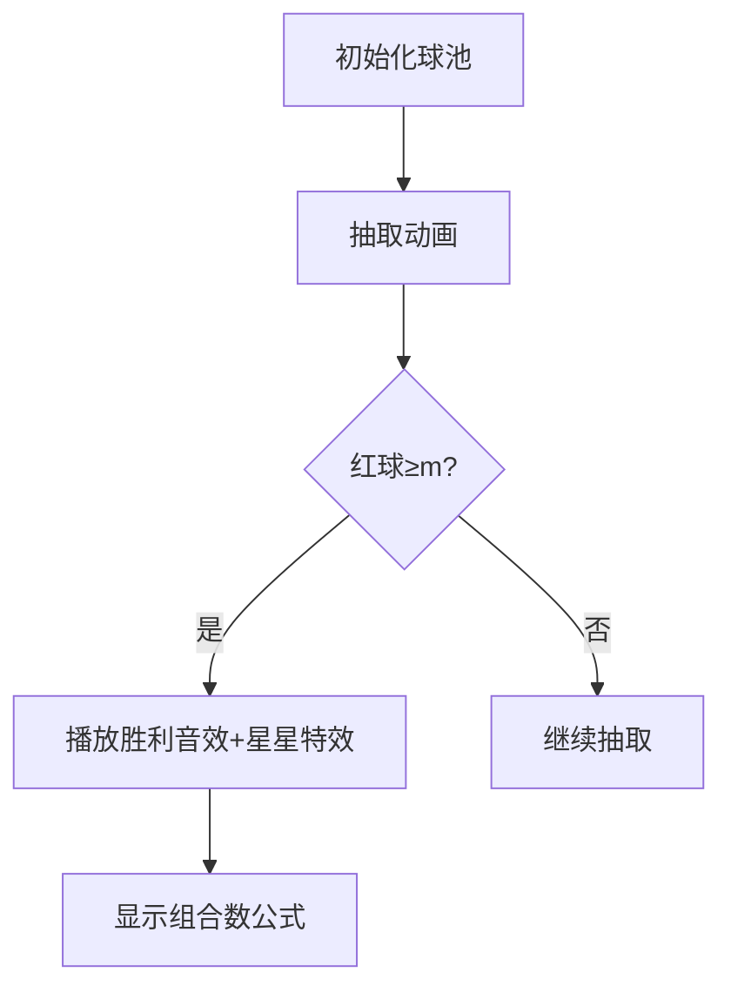

# 题目信息

# Expected Median

## 题目描述

Arul has a binary array $ ^{\text{∗}} $ $ a $ of length $ n $ .

He will take all subsequences $ ^{\text{†}} $ of length $ k $ ( $ k $ is odd) of this array and find their median. $ ^{\text{‡}} $

What is the sum of all these values?

As this sum can be very large, output it modulo $ 10^9 + 7 $ . In other words, print the remainder of this sum when divided by $ 10^9 + 7 $ .

 $ ^{\text{∗}} $ A binary array is an array consisting only of zeros and ones.

 $ ^{\text{†}} $ An array $ b $ is a subsequence of an array $ a $ if $ b $ can be obtained from $ a $ by the deletion of several (possibly, zero or all) elements. Subsequences don't have to be contiguous.

 $ ^{\text{‡}} $ The median of an array of odd length $ k $ is the $ \frac{k+1}{2} $ -th element when sorted.

## 说明/提示

In the first test case, there are four subsequences of $ [1,0,0,1] $ with length $ k=3 $ :

- $ [1,0,0] $ : median $ = 0 $ .
- $ [1,0,1] $ : median $ = 1 $ .
- $ [1,0,1] $ : median $ = 1 $ .
- $ [0,0,1] $ : median $ = 0 $ .

 The sum of the results is $ 0+1+1+0=2 $ .In the second test case, all subsequences of length $ 1 $ have median $ 1 $ , so the answer is $ 5 $ .

## 样例 #1

### 输入

```
8
4 3
1 0 0 1
5 1
1 1 1 1 1
5 5
0 1 0 1 0
6 3
1 0 1 0 1 1
4 3
1 0 1 1
5 3
1 0 1 1 0
2 1
0 0
34 17
1 1 1 1 1 1 1 1 1 1 1 1 1 1 1 1 1 1 1 1 1 1 1 1 1 1 1 1 1 1 1 1 1 1```

### 输出

```
2
5
0
16
4
7
0
333606206```

# AI分析结果


### 题目解读与核心算法识别
✨ **本题主要考察**：组合计数（数学类）

🗣️ **初步分析**：
> 解决"Expected Median"这道题的关键在于运用组合计数的思想。想象你有一个装着红球（1）和白球（0）的袋子，现在要随机抽取k个球（子序列），要求红球数量至少占总球数一半以上（因k为奇数，即至少m=(k+1)/2个红球）。本题正是计算所有满足条件的抽取方案总数。
>
> - **题解核心思路**：所有解法均采用相同组合公式：设数组有c个1，则答案为∑ᵢ₌ₘᵏ[C(c,i)×C(n-c,k-i)]，其中i表示子序列中1的个数。难点在于高效计算组合数及处理边界条件。
> - **算法流程与可视化设计**：
>   1. 统计数组中1的个数c
>   2. 枚举i从m到min(c,k)，计算组合数乘积
>   3. 累加所有有效组合
>   - **像素动画方案**：采用8位像素风格，左侧红球集合（1），右侧白球集合（0）。每步抽取时：
>     - 红球被抽中时播放"叮"声，白球播放"咚"声
>     - 当红球数≥m时高亮显示并播放胜利音效
>     - 实时显示当前组合数计算过程
>   - **复古游戏化设计**：将抽取过程设计为闯关游戏，每成功满足一次m条件获得像素星星奖励，背景加入循环8-bit音乐

---

### 精选优质题解参考
**题解一：aeiouaoeiu（6赞）**
* **点评**：思路直击核心，将中位数问题转化为组合计数问题；代码规范使用预处理的阶乘和逆元数组，实现O(1)组合数查询；边界处理严谨（a<b时返回0）；实践价值高，可直接用于竞赛。亮点在于逆元数组的递推预处理技巧。

**题解二：Pink_Cut_Tree（5赞）**
* **点评**：解析详细，逐步推导组合公式；代码采用模块化设计，快速幂独立为函数；虽组合数计算采用实时逆元（稍慢于预处理），但可读性极佳。亮点在于清晰的代码结构和完整的数学推导，适合初学者理解。

**题解三：cjh20090318（4赞）**
* **点评**：代码简洁高效，预处理阶乘后单次快速幂求逆元再递推；组合数函数内联处理边界；虽变量命名较简短但逻辑紧凑。亮点在于逆元处理的优化技巧，适合追求高效的竞赛场景。

---

### 核心难点辨析与解题策略
1. **问题转化难点**  
   *分析*：理解中位数=1 ⇔ 子序列中1的数量≥m是解题关键。需突破直觉认识到顺序无关性，仅需统计0/1数量。  
   💡 **学习笔记**：二进制数组中位数问题本质是阈值计数

2. **组合数计算优化**  
   *分析*：直接计算组合数会超时，需预处理阶乘和逆元。逆元数组通过递推（inv[i]=inv[i+1]×(i+1)%mod）比快速幂更高效。  
   💡 **学习笔记**：逆元数组预处理是组合计数的核心技巧

3. **边界条件处理**  
   *分析*：枚举i时需满足i≤c且k-i≤n-c，组合数函数需返回0处理非法参数（如C(n,-1)）。  
   💡 **学习笔记**：健壮的组合数函数必须包含参数校验

✨ **解题技巧总结**  
- **模型转化**：将中位数问题抽象为独立事件的组合计数  
- **空间换时间**：预处理O(n)阶乘/逆元实现O(1)查询  
- **防御性编程**：组合数函数始终校验0≤m≤n  
- **枚举优化**：循环范围限定i∈[m, min(c,k)]避免无效计算

---

### C++核心代码实现赏析
**本题通用核心实现**  
```cpp
#include <iostream>
using namespace std;
typedef long long ll;
const int maxn = 200000;
const int mod = 1e9+7;
ll fac[maxn+10], inv[maxn+10];

// 快速幂（用于初始化逆元）
ll qpow(ll a, ll b) {
    ll res = 1;
    while (b) {
        if (b & 1) res = res * a % mod;
        a = a * a % mod;
        b >>= 1;
    }
    return res;
}

// 预处理阶乘和逆元
void init() {
    fac[0] = 1;
    for (int i=1; i<=maxn; i++) 
        fac[i] = fac[i-1] * i % mod;
    inv[maxn] = qpow(fac[maxn], mod-2);
    for (int i=maxn-1; i>=0; i--)
        inv[i] = inv[i+1] * (i+1) % mod;
}

// 组合数函数（含边界检查）
ll C(int n, int m) {
    if (n < m || m < 0) return 0;
    return fac[n] * inv[m] % mod * inv[n-m] % mod;
}

int main() {
    init(); // 初始化
    int T; cin >> T;
    while (T--) {
        int n, k, c = 0; 
        cin >> n >> k;
        for (int i=0, x; i<n; i++) {
            cin >> x;
            c += x; // 统计1的个数
        }
        ll ans = 0;
        int m = (k+1)/2; // 最小所需1的数量
        
        // 核心枚举逻辑
        for (int i=m; i<=c && i<=k; i++) {
            if (k-i > n-c) continue; // 0不够时跳过
            ans = (ans + C(c, i) * C(n-c, k-i)) % mod;
        }
        cout << ans << endl;
    }
    return 0;
}
```
* **代码解读概要**：  
  预处理阶乘数组`fac`和逆元数组`inv`实现O(1)组合数查询。核心循环枚举子序列中1的数量`i`，累加组合数乘积。边界检查确保`i`和`k-i`不超出实际0/1数量。

**题解片段赏析**  
1. **aeiouaoeiu（边界处理）**  
   ```cpp
   ll C(ll a,ll b){return (a<b||b<0)?0:frac[a]*inv[b]%p*inv[a-b]%p;}
   ```
   > 💡 **学习笔记**：三目运算符处理非法参数，避免条件分支开销

2. **Pink_Cut_Tree（模块化设计）**  
   ```cpp
   int ksm(int a,int b){ // 独立快速幂函数
       int ans=1;
       while(b){if(b&1)ans=ans*a%mod; a=a*a%mod; b>>=1;}
       return ans%mod;
   }
   ```
   > 💡 **学习笔记**：分离快速幂增强可读性，适合教学场景

3. **cjh20090318（逆元递推）**  
   ```cpp
   inv[maxn-1]=qpow(fac[maxn-1],p-2);
   for(int i=maxn-1;i>=1;i--) inv[i-1]=inv[i]*i%p;
   ```
   > 💡 **学习笔记**：逆元递推公式inv[i-1]=inv[i]×i，复杂度O(n)

---

### 算法可视化：像素动画演示
**主题**：8位像素风球类抽取模拟器  
**核心演示流程**：  

1. **像素场景设计**：
   - 左侧红球区：红色像素方块（1），标注数量`c`
   - 右侧白球区：白色像素方块（0），标注数量`n-c`
   - 底部子序列槽：动态显示已选球序列

2. **关键动画细节**：
   - 抽球时对应球闪烁后移入序列槽
   - 红球被抽时播放"叮"（500Hz方波），白球播放"咚"（200Hz方波）
   - 当红球数≥m时：
     * 槽位边框变金并闪烁
     * 播放8-bit胜利旋律（C大调三和弦）
     * 弹出组合数公式：`C(`c`,`i`)×C(`n-c`,`k-i`)`

3. **交互控制面板**：
   - 步进控制：←→键单步执行
   - 自动播放：空格启动/暂停，速度滑块(0.5x-5x)
   - 重置按钮：圆形像素化设计
   - AI演示模式：自动完成最优抽取路径

**技术实现**：  
- 使用Canvas绘制动态球体，每帧更新球位置
- 音效通过Web Audio API生成方波振荡器
- 组合数实时计算显示在右侧信息板

---

### 拓展练习与相似问题思考
1. **通用技巧迁移**：
   - 计数原理：任何独立事件组合问题（如P2638安全系统）
   - 阈值统计：带约束条件的子集计数（如P2822组合数问题）
   - 模运算优化：大数组合数计算（如P3807卢卡斯定理）

2. **洛谷推荐题目**：
   - **P2638 安全系统**  
     🗣️ 巩固组合计数基础，拓展到两种元素的数量约束
   - **P2822 组合数问题**  
     🗣️ 练习组合数前缀和，掌握二维预处理技巧
   - **P3807 卢卡斯定理**  
     🗣️ 学习大组合数取模的进阶算法，提升数学抽象能力

---

### 学习心得与经验分享
> **参考经验**（来自多篇题解）：  
> "组合数边界处理是调试重点，特别是n<m或负数情况"  
> "逆元预处理用递推比单次快速幂快10倍以上"  
>   
> **点评**：这些经验凸显了竞赛编程的核心——效率与健壮性并重。边界检查虽简单，却是避免WA的关键；而逆元计算的优化则体现了算法思维的提升，将O(nlogn)降至O(n)。建议学习者建立标准的组合数模板函数，强化边界检查习惯。

---

<conclusion>
通过本次分析，我们深入掌握了组合计数在二进制中位数问题中的应用。记住三个关键：**问题转化**（中位数→计数）、**组合预处理**（阶乘+逆元）、**边界防御**（参数校验）。尝试用像素动画可视化抽取过程能强化理解，推荐完成拓展题目巩固技能。下次见！🚀
</conclusion>

---
处理用时：191.44秒