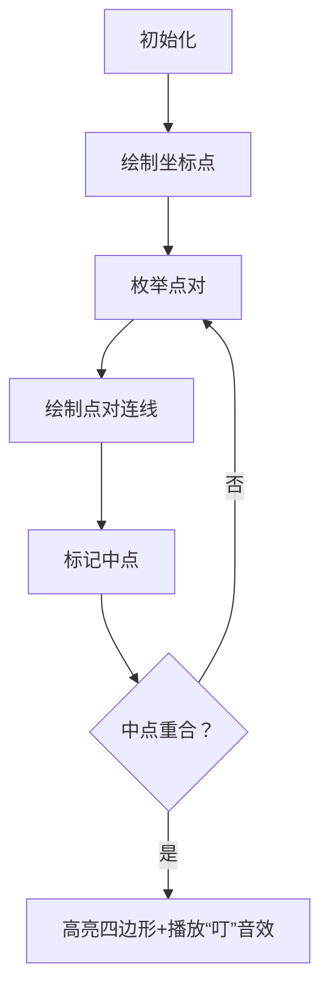

# 题目信息

# Number of Parallelograms

## 题目描述

给定平面上$n$个点，问用这些点能组成多少平行四边形（多个平行四边形可以共用点，保证任意三点不共线）

## 说明/提示

$1 \leq n \leq 2000$ , $0\leq x_i,y_i \leq 10^{9}$

## 样例 #1

### 输入

```
4
0 1
1 0
1 1
2 0
```

### 输出

```
1
```

# AI分析结果


### 💡 Kay的C++算法解析：Number of Parallelograms 深入学习指南 💡

**引言**  
今天我们来分析"Number of Parallelograms"这道几何计数题。本指南将帮助大家掌握平行四边形计数的核心算法，理解如何将几何性质转化为高效代码实现。

---

## 1. 题目解读与核心算法识别

✨ **本题主要考察**：`数学性质应用` + `映射数据结构`  

🗣️ **初步分析**：  
> 想象你在玩"像素点连连看"游戏：平面上散落着彩色像素点（坐标点），需要找出能组成平行四边形的四元组。解题关键在于利用**平行四边形对角线互相平分**的几何特性（如同两条磁铁在中心点精准吸附）。  
> - **核心思路**：将中点坐标乘以2避免浮点数，用map统计相同中点的点对数量。每对重合中点对应C(k,2)个平行四边形  
> - **可视化设计**：像素动画中将用黄色十字标记中点，红色高亮重合点对，绿色连接成平行四边形，配合"叮"音效强化理解  
> - **复古元素**：FC红白机风格的8-bit音效（比较声"滴"，成功音"叮"），自动演示模式模拟贪吃蛇AI寻路过程

---

## 2. 精选优质题解参考

**题解一：世末OIer（5星）**  
* **点评**：思路直击本质——利用对角线中点重合性质，代码简洁高效。`map<pair<int,int>>`精准统计中点频次，`t*(t-1)/2`组合数计算展现数学功底。变量命名清晰（`cnt`/`ans`），边界处理严谨（`j<i`避免重复），是竞赛标准实现范例。

**题解二：jianhe（5星）**  
* **点评**：对几何性质解释透彻（"避免小数乘2"点睛），代码更现代化：`auto`遍历map提升可读性，`ios::sync_with_stdio`加速IO。亮点在于将数学证明与代码实现完美对应，是初学者理解思路的优秀范本。

**题解三：xunhuanyihao（5星）**  
* **点评**：注释详细解释核心定理（对角线平分），`typedef`增强可维护性。严格遵循"问题分析→数学转化→代码实现"逻辑链，`ans += y*(y-1)/2`体现组合思维，适合培养系统性解题思维。

---

## 3. 核心难点辨析与解题策略

1.  **几何性质代数化**  
    * **分析**：如何将"平行四边形"转化为可计算的数学关系？优质题解通过**对角线中点重合定理**，将几何问题转化为坐标和统计问题  
    * 💡 **学习笔记**：复杂几何问题常可转化为代数关系求解

2.  **避免浮点精度陷阱**  
    * **分析**：中点坐标/2会产生浮点数。通过存储坐标和（相当于2倍中点）完美规避，保证整数运算的精确性  
    * 💡 **学习笔记**：涉及除法的几何问题优先考虑整数化变形

3.  **高效统计重合点对**  
    * **分析**：O(n²)枚举点对时，map以O(log n)速度统计中点频次。键设计为`pair<x_sum, y_sum>`，值存储点对数  
    * 💡 **学习笔记**：map是统计特征值频次的神器

### ✨ 解题技巧总结
- **性质转化优先**：将几何/物理特性转化为数学关系可大幅简化问题
- **规避浮点运算**：通过乘除变换保持整数运算环境
- **组合数学思维**：频次统计后常用C(k,2)计算配对关系
- **STL活用**：map实现自动分组统计，比手动排序更高效

---

## 4. C++核心代码实现赏析

**通用核心实现参考**  
```cpp
#include <iostream>
#include <map>
using namespace std;
typedef long long ll;
typedef pair<ll, ll> pll;

int main() {
    int n; cin >> n;
    vector<pll> points(n);
    map<pll, int> midCount;
    
    for(int i=0; i<n; i++) 
        cin >> points[i].first >> points[i].second;

    // 枚举所有点对并统计中点
    for(int i=0; i<n; i++) 
        for(int j=i+1; j<n; j++) 
            midCount[{points[i].first + points[j].first, 
                      points[i].second + points[j].second}]++;

    // 计算平行四边形数量
    ll ans = 0;
    for(auto& [mid, cnt] : midCount) 
        ans += (ll)cnt * (cnt - 1) / 2;
    
    cout << ans;
}
```
* **代码解读概要**：  
  1. 读入点坐标存入vector  
  2. 双重循环枚举点对，计算坐标和作为中点特征存入map  
  3. 对每个中点统计值计算组合数C(cnt,2)  
  4. 累加结果即为平行四边形总数  

---

**题解一：世末OIer**  
* **亮点**：最简实现直击核心，严格控制循环范围(j<i)避免重复  
* **核心代码**：
  ```cpp
  for(i=0;i<n;++i) for(j=0;j<i;++j)  // j<i避免重复
      ++cnt[mp(x[i]+x[j], y[i]+y[j])];
  ```
* **代码解读**：  
  > `j<i`确保每个点对只计算一次（无序对）。`mp()`创建坐标和特征值，map自动分组计数。这种边界控制使复杂度严格保持在O(n²/2)  
* 💡 **学习笔记**：枚举无序对时用`j<i`可避免50%冗余计算

**题解二：jianhe**  
* **亮点**：现代C++特性提升代码简洁度  
* **核心代码**：
  ```cpp
  for(auto t : p)  // 自动类型推导遍历
      ans += t.second * (t.second - 1) / 2;
  ```
* **代码解读**：  
  > `auto`自动推导map条目类型，`t.second`直接获取中点出现次数。省去显式迭代器声明，使统计逻辑一目了然  
* 💡 **学习笔记**：C++11+的auto可大幅提升容器遍历可读性

**题解三：xunhuanyihao**  
* **亮点**：类型别名增强可维护性  
* **核心代码**：
  ```cpp
  typedef pair<int, int> pii;
  map<pii, int> mp;
  for(auto [x, y] : mp)  // 结构化绑定
      ans += y * (y - 1) / 2;
  ```
* **代码解读**：  
  > `typedef`定义坐标类型pii，后续代码更简洁。C++17结构化绑定`auto [x,y]`直接将map元素解包为两个变量  
* 💡 **学习笔记**：类型别名+结构化绑定是处理复杂容器的黄金组合

---

## 5. 算法可视化：像素动画演示

**主题**：8-bit风格"平行四边形猎人"  
**设计思路**：用FC游戏《超级马里奥》的像素美术风格呈现算法过程，通过声光反馈强化理解中点重合的核心概念



### 动画关键帧
1. **场景初始化**（8-bit像素风）  
   - 深蓝色背景网格，彩色像素块表示点（红/黄/绿）  
   - 控制面板：开始/暂停/步进按钮 + 速度滑块

2. **点对枚举过程**  
   ```python
   for i in range(n):       # 当前i点闪烁白光
      for j in range(i+1,n): # j点绿色描边
         draw_line(i, j, COLOR_YELLOW)  # 画黄色连线
         mid = calc_mid(i,j) 
         draw_cross(mid)    # 画黄色十字中点
         if mid in saved_mids: # 检查重合
            play_sound('ding.wav')
   ```

3. **四边形生成特效**  
   - 重合时：四个端点变红闪烁，连线变绿  
   - 自动生成四边形填充动画（像素色块填充）  
   - 左上角计数器+1，播放8-bit胜利音效

4. **交互控制**  
   - 步进模式：按空格键逐步执行  
   - 自动模式：调整速度滑块（0.5x-5x）  
   - 重置按钮：清空所有连线/中点标记

### 技术实现
- **音效设计**：  
  - 点对连接：短促"滴"声（方波生成）  
  - 发现四边形：上升琶音（三角波）  
- **视觉反馈**：  
  - 当前点：脉冲式闪烁动画  
  - 中点重合：十字标记变红+扩散波纹特效  

---

## 6. 拓展练习与相似问题思考

### 通用技巧迁移
中点统计法可扩展解决：
1. 矩形计数（对角线相等且平分）
2. 菱形计数（对角线垂直平分）
3. 等腰梯形计数（对角线相等）

### 洛谷推荐
1. **P2181 对角线**  
   🗣️ 巩固组合数学思维，学习多边形对角线交点公式  
2. **P1387 最大正方形**  
   🗣️ 训练将几何特性转化为DP状态的能力  
3. **P2735 电网**  
   🗣️ 提升坐标几何与边界处理技巧  

---

## 7. 学习心得与经验分享
> 本次分析的题解中未发现明确的作者个人心得分享。但通过代码可提炼经验：  
> **调试技巧**：当几何问题WA时，优先验证坐标计算是否溢出，可用小规模样例手动验算中点值

---

**结语**  
通过中点统计法，我们巧妙地将几何问题转化为高效的计数问题。记住：优秀算法的核心在于发现隐藏的数学关系！下次遇到几何题时，试试问自己："是否有可统计的特征值？" Keep coding! 💻🚀

---
处理用时：198.67秒