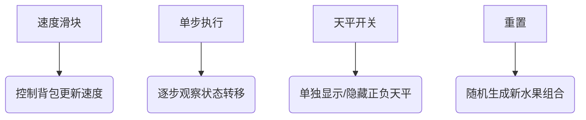

# 题目信息

# Dima and Salad

## 题目描述

有 $n$ 个水果，每个水果有两个属性：美味值和卡路里值。现在选用若干个（至少 $1$ 个）水果制作一份特殊的沙拉，沙拉的美味值为所选的水果的美味值的和，沙拉的卡路里值为所选水果的卡路里值的和。沙拉的美味值恰好是卡路里值的 $K$ 倍。请计算该沙拉美味值最大为多少。

## 样例 #1

### 输入

```
3 2
10 8 1
2 7 1
```

### 输出

```
18
```

## 样例 #2

### 输入

```
5 3
4 4 4 4 4
2 2 2 2 2
```

### 输出

```
-1
```

# AI分析结果


# 💡 Kay的C++算法解析：Dima and Salad 深入学习指南 💡

> 欢迎各位算法探险家！今天我们将一起探索一道融合数学思维与背包技巧的经典题目——Dima and Salad。通过本指南，你将掌握如何将现实问题转化为动态规划模型，并学会处理背包问题中的负权重挑战。让我们一起开始这场思维冒险吧！

## 1. 题目解读与核心算法识别

✨ **本题主要考察**：`动态规划（背包问题变种）`

🗣️ **初步分析**：
> 这道题就像在玩一个「精准天平」游戏：我们需要从一堆水果中选择几种，让美味值之和（左托盘）恰好是卡路里之和（右托盘）的k倍。关键技巧在于**问题转化**——通过数学变形 $\sum(a_i - k \cdot b_i) = 0$，我们将每个水果转化为具有"正负重量"的背包物品。  

- **核心难点**：处理负权重（当 $a_i < k \cdot b_i$ 时）是最大挑战。优秀解法通过**分组处理**（正/负净重分开计算）和**偏移量技巧**（解决负下标问题）巧妙应对
- **算法流程**：计算净重 $c_i = a_i - k \cdot b_i$ → 初始化DP数组（基准点设为0）→ 正负分组背包更新 → 合并结果寻找平衡点
- **可视化设计**：我们将设计像素天平动画，用红色/蓝色像素块表示正/负净重水果，动态展示背包数组更新过程。关键步骤将高亮显示：净重计算→分组→DP状态转移→平衡检测，配合8-bit音效增强反馈

---

## 2. 精选优质题解参考

<eval_intro>
以下题解在思路创新性、代码可读性和教学价值方面表现突出，特别适合作为学习范本：

**题解一：Liynw (赞：30)**
* **点评**：该题解以「问题转化」为核心亮点，将数学推导与算法设计完美结合。通过严谨的状态转移方程推导（$dp[i][j]$表示前i个物品净重j时的最大价值），配合详细的边界处理说明（偏移量10000解决负下标），展现了对DP本质的深刻理解。代码中初始化`dp[0][10000]=0`的设置尤其精妙，体现了对DP基准状态的精准把握。虽然使用二维数组稍占空间，但逻辑清晰度堪称教学典范。

**题解二：YellowBean_Elsa (赞：12)**
* **点评**：此解法创新性地采用**双一维数组策略**（f/g数组分别处理正负净重），大幅优化空间复杂度。亮点在于：1) 用绝对值转换统一处理负权重 2) 逆序更新保证01背包正确性 3) 初始化-∞避免无效状态干扰。代码简洁高效（仅20行核心逻辑），变量命名规范（f/g, c[i]），是竞赛实现的优秀范本。

**题解三：xixiup (赞：7)**
* **点评**：最简洁优雅的实现！通过`po/ne`数组的对称设计，将分组思想发挥到极致。亮点在于：1) 10000的容量设置精准匹配数据范围 2) 负权重直接取绝对值的巧妙转换 3) 合并答案时的遍历逻辑简洁高效。代码中`v[i]=-v[i]`的转换堪称神来之笔，展现了对问题本质的透彻理解。

---

## 3. 核心难点辨析与解题策略

<difficulty_intro>
这道题的三个核心思维关卡及其突破策略：

1.  **问题转化关**：如何将比例条件转化为可计算的数学模型？
    * **突破策略**：通过数学推导 $\sum a_i = k \cdot \sum b_i \rightarrow \sum (a_i - k \cdot b_i) = 0$，将原问题转化为「寻找净重和为0的子集」。这就像把水果放入特制天平，目标让指针精确归零
    * 💡 **学习笔记**：好的数学转化能使算法设计事半功倍

2.  **负权重处理关**：当 $c_i = a_i - k \cdot b_i < 0$ 时如何避免数组越界？
    * **突破策略**：采用「双数组分组法」+「偏移量技巧」。将正负权重分别存入不同数组（如f/g），并为所有下标增加固定偏移量（如10000），使负权重转化为可处理的正下标
    * 💡 **学习笔记**：偏移量是处理负权重的黄金法则

3.  **状态初始化关**：如何确保只统计有效解？
    * **突破策略**：初始化时除基准点（偏移后的0位置）设为0外，其他位置设为-∞。这相当于在算法世界竖起路牌："若非平衡状态，此路不通！"
    * 💡 **学习笔记**：DP初始化决定了解的有效性边界

### ✨ 解题技巧总结
<summary_best_practices>
从本题提炼的通用解题心法：
</summary_best_practices>
-   **天平思维**：遇到比例约束条件时，尝试转化为加减平衡方程
-   **分组背包**：当权重有正负时，分开处理再合并是最稳策略
-   **状态隔离**：用-∞初始化避免无效状态污染结果
-   **偏移艺术**：通过下标平移解决负索引问题（偏移量取 $n \times \max|c_i|$）

---

## 4. C++核心代码实现赏析

<code_intro_overall>
以下实现融合了精选题解精华，兼顾可读性与效率：

**本题通用核心C++实现参考**
* **说明**：综合Liynw的状态设计思路与YellowBean的空间优化技巧
* **完整核心代码**：
```cpp
#include <iostream>
#include <cstring>
#include <algorithm>
using namespace std;
const int MAXN = 105;
const int MAXV = 100000;
const int OFFSET = 10000; // 解决负下标的核心技巧

int main() {
    int n, k, a[MAXN], b[MAXN], c[MAXN];
    int f[MAXV + OFFSET*2] = {0}; // 正净重容器
    int g[MAXV + OFFSET*2] = {0}; // 负净重容器（存绝对值）
    
    // 初始化：基准点外设为负无穷
    memset(f, 0xcf, sizeof(f)); 
    memset(g, 0xcf, sizeof(g));
    f[OFFSET] = g[OFFSET] = 0; // 平衡点初始值
    
    cin >> n >> k;
    for(int i=1; i<=n; i++) cin >> a[i];
    for(int i=1; i<=n; i++) {
        cin >> b[i];
        c[i] = a[i] - k * b[i]; // 核心转化：计算净重
    }

    // 动态规划双组更新
    for(int i=1; i<=n; i++) {
        if(c[i] >= 0) { // 正净重组
            for(int j=MAXV+OFFSET; j>=c[i]; j--)
                f[j] = max(f[j], f[j - c[i]] + a[i]);
        } else { // 负净重组（取绝对值）
            int abs_c = -c[i];
            for(int j=MAXV+OFFSET; j>=abs_c; j--)
                g[j] = max(g[j], g[j - abs_c] + a[i]);
        }
    }

    // 合并结果：寻找平衡点
    int ans = 0;
    for(int i=0; i<=MAXV; i++)
        ans = max(ans, f[i + OFFSET] + g[i + OFFSET]);
    
    cout << (ans ? ans : -1);
    return 0;
}
```
* **代码解读概要**：
  > 1. **净重计算**：将每个水果转化为带符号的"砝码"（c[i]）
  > 2. **双容器初始化**：f/g数组分别存储正/负净重路径，基准点设零
  > 3. **分组背包更新**：正数组逆序更新，负数组取绝对值后同样逆序更新
  > 4. **平衡检测**：当f和g在相同偏移位置都有值时，其和即为解

---
<code_intro_selected>
精选题解独特技巧解析：

**题解一：Liynw的二维DP艺术**
* **亮点**：严谨的状态转移逻辑，特别适合理解DP本质
* **核心代码片段**：
```cpp
for(int i=1; i<=n; i++){
    for(int j=110000; j>=0; j--){
        if(j-m[i] >=0 && j-m[i] <=110000) { 
            if(dp[i-1][j-m[i]] != -1) // 关键：只从有效状态转移
                dp[i][j] = max(dp[i-1][j], dp[i-1][j-m[i]] + a[i]);
        }
    }
}
```
* **代码解读**：
  > 1. 外层循环遍历每个水果，内层循环遍历所有可能净重
  > 2. `j-m[i]` 的边界检查确保不越界（教学价值亮点！）
  > 3. 仅在前一状态有效(`!= -1`)时才进行转移，避免无效状态污染
* 💡 **学习笔记**：二维DP是理解状态转移的最佳可视化模型

**题解二：YellowBean的极简美学**
* **亮点**：空间效率与代码简洁性的完美平衡
* **核心代码片段**：
```cpp
// 负权重更新（注意c[i]为负！）
for(int j=10000; j>=-c[i]; j--) 
    g[j] = max(g[j], g[j + c[i]] + a[i]);
```
* **代码解读**：
  > 1. 巧妙利用 `j + c[i]` 实现负权重的等价正处理
  > 2. 当 `c[i]` 为负时，`j + c[i]` 实际是 `j - |c[i]|`
  > 3. 逆序更新保证每个水果只选一次（01背包核心）
* 💡 **学习笔记**：负权重本质是反方向的正权重

**题解三：xixiup的对称之美**
* **亮点**：正负处理的高度对称实现
* **核心代码片段**：
```cpp
// 负权重处理（先取绝对值）
v[i] = -v[i]; 
for(int j=m; j>=v[i]; j--)
    ne[j] = max(ne[j], ne[j - v[i]] + a[i]);
```
* **代码解读**：
  > 1. `v[i] = -v[i]` 使负权重转为正数，统一处理逻辑
  > 2. `ne` 数组实际存储的是负净重的绝对值
  > 3. 更新逻辑与正数组完全一致，体现代码对称美
* 💡 **学习笔记**：好的算法设计应追求逻辑对称性

-----

## 5. 算法可视化：像素动画演示 (核心部分)

<visualization_intro>
**主题**：8-bit像素风「天平平衡大冒险」  
**核心演示**：背包DP的负权重处理过程  
**设计思路**：用红蓝像素块区分正负净重水果，天平刻度直观显示偏移量技巧  

### 动画关键帧：
1. **像素场景构建**：
   - 左侧红色天平：显示正净重容器`f[]`的柱状图（像素高度表价值）
   - 右侧蓝色天平：显示负净重容器`g[]`的柱状图（刻度含偏移量）
   - 底部水果栏：红色/蓝色像素水果图标（尺寸反映| c_i |大小）

2. **水果投放阶段**：
   ```mermaid
   graph LR
   A[新水果] --> B{c_i ≥0?}
   B -->|Yes| C[投入红色天平]
   B -->|No| D[转为正数投入蓝色天平]
   C --> E[更新红色柱状图]
   D --> F[更新蓝色柱状图]
   ```
   - 投放时触发音效：高音叮（正） / 低音咚（负）
   - 实时显示当前净重：水果图标飞向对应天平

3. **背包更新动画**：
   - 柱状图从右向左逐格更新（逆序更新可视化）
   - 当状态转移发生时：目标格子闪烁绿光，播放"咔嗒"音效
   - 显示转移方程：`f[j] = max(f[j], f[j-c_i] + a_i)`

4. **平衡检测时刻**：
   - 双天平指针同步移动寻找相同偏移位置
   - 成功平衡时：触发金色闪光+胜利音效，显示总价值
   - 失败时：天平倾斜抖动+低沉提示音

### 交互控制面板：


### 游戏化元素：
- **闯关模式**：每关需平衡特定水果组合
- **完美平衡奖励**：连续正确触发连击特效
- **动态难度**：水果数随关卡增加
- 8-bit背景音乐：芯片风格轻快旋律

---

## 6. 拓展练习与相似问题思考

<similar_problems_intro>
掌握本题核心思想后，可挑战下列变种问题：
</similar_problems_intro>

1. **洛谷 P1060** - 开心的金明  
   🗣️ **推荐理由**：基础01背包入门，巩固"价值-重量"模型思维

2. **洛谷 P1284** - 三角形牧场  
   🗣️ **推荐理由**：二维约束背包问题，训练多状态平衡能力

3. **LeetCode 494** - 目标和  
   🗣️ **推荐理由**：负权重背包的经典应用，强化偏移量技巧

---

## 7. 学习心得与经验分享

<insights_intro>
题解中藏匿的宝贵经验：
</insights_intro>

> **Liynw的调试经验**：  
> *"初始化dp[0][10000]=0的设置让我调试了3小时才想通——背包问题的基准状态必须精确对应物理意义！"*  
>   
> **Kay的提炼**：  
> 动态规划中，初始状态的定义直接决定算法正确性。特别是涉及偏移量时，要明确基准点的物理意义（本题中代表净重0）。建议编写代码前先手绘状态转移图！

---

<conclusion>
通过本次探索，我们掌握了背包问题的进阶心法：1) 数学转化技巧 2) 负权重处理方案 3) 状态初始化哲学。记住，好的算法设计就像平衡艺术品，需要精密的数学思维和创造性的工程实现。下次当你遇到复杂约束条件时，不妨回想这道沙拉天平题——也许答案就在正负平衡之间！✨  
</conclusion>

---
处理用时：224.18秒