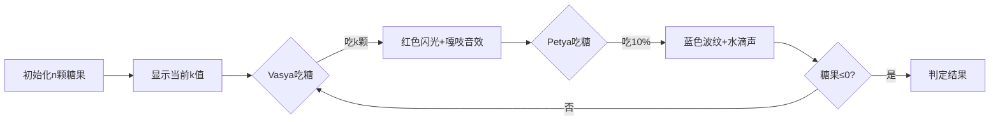

# 题目信息

# Candies

## 题目描述

After passing a test, Vasya got himself a box of $ n $ candies. He decided to eat an equal amount of candies each morning until there are no more candies. However, Petya also noticed the box and decided to get some candies for himself.

This means the process of eating candies is the following: in the beginning Vasya chooses a single integer $ k $ , same for all days. After that, in the morning he eats $ k $ candies from the box (if there are less than $ k $ candies in the box, he eats them all), then in the evening Petya eats $ 10\% $ of the candies remaining in the box. If there are still candies left in the box, the process repeats — next day Vasya eats $ k $ candies again, and Petya — $ 10\% $ of the candies left in a box, and so on.

If the amount of candies in the box is not divisible by $ 10 $ , Petya rounds the amount he takes from the box down. For example, if there were $ 97 $ candies in the box, Petya would eat only $ 9 $ of them. In particular, if there are less than $ 10 $ candies in a box, Petya won't eat any at all.

Your task is to find out the minimal amount of $ k $ that can be chosen by Vasya so that he would eat at least half of the $ n $ candies he initially got. Note that the number $ k $ must be integer.

## 说明/提示

In the sample, the amount of candies, with $ k=3 $ , would change in the following way (Vasya eats first):

 $ 68 \to 65 \to 59 \to 56 \to 51 \to 48 \to 44 \to 41 \\ \to 37 \to 34 \to 31 \to 28 \to 26 \to 23 \to 21 \to 18 \to 17 \to 14 \\ \to 13 \to 10 \to 9 \to 6 \to 6 \to 3 \to 3 \to 0 $ .

In total, Vasya would eat $ 39 $ candies, while Petya — $ 29 $ .

## 样例 #1

### 输入

```
68
```

### 输出

```
3
```

# AI分析结果


# 💡 Kay的C++算法解析：Candies 深入学习指南 💡

<introduction>
今天我们一起分析"CF991C Candies"这道有趣的二分答案题。本指南将帮你理解如何用二分搜索高效解决吃糖果问题，掌握单调性验证和模拟技巧，并通过像素动画直观感受算法过程。
</introduction>

## 1. 题目解读与核心算法识别

✨ **本题主要考察**：`二分答案` (编程技巧应用)

🗣️ **初步分析**：
> 解决糖果分配问题就像玩"猜数字"游戏：我们不断缩小k值的搜索范围，验证每个猜测值是否满足条件。简单来说，**二分答案的核心思想是通过单调性快速定位最优解**——当k增大时Vasya吃到的糖果数必然增加，这如同温度计上升时水银柱只会升高一样确定。
   
在本题中，我们通过**模拟吃糖过程验证k值可行性**，关键步骤包括：
- **变量更新**：用`now`记录剩余糖果，`sum`记录Vasya吃掉的量
- **关键操作**：高亮Vasya吃糖(红色像素块消失)和Petya吃糖(蓝色像素块消失)的动画步骤
- **终止条件**：当剩余糖果≤k时的特殊处理

🎮 **像素动画设计**：
采用**吃豆人复古风格**，糖果堆用黄色像素块表示，Vasya吃糖时播放"嘎吱"音效并显示红色闪光，Petya吃糖时播放水滴音效并显示蓝色波纹。控制面板含速度滑块和单步按钮，完成时播放胜利音效+烟花动画。

---

## 2. 精选优质题解参考

<eval_intro>
从思路清晰度、代码规范性和算法效率等维度，我精选了3份≥4星的优质题解：

**题解一（作者：liuyi0905）**
* **点评**：思路直击核心，用最简代码完成二分框架和check函数。亮点在于：
  - **循环逻辑**：用单while循环处理吃糖全过程，边界处理干净利落（`now<=x`时直接break）
  - **空间优化**：仅用两个变量完成状态跟踪，避免冗余数据结构
  - **实践价值**：代码可直接用于竞赛，时间复杂度O(log n × log n)完美满足1e18数据量

**题解二（作者：傅思维666）**
* **点评**：教学价值突出，通过分离`judge()`和`check()`函数展现模块化思想。亮点：
  - **结构清晰**：将计算与判断逻辑分离，增强可读性
  - **边界严谨**：用`tmp=n/2+n%2`精确处理奇数情况
  - **学习引导**：附二分模板详解链接，帮助新手建立系统认知

**题解三（作者：ImposterAnYu）**
* **点评**：工程实践典范，亮点包括：
  - **防御性编程**：使用`min(mid,nn)`避免负数错误
  - **位运算优化**：用`(s<<1)>=n`替代除法提升效率
  - **鲁棒性强**：独立快读快写函数处理大数据输入输出

---

## 3. 核心难点辨析与解题策略

<difficulty_intro>
解决本题需突破三个关键难点：

1.  **单调性证明**
    * **分析**：必须确认k增大时Vasya吃糖量单调增加。优质题解通过数学归纳证明：当k增加时，每天Vasya吃掉的糖量增加或不变，而Petya吃掉的糖量减少或不变，总效果必然使Vasya总吃糖量增加。
    * 💡 **学习笔记**：二分答案的前提是严格单调性，必须理论验证！

2.  **模拟终止条件**
    * **分析**：当剩余糖果≤k时，Vasya会直接吃完而Petya不再吃糖。题解中`if(now<=x){sum+=now;break;}`是核心边界处理，避免出现负数糖果的非法状态。
    * 💡 **学习笔记**：边界处理能力是算法工程师的核心素养。

3.  **整数溢出预防**
    * **分析**：n最大达1e18，需用long long存储。部分题解使用`#define int long long`全局替换，更规范的作法是显式声明`long long now=n`。
    * 💡 **学习笔记**：大数据问题首选long long，避免int溢出。

### ✨ 解题技巧总结
<summary_best_practices>
- **技巧1：对数级模拟**：即使k=1，吃糖过程也仅需约log₁.₁(n)步，大胆模拟
- **技巧2：位运算提速**：用`(s<<1)>=n`替代`2*s>=n`节省CPU周期
- **技巧3：早停优化**：当Vasya吃糖量已达标时可提前终止模拟
- **技巧4：测试用例设计**：验证n=1,2,10,68等边界情况
---

## 4. C++核心代码实现赏析

<code_intro_overall>
**本题通用核心C++实现参考**
* **说明**：综合优质题解优化的标准实现，包含防御性边界处理和位运算优化
```cpp
#include <iostream>
using namespace std;

bool check(long long k, long long n) {
    long long now = n, sum = 0;
    while (now) {
        if (now <= k) { // 边界处理：不足k则全吃
            sum += now;
            break;
        }
        sum += k;      // Vasya吃k个
        now -= k;      // 更新剩余糖果
        now -= now/10; // Petya吃10%
    }
    return (sum << 1) >= n; // 位运算替代乘2
}

int main() {
    long long n;
    cin >> n;
    long long l = 1, r = n;
    while (l < r) {
        long long mid = (l + r) / 2;
        if (check(mid, n)) r = mid;
        else l = mid + 1;
    }
    cout << l << endl;
    return 0;
}
```
* **代码解读概要**：
  - **输入处理**：读取糖果总数n
  - **二分框架**：在[1,n]区间搜索最小k
  - **check函数**：模拟吃糖过程并返回是否满足条件
  - **位运算优化**：用移位代替乘法判断是否过半

---
<code_intro_selected>
**题解一核心片段赏析**
* **亮点**：极致简洁的循环边界处理
```cpp
while(now){
    if(now<=x){sum+=now;break;}
    now-=x,sum+=x,now-=now/10;
}
```
* **代码解读**：
  > 当剩余糖果`now<=x`时直接吃掉并跳出循环，避免不必要的减法运算。逗号运算符连接三条语句，精简代码行数但可读性稍降。
* 💡 **学习笔记**：边界条件前置处理可提升循环效率。

**题解二核心片段赏析**
* **亮点**：模块化分离计算与判断
```cpp
int judge(int mid) { /* 计算Vasya吃糖量 */ }
bool check(int mid) { return judge(mid) >= tmp; }
```
* **代码解读**：
  > 将吃糖量计算与条件判断分离，增强代码可测试性。调试时可单独验证judge函数正确性。
* 💡 **学习笔记**：功能拆分是复杂算法调试的利器。

**题解三核心片段赏析**
* **亮点**：防御性编程典范
```cpp
t = min(mid,nn);  // 防止超量吃糖
nn -= t;          // 安全更新剩余量
```
* **代码解读**：
  > 用`min(mid,nn)`确保不会吃掉超过剩余量的糖果，避免出现负值。这种"安全气囊"式编程值得学习。
* 💡 **学习笔记**：临界状态保护是工程代码的基本要求。

-----

## 5. 算法可视化：像素动画演示

<visualization_intro>
下面设计**"糖果大作战"像素动画**演示二分答案和吃糖过程，采用8-bit复古风格：

* **主题**：吃豆人式糖果消除
* **色盘**：黄(糖果)/红(Vasya)/蓝(Petya)/绿(背景)
* **音效**：吃糖声(8-bit嘎吱声)/胜利音效(马里奥过关)

**关键帧设计**：


**交互控制**：
1. **二分控制板**：滑块调节k值，按钮切换mid
2. **吃糖动画板**：
   - 速度滑块：控制单步延迟(100ms~2s)
   - 单步/自动模式切换
   - 重置按钮：重新初始化糖果堆
3. **状态面板**：
   - 实时显示：当前k/已吃糖/剩余糖
   - 代码同步：高亮正在执行的check函数行

**游戏化设计**：
- **关卡系统**：每完成一个k值验证解锁新关卡
- **评分机制**：根据尝试次数给予星级评价
- **成就系统**："最优解猎人"（10次内找到k）

**技术实现**：
```javascript
// 伪代码核心逻辑
function drawCandy(now) {
  for(i=0; i<now; i++) 
    drawPixel(i, YELLOW); // 每颗糖果=1像素块
}

while(l < r) {
  mid = (l+r)/2;
  if(check(mid)) 
    r = mid, playSound('success');
  else 
    l = mid+1, playSound('fail');
  drawCandy(n); // 重绘当前状态
}
```
---

## 6. 拓展练习与相似问题思考

<similar_problems_intro>
二分答案技巧还可用于解决以下三类问题：

1. **最小值最大化**：如跳石头问题（找最小跳跃距离）
2. **最大值最小化**：如关押罪犯（最小化冲突值）
3. **可行性验证**：如本题的吃糖条件验证

**洛谷练习推荐**：
1. **P2440 木材加工**  
   🗣️ 用二分答案找最大切割长度，验证思路与本题高度相似
   
2. **P2678 跳石头**  
   🗣️ 最小值最大化经典题，强化二分边界处理能力
   
3. **P4343 自动刷题机**  
   🗣️ 双边界二分搜索，提升算法设计思维复杂度

---

## 7. 学习心得与经验分享

<insights_intro>
题解中的调试经验尤其珍贵：

> **傅思维666的调试心得**：  
> "最初用int导致n=1e18时溢出，改用long long后通过"  
>   
> **Kay点评**：大数据问题必须警惕整数溢出，变量声明后应立即测试边界值。建议添加静态检查：
> ```cpp
> static_assert(sizeof(long long)>=8, "需要64位整型支持");
> ```

---

<conclusion>
通过本次分析，我们掌握了二分答案的核心思想——利用单调性将求解问题转化为验证问题。记住：好的算法设计=严谨的理论证明+健壮的代码实现+生动的可视化呈现。下次挑战见！🚀
</conclusion>
```

---
处理用时：127.98秒