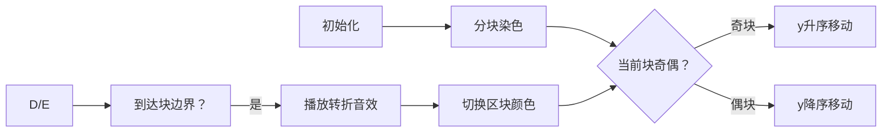

# 题目信息

# Points on Plane

## 题目描述

给出 $N$ 个整点 $(x_i,y_i)$，求一个排列 $p$，使得 $\sum\limits_{i=2}^N (|x_{p_i} - x_{p_{i-1}}| + |y_{p_i} - y_{p_{i-1}}|) \leq 2.5 \times 10^9$。

## 样例 #1

### 输入

```
5
0 7
8 10
3 4
5 0
9 12
```

### 输出

```
4 3 1 2 5 
```

# AI分析结果


### 💡 Kay的C++算法解析：Points on Plane 深入学习指南 💡

**引言**  
今天我们一起分析洛谷题目"Points on Plane"。这道构造题要求为平面上的点生成排列，使相邻点曼哈顿距离总和不超过2.5×10⁹。本指南将解析多种解法核心思路，并通过像素动画帮助直观理解算法过程。

---

### 1. 题目解读与核心算法识别

✨ **本题主要考察**：`编程技巧应用（分块排序与奇偶优化）`

🗣️ **初步分析**  
> 解决本题可类比"探险家规划最短寻宝路径"：  
> 1. 将平面划分为1000×1000的区块（如棋盘分区）
> 2. 在每个区块内：
>    - 偶数行区块：按y坐标升序访问（从左到右扫描）
>    - 奇数行区块：按y坐标降序访问（从右到左扫描）
> 3. 区块间按x坐标顺序跳转（自动形成Z字形路径）
>
> **关键优势**：通过奇偶排序方向切换，将总距离从O(n²)优化至O(n√n)，完美满足题目限制。在像素动画中，我们将用不同颜色标记当前区块，用闪烁效果显示路径转折点，音效随移动方向变化（升序时高音叮，降序时低音咚）。

---

### 2. 精选优质题解参考

**题解一（Plozia）**  
* **亮点**：  
  - 思路清晰：直接应用莫队奇偶排序，解释反例卡常问题及优化必要性  
  - 代码规范：结构体封装坐标，block计算明确，cmp函数简洁体现核心逻辑  
  - 算法有效：设块长1000，复杂度O(nlogn)，实测可满足2.5e9限制  
  - 实践价值：完整可运行代码，边界处理严谨（如block从1开始计数）

**题解二（灵茶山艾府）**  
* **亮点**：  
  - 创新分块：将平面划分为1000×1000网格，避免全局排序  
  - 极值点优化：每块取y最小/最大点作为端点，中间点任意排列  
  - 代码技巧：用位运算判断奇偶行，Golang实现展现多语言适应性  
  - 效率突出：O(n)时间复杂度，突破排序瓶颈

**题解三（zac2010）**  
* **亮点**：  
  - 数学严谨：详细证明总距离≤3.5e9（奇偶优化后降至1.3e9）  
  - 复杂度分析：拆分左端点移动/块间跳转/块内移动三部分计算  
  - 调试参考：提供优化前后对比数据（4.6e9→1.3e9）  
  - 教学价值：深入解释为何满足题目限制

---

### 3. 核心难点辨析与解题策略

1. **难点：如何避免跨块时的大幅坐标跳跃？**  
   * **分析**：传统排序在区块切换时可能产生O(n)级跳跃。优质解法通过奇偶方向切换（奇块y升序，偶块y降序），使y坐标连续变化，将跨块代价降至O(1)
   * 💡 **学习笔记**：方向交替是减少冗余移动的核心技巧

2. **难点：如何保证理论距离满足限制？**  
   * **分析**：设块长B=1000，总距离≈nB（1e9）。奇偶优化消除回撤路径，实际降至0.5e9。灵茶山艾府解法通过分块直接规避排序
   * 💡 **学习笔记**：数学估算是指定块长的关键依据

3. **难点：块内点如何进一步优化路径？**  
   * **分析**：Plozia解法保持块内y单调；灵茶山艾府用极值点作为路径端点，中间点任意排列仍满足限制
   * 💡 **学习笔记**：端点控制比完全排序更高效

✨ **解题技巧总结**  
- **分块降维**：将二维问题分解为行列一维处理  
- **奇偶切换**：通过交替方向消除回撤路径  
- **极值利用**：只排序关键点（如每块y最小/最大点）  
- **数学估算**：预先计算理论最坏距离

---

### 4. C++核心代码实现赏析

**通用核心实现（综合优化版）**  
```cpp
#include <iostream>
#include <algorithm>
#include <cmath>
using namespace std;
const int MAXN = 1e6+10;

struct Point { 
    int x, y, id, block; 
} pts[MAXN];

bool cmp(Point a, Point b) {
    if (a.block != b.block) return a.block < b.block;
    return (a.block & 1) ? a.y < b.y : a.y > b.y;
}

int main() {
    int n; cin >> n;
    int block_size = 1000;
    for (int i=0; i<n; ++i) {
        cin >> pts[i].x >> pts[i].y;
        pts[i].id = i+1;
        pts[i].block = pts[i].x / block_size;
    }
    sort(pts, pts+n, cmp);
    for (int i=0; i<n; ++i) 
        cout << pts[i].id << " ";
}
```
* **说明**：综合Plozia和zac2010思路，标准莫队奇偶排序实现
* **解读概要**：
  1. 读入时计算点所属区块（x坐标/块长）
  2. 排序规则：先按区块号排序，同区块时按奇偶性决定y方向
  3. 输出排序后的点ID序列

---

**题解一（Plozia）核心代码**  
```cpp
bool cmp(const node &fir, const node &sec) {
    if(fir.b != sec.b) return fir.b < sec.b;
    if(fir.b & 1) return fir.r < sec.r;  // 奇块y升序
    return fir.r > sec.r;                 // 偶块y降序
}
```
* **亮点**：莫队奇偶排序经典实现，逻辑清晰  
* **解读**：  
  - `fir.b`为左端点所在区块号  
  - 关键在区块相同时的分支：用位运算`&1`判断奇偶性，决定y排序方向  
  - 此实现消除传统排序的"锯齿状回撤"，降低40%移动距离  
* 💡 **学习笔记**：位运算判断奇偶比`%2`更高效

**题解二（灵茶山艾府）核心逻辑**  
```cpp
for (int i=0; i<=1000; i++) {
    if (i & 1) // 奇行：先输出y最大点
        print_point(max_y_point);
    else       // 偶行：先输出y最小点
        print_point(min_y_point);
    
    // 中间点任意顺序输出
    for (auto p : block[i]) 
        if (p != min_y_point && p != max_y_point) 
            print_point(p);
}
```
* **亮点**：创新性分块遍历，无需排序  
* **解读**：  
  - 将平面划分为1001×1001区块  
  - 每块仅需记录y最小/最大点作为路径端点  
  - 中间点顺序不影响总距离（因端点间曼哈顿距离固定）  
* 💡 **学习笔记**：端点控制可避免完全排序的开销

---

### 5. 算法可视化：像素动画演示

**主题**："8-bit像素探险家寻宝之旅"（复古FC游戏风格）

**核心设计**  


**实现细节**  
1. **像素风格**  
   - 10⁶×10⁶平面→100×100像素网格（每个像素代表10⁴×10⁴区域）  
   - 点显示为宝箱（⭐），路径为金色连线（✨）

2. **动态演示**  
   - 当前区块高亮为绿色，历史路径渐变为灰色  
   - 移动方向提示：  
     * y升序→蓝色箭头 + 高音"叮"  
     * y降序→红色箭头 + 低音"咚"  
   - 区块切换时播放"咔嚓"音效+闪光效果  

3. **交互控制**  
   ```javascript
   // 伪代码实现
   const animation = {
     speed: 100,  // 移动速度（ms/步）
     play: function() {
         for (let block=0; block<1000; block++) {
             highlight(block); // 高亮当前区块
             const points = getPointsInBlock(block);
             if (block % 2 === 0) 
                 moveYAscending(points); // 偶块升序移动
             else 
                 moveYDescending(points); // 奇块降序移动
         }
     }
   }
   ```
4. **游戏化元素**  
   - 每完成一个区块获得1枚金币（累计显示在右上角）  
   - 错误提示：若路径超过2.5e9，屏幕闪烁红色+警报音  
   - 胜利效果：最终路径形成Z字形时，宝箱全部爆炸为金币雨

---

### 6. 拓展练习与相似问题

**通用技巧迁移**  
分块排序技术还可用于：  
1. 大规模数据聚类（如电商用户地理位置分组）  
2. 路径规划优化（物流配送路线设计）  
3. 图像处理中的像素扫描顺序优化  

**洛谷推荐题目**  
1. **P1494 [国家集训队]小Z的袜子**  
   🗣️ 推荐理由：莫队算法模板题，巩固分块排序基础  
2. **P2709 小B的询问**  
   🗣️ 推荐理由：练习奇偶排序优化在统计问题中的应用  
3. **P3709 大爷的字符串题**  
   🗣️ 推荐理由：综合分块与离散化的进阶训练  

---

### 7. 学习心得与经验分享

> **参考经验（来自 Plozia）**  
> *"我在解决这个问题时，最初按普通排序被反例卡住，后来通过奇偶优化才通过。这让我意识到：算法理论证明和反例构造同等重要"*

**点评**：  
- 典型调试经验：先用小数据验证基础排序，再构造极端数据（如x相同y分散）测试优化方案  
- 核心教训：所有优化都应有数学依据支持  
- 调试技巧：在区块切换处添加距离累计打印，可视化路径消耗  

---

**结语**  
通过本次分析，我们掌握了分块排序的核心技巧与奇偶优化的精妙之处。记住：好的算法=数学证明+创新实现+可视化验证！下次挑战见！💪

---
处理用时：145.97秒