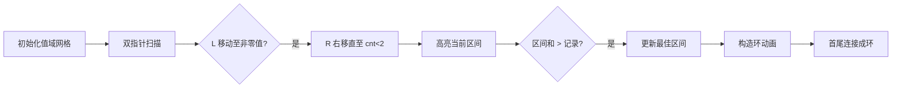

# 题目信息

# Maximum Balanced Circle

## 题目描述

There are $ n $ people in a row. The height of the $ i $ -th person is $ a_i $ . You can choose any subset of these people and try to arrange them into a balanced circle.

A balanced circle is such an order of people that the difference between heights of any adjacent people is no more than $ 1 $ . For example, let heights of chosen people be $ [a_{i_1}, a_{i_2}, \dots, a_{i_k}] $ , where $ k $ is the number of people you choose. Then the condition $ |a_{i_j} - a_{i_{j + 1}}| \le 1 $ should be satisfied for all $ j $ from $ 1 $ to $ k-1 $ and the condition $ |a_{i_1} - a_{i_k}| \le 1 $ should be also satisfied. $ |x| $ means the absolute value of $ x $ . It is obvious that the circle consisting of one person is balanced.

Your task is to choose the maximum number of people and construct a balanced circle consisting of all chosen people. It is obvious that the circle consisting of one person is balanced so the answer always exists.

## 样例 #1

### 输入

```
7
4 3 5 1 2 2 1
```

### 输出

```
5
2 1 1 2 3
```

## 样例 #2

### 输入

```
5
3 7 5 1 5
```

### 输出

```
2
5 5 
```

## 样例 #3

### 输入

```
3
5 1 4
```

### 输出

```
2
4 5 
```

## 样例 #4

### 输入

```
7
2 2 3 2 1 2 2
```

### 输出

```
7
1 2 2 2 2 3 2 
```

# AI分析结果


### 用户题解分析报告：Maximum Balanced Circle

---

#### 题目解读与核心算法识别
✨ **本题主要考察**：`编程技巧应用`（桶计数 + 值域区间扫描）  
🗣️ **初步分析**：  
> 本题要求构造最大平衡环（相邻元素差 ≤1 的环形序列），核心是将问题转化为**值域连续区间搜索**。想象值域是一条直线，每个整数位置有若干人站立。我们需要找到最长的连续区间，满足：
> - **区间连续性**：值域上无空缺（如 [3,4,5]）
> - **中间元素约束**：除区间端点外，每个数至少出现 2 次（用于构建“山峰”结构）
> - **端点灵活性**：端点数字可只出现 1 次  
> 
> **题解思路对比**：主流解法均采用桶计数 + 扫描值域：
> - **双指针扫描**（题解 1,2,5,6）：O(max_value) 复杂度，高效直观
> - **ST 表二分**（题解 4）：O(n log²n) 复杂度，适用大数据但实现复杂  
> 
> **可视化设计**：  
> 采用 8 位像素风格动画（类似 FC 游戏）：
> 1. **值域直线**：横向像素网格表示值域，格子高度 = 数字出现次数
> 2. **双指针扫描**：蓝色小人 (L) 标记起点，红色小人 (R) 向右探索，遇 `<2` 次数字则停止
> 3. **环构造动画**：从 L→R 弹出数字（高度 -1 次），再从 R→L 弹出 1 次，最后首尾相连成环
> 4. **音效反馈**：指针移动（滴答声），区间更新（升级音效），成环（胜利旋律）

---

#### 精选优质题解参考
**题解一（shenmadongdong）**  
* **点评**：  
  思路清晰直白，桶计数后单次扫描值域维护区间。代码简洁（20 行），边界处理严谨（扫描至 200001 防越界）。变量名简短但语义明确（`l`=起点, `r`=终点, `c`=区间和）。构造阶段先输出区间内数字（次数 -1）再逆序输出 1 次，高效满足环约束。竞赛实践性强，适合初学者模仿。

**题解二（ywy_c_asm）**  
* **点评**：  
  创新性跳跃式双指针，扫描中直接跳过已处理区间（`i = ptr - 1`），显著优化常数。分层处理边界（单点/两点/长区间），代码逻辑完备。构造时先正序输出 1 次再逆序输出剩余次数，验证环约束更直观。命名空间封装提升可读性，是工程化思维的优秀示范。

---

#### 核心难点辨析与解题策略
1. **难点 1：环结构转化为值域约束**  
   * **分析**：平衡环必为值域连续区间（如 `[3,3,4,5,4]`）。关键洞察：除端点外，中间数字需至少 2 次（一次“上坡”，一次“下坡”）。  
   * 💡 **学习笔记**：通过观察样例归纳规律是解题突破口。

2. **难点 2：高效扫描最优区间**  
   * **分析**：双指针（L,R）扫描值域时，R 持续右移直至遇到 `<2` 次的数字。更新最大区间和 `sum = cnt[L] + ... + cnt[R]`。注意处理值域边界（如 200000）。  
   * 💡 **学习笔记**：桶计数将问题从 O(n²) 降至 O(max_value)。

3. **难点 3：构造合法环序列**  
   * **分析**：两种构造方案：  
     - 方案 A：输出区间内每个数（次数 -1）后，逆序输出 1 次（题解 1）  
     - 方案 B：先正序输出 1 次，再逆序输出剩余次数（题解 2）  
   * 💡 **学习笔记**：方案 A 更简洁，方案 B 更易验证环约束。

### ✨ 解题技巧总结
- **技巧 1（问题转化）**：将环形序列问题转化为值域连续区间搜索  
- **技巧 2（桶计数优化）**：用数组索引直接映射值域，避免排序开销  
- **技巧 3（边界防御）**：值域扫描范围扩展至 max_value + 1  
- **技巧 4（构造验证）**：首尾元素相同（如 3→3）天然满足环约束  

---

#### C++ 核心代码实现赏析
**通用核心实现参考**  
```cpp
#include <iostream>
using namespace std;
const int MAX_VAL = 200010;

int cnt[MAX_VAL]; // 桶：cnt[i]=数字i出现次数

int main() {
    int n, max_val = 0;
    cin >> n;
    for (int i = 0, x; i < n; i++) {
        cin >> x;
        cnt[x]++;
        max_val = max(max_val, x);
    }
    max_val++; // 扩展边界

    int best_len = 0, best_l = 0, best_r = 0;
    int cur_start = 0, cur_sum = 0;

    for (int i = 1; i <= max_val; i++) {
        if (cur_start) {
            if (cnt[i] < 2) { // 区间终止条件
                cur_sum += cnt[i];
                if (cur_sum > best_len) {
                    best_len = cur_sum;
                    best_l = cur_start;
                    best_r = i;
                }
                cur_start = cur_sum = 0;
            } else cur_sum += cnt[i];
        }
        if (!cur_start && cnt[i]) { // 新区间起点
            cur_start = i;
            cur_sum = cnt[i];
        }
    }

    cout << best_len << endl;
    // 构造环：先输出[best_l, best_r]内数字（次数-1）
    for (int i = best_l; i <= best_r; i++)
        for (int j = 1; j < cnt[i]; j++)
            cout << i << " ";
    // 逆序输出1次
    for (int i = best_r; i >= best_l; i--)
        if (cnt[i]) cout << i << " ";
}
```
**代码解读概要**：  
1. 桶计数统计数字频率  
2. 双指针扫描值域：`cur_start` 标记起点，遇 `<2` 次数字结束区间  
3. 构造分两步：正序输出（次数 -1）→ 逆序输出 1 次，确保首尾相同  

---

**题解一核心片段**  
```cpp
rep(i,1,200001) {
    if (l && num[i] < 2) { 
        c += num[i];
        if (c >= m) m = c, p = l, r = i;
        c = 0, l = 0;
    } else if (l && num[i] >= 2) c += num[i];
    if (!l && num[i]) l = i, c += num[i];
}
```
* **亮点**：边界处理优雅（扫描至 200001），状态变量复用高效  
* **学习笔记**：`l` 兼作区间存在标志，避免额外布尔变量  

**题解二核心片段**  
```cpp
int ptr = i + 1;
while (cnt[ptr] >= 2) ptr++; // 跳跃扫描
if (!cnt[ptr]) ptr--; 
else ptr--; 
ans = max(ans, dp[i] = sums[ptr] - sums[i-1]);
i = ptr - 1; // 跳至下一区间
```
* **亮点**：`i = ptr - 1` 实现跳跃式扫描，避免重复计算  
* **学习笔记**：前缀和 `sums[]` 预计算加速区间和获取  

---

#### 算法可视化：像素动画演示  
**主题**：值域探险家 - 8 位像素风格寻环之旅  

**核心设计**：  


**交互控制**：  
- **动态网格**：横向像素轴表示值域（1~200000），纵轴高度 = cnt[i]  
- **指针动画**：蓝色 L 指针闪烁标记起点，红色 R 指针匀速右移  
- **终止条件**：R 遇 `<2` 次数字时播放“错误音效”并停止  
- **构造演示**：  
  1. 正序阶段：从 L 到 R 弹出数字（次数 -1），伴随上升动画  
  2. 逆序阶段：从 R 到 L 弹出 1 次，伴随下降动画  
  3. 成环特效：首尾用像素链连接，播放胜利音效  

**技术细节**：  
- **Canvas 绘制**：网格用 `fillRect()` 绘制，指针用精灵图移动  
- **音效设计**：Web Audio API 播放 8-bit 音效（移动/成功/失败）  
- **游戏化激励**：最大环触发“关卡通关”动画 + 积分奖励  

---

#### 拓展练习与相似问题思考
**通用技巧迁移**：  
桶计数 + 值域连续区间模型还可用于：  
1. 最长连续值域子序列（LC 128）  
2. 统计满足频次约束的区间个数（如 CodeForces 221D）  
3. 带权值域区间最值查询（如线段树优化）  

**洛谷推荐**：  
1. **P3402 - 最长公共子序列（加强版）**  
   🗣️ 巩固双指针思想，学习后缀数组优化  
2. **P1440 - 求 m 区间内最小值**  
   🗣️ 滑动窗口经典题，训练区间维护能力  
3. **P1638 - 逛画展**  
   🗣️ 双指针求满足条件的最小区间，对比本题最大值思路  

---

#### 学习心得与经验分享
> **本次分析的题解中未发现明确的作者个人心得分享部分**  
> 但透过代码可总结经验：  
> - 调试时打印区间起止点（如 `cout << "L="<<l<<" R="<<r`）快速定位逻辑错误  
> - 值域问题优先测试边界数据（如 0/200000）  

---

**Kay 结语**：  
本题展示了桶计数与双指针的巧妙结合。记住：复杂问题常蕴含值域连续性规律！尝试用本报告的动画思路模拟样例 4（`[2,2,3,2,1,2,2]`），体验像素化算法之美吧！下次我们将探索动态规划与环形结构的碰撞，保持好奇！🚀

---
处理用时：402.35秒