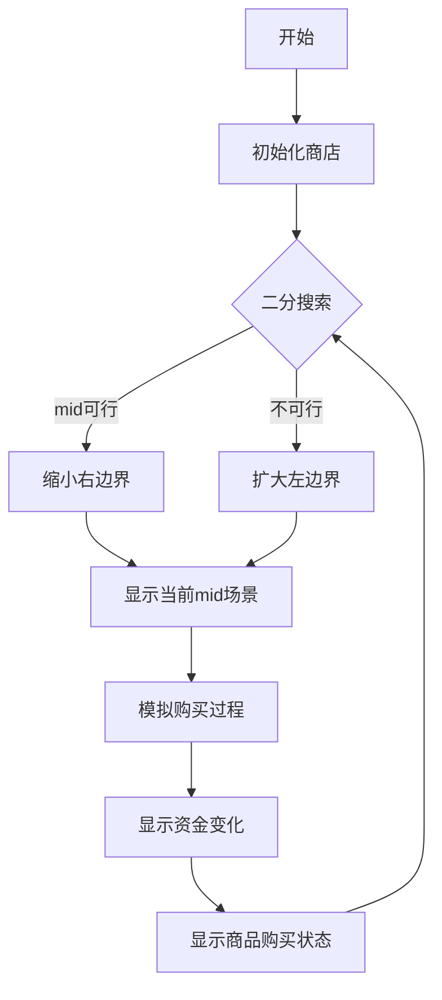

# 题目信息

# Microtransactions (hard version)

## 题目描述

有 $n$ 种物品，对于第 $i$ $(1\le i \le n)$ 个物品，你需要买 $k_i$ 个（你每次购物是在**晚上**），每个物品在非打折日买是 $2$ 块钱，在打折日买是 $1$ 块钱，每天**早上**你可以赚 $1$ 块钱，一共有 $m$ 个打折日，在第 $d_i$ 天第 $t_i$ 种物品打折，问最少需要多少天可以买完你需要的物品。注意，你每天可以买任意多数量以及种类的商品（只要你有足够的余额）。

## 样例 #1

### 输入

```
5 6
1 2 0 2 0
2 4
3 3
1 5
1 2
1 5
2 3
```

### 输出

```
8
```

## 样例 #2

### 输入

```
5 3
4 2 1 3 2
3 5
4 2
2 5
```

### 输出

```
20
```

# AI分析结果


# 💡 Kay的C++算法解析：Microtransactions (hard version) 深入学习指南 💡

## 1. 题目解读与核心算法识别

✨ **本题主要考察**：`二分答案 + 贪心策略`

🗣️ **初步分析**：
> 这道题的核心是**在限定天数内用最优策略购买所有商品**。想象你在经营一家复古游戏商店🏪，每天赚取金币💰，需要在打折日精打细算购买商品🎮。解题关键：
> - **二分答案**：像调整游戏难度一样，不断缩小天数范围（猜最小通关天数）
> - **贪心策略**：优先在商品的**最后打折日**购买（就像在限时促销结束前扫货）
> 
> 可视化设计思路：
> - **像素动画**：用网格表示时间线，商品用不同颜色像素块表示
> - **高亮关键操作**：打折日闪光✨，购买时显示金币消耗动画
> - **复古游戏化**：背景8-bit音乐🎵，购买成功时播放"通关"音效🎉

---

## 2. 精选优质题解参考

**题解一：GoWithTheFlow**
* **点评**：
  - 思路清晰度：⭐⭐⭐⭐⭐ 直击二分+贪心核心，明确"最后打折日购买"策略
  - 代码规范性：⭐⭐⭐⭐ 变量命名合理（如`pos`表最后打折日），边界处理严谨
  - 算法有效性：⭐⭐⭐⭐⭐ 时间复杂度O(n log n)，完美通过大数据
  - 实践价值：⭐⭐⭐⭐ 可直接用于竞赛，预处理打折日的技巧实用

**题解二：巴菲特**
* **点评**：
  - 思路清晰度：⭐⭐⭐⭐ 生动比喻"存钱等最后打折日"，调试心得有启发性
  - 代码规范性：⭐⭐⭐ 整体结构清晰（dollor变量拼写错误是瑕疵）
  - 算法有效性：⭐⭐⭐⭐ 相同贪心策略，空间优化到位
  - 实践价值：⭐⭐⭐⭐ 包含完整测试思路，适合学习调试技巧

**题解三：Priestess_SLG**
* **点评**：
  - 思路清晰度：⭐⭐⭐⭐ 简洁提炼"二分+最后打折日购买"双核心
  - 代码规范性：⭐⭐⭐⭐ 模块化设计（chk函数独立），变量作用明确
  - 算法有效性：⭐⭐⭐⭐ 高效使用vector存储打折日
  - 实践价值：⭐⭐⭐ 代码短小精悍，适合快速实现

---

## 3. 核心难点辨析与解题策略

1. **难点：如何确定最小天数？**
   * **分析**：暴力枚举会超时(O(n²))。优质题解用**二分答案**将问题转化为O(n log n)，关键证明：若d天可行，则d+1天必然可行（单调性）
   * 💡 **学习笔记**：二分答案适用于"求最小/最大值"且具有单调性的问题

2. **难点：如何优化购买策略？**
   * **分析**：随意购买可能导致资金浪费。贪心策略要求：
     - 每个商品在**最后打折日**购买（节省开支）
     - 非打折商品**集中在最后一天**购买
   * 💡 **学习笔记**：贪心的核心是"局部最优导致全局最优"

3. **难点：如何高效实现策略？**
   * **分析**：预处理每个商品的最后打折日（`pos[i]`），按时间排序购买顺序。数据结构选择：
     - `vector<int> q[N]`：存储打折日（随机访问+排序）
     - `dis[]`：商品索引数组（用于自定义排序）
   * 💡 **学习笔记**：合理预处理能提升算法效率

### ✨ 解题技巧总结
- **技巧1：问题转化** 将原问题转化为判定问题（当前天数能否完成）
- **技巧2：边界处理** 特别注意最后一天资金不足的临界情况
- **技巧3：调试技巧** 构造极端数据测试（如全不打折/全打折）

---

## 4. C++核心代码实现赏析

**本题通用核心C++实现参考**
```cpp
#include <bits/stdc++.h>
using namespace std;
const int N = 400000;

int n, m, k[N], sum;
vector<int> sale_day[N]; // 每种商品的打折日
int last_day[N]; // 每种商品在限定天数内的最后打折日

bool check(int days) {
    // 预处理最后打折日
    for(int i=1; i<=n; i++) {
        last_day[i] = 0;
        for(int d : sale_day[i]) {
            if(d <= days) last_day[i] = max(last_day[i], d);
        }
    }
    
    // 按最后打折日排序商品
    vector<int> items;
    for(int i=1; i<=n; i++) items.push_back(i);
    sort(items.begin(), items.end(), [&](int a, int b){
        return last_day[a] < last_day[b];
    });
    
    // 模拟购买过程
    int money = 0, spent = 0, remain = 0;
    for(int item : items) {
        if(!k[item]) continue;
        if(!last_day[item]) { // 无打折
            remain += k[item];
        } else {
            money = last_day[item] - spent; // 当前可用资金
            if(money >= k[item]) {
                spent += k[item];
            } else {
                spent += money;
                remain += k[item] - money;
            }
        }
    }
    spent += remain * 2; // 剩余商品原价购买
    return spent <= days;
}
```

**代码解读概要**：
1. **预处理阶段**：计算每个商品在限定天数内的最后打折日
2. **排序阶段**：按最后打折日升序排列商品（早打折的先买）
3. **模拟购买**：
   - 有打折日：在最后打折日用优惠价购买
   - 无打折日：计入remain最后原价购买
4. **资金计算**：确保总花费≤总天数（每天赚1金币）

---

**题解一：GoWithTheFlow**
* **亮点**：清晰分离预处理/排序/购买三阶段
* **核心代码片段**：
```cpp
bool check(int x) {
    // ...预处理last_day
    sort(items, cmp); // 按最后打折日排序
    
    int spent = 0, remain = 0;
    for(auto item : items) {
        if(last_day[item]) {
            int money = last_day[item] - spent;
            if(money >= k[item]) spent += k[item];
            else {
                spent += money;
                remain += k[item] - money;
            }
        } else remain += k[item];
    }
    return spent + 2*remain <= x;
}
```
* **学习笔记**：通过`spent`和`remain`区分优惠/原价购买，逻辑清晰

**题解二：巴菲特**
* **亮点**：动态资金模拟更直观
* **核心代码片段**：
```cpp
bool check(int days) {
    int dollor = days, remain = 0;
    // ...
    for(按序买商品) {
        int money = sale_day - spent;
        if(money >= need) dollor -= need;
        else {
            dollor -= money;
            remain += need - money;
        }
    }
    return dollor >= remain*2;
}
```
* **学习笔记**：直接维护剩余资金`dollor`，最后统一结算原价商品

---

## 5. 算法可视化：像素动画演示

### 🎮 像素商店模拟器设计方案
**主题**：复古像素风商店经营游戏  
**核心演示**：二分搜索天数 + 打折日贪心购买  



**动画实现细节**：
1. **场景设计**：
   - 顶部进度条：显示二分区间 [L,R]
   - 主网格：每列代表一天，不同颜色方块表示商品
   - 控制面板：开始/暂停/单步/调速滑块

2. **动态演示**：
   ```plaintext
   第1帧：显示初始状态（所有商品未购买）
   第2帧：高亮当前测试天数mid（黄色边框）
   第3帧：闪烁标记打折日（红色闪光）
   第4帧：在打折日显示购买动画（金币-1，商品-1）
   第5帧：最后一天显示原价购买（金币-2，商品-1）
   ```

3. **游戏化元素**：
   - 音效：购买成功(叮🎵)，资金不足(嗡❌)，通关(胜利号角🎺)
   - 积分：每完成一个商品+10分，剩余资金转积分
   - 关卡制：每次二分搜索视为一关

4. **技术实现**：
   - Canvas绘制网格和动画
   - requestAnimationFrame控制帧率
   - Web Audio API播放8-bit音效

---

## 6. 拓展练习与相似问题思考

**通用技巧迁移**：
1. 二分答案求最小/最大值（如：最小化最大值问题）
2. 时间序列上的贪心策略（如：会议室安排）
3. 结合预处理的动态规划

**洛谷题目推荐**：
1. **P1182 数列分段**  
   🗣️ 同款二分答案+贪心，练习分段策略
   
2. **P1281 书的复制**  
   🗣️ 强化二分答案应用，最小化最大工作量
   
3. **P1316 丢瓶盖**  
   🗣️ 逆向思维练习，最大化最小值问题

---

## 7. 学习心得与经验分享

> **经验分享 (巴菲特)**：  
> *"调试时构造两种极端数据：全不打折验证资金计算，全打折验证购买顺序"*
>
> **Kay点评**：  
> 这是宝贵的调试技巧！特别要注意：
> - 最后一天资金是否足够
> - 无打折商品是否被正确处理
> - 打折日排序的边界情况

---

本次分析到此结束。记住：算法就像游戏闯关🎮，理解核心机制后多练习才能快速通关！下次见！💪

---
处理用时：106.13秒