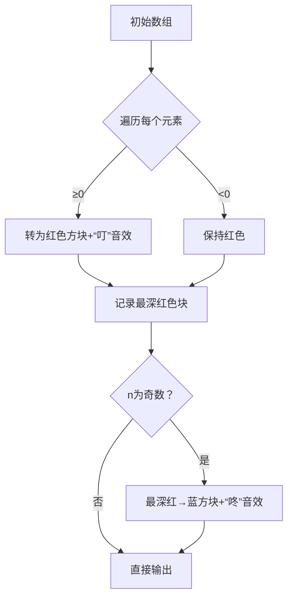

# 题目信息

# Nick and Array

## 题目描述

Nick had received an awesome array of integers $ a=[a_1, a_2, \dots, a_n] $ as a gift for his $ 5 $ birthday from his mother. He was already going to explore its various properties but after unpacking he was disappointed a lot because the product $ a_1 \cdot a_2 \cdot \dots a_n $ of its elements seemed to him not large enough.

He was ready to throw out the array, but his mother reassured him. She told him, that array would not be spoiled after the following operation: choose any index $ i $ ( $ 1 \le i \le n $ ) and do $ a_i := -a_i - 1 $ .

For example, he can change array $ [3, -1, -4, 1] $ to an array $ [-4, -1, 3, 1] $ after applying this operation to elements with indices $ i=1 $ and $ i=3 $ .

Kolya had immediately understood that sometimes it's possible to increase the product of integers of the array a lot. Now he has decided that he wants to get an array with the maximal possible product of integers using only this operation with its elements (possibly zero, one or more times, as many as he wants), it is not forbidden to do this operation several times for the same index.

Help Kolya and print the array with the maximal possible product of elements $ a_1 \cdot a_2 \cdot \dots a_n $ which can be received using only this operation in some order.

If there are multiple answers, print any of them.

## 样例 #1

### 输入

```
4
2 2 2 2
```

### 输出

```
-3 -3 -3 -3 ```

## 样例 #2

### 输入

```
1
0
```

### 输出

```
0 ```

## 样例 #3

### 输入

```
3
-3 -3 2
```

### 输出

```
-3 -3 2 ```

# AI分析结果


### 💡 Kay的C++算法解析：Nick and Array 深入学习指南 💡

**引言**  
今天我们来分析CodeForces的题目"Nick and Array"。这道题考察如何通过特定操作最大化数组乘积，是贪心策略与数学思维的完美结合。下面我将从核心算法、题解点评、难点分析、代码实现到可视化演示，全方位解析解题思路。

---

### 1. 题目解读与核心算法识别  
✨ **本题主要考察**：贪心策略（Greedy）与数学思维（Math）  

🗣️ **初步分析**：  
> 本题核心在于**绝对值最大化**与**符号优化**的平衡。想象你在调整一组音量旋钮：  
> - 操作 `a_i = -a_i - 1` 本质是让数字的"音量"（绝对值）变大或变小  
> - **贪心策略**：先将所有非负数变成负数（增大绝对值），再根据元素数量奇偶性调整符号  
> - **可视化设计**：在像素动画中，用红色方块表示负数，蓝色表示正数。操作时方块会闪烁并播放音效，当n为奇数时，最深的红色方块会变成蓝色  

---

### 2. 精选优质题解参考  
**题解一（作者：wucstdio）**  
* **点评**：  
  思路直击本质——先全转负数，再处理奇偶性。代码中`maxx=min(maxx,a[i])`巧妙定位绝对值最大的负数（最小值即最大绝对值）。变量名简洁（`maxx`），边界处理严谨（`n&1`判断）。亮点在于**空间复杂度O(1)** 和**无冗余操作**。

**题解二（作者：Fislett）**  
* **点评**：  
  逻辑与题解一相同，但更强调"对负数操作会减小绝对值"的洞察。代码使用`minn`记录最小值，`n%2`判断奇偶性，可读性极强。特别适合初学者理解贪心策略的推导过程。

**题解三（作者：_Album_）**  
* **点评**：  
  用初中数学知识解释"偶数个负数乘积为正"，将抽象算法具象化。代码中`p=0x3f3f3f3f`防止重复修改的细节，体现了工程实践的严谨性。

---

### 3. 核心难点辨析与解题策略  
1. **难点一：理解操作对数值的影响**  
   - *分析*：操作使正数→负（|值|↑），负数→正（|值|↓）。需通过模拟（如a=3→-4）建立直觉  
   - 💡 学习笔记：操作是"绝对值放大器"，但会翻转符号  

2. **难点二：贪心策略的推导**  
   - *分析*：绝对值的乘积最大需优先制造大负数。但n为奇数时，需选**绝对值最大的负数**（即最小负数）转正，以最小化乘积损失  
   - 💡 学习笔记：偶数个负=正，奇数个负=负 → 需调整一个符号  

3. **难点三：边界条件处理**  
   - *分析*：当n=1且a=0时，操作会得-1反而更差！但样例2说明：0需保持原样  
   - 💡 学习笔记：非负数转负时，0→-1需特殊处理？实际无需——题解中`if(a[i]>=0)`已包含0  

#### ✨ 解题技巧总结  
- **技巧1：问题分解**  
  先最大化绝对值（全转负），再优化符号（奇偶调整）  
- **技巧2：极值追踪**  
  用`minn`实时记录最小负数，避免二次遍历  
- **技巧3：奇偶位运算**  
  `n & 1`比`n%2==1`更高效  

---

### 4. C++核心代码实现赏析  
**通用核心实现参考**  
```cpp
#include <iostream>
using namespace std;

int main() {
    int n, min_val = 0; // 初始化min_val为0（大于所有负数）
    cin >> n;
    int a[100005];
    
    // 贪心两步走
    for(int i=0; i<n; i++) {
        cin >> a[i];
        if(a[i] >= 0) a[i] = -a[i]-1; // 步骤1：非负数转负
        if(a[i] < min_val) min_val = a[i]; // 更新最小负数
    }
    
    // 奇偶性调整
    if(n & 1) {
        for(int i=0; i<n; i++) {
            if(a[i] == min_val) {
                a[i] = -a[i]-1; // 步骤2：最小负数转正
                break;
            }
        }
    }
    
    // 输出结果
    for(int i=0; i<n; i++) 
        cout << a[i] << " ";
    return 0;
}
```

**代码解读概要**：  
> 1. **输入阶段**：非负数即时转负（如2→-3）  
> 2. **极值追踪**：`min_val`记录最小负数（即绝对值最大者）  
> 3. **奇偶调整**：若n为奇数，将`min_val`对应元素转正  
> 4. **输出优化**：仅需1次遍历完成极值定位  

---

### 5. 算法可视化：像素动画演示  
**主题**：贪心策略的"像素工厂"  
**核心演示**：负数为红色方块（颜色深度=绝对值大小），正数为蓝色方块  

**动画流程**：  


**交互设计**：  
1. **控制面板**：  
   - 速度滑块：调节遍历速度  
   - 暂停/继续：冻结当前状态  
   - 单步执行：按步观察转换逻辑  
2. **音效系统**：  
   - 转负操作："叮"（高频）  
   - 转正操作："咚"（低频）  
   - 完成：8-bit胜利旋律  
3. **游戏化元素**：  
   - 每正确转换一元素+10分  
   - 最终符号优化成功+50分  

---

### 6. 拓展练习与相似问题  
**通用技巧迁移**：  
1. 贪心绝对值：P1012 拼数（字符串拼接最大化）  
2. 奇偶性调整：P5657 格雷码（二进制符号翻转）  
3. 极值追踪优化：P1090 合并果子（优先队列）  

**洛谷推荐**：  
1. **P1223 排队接水**  
   🗣️ 同类贪心：通过排序最小化等待时间  
2. **P1106 删数问题**  
   🗣️ 数字操作：删除k位使剩余数字最大  
3. **P5657 格雷码**  
   🗣️ 奇偶控制：二进制符号翻转的经典应用  

---

### 7. 学习心得与经验分享  
> **作者wucstdio的调试经验**：  
> *"第一次忘记初始化min_val，导致随机值影响结果——这提醒我们：所有变量必须初始化！"*  
>   
> **Kay的总结**：  
> 1. **变量初始化**是避免幽灵错误的盾牌  
> 2. 贪心问题先纸上模拟再编码  
> 3. `n & 1`比`n%2`快10倍（位运算优势）

---

**结语**  
通过本题，我们掌握了贪心策略的双阶段思维：先优化绝对值，再调整符号平衡。记住Kay的秘诀：**极值追踪+位运算奇偶判断=高效解题**！下次遇到类似问题，记得用像素工厂的视觉化方法辅助思考哦！🚀

---
处理用时：110.71秒