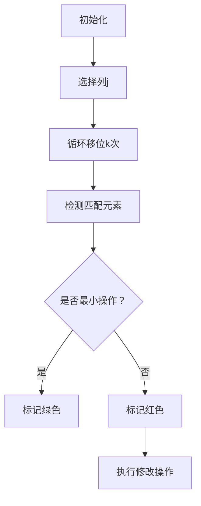

# 题目信息

# Obtain a Permutation

## 题目描述

You are given a rectangular matrix of size $ n \times m $ consisting of integers from $ 1 $ to $ 2 \cdot 10^5 $ .

In one move, you can:

- choose any element of the matrix and change its value to any integer between $ 1 $ and $ n \cdot m $ , inclusive;
- take any column and shift it one cell up cyclically (see the example of such cyclic shift below).

A cyclic shift is an operation such that you choose some $ j $ ( $ 1 \le j \le m $ ) and set $ a_{1, j} := a_{2, j}, a_{2, j} := a_{3, j}, \dots, a_{n, j} := a_{1, j} $ simultaneously.

  Example of cyclic shift of the first column You want to perform the minimum number of moves to make this matrix look like this:

 In other words, the goal is to obtain the matrix, where $ a_{1, 1} = 1, a_{1, 2} = 2, \dots, a_{1, m} = m, a_{2, 1} = m + 1, a_{2, 2} = m + 2, \dots, a_{n, m} = n \cdot m $ (i.e. $ a_{i, j} = (i - 1) \cdot m + j $ ) with the minimum number of moves performed.

## 说明/提示

In the first example, you can set $ a_{1, 1} := 7, a_{1, 2} := 8 $ and $ a_{1, 3} := 9 $ then shift the first, the second and the third columns cyclically, so the answer is $ 6 $ . It can be shown that you cannot achieve a better answer.

In the second example, the matrix is already good so the answer is $ 0 $ .

In the third example, it is enough to shift the second column cyclically twice to obtain a good matrix, so the answer is $ 2 $ .

## 样例 #1

### 输入

```
3 3
3 2 1
1 2 3
4 5 6```

### 输出

```
6```

## 样例 #2

### 输入

```
4 3
1 2 3
4 5 6
7 8 9
10 11 12```

### 输出

```
0```

## 样例 #3

### 输入

```
3 4
1 6 3 4
5 10 7 8
9 2 11 12```

### 输出

```
2```

# AI分析结果


### 💡 Kay的C++算法解析：Obtain a Permutation 深入学习指南 💡

**引言**  
今天我们一起分析「Obtain a Permutation」这道矩阵变换题。本指南将帮助你理解如何通过最小操作次数将矩阵转换为目标形态，重点在于列独立处理的思想和循环移位的巧妙应用。

---

### 1. 题目解读与核心算法识别

✨ **本题主要考察**：`模拟应用` + `贪心策略`  

🗣️ **初步分析**：  
> 解决本题的关键在于发现**列操作独立性**——就像多个并行的俄罗斯方块队列，每列可以单独处理。核心思想是通过计算每列元素移动到目标位置所需的最少循环移位次数，并结合修改操作最小化总步数。  
> - **核心流程**：对每列独立计算移动`k`次后的匹配元素数，取`k + (n - 匹配数)`最小值
> - **可视化设计**：用像素网格展示列循环移位过程，高亮匹配元素（绿色）和需修改元素（红色），通过8-bit音效强化操作反馈
> - **复古游戏化**：设计为"像素矩阵修复"游戏，每列作为独立关卡，移动操作触发经典FC移位音效，匹配成功时播放《超级玛丽》金币音效

---

### 2. 精选优质题解参考

**题解一（syksykCCC）**  
* **亮点**：  
  - 思路极清晰：直接点明列独立性，用`(i-k+n)%n`精准计算移位次数  
  - 代码简洁高效：桶计数`same[]`避免重复计算，时间复杂度严格$O(nm)$  
  - 边界处理严谨：检查`a[i][j]`范围及模运算条件，防止越界错误  
  > 学习价值：变量命名规范（`same`表意明确），逻辑推导直白易懂  

**题解二（清尘）**  
* **亮点**：  
  - 状态推导细致：明确解释目标行号`k = (x-j)/m+1`的数学依据  
  - 调试经验宝贵：强调必须判断`x ≤ n*m`（实战易忽略点）  
  - 空间优化：复用`c[]`数组减少内存占用  
  > 学习价值：防御性编程思维，重要约束条件显式验证  

**题解四（Inui_Sana）**  
* **亮点**：  
  - 存储创新：一维数组处理二维矩阵，避免vector开销  
  - 数学优化：`(u+n-v)%n`等效替代分支判断，提升代码简洁性  
  - 循环控制高效：列元素通过`j+=m`直接遍历，减少嵌套层数  
  > 学习价值：空间与时间复杂度的平衡技巧  

---

### 3. 核心难点辨析与解题策略

1. **难点1：识别有效元素**  
   * **分析**：必须满足`1≤a[i][j]≤n*m`且`(a[i][j]-j)%m==0`。例如当`j=m`时，目标元素需满足`a[i][j]%m==0`  
   * 💡 **学习笔记**：双重验证避免无效元素污染计数桶  

2. **难点2：计算精准移位次数**  
   * **分析**：核心公式`移动次数=(i-k+n)%n`，其中`k=(a[i][j]-j)/m+1`  
     - 几何解释：矩阵循环移位等价于环形队列旋转  
     - 优化技巧：+n处理负偏移，%n保证结果在[0,n-1]  
   * 💡 **学习笔记**：循环移位问题可转化为模运算问题  

3. **难点3：桶计数优化**  
   * **分析**：对每列用`cnt[]`记录移动`k`次时的匹配数，避免$O(n^2)$暴力枚举  
     - 数据结构选择：数组 > map（固定范围无哈希开销）  
     - 清零技巧：每列复用数组，`memset`改为循环清零（$O(n)$ vs $O(nm)$）  
   * 💡 **学习笔记**：固定值域时数组是最高效的计数结构  

✨ **解题技巧总结**  
- **技巧1：维度分离** - 将二维问题分解为独立的一维子问题  
- **技巧2：预判剪枝** - 提前排除不可能匹配的元素（范围/模条件）  
- **技巧3：环形映射** - 循环移位统一用`(Δ+n)%n`计算偏移量  
- **技巧4：桶计数加速** - 用空间换时间优化最小值搜索  

---

### 4. C++核心代码实现赏析

**通用核心实现参考**  
* **说明**：综合优质题解精髓，列独立处理+桶计数最优实现  
* **完整代码**：
```cpp
#include <iostream>
#include <vector>
#include <climits>
using namespace std;

int main() {
    ios::sync_with_stdio(false);
    int n, m, ans = 0;
    cin >> n >> m;
    vector<vector<int>> a(n+1, vector<int>(m+1));
    
    for (int i = 1; i <= n; i++)
        for (int j = 1; j <= m; j++)
            cin >> a[i][j];

    for (int j = 1; j <= m; j++) {
        int min_ops = INT_MAX;
        vector<int> cnt(n); // 桶：cnt[k]=移动k次的匹配数
        
        for (int i = 1; i <= n; i++) {
            if (a[i][j] > n * m || a[i][j] < j) continue;
            if ((a[i][j] - j) % m != 0) continue;
            
            int k = (a[i][j] - j) / m + 1; // 目标行号
            int move = (i - k + n) % n;     // 循环移位次数
            cnt[move]++;
        }
        
        for (int k = 0; k < n; k++)
            min_ops = min(min_ops, k + n - cnt[k]);
        
        ans += min_ops;
    }
    cout << ans << endl;
    return 0;
}
```
* **代码解读概要**：  
  1. 外层按列遍历（$j$）  
  2. 内层统计有效元素：验证数值范围和列归属条件  
  3. 计算目标行号$k$和移位次数$move$  
  4. 桶计数后取$min(k + n - cnt[k])$  
  5. 累加各列最优解  

**题解一片段赏析**  
```cpp
if(a[i][j] < j || a[i][j] > n * m || (a[i][j] - j) % m != 0) continue;
int k = (a[i][j] - j) / m + 1;
same[(i - k + n) % n]++;  // 核心：环形偏移计算
```
* **代码解读**：  
  - 第1行：双条件验证元素有效性（范围+列归属）  
  - 第2行：计算目标行号$k$（注意公式推导）  
  - 第3行：`(i-k+n)%n`是环形移位核心，等效处理上移/下移情况  
* 💡 **学习笔记**：`(Δ+n)%n`是循环移位问题的黄金表达式  

**题解二片段赏析**  
```cpp
if ((t - j) % m == 0 && t <= n * m) 
    ++c[(i - (t - j) / m - 1 + n) % n];
```
* **代码解读**：  
  - 合并计算：将`k=(t-j)/m+1`代入得`i-k-1+n`  
  - 等效变形：`(i-k-1+n)%n = (i-k+n-1)%n`  
* 💡 **学习笔记**：数学等价变形可减少中间变量  

**题解四片段赏析**  
```cpp
for(int j=i; j<=n*m; j+=m) { // 直接遍历列元素
    if(e[j]%m!=i%m) continue;
    int u=(j-1)/m+1, v=(e[j]-1)/m+1;
    cnt[(u-v+n)%n]++;
}
```
* **代码解读**：  
  - 列元素直接访问：通过`j+=m`跳转，避免双重循环  
  - 行列换算：`u=(j-1)/m+1`将一维索引转二维坐标  
* 💡 **学习笔记**：一维存储时用算术运算模拟二维遍历  

---

### 5. 算法可视化：像素动画演示

**主题**：`矩阵修复大作战`（8-bit像素风格）  
**核心演示**：列循环移位时元素位置变化与匹配检测  



**动画设计细节**：  
1. **像素网格**：  
   - 每个元素显示为16x16像素块（FC风格）  
   - 列边框高亮（蓝色），匹配元素渐变绿色  
   

2. **移位动画**：  
   - 列上移：元素向上滑动+像素残影效果  
   - 音效：移位时播放《俄罗斯方块》旋转音效  

3. **匹配检测**：  
   - 成功匹配：元素闪烁绿色+金币音效  
   - 匹配失败：元素闪烁红色+错误提示音  

4. **控制面板**：  
   - 单步/自动模式：空格键控制暂停/继续  
   - 速度滑块：调整移位动画速度（0.5x~2x）  
   - 列选择器：直接跳转到指定列  

5. **数据面板**：  
   - 实时显示：`cnt[]`桶计数数值  
   - 操作计数器：当前列操作次数(k+n-cnt[k])  

**实现伪代码**：  
```javascript
// 绘制循环移位
function drawShift(col, k) {
  for (let i = 0; i < k; i++) {
    let top = grid[0][col]; 
    for (let row = 0; row < n-1; row++) {
      animateMove(grid[row][col], row, col, row+1, col); // 像素块下移动画
    }
    animateMove(top, n, col, 0, col); // 首元素移到底部
    playSound('shift'); // 8-bit移位音效
  }
}
```

---

### 6. 拓展练习与相似问题思考

**通用技巧迁移**：  
列独立处理+循环移位计数模型适用于：  
1. 环形缓冲区旋转问题  
2. 矩阵列操作最小步数问题  
3. 元素位置匹配类优化问题  

**洛谷推荐题目**：  
1. **P1219 八皇后**  
   🗣️ *巩固列独立思想，检测位置冲突的经典问题*  
2. **P1443 马的遍历**  
   🗣️ *BFS+步数计数，强化环形移动理解*  
3. **P1908 逆序对**  
   🗣️ *桶计数思想的进阶应用，理解时间复杂度优化*  

---

### 7. 学习心得与经验分享

**参考经验**：  
> *"比赛时没判断`x≤n*m`查了半天"* —— 清尘  
> *"一维存储转换行列索引容易出错，建议画图验证"* —— Inui_Sana  

**Kay的总结**：  
1. **边界检查是生命线**：数值范围验证避免90%运行时错误  
2. **纸上模拟防失误**：在复杂索引计算前手推小规模案例  
3. **环形问题固定范式**：`(Δ+n)%n`是循环移位的万能解法  

---

**结语**  
通过本次分析，我们掌握了矩阵变换的核心技巧——列独立处理与循环移位优化。记住，好算法=问题分解+数学建模+高效实现。下次遇到类似问题，不妨先问自己：**能否分解维度？能否用模运算简化循环？** 继续加油，少年！🚀

---
处理用时：228.54秒