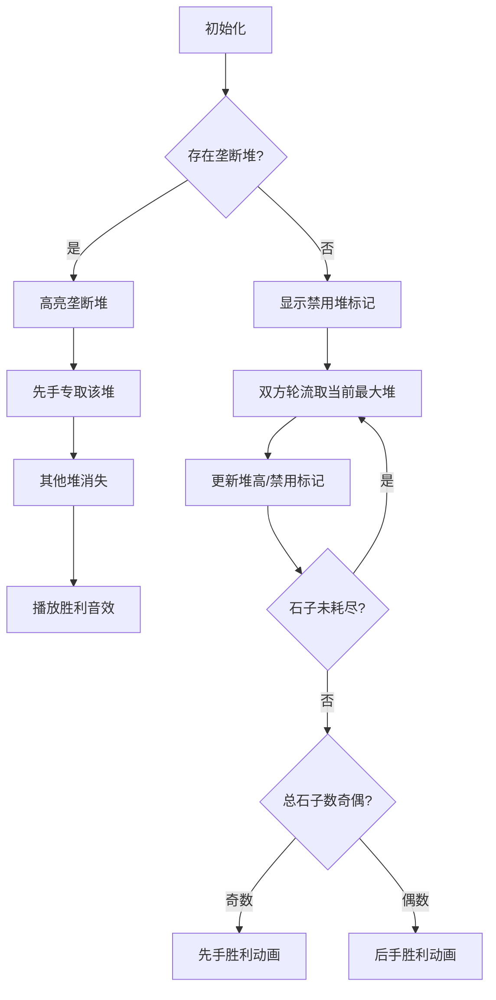

# 题目信息

# Stoned Game

## 题目描述

T is playing a game with his friend, HL.

There are $ n $ piles of stones, the $ i $ -th pile initially has $ a_i $ stones.

T and HL will take alternating turns, with T going first. In each turn, a player chooses a non-empty pile and then removes a single stone from it. However, one cannot choose a pile that has been chosen in the previous turn (the pile that was chosen by the other player, or if the current turn is the first turn then the player can choose any non-empty pile). The player who cannot choose a pile in his turn loses, and the game ends.

Assuming both players play optimally, given the starting configuration of $ t $ games, determine the winner of each game.

## 说明/提示

In the first game, T removes a single stone from the only pile in his first turn. After that, although the pile still contains $ 1 $ stone, HL cannot choose from this pile because it has been chosen by T in the previous turn. Therefore, T is the winner.

## 样例 #1

### 输入

```
2
1
2
2
1 1```

### 输出

```
T
HL```

# AI分析结果


# 💡 Kay的C++算法解析：Stoned Game 深入学习指南 💡

## 1. 题目解读与核心算法识别

✨ **本题主要考察**：`博弈论（数学）`

🗣️ **初步分析**：
> 这道石子游戏题就像两个人在玩"石子搬移对决"，规则是不能连续两次搬同一堆石子。关键在于识别两种必胜模式：
> - **"垄断堆"模式**：若某堆石子数量 > 其他堆总和（相当于某人独占半壁江山），先手只需死守这堆必胜
> - **"消耗战"模式**：双方会轮流消耗当前最大堆（避免制造垄断堆），最终所有石子被取完，此时总石子数奇偶决定胜负（奇数步时先手走最后一步）
> 
> 可视化设计思路：
> - 用不同颜色像素块表示石子堆，高度对应石子数量
> - "垄断堆"模式：红色高亮关键堆，其他堆逐渐灰暗消失
> - "消耗战"模式：显示当前禁用堆（闪烁标记），动态更新堆高
> - 复古游戏元素：8-bit音效（取石子"哔"声，胜利音效），控制面板支持单步/自动播放

---

## 2. 精选优质题解参考

**题解一（作者：SSerxhs）**
* **点评**：思路直击要害，用最简代码（仅1次遍历）同时计算最大值和其余和。变量命名简洁（j存最大值下标，c存其余和），边界处理严谨（包含n=1的情况）。亮点在于用位运算`(c^a[j])&1`高效判断总和奇偶性，竞赛实用性强。

**题解二（作者：钓鱼王子）**
* **点评**：通过排序直观获取最大值（升序后a[n]即为最大值），逻辑清晰分两步判断。代码中`sum`先存其余和再累加最大值的设计巧妙，避免重复计算。虽然排序增加O(n log n)开销，但数据范围小完全可接受。

**题解三（作者：寒鸽儿）**
* **点评**：创新性用优先队列模拟对局过程，提供不同于数学结论的实现视角。每次取两最大堆各减1的设计生动展示"消耗战"本质，帮助理解游戏进程。虽复杂度较高(O(Σa_i log n))，但数据范围小且有教学价值。

---

## 3. 核心难点辨析与解题策略

1. **识别必胜态（垄断堆）**
   * **分析**：计算最大值max与其余和sum_rest，当max > sum_rest时即必胜态。关键在理解此时先手可无限取该堆，后手被迫取其他堆直至枯竭
   * 💡 **学习笔记**：发现"垄断堆"就锁定胜局

2. **理解消耗战模式**
   * **分析**：当无垄断堆时，双方会避免制造新垄断堆，因而轮流取当前最大堆（非禁用堆）。这确保石子最终取完，总步数=总石子数
   * 💡 **学习笔记**：最优策略下游戏必进行至终局

3. **奇偶性决定胜负**
   * **分析**：总石子数奇偶性决定最后一步执行者。奇数步时先手执行最后一步（后手无路可走），偶数步时后手执行最后一步
   * 💡 **学习笔记**：终局时总步数奇偶=石子总数奇偶

### ✨ 解题技巧总结
- **问题分解法**：将博弈问题分解为"垄断堆检测"和"奇偶性判断"两个子问题
- **数学建模法**：用最大值与总和的数学关系代替复杂模拟
- **边界思维**：特别注意n=1（天然垄断堆）等边界情况

---

## 4. C++核心代码实现赏析

**本题通用核心C++实现参考**
* **说明**：综合优质题解思路，采用高效遍历法求最大值和总和
```cpp
#include <iostream>
#include <vector>
using namespace std;

int main() {
    int t;
    cin >> t;
    while (t--) {
        int n, sum = 0, max_val = 0;
        cin >> n;
        vector<int> a(n);
        for (int i = 0; i < n; i++) {
            cin >> a[i];
            sum += a[i];              // 累加总和
            max_val = max(max_val, a[i]); // 更新最大值
        }
        if (max_val > sum - max_val || sum % 2 == 1) 
            cout << "T\n";  // 垄断堆或奇数必胜
        else 
            cout << "HL\n"; // 否则后手胜
    }
    return 0;
}
```
* **代码解读概要**：通过单次遍历同时计算总和与最大值，避免排序开销。条件判断先检查垄断堆(max_val > sum - max_val)，再检查总石子奇偶性(sum % 2)，简洁高效。

---

**题解一（SSerxhs）核心代码**
```cpp
j = 1; // 初始化最大值下标
for (i = 2; i <= n; i++) 
    if (a[i] > a[j]) j = i;  // 遍历找最大值下标
c = 0; // 其余堆和
for (i = 1; i <= n; i++) 
    if (i != j) c += a[i]; // 累加非最大堆
if ((a[j] > c) || ((c ^ a[j]) & 1)) // 垄断堆或奇偶判断
    puts("T");
```
* **亮点**：位运算高效判奇偶
* **代码解读**：第一循环确定最大值下标j（避免重复计算最大值），第二循环计算其余和c。条件`(c ^ a[j]) & 1`等价于`(c + a[j]) % 2`（总和奇偶性），位运算提升效率
* 💡 **学习笔记**：遍历求极值时保存下标可避免后续重复查找

**题解二（钓鱼王子）核心代码**
```cpp
sort(a + 1, a + n + 1); // 升序排序
int sum = 0;
for (int i = 1; i < n; i++) 
    sum += a[i]; // 前n-1个和
if (a[n] > sum) puts("T"); // 最大值>其余和
else {
    sum += a[n]; // 总和=原sum+a[n]
    if (sum & 1) puts("T"); // 奇数胜
}
```
* **亮点**：排序后最大值位置固定
* **代码解读**：升序排序后最大值在a[n]，先计算前n-1项和（即其余和）。注意sum在else块更新为总和，避免定义新变量
* 💡 **学习笔记**：排序虽增加开销，但使最大值访问更直观

**题解三（寒鸽儿）核心代码**
```cpp
priority_queue<int> q; // 大顶堆
while (q.size() >= 2) {
    int r = q.top(); q.pop(); // 最大堆
    int l = q.top(); q.pop(); // 次大堆
    if (--r) q.push(r); // 各减1后非空则入队
    if (--l) q.push(l);
}
if (q.size() == 1) cout << "T\n"; // 剩1堆时先手胜
```
* **亮点**：模拟过程直观展示游戏机制
* **代码解读**：循环每次取两最大堆各减1石子，模拟双方轮流操作。当循环结束剩1堆时，说明下一轮先手可取其获胜；否则所有堆同时耗尽（后手胜）
* 💡 **学习笔记**：优先队列适合模拟"总是取当前最大值"场景

---

## 5. 算法可视化：像素动画演示

**主题**：8-bit像素风石子大作战  
**核心演示**：动态展示两种游戏模式，重点呈现石子堆变化与胜负判定  

### 动画设计


**交互控制**：
- **像素风格**：FC红白机色调（每堆不同颜色），堆高用像素块数量表示
- **步进控制**：支持单步/自动播放（速度可调）
- **音效设计**：
  - 取石子：8-bit "哔"声
  - 垄断堆出现：低频警报音
  - 胜利：欢快旋律（先手胜↑调，后手胜↓调）
- **状态高亮**：
  - 当前操作堆：黄色闪烁边框
  - 禁用堆：灰色半透明+锁形图标
  - 垄断堆：红色脉冲光效

**技术实现**：Canvas绘制动态堆高，setInterval控制自动播放，Web Audio API触发音效。关键帧包含垄断堆检测、堆高更新、胜负判定三个状态节点。

---

## 6. 拓展练习与相似问题思考

**通用思路迁移**：
1. **限制操作博弈**：当操作有特殊限制时（如本题禁用上一轮堆），常需分析状态转移
2. **资源控制策略**：通过制造资源不对称（如垄断堆）获得主动权
3. **奇偶性定胜负**：当游戏必进行到底时，总操作步数奇偶决定性作用

**洛谷推荐**：
1. [P1247 取石子游戏](https://www.luogu.com.cn/problem/P1247)  
   → 巩固经典Nim博弈模型
2. [P1288 取数游戏II](https://www.luogu.com.cn/problem/P1288)  
   → 练习有向图博弈+决策限制
3. [P2197 Nim游戏](https://www.luogu.com.cn/problem/P2197)  
   → 掌握Nim定理的变种应用

---

## 7. 学习心得与经验分享

> **参考经验（寒鸽儿）**：  
> "模拟方法帮助理解博弈过程，但数学结论更高效"

> **参考经验（king_xbz）**：  
> "最初尝试贪心取最大堆失败，意识到需避免制造对手的必胜态"

> **点评**：这些经验凸显博弈问题的核心矛盾——直观策略可能致命，需通过数学证明验证策略最优性。调试时可构造小数据模拟（如n=2）验证结论。

---

本次分析就到这里！记住：博弈问题=数学证明+状态分析。多练习奇偶性应用和资源控制策略，下次遇到类似问题你定能游刃有余！🚀

---
处理用时：198.31秒