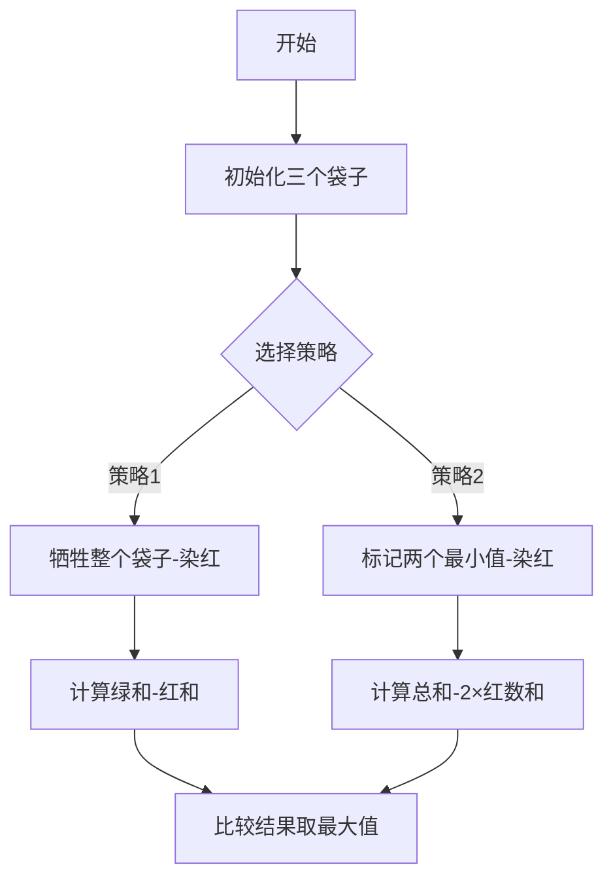

# 题目信息

# Three Bags

## 题目描述

You are given three bags. Each bag contains a non-empty multiset of numbers. You can perform a number of operations on these bags. In one operation, you can choose any two non-empty bags, and choose one number from each of the bags. Let's say that you choose number $ a $ from the first bag and number $ b $ from the second bag. Then, you remove $ b $ from the second bag and replace $ a $ with $ a-b $ in the first bag. Note that if there are multiple occurrences of these numbers, then you shall only remove/replace exactly one occurrence.

You have to perform these operations in such a way that you have exactly one number remaining in exactly one of the bags (the other two bags being empty). It can be shown that you can always apply these operations to receive such a configuration in the end. Among all these configurations, find the one which has the maximum number left in the end.

## 说明/提示

In the first example input, let us perform the following operations:

 $ [1, 2], [6, 3, 4, 5], [5] $

 $ [-5, 2], [3, 4, 5], [5] $ (Applying an operation to $ (1, 6) $ )

 $ [-10, 2], [3, 4], [5] $ (Applying an operation to $ (-5, 5) $ )

 $ [2], [3, 4], [15] $ (Applying an operation to $ (5, -10) $ )

 $ [-1], [4], [15] $ (Applying an operation to $ (2, 3) $ )

 $ [-5], [], [15] $ (Applying an operation to $ (-1, 4) $ )

 $ [], [], [20] $ (Applying an operation to $ (15, -5) $ )

You can verify that you cannot achieve a bigger number. Hence, the answer is $ 20 $ .

## 样例 #1

### 输入

```
2 4 1
1 2
6 3 4 5
5```

### 输出

```
20```

## 样例 #2

### 输入

```
3 2 2
7 5 4
2 9
7 1```

### 输出

```
29```

# AI分析结果


### 💡 Kay的C++算法解析：Three Bags 深入学习指南 💡

**引言**  
今天我们来分析CF1467C "Three Bags"这道有趣的贪心题。本指南将帮你掌握如何通过巧妙的贡献分配策略最大化最终数值，并理解其背后的数学本质。

---

### 1. 题目解读与核心算法识别

✨ **本题主要考察**：`贪心策略`与`数学推导`  

🗣️ **初步分析**：
> 解决本题的关键在于将操作转化为对数值贡献符号的分配。想象你在玩一个"符号分配游戏"：通过操作给数字分配正负号（绿色正号/红色负号），最终目标是最大化剩余数值。  
> - **核心策略**：  
>   - **策略1**：牺牲整个袋子的数（全为负贡献），其他袋子为正  
>   - **策略2**：牺牲两个不同袋子中的最小值（两个负贡献），其余全为正  
> - **可视化设计**：  
>   采用8位像素风格（类似FC游戏）展示两种策略：  
>   1. 策略1：将目标袋子染成红色，其他绿色→计算"绿和-红和"  
>   2. 策略2：标记两个最小值为红色→计算"总和-2×红数和"  
>   动画添加音效：选择袋子时触发"选择音效"，计算结果时播放"胜利音效"  

---

### 2. 精选优质题解参考

**题解一（PersistentLife）**  
* **点评**：思路清晰直击核心，直接给出两种策略的数学表达式。代码简洁高效（O(n)时间复杂度），变量命名规范（s1/s2/s3表总和，m1/m2/m3表最小值）。亮点在于用`min(m1+m2, min(m1+m3, m2+m3))`精妙计算策略二，竞赛实用性强。作者提到"两种贡献情况"启发了策略推导。

**题解二（OYBDOOO）**  
* **点评**：代码极度简洁（一行输出解决），正确实现双策略。变量命名合理（all总和，mi最小值），但缺少注释影响可读性。亮点在于用`max`嵌套同时比较四种情况，展示数学本质。实践时需注意避免重复计算策略二。

**题解三（duyi）**  
* **点评**：创新性地用树形结构分析贡献符号，最终回归到双策略。代码规范但策略二实现稍复杂（循环冗余）。亮点在于快速IO模板提升效率，适合大数据场景，但需注意策略二应直接取最小值和组合。

---

### 3. 核心难点辨析与解题策略

1. **贡献符号分配**  
   * **分析**：操作本质是给数值分配正负号。难点在于发现：① 同袋数不能互消 ② 最终符号取决于"牺牲"选择。优质解通过样例归纳出两种最优符号分配方式。
   * 💡 **学习笔记**：将操作转化为符号分配是破题关键。

2. **策略数学建模**  
   * **分析**：策略1的表达式为`sum_other - sum_target`，策略2为`total_sum - 2*min_pair`。难点在于推导min_pair需来自不同袋。代码中用`min(m1+m2, m1+m3, m2+m3)`保证。
   * 💡 **学习笔记**：贪心策略需要严谨的数学表达式支撑。

3. **边界情况处理**  
   * **分析**：当袋子只有一个数时，它既是自身最小值也是总和。优质解通过分离计算每个袋子的`sum`和`min`天然处理边界。
   * 💡 **学习笔记**：独立计算袋子属性可避免边界错误。

### ✨ 解题技巧总结
- **极值利用**：最小值常作为贪心策略的"牺牲品"减少损失  
- **数学映射**：将操作过程转化为静态的贡献表达式  
- **分类完备性**：两种策略覆盖所有最优情况，需完整计算比较  

---

### 4. C++核心代码实现赏析

**通用核心实现参考**  
```cpp
#include <iostream>
#include <vector>
#include <algorithm>
using namespace std;
typedef long long ll;

int main() {
    ll n1, n2, n3;
    cin >> n1 >> n2 >> n3;
    
    vector<ll> a(n1), b(n2), c(n3);
    ll s1=0, s2=0, s3=0, m1=1e18, m2=1e18, m3=1e18;
    
    for (auto& x : a) { cin >> x; s1 += x; m1 = min(m1, x); }
    for (auto& x : b) { cin >> x; s2 += x; m2 = min(m2, x); }
    for (auto& x : c) { cin >> x; s3 += x; m3 = min(m3, x); }

    // 策略1：牺牲整个袋子
    ll ans1 = s2 + s3 - s1;
    ll ans2 = s1 + s3 - s2;
    ll ans3 = s1 + s2 - s3;
    
    // 策略2：牺牲两个最小值
    ll minPair = min({m1+m2, m1+m3, m2+m3});
    ll ans4 = s1+s2+s3 - 2*minPair;
    
    cout << max({ans1, ans2, ans3, ans4}) << endl;
}
```
* **代码解读概要**：  
  1. 分别计算三个袋子的总和（s1,s2,s3）和最小值（m1,m2,m3）  
  2. 策略1：计算三种牺牲方案（牺牲s1/s2/s3）  
  3. 策略2：取最小双数组合，用总和减去其两倍  
  4. 最终取四种情况最大值  

**题解一片段赏析**  
```cpp
ans = max({s2+s3-s1, s1+s3-s2, s1+s2-s3, 
          s1+s2+s3-2*min({m1+m2, m1+m3, m2+m3})});
```
* **亮点**：极简表达式实现双策略  
* **代码解读**：  
  - 前三个max对应策略1的三种牺牲方案  
  - `min({m1+m2,...})`计算最小双数组合  
  - `2*min_pair`实现策略二的数学表达式  
* 💡 **学习笔记**：善用STL的min/max嵌套简化代码  

---

### 5. 算法可视化：像素动画演示

**主题**：8位像素风"符号分配大作战"  
**核心演示**：动态展示两种贪心策略的执行过程  



**动画流程**：  
1. **像素场景**：  
   - 三个袋子用不同颜色像素框（红/蓝/黄）  
   - 数字用16x16像素方块显示数值  
2. **策略演示**：  
   - 策略1：目标袋子闪烁后变红色，其他变绿色 → 显示`sum_green - sum_red`计算式  
   - 策略2：扫描标记最小值（闪烁+音效），染红后显示`total - 2*red_sum`  
3. **交互控制**：  
   - 单步执行：空格键逐步展示  
   - 速度调节：滑块控制动画速度（100ms~1s）  
   - 音效设计：  
     * 选择袋子："叮"（8-bit短音）  
     * 标记负号："轰"（低音）  
     * 计算结果："胜利旋律"（上升音阶）  
4. **游戏化元素**：  
   - 每正确完成策略得1颗星星  
   - 收集3颗星星解锁"极速模式"  

---

### 6. 拓展练习与相似问题

**通用技巧迁移**：  
1. 贡献符号分配：P1090合并果子（负贡献=合并代价）  
2. 极值贪心策略：P1208混合牛奶（优先选单价最低）  
3. 数学建模优化：P5019铺设道路（差分转贪心）  

**洛谷推荐**：  
1. **P1090 合并果子**  
   → 巩固"极值贪心+优先队列"  
2. **P1208 混合牛奶**  
   → 练习"单价最优贪心策略"  
3. **P1484 种树**  
   → 进阶训练"带限制的极值选择"  

---

### 7. 学习心得分享

> **PersistentLife的经验**：  
> *"答案有两种情况：两个在不同集合中的数贡献为负，其余为正；一个集合中的元素贡献为负，其余为正"*  
> **Kay点评**：通过样例反推策略是重要解题技巧。样例1展示策略1，样例2展示策略2，这种"从特殊到一般"的归纳方法值得学习！

---

### 结语  
通过本次分析，我们掌握了贪心策略的核心思想：**用数学语言描述操作本质，通过极值优化决策**。记住：每道题都是新冒险，带上你的"像素思维"和"数学武器"，下次挑战见！🎮🚀

---
处理用时：196.72秒