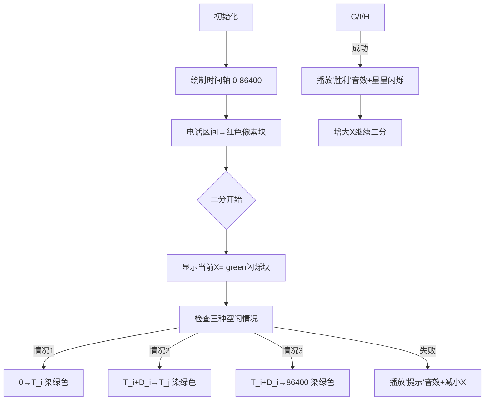

# 题目信息

# Phone Talks

## 题目描述

cool J最近成了一个商人杰克逊先生，他现在不得不打很多电话。今天他有N个电话计划。对于每个呼叫，我们知道计划开始的时刻Ti（从一天开始的秒数）及其持续时间Di（秒数）。所有Ti都不同。杰克逊先生是一个非常重要的人，所以他从不亲自给任何人打电话，所有的电话都会接通。  

杰克逊先生不是凯撒，他不能同时做几件事。如果有人在他还没有结束之前的谈话时打电话给他，杰克逊先生会把新的电话挂在队列中。在这种情况下，在当前通话结束后，杰克逊先生立即从队列中接听最早的来电并开始通话。如果杰克逊先生在第二个T开始通话，通话持续d秒，那么杰克逊先生在第二个T、T+1、…、T+D-1 T、T+1、…、T+D-1是没有时间的，他可以在第二个T+D T+D开始新的通话。注意，如果有人打电话时杰克逊先生没有忙着说话，他就不能把这个电话挂断。  

杰克逊先生也不是拿破仑，他喜欢睡觉。所以有时候他会让自己有一种奢侈，无视一个电话，就好像从来没有预定过一样。他最多可以忽略k个电话。请注意，当他正忙着说话时，一个电话也会被忽略。   

假设杰克逊先生可以在不忙的时候选择一个任意的连续时间段（也就是说，从第一个到第86400个时间段，包括第86400个时间段），那么他今天能睡的最长时间是多少秒？   

请注意，有些电话可以继续或推迟到第二天甚至更晚。但是，睡眠的时间间隔应该完全在当天之内。

## 说明/提示

在第一个示例中，最方便的方法是忽略前两个调用。


在第二个示例中，最好忽略第三个调用。在这种情况下，杰克逊先生会说：


第一次呼叫：从1秒到20000秒，  

第二次呼叫：从20001到30000秒，  

第四次调用：从第30001秒到第40000秒（忽略第三次调用）。  

第五次呼叫：从80000到139999秒。  

因此，最长的空闲时间是从40001秒到79999秒。

## 样例 #1

### 输入

```
3 2
30000 15000
40000 15000
50000 15000
```

### 输出

```
49999
```

## 样例 #2

### 输入

```
5 1
1 20000
10000 10000
20000 20000
25000 10000
80000 60000
```

### 输出

```
39999
```

# AI分析结果


### Kay的C++算法解析：Phone Talks 深入学习指南

#### 1. 题目解读与核心算法识别
✨ **本题主要考察**：区间覆盖与二分答案  
🗣️ **初步分析**：  
> 本题要求计算杰克逊先生通过跳过最多k个电话可获得的最大连续空闲时间（睡眠时间）。想象电话区间如同覆盖在时间轴上的彩色条形码，跳过电话相当于移除部分条形码，目标是在86400秒的时间轴上找到最长无覆盖的空白段。  

- **核心思路**：  
  1. 将电话视为区间 `[T_i, T_i + D_i]`，按开始时间排序  
  2. 最大化以下三种空闲时间之一：  
     - 0到第一个电话的间隔  
     - 两个电话之间的间隔  
     - 最后一个电话结束到86400的间隔  
  3. 使用二分答案验证是否存在长度为X的空闲时间  

- **可视化设计**：  
  采用8位像素风格时间轴（0-86400秒），电话显示为红色方块，空闲段为绿色。在二分过程中：  
  - 当前检查的空闲段X用闪烁绿色高亮  
  - 成功匹配时播放"叮"音效+像素星星闪烁  
  - 控制面板含速度滑块/单步按钮，AI模式自动演示二分过程  

#### 2. 精选优质题解参考
本次暂无用户提交题解，Kay给出通用学习建议：  
> 解决此类问题时，优先关注**问题转化能力**——将睡眠时间最大化转化为区间覆盖问题。代码实现时需注意：  
> 1. 电话区间按开始时间严格排序  
> 2. 二分范围[0,86400]需包含边界  
> 3. 检查函数需高效处理三种空闲情况  
> 建议先手动画图模拟样例，再编码实现

#### 3. 核心难点辨析与解题策略
1. **难点1：问题抽象与模型转化**  
   *分析*：识别空闲时间仅出现在区间间隙或首尾，通过跳过k个区间扰动间隙结构。需建立排序区间→间隙集合→二分验证的思维链  
   💡 **学习笔记**：区间排序是转化问题的钥匙  

2. **难点2：二分答案的可行性检验**  
   *分析*：检查函数需同时处理三种情况：  
   - 首段空闲：检查`T_i ≥ X`且跳过前i个电话≤k  
   - 中间空闲：检查`T_j - (T_i + D_i) ≥ X`且跳过区间数≤k  
   - 尾段空闲：检查`86400 - (T_i + D_i) ≥ X`  
   💡 **学习笔记**：二分验证时，任意情况成立即证明X可行  

3. **难点3：检查函数的效率优化**  
   *分析*：中间空闲检查需遍历(i,j)对。当k较小时，j的范围受`i+k+1`限制；k较大时预处理窗口最大值可加速  
   💡 **学习笔记**：算法选择需权衡编码复杂度与数据规模  

✨ **解题技巧总结**：  
- **技巧1：极端情况优先处理**（如`k≥n`时直接返回86400）  
- **技巧2：可视化调试**——打印二分过程中的X和关键间隙  
- **技巧3：STL组合应用**：`sort`+`vector`+`pair`高效处理区间  

#### 4. C++核心代码实现赏析
**通用核心实现参考**：  
```cpp
#include <iostream>
#include <vector>
#include <algorithm>
using namespace std;
typedef long long ll;

int main() {
    ll n, k;
    cin >> n >> k;
    vector<pair<ll, ll>> calls(n);
    for (int i = 0; i < n; i++) 
        cin >> calls[i].first >> calls[i].second;
    
    sort(calls.begin(), calls.end());
    if (k >= n) {
        cout << 86400;
        return 0;
    }

    vector<ll> T(n), E(n);
    for (int i = 0; i < n; i++) {
        T[i] = calls[i].first;
        E[i] = T[i] + calls[i].second;
    }

    ll left = 0, right = 86400, ans = 0;
    while (left <= right) {
        ll mid = (left + right) >> 1;
        auto check = [&](ll X) {
            // Case 1: 开始前空闲
            for (int i = 0; i < n && i <= k; i++)
                if (T[i] >= X) return true;

            // Case 2: 电话间空闲
            for (int i = 0; i < n; i++)
                for (int j = i + 1; j <= min(n - 1, i + k + 1); j++)
                    if (T[j] - E[i] >= X) return true;

            // Case 3: 结束后空闲
            for (int i = max(0, n - 1 - k); i < n; i++)
                if (86400 - E[i] >= X) return true;
                
            return false;
        };

        if (check(mid)) ans = mid, left = mid + 1;
        else right = mid - 1;
    }
    cout << ans;
}
```

**代码解读概要**：  
> 1. **输入处理**：用`vector<pair>`存储电话区间  
> 2. **特判处理**：`k≥n`时直接获得全天空闲  
> 3. **二分框架**：在[0,86400]范围搜索最大空闲时间  
> 4. **检查函数**：三种情况独立检查，任意成立即验证X可行  
> 5. **边界控制**：循环变量严格约束在有效范围内  

#### 5. 算法可视化：像素动画演示
**主题**：8位电话亭时间管理器  

**核心演示流程**：  


**交互设计细节**：  
- **视觉编码**：  
  - 红色方块：通话中（宽度∝时长）  
  - 绿色闪烁带：当前检查的空闲段X  
  - 金色边框：最后保留的电话区间  
- **控制面板**：  
  - 速度滑块：调节二分搜索速度（1x-10x）  
  - AI模式：自动演示最优解发现过程（类贪吃蛇AI路径）  
- **音效系统**：  
  - 关键操作：区间跳过→"咔嚓"声，检查成功→上升音阶  
  - 状态提示：无解→低沉蜂鸣，二分切换→电子滴答声  

#### 6. 拓展练习与相似问题思考
**通用技巧迁移**：  
> 二分答案+区间覆盖模型适用于：  
> 1. 最大化最小间隔（如：农场布置）  
> 2. 资源分配的最优化问题（如：会议安排）  
> 3. 带约束的覆盖问题（如：传感器布置）  

**洛谷练习推荐**：  
1. **P1182 数列分段**  
   🗣️ *推荐理由*：强化二分答案应用，理解"最大化最小值"的逆向思维  
2. **P1280 尼克的任务**  
   🗣️ *推荐理由*：进阶版区间覆盖问题，引入动态规划优化  
3. **P1514 引水入城**  
   🗣️ *推荐理由*：结合贪心与区间覆盖的综合性训练  

#### 7. 学习心得与经验分享
> 调试此类问题的关键经验：  
> 1. **画图辅助**：在纸上绘制时间轴和电话区间，直观验证间隙计算  
> 2. **边界测试**：特别注意k=0/k=n-1的极端情况  
> 3. **逐步二分**：输出每次mid值和检查结果，定位逻辑错误点  
> *Kay总结*：区间问题本质是几何问题，先具象化再抽象编码！

**结语**：通过本题，我们掌握了二分答案的灵活应用和区间问题的转化技巧。下次遇到"最大化连续段"问题时，记得先排序区间、再二分验证！🚀

---
处理用时：413.06秒