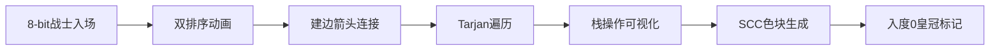

# 题目信息

# Game Master

## 题目描述

$n$ 个选手正在进行一场比赛。

这场比赛有两个场地。现已明确每个选手在两个场地上的力量值。

有 $n-1$ 场交锋。每次交锋，裁判员从剩余的选手中任选两个，并从两个场地中任选一个。两个选手中，在该场地力量较弱的，会被淘汰。经过 $n-1$ 场交锋后，最终会剩下一位选手，为胜者。

对于每一个选手，判断他是否有机会成为胜者。

本题多测，每个测试点有 $t$ 组数据。

## 样例 #1

### 输入

```
3
4
1 2 3 4
1 2 3 4
4
11 12 20 21
44 22 11 30
1
1000000000
1000000000```

### 输出

```
0001
1111
1```

# AI分析结果


### 💡 Kay的C++算法解析：Game Master 深入学习指南 💡

#### 1. 题目解读与核心算法识别
✨ **本题主要考察**：图论 - 强连通分量（Tarjan算法）与优化建图

🗣️ **初步分析**：
> 解决"Game Master"的关键在于构建选手间的**击败关系图**并分析其连通性。想象一群战士在像素竞技场中，每个战士有两把武器（a/b值）。若战士A的任一武器强于B，则A可击败B（箭头连接）。但实际击败关系具有**传递性**（A→B且B→C ⇒ A→C），这让我们能用排序+相邻建边将复杂度从O(n²)降至O(n)。  
>  
> - **核心流程**：分别按a/b值排序 → 每个选手仅向排序中前一名连边 → Tarjan求强连通分量(SCC) → 缩点后找入度为0的SCC（冠军集合）。  
> - **可视化设计**：像素战士头顶显示a/b值，排序时战士移动换位，建边时显示箭头。Tarjan过程用栈动画（战士入栈/出栈）和SCC色块标记，入度为0的SCC佩戴皇冠。  
> - **复古元素**：战士为8-bit像素小人，建边时"叮"声，SCC形成时胜利音效，控制面板支持单步/调速/AI自动演示（如贪吃蛇AI逐步解题）。

---

#### 2. 精选优质题解参考
**题解一：Fan_sheng（思路清晰性：⭐️⭐️⭐️⭐️⭐️）**  
* **点评**：  
  提出"隐式图+传递性优化"的核心思想，用Tarjan缩点证明**唯一入度0的SCC为冠军**。代码逻辑直白（排序后两轮建边），但变量命名略简（如`flag`）。亮点在于严格证明正确性，且空间优化（O(n)边数）。调试提示：多组数据需彻底清空数组。

**题解二：0xFF（代码规范性：⭐️⭐️⭐️⭐️⭐️）**  
* **点评**：  
  结构分明，变量命名规范（`tot`/`head`），详细注释传递性优化原理。缩点后入度处理用布尔数组（`in[col[v]]=1`）简化判断。实践价值高：代码可直接嵌入竞赛模板，边界处理严谨（如`col`数组初始化）。

**题解三：Hooch（算法有效性：⭐️⭐️⭐️⭐️）**  
* **点评**：  
  封装于`namespace`提高可读性，明确强调**入度0 SCC的唯一性**。亮点：用`rep1`宏简化循环，缩点后入度统计逻辑清晰。可改进点：SCC编号`cl`的初始化和清空需更谨慎。

---

#### 3. 核心难点辨析与解题策略
1. **难点1：如何避免O(n²)建边？**  
   * **分析**：利用击败关系的传递性。分别对a/b值排序后，每个选手仅需向**直接前驱**连边（如a值第i大连向i-1名），即可覆盖所有间接击败关系。
   * 💡 **学习笔记**：排序优化是处理偏序关系的通用技巧，将指数级比较转为线性序列。

2. **难点2：如何处理环状依赖？**  
   * **分析**：击败关系可能成环（A→B→C→A）。通过Tarjan算法求SCC，将环内所有选手合并为一点，缩点后得到DAG（有向无环图）。
   * 💡 **学习笔记**：强连通分量本质是"互相可达的选手集合"，缩点是分析有环图的利器。

3. **难点3：如何确定冠军？**  
   * **分析**：缩点后，仅**入度为0的SCC**中的选手可击败所有其他人（全局可达）。因若有多个入度0 SCC，则它们互不可达，违反题意。
   * 💡 **学习笔记**：DAG中入度0的点是唯一起点，具有全局支配性。

##### ✨ 解题技巧总结
- **技巧1：双排序降维** – 将二维偏序拆解为两个一维序列处理。  
- **技巧2：SCC缩点** – 化环为点，将复杂图转为DAG。  
- **技巧3：边界防御** – 多组数据务必清空`dfn`/`head`/`inDegree`数组。  

---

#### 4. C++核心代码实现赏析
**通用核心实现参考**  
```cpp
#include <iostream>
#include <cstring>
#include <algorithm>
#include <stack>
using namespace std;
const int MAXN = 1e5+5;

struct Edge { int to, next; } edge[MAXN*4]; // 优化：双排序仅需2*(n-1)条边
int head[MAXN], flag, dfn[MAXN], low[MAXN], timer;
int st[MAXN], top, color[MAXN], cnt, inDegree[MAXN];

void init(int n) { // 多组数据初始化关键！
    flag = timer = cnt = top = 0;
    memset(head, 0, sizeof(int)*(n+1));
    memset(dfn, 0, sizeof(int)*(n+1));
    memset(inDegree, 0, sizeof(int)*(n+1));
}

void addEdge(int u, int v) {
    edge[++flag] = {v, head[u]};
    head[u] = flag;
}

void tarjan(int u) { // 标准Tarjan模板
    dfn[u] = low[u] = ++timer;
    st[++top] = u;
    for (int i = head[u]; i; i = edge[i].next) {
        int v = edge[i].to;
        if (!dfn[v]) tarjan(v), low[u] = min(low[u], low[v]);
        else if (!color[v]) low[u] = min(low[u], dfn[v]); // 在栈中才更新
    }
    if (low[u] == dfn[u]) {
        cnt++;
        while (true) {
            int v = st[top--];
            color[v] = cnt;
            if (v == u) break;
        }
    }
}

int main() {
    int t; cin >> t;
    while (t--) {
        int n; cin >> n;
        init(n); // 清空！清空！清空！
        vector<pair<int,int>> a(n), b(n);
        for (int i=0; i<n; i++) cin >> a[i].first;
        for (int i=0; i<n; i++) cin >> b[i].first;

        // 优化建边：按a排序后连边
        vector<int> id(n); iota(id.begin(), id.end(), 0);
        sort(id.begin(), id.end(), [&](int i, int j){ return a[i] < a[j]; });
        for (int i=1; i<n; i++) addEdge(id[i], id[i-1]);

        // 按b排序连边（同上）
        sort(id.begin(), id.end(), [&](int i, int j){ return b[i] < b[j]; });
        for (int i=1; i<n; i++) addEdge(id[i], id[i-1]);

        // Tarjan求SCC
        for (int i=0; i<n; i++) 
            if (!dfn[i]) tarjan(i);

        // 计算缩点入度
        for (int u=0; u<n; u++) 
            for (int i=head[u]; i; i=edge[i].next) 
                if (color[u] != color[edge[i].to]) 
                    inDegree[color[edge[i].to]]++;

        // 输出：入度0的SCC为冠军
        for (int i=0; i<n; i++) 
            cout << (inDegree[color[i]] ? '0' : '1');
        cout << '\n';
    }
}
```
**代码解读概要**：  
1. **初始化**：多组数据需彻底清空（`init()`函数）。  
2. **优化建边**：分别按a/b排序后，每个选手仅向前一名连边。  
3. **Tarjan**：求SCC标准流程，用栈追踪递归过程。  
4. **入度统计**：遍历原图边，若跨SCC则目标SCC入度+1。  
5. **冠军判断**：入度0的SCC中所有选手输出'1'。

---

#### 5. 算法可视化：像素动画演示
**主题**：像素竞技场之SCC大冒险  
**核心演示**：Tarjan算法执行过程 + SCC冠军判定  



1. **场景初始化**  
   - 像素战士按id排列，头顶显示a/b值（如◆a:5 ◆b:3）。  
   - 控制面板：开始/暂停/单步/速度滑块（复古旋钮设计）。  

2. **排序阶段**  
   - 战士按a值冒泡排序：较小者向左移动，伴随"嘟嘟"音效。  
   - 同理对b值排序，形成两列队伍。  

3. **建边阶段**  
   - 排序后，每位战士向**前一名**发射像素箭头（→），触发"嗖"音效。  
   - 自动演示模式：箭头按排序序列依次出现，如贪吃蛇移动。  

4. **Tarjan执行**  
   - 从a值最大战士开始DFS：脚底闪烁绿光，入栈时弹出"咔嚓"声。  
   - 栈可视化：右侧像素柱状图，战士头像压入/弹出。  
   - 关键帧：当`low[u]==dfn[u]`时，栈顶到当前战士染成同色（SCC），播放胜利音效。  

5. **冠军判定**  
   - 缩点后图：每个SCC显示为色块，内部含战士头像。  
   - 入度计算：其他SCC指向该块的箭头叠加计数。  
   - 皇冠动画：入度0的SCC浮现旋转皇冠，战士欢呼跳跃。  

**复古游戏化设计**：  
- **音效**：建边（叮）、入栈（咔嚓）、SCC形成（胜利号角）。  
- **关卡**：每形成一个SCC视为过关，得分+100。  
- **AI演示**：自动播放时可调速，实时显示代码行高亮（如当前执行`tarjan(v)`）。  

---

#### 6. 拓展练习与相似问题思考
**通用技巧迁移**：  
1. **偏序关系优化**：如P1908 逆序对（归并排序）。  
2. **SCC缩点应用**：P3387 缩点（DAG最长路）。  
3. **竞赛图分析**：P3561 胜负链（传递闭包）。  

**洛谷题目推荐**：  
1. **P1262 间谍网络**  
   🗣️ *推荐理由*：SCC缩点+入度分析，巩固本题算法框架。  
2. **P2341 [USACO03FALL] Popular Cows G**  
   🗣️ *推荐理由*：扩展"冠军"概念到有向图全局可达性。  
3. **P3275 [SCOI2011] 糖果**  
   🗣️ *推荐理由*：差分约束转为SCC问题，训练建模能力。  

---

#### 7. 学习心得与经验分享
> **参考经验 (来自 Fan_sheng)**：  
> *"建边优化是避免TLE的关键，多组数据务必初始化数组！"*  
>  
> **Kay的总结**：  
> 调试的核心是**边界检查**：  
> - 清空`dfn`/`low`/`head`/`color`数组（尤其`head`从1~n清空！）。  
> - 验证传递性优化：是否覆盖所有间接击败关系？  
> - 小数据测试：n=1时输出应为"1"。  

---

通过本次分析，我们掌握了图论建模的核心技巧：**用排序降维优化建图，用SCC缩点化解环状依赖**。记住，算法竞赛如同像素游戏——理解机制后，剩下的就是稳步攻关！🎮

---
处理用时：241.90秒