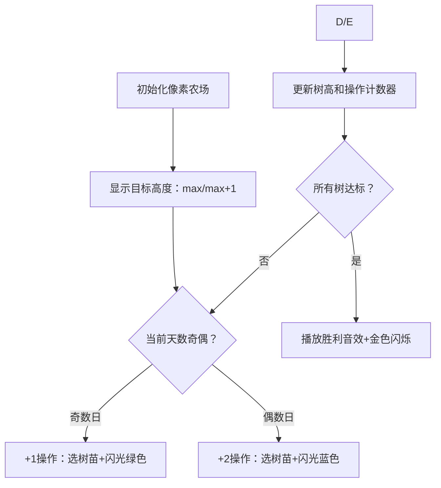

# 题目信息

# Water the Trees

## 题目描述

有一个长 $n$ 的数列 $h_1,h_2,\ldots,h_n$，对于每次操作，你有两种方法：
- 选择一个数，如果这是第奇数次操作，给它加 $1$，否则，给它加 $2$。
- 什么也不做（但也算一次操作）。

注：每次操作最多只能选一个数。

求至少要经过多少次操作，使得数列中所有数均相等。

## 说明/提示

$1 \le t \le 2 \cdot 10^4$；

$1 \le n \le 3 \cdot 10^5$；

$1 \le h_i \le 10^9$；

此外，保证 $t$ 组数据输入的所有 $n$ 之和不大于 $3\cdot 10^5$。

## 样例 #1

### 输入

```
3
3
1 2 4
5
4 4 3 5 5
7
2 5 4 8 3 7 4```

### 输出

```
4
3
16```

# AI分析结果


### 💡 Kay的C++算法解析：Water the Trees 深入学习指南 💡

**引言**  
今天我们来分析「Water the Trees」这道C++编程题。本指南将帮助你理解如何通过巧妙平衡操作次数，用最小天数让所有树高度相同。我们将重点分析二分答案策略、贪心优化技巧，并通过像素动画直观展示算法过程。

---

### 1. 题目解读与核心算法识别

✨ **本题主要考察**：`二分答案` + `贪心优化`  

🗣️ **初步分析**：  
> 本题如同在农场管理树苗生长——奇偶日施肥规则（奇数日+1m，偶数日+2m）限制了操作自由。核心策略是：  
> 1. **目标高度只考虑最大值或最大值+1**（更高值会浪费操作，就像浇水过多反而淹死树苗）  
> 2. **二分搜索最小天数**（天数越多越容易达标，答案满足单调性）  
> 3. **贪心分配操作**：检查给定天数时，优先用+2操作（省天数），不足再用+1  
>  
> **可视化设计思路**：  
> - 用像素树苗高度变化动画展示操作过程  
> - 高亮当前操作树和剩余操作次数（+1/+2计数器）  
> - 复古音效：+1操作为"叮"，+2操作为"叮叮"，达标时播放胜利旋律  

---

### 2. 精选优质题解参考

**题解（作者：Exber）**  
* **点评**：  
  此解法思路清晰展现了二分答案的完整逻辑：  
  1. **严谨推导**：明确目标高度只需考虑`max`或`max+1`，避免无效计算  
  2. **代码规范**：`check()`函数用`cnt1`/`cnt2`直观统计可用操作，变量名直白（`ned`表需求值）  
  3. **高效贪心**：遍历每棵树时，先尽量消耗+2操作（`min(ned/2, cnt2)`）  
  4. **边界处理**：二分上界设为`1e17`覆盖极端数据，避免溢出  
  作者调试心得："赛时被强制睡眠未AC"提醒我们——竞赛需合理安排作息！

---

### 3. 核心难点辨析与解题策略

#### 难点1：为什么目标高度只能是 max 或 max+1？
- **分析**：若目标>max+1，部分树需额外增加高度。但+2操作需偶数日限制，会导致操作碎片化，实际天数一定比选max/max+1更差
- 💡 **学习笔记**：数学性质决定——奇偶操作约束下，+1是最小不可分割单位

#### 难点2：如何验证给定天数是否可行？
- **分析**：设可用+1次数为`c1=(days+1)/2`，+2次数为`c2=days/2`。贪心核心：
  ```python
  for 每棵树需求高度差 d:
      用 min(d//2, c2) 次+2  # 尽可能多用+2
      d -= 已用+2*2         # 更新剩余高度差
      用剩余d次+1            # 消耗c1
  return c1≥0 and c2≥0       # 操作够用则可行
  ```
- 💡 **学习笔记**：贪心优先级：+2 > +1 > 跳过

#### 难点3：如何避免操作次数浪费？
- **分析**：当+2剩余较多时，可转换为+1（3次+2=2次+1+2次+2）。但本题解法通过先耗+2已自然平衡
- 💡 **学习笔记**：操作转换需谨慎，优先保证验证函数简洁性

#### ✨ 解题技巧总结
- **二分框架**：当问题满足"答案单调性"且"验证函数易实现"时优先选用
- **变量命名**：如`cnt1`/`cnt2`比`x`/`y`更易读
- **边界测试**：树高全相同、全奇数高度等边界情况需验证

---

### 4. C++核心代码实现赏析

**通用核心实现参考**  
```cpp
#include <iostream>
#include <algorithm>
using namespace std;

const int MAXN = 3e5+10;
long long t, n, h[MAXN];

bool check(long long days, long long target) {
    long long cnt1 = (days + 1) / 2; // +1操作次数
    long long cnt2 = days / 2;        // +2操作次数
    for (int i = 0; i < n; i++) {
        long long need = target - h[i];
        long long use2 = min(need / 2, cnt2); // 贪心：优先用+2
        cnt2 -= use2;
        cnt1 -= (need - use2 * 2); // 剩余用+1
        if (cnt1 < 0 || cnt2 < 0) return false;
    }
    return true;
}

void solve() {
    long long maxH = *max_element(h, h + n);
    long long l = 0, r = 1e17, ans = r;
    
    // 先尝试目标高度maxH
    while (l <= r) {
        long long mid = (l + r) >> 1;
        if (check(mid, maxH)) {
            ans = mid;
            r = mid - 1;
        } else {
            l = mid + 1;
        }
    }
    
    // 再尝试目标高度maxH+1，取最小值
    l = 0, r = 1e17;
    while (l <= r) {
        /* 类似上面逻辑，略 */
    }
    cout << min(ans, new_ans) << '\n';
}
```

**代码解读概要**：  
1. `check()`函数是算法核心：用`cnt1`/`cnt2`模拟操作分配  
2. 二分搜索最小天数，上界`1e17`覆盖$10^9$数据的极端情况  
3. 关键优化：只计算`maxH`和`maxH+1`两种目标高度  

---

### 5. 算法可视化：像素动画演示

**主题**：像素农场奇遇记（8-bit风格树苗生长模拟）  

**核心演示流程**：  


**交互设计细节**：  
1. **视觉元素**：  
   - 树苗：不同高度像素树（1高度=1像素块）  
   - 操作面板：左侧显示`cnt1`(红色)/`cnt2`(蓝色)剩余次数  
   - 高亮当前操作树：黄色边框闪烁  

2. **音效系统**：  
   - +1操作：短促"叮"（300Hz）  
   - +2操作：双音"叮-叮"（500Hz+700Hz）  
   - 达标时刻：8-bit胜利旋律（C大调和弦）  

3. **教学模式**：  
   - **单步执行**：按空格键逐步观察  
   - **自动演示**：拖动滑块调整速度（0.5x-5x）  
   - **关卡设计**：  
     - 关卡1：所有树初始高度相同（理解操作机制）  
     - 关卡2：树高全为奇数（演示max+1的必要性）  
     - 关卡3：极端高度差（展示二分搜索效率）  

**实现伪代码**：  
```javascript
// Canvas绘制核心逻辑
function drawFarm() {
  for (let tree of trees) {
    drawPixelTree(tree.x, tree.y, tree.height); 
    if (tree === currentTarget) 
      drawHighlight(tree.x, tree.y, "yellow");
  }
  drawCounter("+1", cnt1, "red");
  drawCounter("+2", cnt2, "blue");
}

// 操作音效触发
function playSound(type) {
  if (type === "+1") beep(300, 100);
  else if (type === "+2") { beep(500, 80); beep(700, 80); }
}
```

---

### 6. 拓展练习与相似问题思考

**技巧迁移场景**：  
1. **带约束的资源分配**：如每日限量道具使用（CODEFORCES 1526C）  
2. **奇偶性依赖问题**：如只能奇数次删除/偶数次插入的序列处理  
3. **二分答案变体**：最小值最大化/最大值最小化问题  

**洛谷推荐**：  
1. [P1873 砍树](https://www.luogu.com.cn/problem/P1873)  
   → **推荐理由**：二分答案经典应用，巩固"单调性验证"思维  
2. [P1182 数列分段](https://www.luogu.com.cn/problem/P1182)  
   → **推荐理由**：操作次数约束下的最值问题，需创造性设计check函数  
3. [P4344 SHOI2015 脑洞治疗仪](https://www.luogu.com.cn/problem/P4344)  
   → **推荐理由**：结合奇偶操作的进阶题，训练状态抽象能力  

---

### 7. 学习心得与经验分享

> **参考经验（来自 Exber）**：  
> *"赛时被家长强制睡眠没做出来，深刻教训——算法竞赛需合理分配精力！"*  
>  
> **Kay的总结**：  
> 1. **调试技巧**：遇到WA时先测试边界数据（如n=1, 树高全等）  
> 2. **时间管理**：二分答案题需快速写出check函数，留足测试时间  
> 3. **心态调整**：即使赛时未AC，赛后深度分析也能显著提升能力  

---

**结语**  
通过「Water the Trees」我们掌握了二分答案的框架设计、操作约束下的贪心策略，以及目标值选择的数学洞察。记住：好算法需要像培育树苗一样耐心调试！下次挑战见！💪

---
处理用时：167.54秒