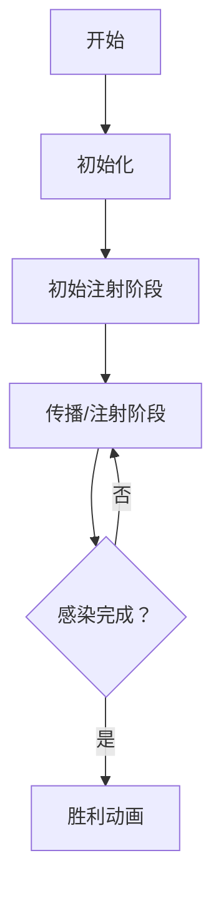

# 题目信息

# Tree Infection

## 题目描述

### 题意描述
一个树是一个无环连通图。一个有根树有一个被称作“根结点”的结点。对于任意一个非根结点 $v$ ，其父结点是从根结点到结点 $v$ 最短路径上的前一个结点。结点 $v$ 的子结点包括所有以 $v$ 父结点为 $v$ 的结点。

给定一个有 $n$ 个结点的有根树。结点 $1$ 即为根结点。一开始，该树上所有结点均是“健康”的。

每一秒你会进行两次操作——先是传播操作，然后是注射操作，定义如下。

- 传播操作：对于每个结点 $v$ ，若该结点至少有一个子结点被“感染”，则你可以“感染”顶点 $v$ 任意一个其他的子结点。
- 注射：你可以选择任意一个“健康”的结点并使它变为“感染”状态。

这程每秒会重复一次知道整个树的结点都处于“感染”状态。你需要找到使整个树被“感染”的最短时间（秒数）。

## 说明/提示

- $ 1 \le t \le 10^4 $
- $ 2 \le n \le 2 \times 10^5 $
- $ 1 \le p_i \le n $
- $ \sum \limits_{i=1} ^t n_i \le 2 \times 10^5 $

## 样例 #1

### 输入

```
5
7
1 1 1 2 2 4
5
5 5 1 4
2
1
3
3 1
6
1 1 1 1 1```

### 输出

```
4
4
2
3
4```

# AI分析结果


### 💡 Kay的C++算法解析：Tree Infection 深入学习指南 💡

#### 1. 题目解读与核心算法识别
✨ **本题主要考察**：`贪心算法` + `优先队列应用`  
🗣️ **初步分析**：
> 解决"Tree Infection"的关键在于理解**贪心策略与时间模拟的配合**。想象你是一位抗疫指挥官，每个父节点是一个"家庭"，子节点是家庭成员。为了最快感染全树：
> - 核心策略：先确保每个家庭至少有一个感染者（初始注射），再优先感染人数最多的家庭（贪心选择）
> - 难点在于：如何动态处理传播与注射的并行效果？如何避免大家庭浪费传播时间？
> - 可视化设计：用像素树+感染动画展示传播过程（绿色健康/红色感染/黄色传播感染），右侧实时显示优先队列中剩余感染需求

---

#### 2. 精选优质题解参考
**题解一（来源：tzyt）**  
* **点评**：思路清晰展现了贪心本质——先完成基础注射，再用优先队列动态处理剩余感染。代码中`pq.push(siz[i] - (i - fir_n_zero) - 1)`巧妙计算初始传播后的剩余感染需求，变量命名规范（如`tm_used`表时间）。亮点在于用`spreaded`计数器同步传播进度，时间复杂度O(n log n)最优  

**题解二（来源：听取MLE声一片）**  
* **点评**：核心逻辑与题解一高度一致，但实现更简洁。亮点在于直接用`top`计数器替代`spreaded`，循环条件`while(pque.top()>top)`直指问题本质。边界处理严谨（如`a[0]=1`保证根节点覆盖）  

**题解四（来源：XL4453）**  
* **点评**：提供独特二分答案视角。亮点在于`check`函数设计：`cnt += max(0, v[i]-num-1-i)` 验证额外注射次数的可行性，为贪心策略提供理论补充  

---

#### 3. 核心难点辨析与解题策略
1. **难点：初始状态建模**  
   * **分析**：如何表示"每个节点至少一个子节点感染"后的状态？优质题解用`排序+偏移量`技巧：`siz[i] - index - 1` 计算剩余未感染数  
   * 💡 **学习笔记**：初始注射阶段需保证所有子树入口被覆盖  

2. **难点：传播/注射并行模拟**  
   * **分析**：每秒传播自动感染1节点，同时注射可额外感染1节点。用优先队列总选最大剩余群体注射，`spreaded`计数器同步传播进度  
   * 💡 **学习笔记**：贪心选择等价于最小化最大剩余感染群体  

3. **难点：终止条件判定**  
   * **分析**：当传播感染总数（`spreaded`）≥ 最大剩余需求时，传播可自动完成剩余感染  
   * 💡 **学习笔记**：优先队列的堆顶元素是进度关键指标  

### ✨ 解题技巧总结
- **贪心选择策略**：优先处理剩余子节点最多的节点（等效于"最紧急任务"）  
- **时间模拟技巧**：用`spreaded/top`计数器同步自动传播进度  
- **数据结构优化**：优先队列O(1)获取最大值，O(log n)更新  
- **边界处理**：添加虚拟根节点(`siz[0]=1`)保证全覆盖  

---

#### 4. C++核心代码实现赏析
**通用核心实现参考**  
```cpp
#include <iostream>
#include <queue>
#include <algorithm>
using namespace std;

int main() {
    int t; cin >> t;
    while (t--) {
        int n; cin >> n;
        vector<int> siz(n+2, 0);
        siz[0] = 1; // 虚拟根节点
        
        // 统计子节点数
        for (int i = 1; i < n; i++) {
            int fa; cin >> fa;
            siz[fa]++;
        }

        sort(siz.begin(), siz.end());
        int idx = find_if(siz.begin(), siz.end(), 
                        [](int x){ return x > 0; }) - siz.begin();
        
        priority_queue<int> pq;
        int time = siz.size() - idx; // 初始注射时间
        
        // 计算初始传播后剩余需求
        for (int i = idx; i < siz.size(); i++) 
            pq.push(siz[i] - (i - idx) - 1);
        
        int spread = 0;
        while (pq.top() > spread) {
            int cur = pq.top(); pq.pop();
            pq.push(cur - 1); // 额外注射
            spread++; // 传播计数
            time++;   // 时间增加
        }
        cout << time << endl;
    }
}
```

**题解一核心片段**  
```cpp
pq.push(siz[i] - (i - fir_n_zero) - 1);
while(pq.top() > spreaded){
    spreaded++;
    int tp = pq.top(); pq.pop();
    pq.push(tp - 1);
    tm_used++;
}
```
* **亮点**：偏移量计算精确反映初始传播后状态  
* **解读**：`(i - fir_n_zero)`表示该节点在初始注射序列中的位置，`-1`扣除初始注射的感染。循环中`spreaded`记录每秒自动传播数，当堆顶≤spreaded时传播可自动完成剩余感染  

**题解四二分逻辑**  
```cpp
bool check(int num){ // 检查额外注射num次是否可行
    int cnt=0;
    for(int i=0;i<v.size();i++){
        cnt += max(0, v[i]-num-1-i);
    }
    return cnt <= num;
}
```
* **解读**：`v[i]-num-1-i`计算在额外注射和传播影响后剩余感染需求，验证贪心策略的理论基础  

---

### 5. 算法可视化：像素动画演示  
**主题**：树形防疫作战（8-bit像素风格）  
**核心演示**：  


**动画流程**：  
1. **像素树初始化**  
   - 8-bit风格树形结构（根在上/子在下）  
   - 健康节点：绿色像素块 ▩ | 感染节点：红色像素块 ■  

2. **初始注射阶段**  
   - 从叶子层向上注射：每个父节点选1子节点注射（红块闪烁+“注射”音效）  
   - 状态栏：显示`Time = 有子节点数`（如3个子节点显示t=3）  

3. **传播/注射阶段**  
   - **自动传播**：每秒所有有感染子节点的父节点自动感染1健康子节点→变黄 ▧ + "传播"音效  
   - **主动注射**：右侧优先队列可视化（高度=剩余感染需求），选最高柱注射→红块+“注射”音效  
   - 计数器：`传播数++`（黄色进度条增长）  

4. **终止条件**  
   - 当所有优先队列柱高 ≤ 黄色进度条：播放胜利音效 + 全树红块闪烁  
   - 控制面板：速度滑块调节1x-5x，单步/暂停/重置按钮  

**游戏化设计**：  
- 每完成一个父节点感染得10分（8-bit计分板）  
- 错误尝试：注射无效节点时播放"error"音效  
- 过关动画：树形像素烟花绽放  

---

#### 6. 拓展练习  
1. **洛谷 P1090** - 合并果子  
   * 理由：优先队列贪心入门，理解"每次选最小成本"  
2. **洛谷 P1873** - 砍树  
   * 理由：二分答案验证+贪心切割策略  
3. **洛谷 P5019** - 铺设道路  
   * 理由：传播式覆盖问题，类比感染传播机制  

---

#### 7. 学习心得  
**经验分享（题解一）**：  
> "优先处理子节点多的节点避免传播时间浪费是关键——就像疫情爆发时优先封锁大城市"  
> **Kay点评**：生动比喻揭示贪心本质，提醒注意传播与注射的并行性  

本次解析到此结束，保持思考，编程快乐！ 🚀

---
处理用时：135.50秒