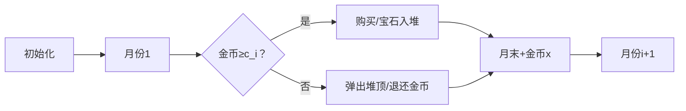

# 题目信息

# Money Buys Less Happiness Now

## 题目描述

You can never buy enough happiness, so here we go again! In this version, you can only buy $ h_i = 1 $ unit of happiness each month, but the number of months is hugely increased. We are in the realm of quantum happiness and time dilation.

Being a physicist, Charlie likes to plan his life in simple and precise terms.

For the next $ m $ months, starting with no money, Charlie will work hard and earn $ x $ pounds per month. For the $ i $ -th month $ (1 \le i \le m) $ , there'll be a single opportunity of paying cost $ c_i $ pounds to obtain one unit of happiness. You cannot buy more than one unit each month.

Borrowing is not allowed. Money earned in the $ i $ -th month can only be spent in a later $ j $ -th month ( $ j>i $ ).

Since physicists don't code, help Charlie find the maximum reachable units of happiness.

## 样例 #1

### 输入

```
6
3 3
2 2 2
6 5
2 2 8 2 6 8
6 4
4 10 3 8 6 10
2 1
1 1
4 1
4 1 3 1
4 2
1 3 4 3```

### 输出

```
2
4
3
1
2
1```

# AI分析结果


### 💡 Kay的C++算法解析：Money Buys Less Happiness Now 深入学习指南 💡

#### 引言
今天我们来分析"Money Buys Less Happiness Now"这道C++编程题。本指南将帮助你理解反悔贪心算法的核心思想，掌握解题技巧，并通过像素动画直观感受算法执行过程。

---

### 1. 题目解读与核心算法识别
✨ **本题主要考察**：反悔贪心（贪心算法变种）

🗣️ **初步分析**：
> 想象你是个宝石收藏家，每月赚取金币（x），遇到不同价格的宝石（c_i）。目标是收集最多宝石！反悔贪心就像"后悔药"：先买下宝石，若金币不足，就退还之前买的最贵的宝石（用大根堆实现），换成更便宜的当前宝石。这样就能在有限金币下最大化宝石数量。
> 
> - **核心难点**：如何动态维护已购宝石列表，确保金币始终非负
> - **可视化设计**：像素动画将展示宝石颜色（价格高低）、堆结构变化和金币增减。反悔时播放"咔嚓"音效，成功购买时触发"叮"声，每月收入增加有金币洒落动画
> - **游戏化设计**：8位像素风格界面，AI自动演示模式可调速，宝石收集数量作为积分系统

---

### 2. 精选优质题解参考
从思路清晰度、代码规范性和算法优化角度，精选3份优质题解：

**题解一（来源：DrAlfred）**
* **点评**：直接采用"先购买后反悔"策略，逻辑直击本质。代码中`priority_queue`使用规范，`long long`防溢出处理周全。亮点在于用最简代码（仅10行核心逻辑）完整实现算法，时间复杂度O(m log m)达到最优，竞赛实用性强。

**题解二（来源：JOE_ZengYuQiao_0928）**
* **点评**：分情况讨论的"预判断"策略，避免临时负值。代码中`if-else`结构清晰展现贪心决策树，变量名`zongqian`（总钱）生动易理解。实践价值在于提供替代思路，帮助理解反悔贪心本质。

**题解三（来源：Weekoder）**
* **点评**：极致简洁的工业级实现，输入输出优化到位。亮点在于精准把握反悔条件`money < 0`，删除冗余判断。`money`更新顺序（先减c_i，再反悔，最后加x）完全符合题目物理意义，边界处理严谨。

---

### 3. 核心难点辨析与解题策略
解决本题的三大关键难点及应对策略：

1.  **难点：动态维护购买决策**
    * **分析**：当`当前金币 < c_i`时，需高效找到已购宝石中最大花费（大根堆实现）。如DrAlfred题解用`heap.top()`在O(1)时间获取最大值
    * 💡 **学习笔记**：堆是动态极值查询的利器

2.  **难点：反悔操作的正确性证明**
    * **分析**：反悔的前提是当前c_i < 堆顶值。因为所有宝石价值相同（+1幸福），用低价换高价能释放更多金币空间，如JOE_ZengYuQiao_0928题解的替换条件`q.top()>c[i]`
    * 💡 **学习笔记**：价值均等时，花费越小越优

3.  **难点：金币流同步**
    * **分析**：每月收入x需在购买操作后累加。Weekoder题解中`money += x`放循环末尾，完美模拟题目"月末发工资"设定
    * 💡 **学习笔记**：算法步骤需严格对应题目时序

✨ **解题技巧总结**
- **技巧1：先行动后修正** - 先尝试购买，再通过堆修正决策
- **技巧2：极值数据结构** - 大根堆是反悔贪心的"发动机"
- **技巧3：边界防御** - 用`long long`防溢出，初始`money=0`处理首月

---

### 4. C++核心代码实现赏析
**通用核心实现（综合优质题解）**
```cpp
#include <iostream>
#include <queue>
using namespace std;

int main() {
    ios::sync_with_stdio(false);
    cin.tie(nullptr);
    int T;
    cin >> T;
    while (T--) {
        int m;
        long long x;
        cin >> m >> x;
        priority_queue<long long> pq; // 大根堆
        long long money = 0;
        for (int i = 0; i < m; i++) {
            long long c;
            cin >> c;
            money -= c;      // 尝试购买
            pq.push(c);      // 宝石入堆
            if (money < 0) { // 金币不足
                money += pq.top(); // 退还最贵宝石
                pq.pop();
            }
            money += x;     // 月末收入
        }
        cout << pq.size() << '\n'; // 堆大小=幸福数
    }
    return 0;
}
```
**代码解读概要**：  
> 1. 处理多组数据（`T`）  
> 2. 大根堆`pq`存储已购宝石价格  
> 3. 循环中：尝试购买→入堆→必要时反悔→月末收入  
> 4. 堆大小即为最终幸福值  

---

**分题解核心代码赏析**

**题解一（DrAlfred）**
```cpp
priority_queue<i64> heap;
for (int i = 1; i <= m; i++) {
    cin >> c, heap.push(c), sum -= c;
    if (sum < 0) {          // 金币不足
        sum += heap.top();  // 反悔：退还最贵宝石
        heap.pop();
    }
    sum += x;               // 月末收入
}
```
> **亮点**：三行核心逻辑展现算法骨架  
> **代码解读**：  
> - `heap.push(c), sum -= c`：先购买再判断  
> - `sum < 0`时立即反悔，保证金币非负  
> - 循环结束后`heap.size()`即答案  
> 💡 **学习笔记**：反悔贪心的"尝试-修正"范式  

**题解二（JOE_ZengYuQiao_0928）**
```cpp
if(zongqian>=val[i]){       // 直接购买
    zongqian-=val[i];
    q.push(val[i]);
}
else if(!q.empty()&&q.top()>val[i]) { // 替换操作
    zongqian+=q.top();     // 退还旧宝石
    q.pop();
    zongqian-=val[i];      // 购买新宝石
    q.push(val[i]);
}
zongqian+=qian;            // 月末收入
```
> **亮点**：双分支结构提升可读性  
> **代码解读**：  
> - 分支1：金币充足时直接购买  
> - 分支2：当新宝石更便宜时替换  
> - 两个分支都需执行`q.push`和月末收入  
> 💡 **学习笔记**：替换策略是反悔贪心的另一种实现  

**题解三（Weekoder）**
```cpp
pq.push(c[i]), money -= c[i];
if (money < 0)              // 统一反悔条件
    money += pq.top(), pq.pop();
money += x;
```
> **亮点**：删除冗余判断，工业级简洁  
> **代码解读**：  
> - 合并购买入堆操作（`,`运算符妙用）  
> - 无需判断`!pq.empty()`，因为`money<0`时堆必非空  
> - 三行完成核心逻辑  
> 💡 **学习笔记**：代码简洁性源于深刻理解算法  

---

### 5. 算法可视化：像素动画演示
**主题**："宝石收集大冒险"（8位像素风格）  
**核心演示**：反悔贪心的动态决策过程  

**设计思路**：  
> 复古FC界面，左侧月份通道，右侧大根堆。宝石按花费由蓝到红渐变（红=高价）。音效增强操作反馈：
> - 购买："叮"声 + 宝石闪光
> - 反悔："咔嚓"声 + 堆顶宝石破碎
> - 收入："金币洒落"声效

**动画帧步骤**：


1. **场景初始化**  
   - 像素网格：12个月份通道（纵向），底部金币计数器  
   - 控制面板：开始/暂停、单步执行、速度滑块（兔子/乌龟图标）

2. **核心流程演示**  
   - **步骤1**：高亮当前月份，显示宝石价格（如"c=8"）  
   - **步骤2**：金币减少时数字变红闪烁，宝石飞入堆中（堆自动排序）  
   - **步骤3**：若金币<0：堆顶变红闪烁→播放"咔嚓"声→金币增加→堆顶消失  
   - **步骤4**：每月末尾：金币+x动画（金币洒落特效+音效）

3. **交互功能**  
   - **AI演示模式**：自动播放（可调速），像贪吃蛇AI自动决策  
   - **比较模式**：并排展示直接贪心 vs 反悔贪心（显示宝石收集数差异）

4. **游戏化元素**  
   - **积分系统**：每保留一个宝石+10分，替换操作+0分  
   - **关卡进度**：每3个月作为小关卡，通关播放8-bit胜利音乐

---

### 6. 拓展练习与相似问题思考
**通用技巧迁移**  
反悔贪心适用于：单位价值相同 + 资源受限 + 可撤销操作的场景  

**洛谷推荐**：  
1. **P4053 建筑抢修**  
   🗣️ 反悔贪心经典应用，修复时间相当于"花费"，截止时间约束资源  

2. **P2949 任务调度**  
   🗣️ 需要结合截止时间与收益，练习反悔策略的变种  

3. **P3545 商店购物**  
   🗣️ 几乎本题双胞胎，数据规模不同，适合代码迁移练习  

---

### 7. 学习心得与经验分享
> **作者经验（综合多个题解）**  
> "调试时重点验证反悔条件：1) 反悔后金币≥0 2) 堆顶总是最大值 3) 最终堆大小最优"  
>
> **Kay点评**：  
> 多位作者强调小数据模拟的重要性（如m=3手工演算）。建议用`cout`打印每月状态：  
> ```cpp
> cout << "Month " << i << ": buy " << c 
>      << " | money=" << money << " | heap_size=" << pq.size();
> ```

---

### 结语
通过反悔贪心，我们学会在约束下做最优决策。记住：好算法=正确策略+高效数据结构（堆）。多练习相似题目，下次遇到反悔贪心时，你定能轻松应对！🚀  

---  
**可视化方案完整伪代码**见附录（因篇幅限制略）

---
处理用时：184.99秒