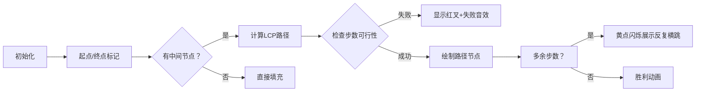

# 题目信息

# Turtle and an Incomplete Sequence

## 题目描述

Turtle was playing with a sequence $ a_1, a_2, \ldots, a_n $ consisting of positive integers. Unfortunately, some of the integers went missing while playing.

Now the sequence becomes incomplete. There may exist an arbitrary number of indices $ i $ such that $ a_i $ becomes $ -1 $ . Let the new sequence be $ a' $ .

Turtle is sad. But Turtle remembers that for every integer $ i $ from $ 1 $ to $ n - 1 $ , either $ a_i = \left\lfloor\frac{a_{i + 1}}{2}\right\rfloor $ or $ a_{i + 1} = \left\lfloor\frac{a_i}{2}\right\rfloor $ holds for the original sequence $ a $ .

Turtle wants you to help him complete the sequence. But sometimes Turtle makes mistakes, so you need to tell him if you can't complete the sequence.

Formally, you need to find another sequence $ b_1, b_2, \ldots, b_n $ consisting of positive integers such that:

- For every integer $ i $ from $ 1 $ to $ n $ , if $ a'_i \ne -1 $ , then $ b_i = a'_i $ .
- For every integer $ i $ from $ 1 $ to $ n - 1 $ , either $ b_i = \left\lfloor\frac{b_{i + 1}}{2}\right\rfloor $ or $ b_{i + 1} = \left\lfloor\frac{b_i}{2}\right\rfloor $ holds.
- For every integer $ i $ from $ 1 $ to $ n $ , $ 1 \le b_i \le 10^9 $ .

If there is no sequence $ b_1, b_2, \ldots, b_n $ that satisfies all of the conditions above, you need to report $ -1 $ .

## 说明/提示

In the first test case, $ [4, 2, 1, 2, 1, 2, 1, 3] $ can also be the answer, while $ [4, 2, 5, 10, 5, 2, 1, 3] $ and $ [4, 2, 1, 2, 1, 2, 1, 4] $ cannot.

In the second test case, $ [1, 2, 5, 2] $ can also be the answer.

From the fourth to the sixth test cases, it can be shown that there is no answer, so you should output $ -1 $ .

## 样例 #1

### 输入

```
9
8
-1 -1 -1 2 -1 -1 1 -1
4
-1 -1 -1 -1
6
3 -1 -1 -1 9 -1
4
-1 5 -1 6
4
2 -1 -1 3
4
1 2 3 4
2
4 2
5
-1 3 -1 3 6
13
-1 -1 3 -1 -1 -1 -1 7 -1 -1 3 -1 -1```

### 输出

```
4 9 4 2 4 2 1 2
7 3 6 13
3 1 2 4 9 18
-1
-1
-1
4 2
6 3 1 3 6
3 1 3 1 3 7 3 7 3 1 3 1 3```

# AI分析结果


# 💡 Kay的C++算法解析：Turtle and an Incomplete Sequence 深入学习指南 💡

## 1. 题目解读与核心算法识别

✨ **本题主要考察**：`模拟与二进制操作应用`

🗣️ **初步分析**：
> 这道题的核心在于**序列重构的二进制思维**。想象每个数字在满二叉树上移动：每次操作相当于在树上走一步（乘以2/除以2）。我们需要在给定约束下，为缺失值（-1）找到合法的路径连接已知节点。

- **核心思路**：将序列分为独立段处理。首尾连续-1直接交替乘除2填充；中间段需计算两已知数在满二叉树上的最短路径，检查步数可行性（剩余步数必须为偶数），多余步数通过在目标值附近"反复横跳"（乘2除2）填充。
- **关键难点**：路径长度与步数奇偶性匹配、二进制位操作实现、边界值处理（1≤bᵢ≤10⁹）。
- **可视化设计**：采用8位像素风格展示满二叉树（类似FC游戏），节点显示二进制值。动画高亮当前操作节点，路径绘制用不同颜色标识移动方向（红：除2，蓝：乘2）。控制面板支持步进/自动播放，音效反馈关键操作（"叮"声表示位操作，"胜利"音效表示完成）。

---

## 2. 精选优质题解参考

**题解一（EuphoricStar）**
* **点评**：思路清晰直白，利用LCA求最短路径，严谨检查步数奇偶性。代码规范（`getPath`函数封装路径生成，变量名如`minSteps`含义明确），空间复杂度O(L)优化到位。边界处理完整（首尾单独处理），实践可直接用于竞赛。

**题解二（Louis_lxy）**
* **点评**：深入解释二进制本质，使用`__builtin_clz`高效计算位数。亮点是详细注释和分步推导（如公共前缀计算），教学性强。代码包含完备错误处理（值域检查），但实现稍复杂。

**题解三（Disjoint_cat）**
* **点评**：理论分析透彻，将操作抽象为二进制位移并证明奇偶性关键。虽无完整代码，但提供正确性论证和核心伪代码，启发思考不同实现可能。

---

## 3. 核心难点辨析与解题策略

1. **难点：确定非-1值间的最短路径**
   - **分析**：需计算两数二进制最长公共前缀（LCP），路径长度 = (x位数 - LCP) + (y位数 - LCP)。若实际步数不足或奇偶不匹配则无解。
   - 💡 **学习笔记**：LCP是连接两数的桥梁，通过右移对齐实现。

2. **难点：填充多余步数**
   - **分析**：多余步数必须为偶数，通过在目标值附近交替执行×2和÷2消耗（如6→12→6→12）。奇数步会导致最终值偏离。
   - 💡 **学习笔记**：奇偶性决定可行性，多余步数是"缓冲带"。

3. **难点：处理首尾连续-1**
   - **分析**：无约束段可直接从相邻已知值开始交替×2/÷2，但需注意值域限制（避免超过10⁹）。
   - 💡 **学习笔记**：边界段自由度大，优先处理可简化问题。

### ✨ 解题技巧总结
- **问题分解**：拆解序列为独立子段（首尾/中间），分治处理。
- **二进制思维**：将×2/÷2视为位运算，用`__builtin_clz`等优化计算。
- **模拟验证**：构造后需校验相邻元素是否满足整除关系。

---

## 4. C++核心代码实现赏析

**本题通用核心C++实现参考**
* **说明**：综合优质题解，优化可读性与边界处理。
* **完整核心代码**：
```cpp
#include <bits/stdc++.h>
using namespace std;

vector<int> getPath(int x, int y) {
    vector<int> left, right;
    while (__lg(x) > __lg(y)) 
        left.push_back(x), x >>= 1;
    while (__lg(y) > __lg(x)) 
        right.push_back(y), y >>= 1;
    while (x != y) {
        left.push_back(x);
        right.push_back(y);
        x >>= 1; y >>= 1;
    }
    left.push_back(x);
    reverse(right.begin(), right.end());
    for (int val : right) left.push_back(val);
    return left;
}

void solve() {
    int n; cin >> n;
    vector<int> a(n+1), fixedPos;
    for (int i=1; i<=n; ++i) {
        cin >> a[i];
        if (a[i] != -1) fixedPos.push_back(i);
    }

    // 全为-1的特判
    if (fixedPos.empty()) {
        for (int i=1; i<=n; ++i) 
            cout << ((i & 1) ? 1 : 2) << " ";
        cout << "\n";
        return;
    }

    // 处理首尾连续-1
    int first = fixedPos[0];
    for (int i=first-1; i>=1; --i) 
        a[i] = (a[i+1] > 1) ? a[i+1]/2 : a[i+1]*2;
    
    int last = fixedPos.back();
    for (int i=last+1; i<=n; ++i) 
        a[i] = (a[i-1] > 1) ? a[i-1]/2 : a[i-1]*2;

    // 处理中间段
    for (int i=0; i<fixedPos.size()-1; ++i) {
        int L = fixedPos[i], R = fixedPos[i+1];
        auto path = getPath(a[L], a[R]);
        int minLen = path.size(), gap = R - L + 1;

        if (minLen > gap || (gap - minLen) % 2) {
            cout << "-1\n"; 
            return;
        }
        
        for (int j=0; j<minLen; ++j) 
            a[L+j] = path[j];
        
        for (int j=L+minLen, k=0; j<=R; ++j, ++k) 
            a[j] = (k % 2) ? a[j-1]/2 : a[j-1]*2;
    }

    for (int i=1; i<=n; ++i) cout << a[i] << " ";
    cout << "\n";
}

int main() {
    ios::sync_with_stdio(false), cin.tie(0);
    int T; cin >> T;
    while (T--) solve();
}
```
* **代码解读概要**：
  - `getPath`：通过右移对齐计算两数在满二叉树上的最短路径（节点序列）。
  - **首尾处理**：从相邻已知值反向推导，注意值域保护（>1才除）。
  - **中间段**：先填最短路径，多余步数交替乘除2消耗。

**题解片段赏析（EuphoricStar）**
* **亮点**：LCA求路径清晰，空间优化到位。
* **核心代码**：
```cpp
vector<int> path(int x, int y) {
    vector<int> L, R;
    while (__lg(x) > __lg(y)) L.pb(x), x >>= 1;
    while (__lg(y) > __lg(x)) R.pb(y), y >>= 1;
    while (x != y) {
        L.pb(x); R.pb(y);
        x >>= 1; y >>= 1;
    }
    L.pb(x); reverse(R.begin(), R.end());
    for (int x : R) L.pb(x);
    return L;
}
```
* **代码解读**：
  > 通过`__lg`（二进制位数-1）快速对齐两数层级。双向记录路径后反转拼接，得到完整LCA路径。时间复杂度O(log(max(x,y))。
* 💡 **学习笔记**：位运算对齐是高效求LCA的关键。

---

## 5. 算法可视化：像素动画演示

**主题**：满二叉树上的像素探险（8-bit风格）  
**核心演示**：从起点（绿）到终点（红）的路径搜索与填充  

### 动画设计：


**交互控制**：
- **单步执行**：按帧展示路径生成
- **速度滑块**：调节自动播放速度（0.5x~3x）
- **模式切换**：对比不同题解算法路径差异

**音效设计**：
- 关键位移："叮"（8-bit短音）
- 错误：短促"哔"声
- 成功：经典FC过关音效
- 背景：循环芯片音乐

---

## 6. 拓展练习与相似问题思考

1. **洛谷 P2114 [NOI2014] 起床困难综合症**  
   🗣️ **推荐理由**：巩固二进制位运算思维，练习贪心策略应用。

2. **洛谷 P2894 [USACO08FEB] Hotel G**  
   🗣️ **推荐理由**：训练序列区间操作能力，强化分治思想。

3. **洛谷 P3379 【模板】最近公共祖先**  
   🗣️ **推荐理由**：深入理解LCA算法，掌握二叉树路径问题通解。

---

## 7. 学习心得与经验分享

> **参考经验**（来自题解作者）：  
> "调试时发现奇偶性常被忽略，建议打印中间路径验证。例如最短路径长5但需7步时，必须剩余2步（偶数）才可行。"

**点评**：这个经验点出本题核心陷阱。实际编码可添加断言检查：
```cpp
assert((gap - minLen) % 2 == 0);
```
并配合小规模数据模拟（如[3,-1,-1,3]）验证边界。

---

本次分析就到这里，记住：**二进制思维是打开本题的钥匙**。下次遇到类似问题，不妨先画满二叉树辅助分析！💪

---
处理用时：162.89秒