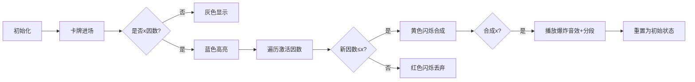

# 题目信息

# Valuable Cards

## 题目描述

In his favorite cafe Kmes once again wanted to try the herring under a fur coat. Previously, it would not have been difficult for him to do this, but the cafe recently introduced a new purchasing policy.

Now, in order to make a purchase, Kmes needs to solve the following problem: $ n $ cards with prices for different positions are laid out in front of him, on the $ i $ -th card there is an integer $ a_i $ , among these prices there is no whole positive integer $ x $ .

Kmes is asked to divide these cards into the minimum number of bad segments (so that each card belongs to exactly one segment). A segment is considered bad if it is impossible to select a subset of cards with a product equal to $ x $ . All segments, in which Kmes will divide the cards, must be bad.

Formally, the segment $ (l, r) $ is bad if there are no indices $ i_1 < i_2 < \ldots < i_k $ such that $ l \le i_1, i_k \le r $ , and $ a_{i_1} \cdot a_{i_2} \ldots \cdot a_{i_k} = x $ .

Help Kmes determine the minimum number of bad segments in order to enjoy his favorite dish.

## 样例 #1

### 输入

```
8
6 4
2 3 6 2 1 2
9 100000
50000 25000 12500 6250 3125 2 4 8 16
5 2
1 1 1 1 1
8 6
4 3 4 3 4 3 4 3
7 12
6 11 1 3 11 10 2
10 5
2 4 4 2 4 4 4 3 1 1
7 8
4 6 5 1 2 4 1
8 27
3 9 17 26 2 20 9 3```

### 输出

```
3
2
1
1
2
1
3
3```

# AI分析结果


# 💡 Kay的C++算法解析：Valuable Cards 深入学习指南 💡

> **Kay说**：想象你是一个像素游戏里的冒险家，面前有一排魔法卡牌。只有避开能合成“禁忌数字x”的组合，才能通过关卡。今天我们就要学习如何用最少的安全段划分卡牌序列！

## 1. 题目解读与核心算法识别

✨ **本题主要考察**：`贪心策略` + `因数背包动态规划`

🗣️ **初步分析**：
> 这道题就像在玩一个“避免合成禁忌数字”的像素游戏。贪心策略就是尽可能多地收集卡牌，直到下一张牌会让当前段出现禁忌组合x，这时我们就开新段重新收集。动态规划则像背包系统，只记录能合成x的因数（类似游戏里的合成配方）。

- **核心流程**：预处理x的所有因数 → 从左到右扫描卡牌 → 用DP数组记录当前可合成的因数 → 当合成x时立即分段
- **可视化设计**：用像素方块表示因数状态（灰色=未激活/彩色=已激活）。加入卡牌时触发因数合成动画，成功合成x时播放胜利音效并重置关卡
- **游戏化元素**：8-bit风格BGM，卡牌移动音效，合成x时的爆炸特效，分段计数作为游戏分数

---

## 2. 精选优质题解参考

**题解一（I_will_AKIOI）**
* **点评**：这份题解思路清晰如像素地图——预处理x的因数后，用DP数组精准追踪合成状态。亮点在于优化意识：从大到小枚举因数避免重复合成（类似背包优化），代码中`d[now*a[i]]|=d[now]`的状态转移简洁有力。变量名`v`(因数集)、`d`(状态数组)如游戏道具般直观，边界处理（`k%a[i]`跳过非因数）更显严谨

**题解二（OIer_Hhy）**
* **点评**：巧妙运用双集合(st/us)交替更新，像游戏里的双背包系统。遍历集合时用临时容器避免修改冲突是亮点，`if(x%k==0)`的条件判断如安全检测机制。虽然unordered_set常数较大，但因数数量少（≤128）仍高效

**题解三（liaoz123）**
* **点评**：最简洁的像素级实现！预处理因数后专注DP状态转移。亮点在于重置逻辑：分段时保留`f[1]=true`（空合成）并立即加入当前卡牌，确保新段连续性。`f[q[j]]|=f[q[j]/a[i]]`如合成公式般优雅

---

## 3. 核心难点辨析与解题策略

1.  **难点：如何高效维护可合成因数？**
    * **分析**：暴力维护所有可能乘积会超时。优质题解都利用x因数稀少的特性（≤128），用DP数组或集合仅跟踪x的因数
    * 💡 **学习笔记**：问题规模决定解法——当x≤1e5时，因数集合就是最佳状态容器

2.  **难点：避免重复使用卡牌？**
    * **分析**：子序列不要求连续，但DP状态转移天然符合顺序性。`d[new]=d[old]|d[old*a_i]`保证每个卡牌只贡献一次合成
    * 💡 **学习笔记**：存在性DP不记录路径，自然避免重复

3.  **难点：分段时状态重置？**
    * **分析**：合成x后需清空状态，但当前卡牌要加入新段。`d[1]=true`保留空合成状态，`d[a_i]=true`确保新段起点
    * 💡 **学习笔记**：状态重置不是归零——保留种子才能继续生长

### ✨ 解题技巧总结
- **因数过滤**：预处理x因数，非因数卡牌直接跳过
- **降维枚举**：从大到小遍历因数避免重复更新（类似01背包优化）
- **状态压缩**：用bool数组替代集合，O(1)查询效率
- **分段原子性**：分段后立即将当前卡牌纳入新段

---

## 4. C++核心代码实现赏析

**本题通用核心实现**（综合优化版）：
```cpp
#include <iostream>
#include <vector>
#include <algorithm>
using namespace std;

void solve() {
    int n, x, ans = 1;
    cin >> n >> x;
    vector<int> a(n), factors;
    
    // 像素图鉴：收集x的所有因数
    for (int i = 1; i * i <= x; ++i) 
        if (x % i == 0) {
            factors.push_back(i);
            if (i * i != x) factors.push_back(x / i);
        }
    sort(factors.rbegin(), factors.rend()); // 从大到小排序

    vector<bool> dp(x + 1, false);
    dp[1] = true; // 空合成状态

    for (int card : a) {
        if (x % card) continue; // 跳过非因数卡牌
        
        bool found_x = false;
        for (int fac : factors) {        // 像素合成：遍历因数配方
            if (fac % card || fac > x / card) continue;
            int prev = fac / card;       // 检查前置配方
            if (dp[prev]) {
                if (fac == x) found_x = true; // 禁忌合成！
                else dp[fac] = true;     // 点亮新因数
            }
        }

        if (found_x) {                   // 触发分段
            ans++;
            fill(dp.begin(), dp.end(), false);
            dp[1] = true;                // 保留空合成
            if (x % card == 0) dp[card] = true; // 当前卡加入新段
        }
    }
    cout << ans << '\n';
}
```

**分段解读**：
1. **因数收集**：像收集游戏图鉴，`i*i<=x`高效获取因数对
2. **状态初始化**：`dp[1]=true`设定空合成基础状态
3. **卡牌扫描**：跳过非因数卡（无关道具）
4. **因数合成**：`fac%card==0`检测合成配方，`prev=fac/card`计算前置条件
5. **禁忌检测**：合成x时触发分段，重置状态但保留当前卡

---

## 5. 算法可视化：像素动画演示

> **像素化设计**：8-bit风格合成工坊，每个因数显示为发光晶体

### 动画脚本


**交互控制**：
- **单步执行**：空格键逐步观察合成过程
- **速度调节**：滑块控制0.5x~4x速度
- **音效设计**：
  - 卡牌移动：8-bit电子音
  - 因数合成：清脆“叮”声
  - 合成x：小号胜利旋律
  - 错误合成：短促爆破音

**游戏化元素**：
1. 每段作为独立关卡，通关获得星章
2. 连续无错合成触发连击奖励
3. 动态显示当前DP状态：激活因数亮彩色，其余灰色

---

## 6. 拓展练习与相似问题

**技巧迁移场景**：
1. 子序列乘积问题（因数背包）
2. 避免特定组合的序列划分
3. 稀疏状态动态规划

**洛谷推荐**：
1. **P2214 乘积最大** - 区间划分+乘积优化
2. **P1806 跑步** - 子集和变形练习
3. **P2918 Buying Hay** - 因数背包进阶

---

## 7. 学习心得分享

> **题解作者经验**：
> “枚举顺序决定成败——从大到小更新因数避免重复合成，就像整理背包时先放⼤物品”（I_will_AKIOI）
> 
> **Kay总结**：调试DP时打印中间状态！用`cout<<fac<<":"<<dp[fac]<<endl;`观察因数激活情况，比盲目检查高效十倍

---

> **Kay结语**：算法学习就像像素游戏——理解核心机制后，每个优化都是通关秘籍。下次遇到合成类问题，记得举起你的因数背包！👾

---
处理用时：233.71秒