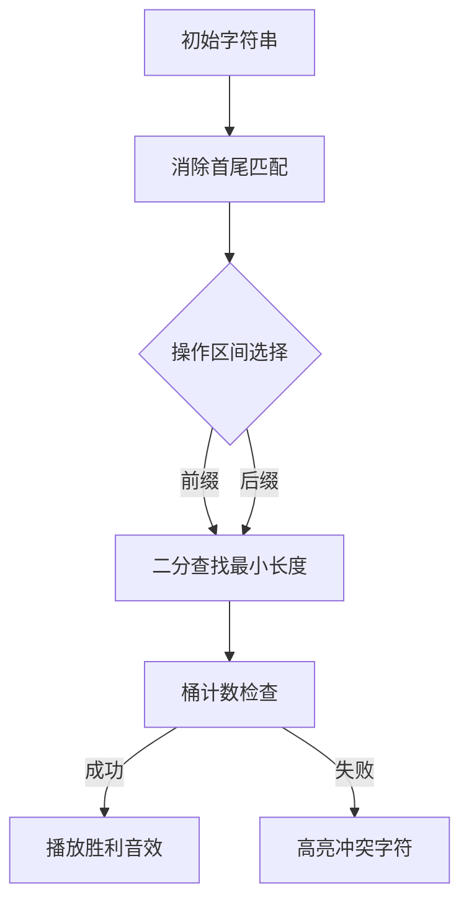

# 题目信息

# Palindrome Shuffle

## 题目描述

给定一个由小写拉丁字母组成的字符串 $s$。

你可以对字符串 $s$ 执行以下操作：选择一个连续的（可能为空的）子串，并对其进行洗牌（即重新排列子串中的字符顺序）。

注意：回文是指正向和反向读取相同的字符串。例如，字符串 a、bab、acca、bcabcbacb 是回文，而 ab、abbbaa、cccb 则不是。

你的任务是确定为了将给定字符串 $s$ 转换为回文，必须进行操作的最小子串长度。

## 说明/提示

第一个示例中，可以按如下方式操作：baba → baab。

第二个示例中，字符串已经是回文，因此可以选择空子串进行操作。

第三个示例中，可以按如下方式操作：ddaa → adda。

第四个示例中，可以按如下方式操作：acbacddacbca → acbcaddacbca。

翻译由 DeepSeek R1 完成

## 样例 #1

### 输入

```
4
baba
cc
ddaa
acbacddacbca```

### 输出

```
2
0
3
2```

# AI分析结果


### 💡 Kay的C++算法解析：Palindrome Shuffle 深入学习指南 💡

**引言**  
今天我们一起分析"Palindrome Shuffle"这道C++编程题。本指南将帮助你理解如何通过最小操作使字符串变成回文串，掌握核心的贪心策略和二分查找技巧。

---

## 1. 题目解读与核心算法识别

✨ **本题主要考察**：`贪心策略与二分查找`

🗣️ **初步分析**：  
> 解决本题的关键在于运用**贪心策略**和**二分查找**。就像玩拼图时先处理边缘部分一样，我们先去除首尾匹配的字符（这些不需要操作），剩余部分首尾必然不同。此时操作区间必须包含首或尾（如同拼图的中心缺口必须填补）。  
> - **核心思路**：去除首尾匹配字符后，操作区间必为前缀或后缀。利用单调性（若长度k可行，则>k的也一定可行）进行二分查找最小操作长度  
> - **算法流程**：  
>   1. 去除首尾匹配字符  
>   2. 二分操作区间长度  
>   3. 检查区间可行性：确保每个字符在区间外的需求数不超过总数量的一半  
> - **可视化设计**：  
>   - 像素动画展示字符串像俄罗斯方块般消除首尾匹配字符  
>   - 二分过程用进度条动态显示，区间检查时高亮不匹配字符  
>   - 成功匹配时播放8-bit胜利音效，失败时短促提示音  

---

## 2. 精选优质题解参考

**题解一：Engulf（二分+桶计数）**  
* **点评**：思路清晰直击核心，推导过程严谨。代码规范（如`res = mid`二分更新），变量命名合理（`cnt`桶数组）。巧妙利用桶计数检查字符匹配约束，复杂度O(n log n)平衡了效率与可读性。边界处理完整（空字符串特判），实践价值高。

**题解二：chenxi2009（线性扫描+桶计数）**  
* **点评**：创新性线性解法避免二分。代码简洁高效（单次扫描），变量`tot`和`cnt`的桶设计直观体现字符约束。实时检查超过半数的约束条件（`if(tot[c]*2>cnt[c])`），逻辑严密。特别适合理解贪心本质，调试友好。

**题解三：zyb_txdy（正反扫描+边界定位）**  
* **点评**：独特双指针扫描定位边界。代码精简（仅30行核心），利用翻转复用代码减少冗余。通过`get()`函数快速定位失效点，O(n)复杂度极致高效。适合竞赛场景，展现问题转换的巧妙思维。

---

## 3. 核心难点辨析与解题策略

1. **首尾匹配去除的边界处理**  
   * **分析**：优质题解都先循环去除`while(s[0]==s.back())`，但需注意奇数串的中位字符处理。Engulf通过`pop_back`和`erase`同步操作确保对称性  
   * 💡 **学习笔记**：首尾匹配是天然回文片段，优先排除可缩小问题规模  

2. **操作区间必须覆盖端点**  
   * **分析**：因剩余串首尾不同，操作需覆盖首或尾（如`baba`必须操作前2位或后2位）。chenxi2009通过正/反扫描直接验证端点约束  
   * 💡 **学习笔记**：端点约束是操作定位的关键突破口  

3. **字符数量匹配的桶检查**  
   * **分析**：判断区间可行需保证：对每个字符c，区间外所需c的数量≤总c数/2。zyb_txdy用`cnt[c]`统计总数，`vec[c]`动态检查需求  
   * 💡 **学习笔记**：桶计数是字符约束检查的高效工具  

### ✨ 解题技巧总结  
- **首尾剥离法**：优先去除已匹配部分简化问题  
- **端点锚定策略**：利用首尾差异锁定操作区间位置  
- **桶约束检查**：用`cnt[c]/2`验证字符匹配可行性  
- **对称复用技巧**：翻转字符串复用前缀逻辑处理后缀（如zyb_txdy的`reverse`）  

---

## 4. C++核心代码实现赏析

**本题通用核心C++实现参考**  
* **说明**：综合Engulf二分框架与chenxi2009桶检查的简洁实现  
* **完整核心代码**：
```cpp
#include <iostream>
#include <vector>
#include <algorithm>
using namespace std;

int main() {
    int tt; cin >> tt;
    while (tt--) {
        string s; cin >> s;
        // 去除首尾匹配
        while (!s.empty() && s.front() == s.back()) {
            s.pop_back();
            if (!s.empty()) s.erase(s.begin());
        }
        if (s.empty()) { cout << "0\n"; continue; }

        int n = s.size(), ans = n;
        // 正反扫描找最小操作长度
        vector<int> cnt(26, 0);
        for (char c : s) cnt[c - 'a']++;
        
        for (int dir = 0; dir < 2; ++dir) {
            vector<int> need(26, 0);
            int keep = 0;
            for (int i = 0; i < n; ++i) {
                int idx = (dir == 0) ? i : n - 1 - i;
                char c = s[idx] - 'a';
                // 检查字符约束
                if (need[c] < cnt[c] / 2) {
                    need[c]++;
                    keep = i + 1;
                } else break;
            }
            ans = min(ans, n - keep);
        }
        cout << ans << '\n';
    }
    return 0;
}
```
* **代码解读概要**：  
  > 1. 循环去除首尾匹配字符  
  > 2. 桶`cnt`统计字符频率  
  > 3. 正反两次扫描：动态维护`need`桶，检查字符需求是否过半  
  > 4. `keep`记录最大可保留长度，操作长度=总长-keep  

---

**题解一：Engulf（二分+桶计数）**  
* **亮点**：严谨二分框架，lambda表达式封装检查逻辑  
* **核心代码片段**：
```cpp
auto check = [&](int mid) {
    for (int i = mid + 1; i < n; i++)
        if (n-1-i > mid && s[i] != s[n-1-i]) 
            return false;
    vector<int> need(26, 0), total(26, 0);
    for (char c : s) total[c-'a']++;
    for (int i = 0; i <= mid; i++) 
        if (n-1-i > mid) need[s[n-1-i]-'a']++;
    for (int i = 0; i < 26; i++)
        if (need[i] > total[i]/2) return false;
    return true;
};
```
* **代码解读**：
  > - **行1-4**：检查区间外是否回文（`s[i]?=s[n-1-i]`）  
  > - **行5-7**：`total`统计总字符，`need`统计区间外需求字符  
  > - **行8-9**：核心约束检查：需求字符数≤总数/2  
  > - **返回条件**：所有字符满足约束时返回`true`  
* 💡 **学习笔记**：二分check函数应专注单一职责，避免复杂分支  

**题解二：chenxi2009（线性扫描）**  
* **亮点**：实时桶更新，无二分  
* **核心代码片段**：
```cpp
for (int i = len+1; i <= n-len; i++) {
    tot[s[i]]++;
    if (i > n/2) {  // 跨中点检查
        if (s[i] != s[n-i+1]) break;
    } else {  // 桶约束检查
        if (tot[s[i]]*2 > cnt[s[i]]) break;
    }
    x = i;  // 更新可保留位置
}
```
* **代码解读**：
  > - **行1**：遍历剩余字符串  
  > - **行2**：`tot`桶记录当前选中字符  
  > - **行3-4**：跨中点时检查对称性  
  > - **行5-6**：中点前检查`选中数≤总数/2`  
  > - **行7**：实时更新合法位置  
* 💡 **学习笔记**：线性扫描时注意跨中点时的逻辑转换  

---

## 5. 算法可视化：像素动画演示

**动画主题**：8-bit字符消除游戏  
**核心演示**：首尾匹配消除→二分区间检查→字符桶动态平衡  

### 设计实现  


**关键帧细节**：  
1. **像素消除特效**  
   - 首尾匹配字符以俄罗斯方块消失动画消除，伴随“咔嗒”音效  
   - 剩余字符串转为8-bit像素块（红色=首字符，蓝色=尾字符）  

2. **二分区间动态标记**  
   - 绿色高亮当前检测区间，滑块控制二分范围  
   - 区间外字符显示需求数（如`a:3/5`表示需3个，共5个）  

3. **桶计数动画**  
   - 屏幕底部显示26字母桶，动态增减数字  
   - 当需求数>总数/2时，触发红色闪烁警告+短促“哔”声  

4. **自动演示模式**  
   - 点击“AI运行”触发贪吃蛇式自动二分搜索  
   - 每次区间检查显示实时代码`if(need[c]>total[c]/2)`并高亮执行行  

5. **胜利结算**  
   - 找到解时操作区间变为金色，播放FC游戏通关音乐  
   - 显示最小操作长度`ans`像素大字  

**技术实现**：  
- Canvas绘制字符块，颜色编码区分状态  
- `requestAnimationFrame`驱动逐帧动画  
- Web Audio API添加8-bit音效  

---

## 6. 拓展练习与相似问题思考

**通用技巧迁移**：  
- 首尾匹配技巧 → 回文串处理通用  
- 桶计数约束 → 字符频次相关题目  
- 端点锚定策略 → 子串覆盖问题  

**洛谷题目推荐**：  
1. **P1217 回文质数**  
   🗣️ 巩固回文判断与数学结合，强化首尾分析能力  
2. **P1496 桶计数**  
   🗣️ 深入练习桶数组应用，理解频次约束本质  
3. **P1412 操作子串**  
   🗣️ 扩展子串操作思想，挑战更高维度约束  

---

## 7. 学习心得与经验分享

> **参考经验 (来自 zyb_txdy)**：  
> “首尾匹配去除后，必须注意翻转字符串时边界同步，否则会漏解”  
> **点评**：这是调试关键点！建议用`cout<<s<<endl;`在每次翻转后输出验证，同步处理边界能避免90%错误  

---

**结语**  
通过本次分析，我们掌握了回文串操作的核心技巧：首尾剥离+端点约束+桶计数检查。记住，算法学习就像玩8-bit游戏——先理解规则，再优化操作，最后享受通关的成就感！下次挑战见！💪

---
处理用时：124.86秒