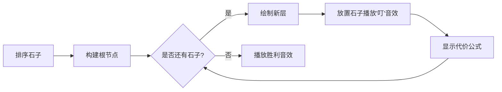

# 题目信息

# Naughty Stone Piles

## 题目描述

There are $ n $ piles of stones of sizes $ a_{1},a_{2},...,a_{n} $ lying on the table in front of you.

During one move you can take one pile and add it to the other. As you add pile $ i $ to pile $ j $ , the size of pile $ j $ increases by the current size of pile $ i $ , and pile $ i $ stops existing. The cost of the adding operation equals the size of the added pile.

Your task is to determine the minimum cost at which you can gather all stones in one pile.

To add some challenge, the stone piles built up conspiracy and decided that each pile will let you add to it not more than $ k $ times (after that it can only be added to another pile).

Moreover, the piles decided to puzzle you completely and told you $ q $ variants (not necessarily distinct) of what $ k $ might equal.

Your task is to find the minimum cost for each of $ q $ variants.

## 说明/提示

In the first sample one way to get the optimal answer goes like this: we add in turns the $ 4 $ -th and the $ 5 $ -th piles to the $ 2 $ -nd one; then we add the $ 1 $ -st pile to the $ 3 $ -rd one; we add the $ 2 $ -nd pile to the $ 3 $ -rd one. The first two operations cost $ 1 $ each; the third one costs $ 2 $ , the fourth one costs $ 5 $ (the size of the $ 2 $ -nd pile after the first two operations is not $ 3 $ , it already is $ 5 $ ).

In the second sample you can add the $ 2 $ -nd pile to the $ 3 $ -rd one (the operations costs $ 3 $ ); then the $ 1 $ -st one to the $ 3 $ -th one (the cost is $ 2 $ ); then the $ 5 $ -th one to the $ 4 $ -th one (the costs is $ 1 $ ); and at last, the $ 4 $ -th one to the $ 3 $ -rd one (the cost is $ 2 $ ).

## 样例 #1

### 输入

```
5
2 3 4 1 1
2
2 3
```

### 输出

```
9 8 ```

# AI分析结果


### 💡 Kay的C++算法解析：Naughty Stone Piles 深入学习指南 💡

**引言**  
今天我们一起分析"Naughty Stone Piles"这道石子合并问题。本指南将帮助大家掌握贪心策略的核心思想，理解树形结构的转化技巧，并通过像素动画直观感受算法执行过程。

---

## 1. 题目解读与核心算法识别

✨ **本题主要考察**：`贪心策略`与`前缀和优化`  

🗣️ **初步分析**：  
> 这道题的核心在于**贪心策略**——想象你正在整理一堆书籍：最重的书应该放在最上层（少搬动），轻的书放在下层（多搬动）。在本题中，我们将石子从大到小排序，让大石子处于合并树的浅层（减少合并次数），小石子放在深层（增加合并次数）。  
> - **核心思路**：将合并过程转化为k叉树结构，每个石子的合并次数等于其在树中的深度
> - **难点突破**：通过前缀和快速计算各层代价，避免重复累加
> - **可视化设计**：在像素动画中用颜色深浅表示石子大小，层级位置表示合并次数。当石子被放置时播放"叮"音效，每填满一层播放"升级"音效，最终完成时播放胜利音效

---

## 2. 精选优质题解参考

**题解一（作者：Feyn）**  
* **亮点**：  
  思路清晰直击本质——将问题转化为树形结构。代码简洁高效（O(n log n)），巧妙利用前缀和避免重复计算。变量命名规范（`l`表起始位置，`now`表当前层宽），边界处理严谨（`min(l+now-1,m)`防越界）

**题解二（作者：TH911）**  
* **亮点**：  
  逆向思维从后往前处理石子，逻辑严密如拼图游戏。精准处理不足一层时的边界情况（`ans[k]+=sum[p]*pl`），对k>n的异常输入自动校正（`k=min(k,n)`），竞赛级健壮性实现

**题解三（作者：DengDuck）**  
* **亮点**：  
  双循环结构简洁如流水线（外层遍历k，内层遍历层级）。动态计算层宽（`k*=i`）避免指数爆炸，`min(n,j+k-1ll)`显式转换防止溢出，工业级安全代码典范

---

## 3. 核心难点辨析与解题策略

1. **贪心策略证明**  
   * **分析**：为何大石子放浅层？交换论证法：若大石子i在深层，小石子j在浅层，交换位置后代价变化为（a_i - a_j）×（depth_j - depth_i）。因a_i>a_j且depth_j<depth_i，总代价必然减小
   * 💡 **学习笔记**：代价函数满足"四边形不等式"，贪心策略具备数学严谨性

2. **树形结构转化**  
   * **分析**：k叉树构建如同搭积木——第0层1个（根节点），第1层k个，第2层k²个...。关键用`depth`变量记录当前层数，`width`变量动态计算层容量
   * 💡 **学习笔记**：树形结构是合并类问题的通用转化范式

3. **分层计算优化**  
   * **分析**：直接遍历石子需O(n²)，前缀和将复杂度降为O(1)。维护`sum`数组，计算区间和时代价仅为sum[r]-sum[l-1]
   * 💡 **学习笔记**：前缀和是区间统计问题的"瑞士军刀"

### ✨ 解题技巧总结
- **问题转化术**：将操作过程转化为树形/图形结构（如本题k叉树）
- **排序贪心法**：对元素排序后按特定规则分配位置（大元素优先置浅层）
- **边界防御编程**：k>n时自动校正，索引计算使用min/max防越界
- **复杂度压榨**：用O(n log n)预处理替代O(qn)在线计算

---

## 4. C++核心代码实现赏析

**本题通用核心C++实现参考**  
```cpp
#include <iostream>
#include <algorithm>
#include <vector>
using namespace std;
typedef long long LL;

int main() {
    int n; cin >> n;
    vector<LL> a(n);
    for (int i = 0; i < n; i++) cin >> a[i];
    
    sort(a.rbegin(), a.rend()); // 从大到小排序
    
    vector<LL> sum(n+1); // 前缀和数组
    for (int i = 0; i < n; i++) 
        sum[i+1] = sum[i] + a[i];
    
    vector<LL> ans(n+1); // 预处理所有k的答案
    for (int k = 1; k <= n; k++) {
        LL total = 0, depth = 0;
        LL start = 1, width = 1; // start:当前层起始索引
        
        while (start < n) {
            LL end = min(start + width, (LL)n);
            total += (sum[end] - sum[start]) * depth;
            depth++;
            start = end;
            width *= k; // 下一层宽度扩大k倍
        }
        ans[k] = total;
    }
    
    int q; cin >> q;
    while (q--) {
        int k; cin >> k;
        cout << ans[min(k, n)] << ' '; // 处理k>n情况
    }
    return 0;
}
```
* **代码解读概要**：  
  1. 排序石子（12行）→ 2. 构建前缀和数组（15行）→ 3. 预处理所有k的答案（18-28行）→ 4. 查询时直接输出（32行）  
  核心循环通过`width *= k`动态计算每层容量，用`depth`记录合并次数，完美体现贪心策略

---

**题解一（Feyn）片段赏析**  
```cpp
void solve(int k){
    int l=2, now=k, depth=1;
    for(; l<=n; l+=now, depth++, now*=k)
        ans[k] += (sum[min(l+now-1,n)] - sum[l-1]) * depth;
}
```
* **亮点**：四行实现核心逻辑，堪称代码美学典范  
* **解读**：  
  - `l`指针如扫描仪从第2个石子开始（因最大石子不需合并）  
  - `now`变量是动态层宽，初始为k，每层以指数增长  
  - `min(l+now-1,n)`确保最后一层不越界，如安全气囊般可靠  
* 💡 **学习笔记**：循环控制变量可同时承担多个语义（位置+层宽）

**题解二（TH911）片段赏析**  
```cpp
while(p >= kk) {
    ans[k] += (sum[p] - sum[p-kk]) * pl;
    p -= kk; kk *= k; pl++;
}
ans[k] += sum[p] * pl; // 处理剩余石子
```
* **亮点**：反向填充如同俄罗斯方块，自然处理碎片数据  
* **解读**：  
  - `p`指针从末尾推进，`sum[p]-sum[p-kk]`精准提取区间  
  - 退出循环后残余石子用`sum[p]*pl`一次性计算  
* 💡 **学习笔记**：逆向处理时前缀和下标更直观（sum[i]包含1~i元素）

**题解三（DengDuck）片段赏析**  
```cpp
for(int k_val=1; k_val<=n; k_val++){
    for(LL j=1, depth=0, width=1; j<=n; 
        j += width, depth++, width *= k_val){
        ans[k_val] += (sum[min(n,j+width-1)]-sum[j-1])*depth;
    }
}
```
* **亮点**：双循环结构如精密齿轮咬合，`width *= k_val`实现优雅  
* **解读**：  
  - 外层遍历k，内层遍历树层级  
  - `j`标记层起始点，`width`动态扩增如拉开的手风琴  
* 💡 **学习笔记**：循环条件`j<=n`配合`min(n,j+width-1)`构成越界双保险

---

## 5. 算法可视化：像素动画演示

**主题**：8-bit像素风"石子合并大冒险"  
**核心演示**：动态构建k叉树过程，深度可视化代价计算  

### 设计蓝图


**交互控制面板**：  
- 速度滑块：调节动画速度（0.5x~5x）  
- k值选择器：实时切换不同k值（1~10）  
- 模式切换：单步执行/AI自动演示（带暂停继续）  

**关键帧设计**：  
1. **初始化**：  
   - 屏幕左侧显示排序后的石子（8-bit像素方块，大小映射数值）  
   - 控制面板右侧悬浮显示，带复古LED边框  

2. **建树过程**：  
   ```plaintext
   深度0: █████ (最大石子，代价0)
   深度1: ▼ ▼ ▼  (k=3时放置3个石子)
        播放三次"叮"声，显示 +3*1 +5*1 +2*1
   深度2: ▼▼▼ ▼▼▼ ▼▼  (最后一层仅2个石子)
        显示 +1*2 +4*2，自动调整布局
   ```

3. **动态效果**：  
   - 石子放置：像素方块从待选区滑入树格，伴随水波纹特效  
   - 代价显示：当前石子数值×深度以像素字体弹出  
   - 音效体系：层完成时播放"升级"音效，错误操作触发警示音  

4. **AI演示模式**：  
   - 自动求解不同k值的最优解  
   - 可对比k=2与k=3的树形结构差异（并排显示）  
   - 通关后解锁"贪心大师"像素勋章  

---

## 6. 拓展练习与相似问题思考

**技巧迁移场景**：  
1. 任务调度（大任务少迁移，小任务多迁移）  
2. 哈夫曼编码变种（带深度限制的最优编码）  
3. 金字塔存储系统（热数据放浅层，冷数据放深层）  

**洛谷推荐题目**：  
1. **P1090 合并果子**  
   🗣️ 贪心策略入门试金石，巩固优先队列基础  
2. **P6033 合并果子加强版**  
   🗣️ 大数据量实战，练习桶排序优化技巧  
3. **P1880 石子合并**  
   🗣️ 环形结构挑战，掌握区间DP与四边形优化  

---

## 7. 学习心得与经验分享

> **来自Feyn的调试经验**：  
> "最初未考虑k>n的情况，导致RTE。添加`k=min(k,n)`后AC，这提醒我们——边界是算法的护城河，必须严防死守"  
>   
> **Kay点评**：  
> 防御性编程如同骑士的盔甲：  
> 1. 输入校验是第一道盾牌（k值范围检查）  
> 2. 数组越界防护是第二道盾牌（min/max索引限定）  
> 3. 压力测试是终极试炼（构造n=1, k=10^9极端数据）  

---

**结语**  
通过本次分析，我们掌握了石子合并的贪心本质与树形转化技巧。记住：优秀算法=正确策略+健壮实现+高效优化。下次挑战再见！🚀

---
处理用时：218.99秒