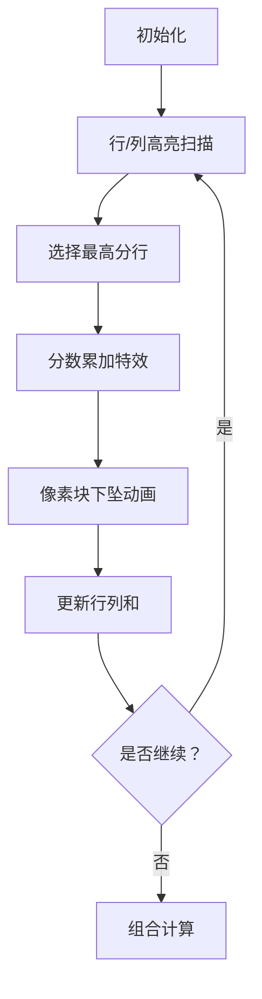

# 题目信息

# DZY Loves Modification

## 题目描述

As we know, DZY loves playing games. One day DZY decided to play with a $ n×m $ matrix. To be more precise, he decided to modify the matrix with exactly $ k $ operations.

Each modification is one of the following:

1. Pick some row of the matrix and decrease each element of the row by $ p $ . This operation brings to DZY the value of pleasure equal to the sum of elements of the row before the decreasing.
2. Pick some column of the matrix and decrease each element of the column by $ p $ . This operation brings to DZY the value of pleasure equal to the sum of elements of the column before the decreasing.

DZY wants to know: what is the largest total value of pleasure he could get after performing exactly $ k $ modifications? Please, help him to calculate this value.

## 说明/提示

For the first sample test, we can modify: column 2, row 2. After that the matrix becomes:

`<br></br>1 1<br></br>0 0<br></br><br></br>`For the second sample test, we can modify: column 2, row 2, row 1, column 1, column 2. After that the matrix becomes:

`<br></br>-3 -3<br></br>-2 -2<br></br><br></br>`

## 样例 #1

### 输入

```
2 2 2 2
1 3
2 4
```

### 输出

```
11
```

## 样例 #2

### 输入

```
2 2 5 2
1 3
2 4
```

### 输出

```
11
```

# AI分析结果


### 💡 Kay的C++算法解析：DZY Loves Modification 深入学习指南 💡

<introduction>
今天我们来分析"CF446B DZY Loves Modification"这道贪心+优先队列的综合题。本指南将帮助你理解矩阵操作的独特性质，掌握贪心策略的设计思路，并通过生动的像素动画直观感受算法执行过程。
</introduction>

---

## 1. 题目解读与核心算法识别

✨ **本题主要考察**：`贪心策略` + `优先队列应用`

🗣️ **初步分析**：
> 解决矩阵操作问题就像玩"像素消除游戏"——每次消除得分最高的行/列会获得最大即时收益。贪心思想就是"当前最优选择"，而优先队列则是快速找到最高分区域的"雷达扫描仪"。
   
- **核心思路**：独立计算行/列操作的最大收益，通过数学补偿解决行列交叉影响
- **关键难点**：操作顺序的无关性证明（交换律）、交叉影响补偿项推导
- **可视化设计**：
  - 像素网格展示矩阵数值（暖色=高值，冷色=低值）
  - 高亮当前操作行/列，显示分数累加过程
  - 当枚举行列操作组合时，用闪烁效果标记交叉区域，动态显示补偿项计算

---

## 2. 精选优质题解参考

**题解一（来源：交警）**
* **点评**：思路最为严谨完整，详细证明了操作顺序无关性，这是理解本题的关键突破点。代码结构清晰：① 独立预处理行列和 ② 优先队列维护最大值 ③ 补偿项计算。变量命名规范（row/col数组），边界处理完整（long long防溢出）。亮点在于数学证明与代码实现的完美结合。

**题解二（来源：fuqingchen）**
* **点评**：代码简洁高效，直接使用STL优先队列，省去手动排序。核心逻辑仅30行，但完整覆盖算法要点：行列分开贪心预处理+补偿项枚举。实践价值高，可直接用于竞赛，特别适合掌握STL的学习者。

**题解三（来源：Utilokasteinn）**
* **点评**：创新性使用multiset替代优先队列，提供容器选择的多样性。重点分析了Wa#4的陷阱（重复最大值处理），强化调试意识。代码包含详细注释，适合理解不同数据结构的应用场景。

---

## 3. 核心难点辨析与解题策略

### 难点1：操作顺序无关性证明
* **分析**：如同俄罗斯方块，无论先消行还是列，最终消除的方块数相同。交警的证明显示：交换行列操作顺序，总分不变（元素a[i][j]总被减(r+c)p，其中r、c是它所在行/列被操作的次数）
* 💡 **学习笔记**：操作顺序无关 → 行列可独立处理

### 难点2：交叉影响补偿项
* **分析**：每次行操作会使该行所有元素减p，影响后续列操作收益。补偿项`i*(k-i)*p`的推导：i次行操作和(k-i)次列操作，产生i*(k-i)个交叉点，每个点少计p分
* 💡 **学习笔记**：独立预处理 + 数学补偿 = 解决相互影响

### 难点3：贪心策略实现
* **分析**：优先队列（O(logn)）比暴力排序（O(nlogn)）更高效维护当前最大值。每次取出堆顶后，需更新`sum = sum - 列数*p`（行操作）重新入堆
* 💡 **学习笔记**：堆优化是贪心的黄金搭档

### ✨ 解题技巧总结
1. **问题分解**：将行列操作解耦，转化为两个独立子问题
2. **数学建模**：通过交叉项补偿解决相互影响
3. **STL应用**：优先队列priority_queue/multiset快速维护极值
4. **边界防御**：数据范围10^6 → long long必需，初始值设为LLONG_MIN

---

## 4. C++核心代码实现赏析

**本题通用核心实现（综合优质题解）**
```cpp
#include <iostream>
#include <queue>
#include <climits>
using namespace std;
typedef long long ll;

int main() {
    ll n, m, k, p;
    cin >> n >> m >> k >> p;
    vector<vector<ll>> a(n, vector<ll>(m));
    vector<ll> rowSum(n, 0), colSum(m, 0);

    // 输入并计算行列和
    for (int i = 0; i < n; i++) 
        for (int j = 0; j < m; j++) {
            cin >> a[i][j];
            rowSum[i] += a[i][j];
            colSum[j] += a[i][j];
        }

    // 优先队列初始化
    priority_queue<ll> rowQ, colQ;
    for (auto r : rowSum) rowQ.push(r);
    for (auto c : colSum) colQ.push(c);

    // 预处理行列操作收益
    vector<ll> rowAns(k+1, 0), colAns(k+1, 0);
    for (int i = 1; i <= k; i++) {
        ll top = rowQ.top(); rowQ.pop();
        rowAns[i] = rowAns[i-1] + top;
        rowQ.push(top - m * p); 
    }
    for (int i = 1; i <= k; i++) {
        ll top = colQ.top(); colQ.pop();
        colAns[i] = colAns[i-1] + top;
        colQ.push(top - n * p);
    }

    // 枚举行列操作组合
    ll ans = LLONG_MIN;
    for (int i = 0; i <= k; i++) 
        ans = max(ans, rowAns[i] + colAns[k-i] - i*(k-i)*p);
    
    cout << ans << endl;
    return 0;
}
```
**代码解读概要**：
1. 输入阶段：计算每行/列原始和
2. 预处理：用优先队列维护当前最大值
3. 动态更新：每次取最大值后更新行列和（减m*p或n*p）
4. 组合计算：枚举所有行列操作比例，减去交叉补偿项

**题解一（交警）核心片段赏析**
```cpp
for (int i = 1; i <= k; i++) {
    ll top = rowQ.top(); rowQ.pop();
    rowAns[i] = rowAns[i-1] + top;       // 累加当前行收益
    rowQ.push(top - m * p);              // 更新后重新入队
}
```
* **亮点**：清晰的贪心迭代逻辑
* **代码解读**：
  - `rowQ.top()`获取当前最大行和（O(1)）
  - `rowAns[i]`记录操作i次的最大收益
  - `top - m*p`模拟该行所有元素减p后的新和
* 💡 **学习笔记**：贪心是"近视最优解"，需配合动态更新

**题解三（Utilokasteinn）multiset应用**
```cpp
multiset<ll, greater<ll>> rowSet; 
// 插入初始值
auto it = rowSet.begin();
ll val = *it;
rowSet.erase(it);
rowSet.insert(val - m*p);
```
* **亮点**：multiset提供更多灵活操作
* **学习笔记**：当需要访问中间元素时，multiset比priority_queue更合适

---

## 5. 算法可视化：像素动画演示

**主题**：8-bit风格矩阵消除游戏  
**核心演示**：贪心选择过程与交叉补偿机制  

### 动画设计


1. **像素场景**：
   - 网格背景：16x16像素块，RGB332调色板（64色）
   - 动态标识：当前操作行/列用闪烁边框（频率2Hz）

2. **关键动画**：
   - **行操作**：整行像素块上浮+渐隐，显示`+XX分`
   - **列操作**：整列像素块左右晃动+缩小效果
   - **补偿计算**：行列交叉点闪烁红色，显示`-X补偿`

3. **交互控制**：
   - 速度滑块：0.5x~5x调节执行速度
   - 模式切换：单步执行/AI自动演示（贪吃蛇式路径）
   - 音效设计：
     * 选择行：NES风格8-bit音阶（C-E-G）
     * 选择列：低音和弦（C-G-C）
     * 错误操作：短促爆破音

4. **信息面板**：
   - 实时显示：`rowAns[i]`、`colAns[k-i]`、补偿项
   - 伪代码同步高亮：
     ```python
     for i in range(k+1):
         total = row[i] + col[k-i] - i*(k-i)*p  # 补偿交叉影响
     ```

---

## 6. 拓展练习与相似问题

**通用技巧迁移**：
1. 操作独立性分析（行列/行列无关性）
2. 贪心+数据结构维护极值
3. 操作后效性的数学补偿

**洛谷推荐**：
1. [P2216 理想的正方形](https://www.luogu.com.cn/problem/P2216)  
   → 二维滑动窗口+极值维护，巩固优先队列应用
2. [P1886 滑动窗口](https://www.luogu.com.cn/problem/P1886)  
   → 单调队列经典题，操作独立性的基础训练
3. [P1714 切蛋糕](https://www.luogu.com.cn/problem/P1714)  
   → 前缀和+贪心极值，强化补偿项思维

---

## 7. 学习心得与经验分享

> **来自交警的调试经验**：  
> "最初未考虑long long导致WA#4，提醒我们：10^6级操作数必须警惕整数溢出"

**Kay的总结**：  
1. **防御性编程**：大数据范围立即用long long
2. **贪心验证**：通过交换律证明操作独立性
3. **容器选择**：priority_queue默认大根堆，multiset需指定greater

---

本次分析揭示了贪心策略与数据结构的精妙配合。记住：好算法=正确性证明+高效实现+边界防御。继续挑战吧，少年！💪

---
处理用时：144.87秒