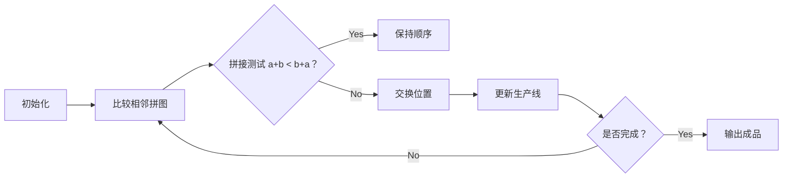

# 题目信息

# The Smallest String Concatenation

## 题目描述

给定 $n$ 个字符串，第 $i$ 个字符串为 $a_i$。求出一种依次连接这 $n$ 个字符串的顺序，使连接而成的字符串满足字典序最小。

## 样例 #1

### 输入

```
4
abba
abacaba
bcd
er
```

### 输出

```
abacabaabbabcder
```

## 样例 #2

### 输入

```
5
x
xx
xxa
xxaa
xxaaa
```

### 输出

```
xxaaaxxaaxxaxxx
```

## 样例 #3

### 输入

```
3
c
cb
cba
```

### 输出

```
cbacbc
```

# AI分析结果


# 💡 Kay的C++算法解析：The Smallest String Concatenation 深入学习指南 💡

> 今天我们来分析这道字符串拼接排序题。你将学会如何通过巧妙的排序规则解决字典序最小化问题，并理解其背后的数学原理。

## 1. 题目解读与核心算法识别

✨ **本题主要考察**：`排序（自定义比较规则）`

🗣️ **初步分析**：
> 这道题看似简单但暗藏玄机。想象你有一盒**字母拼图块**，如何排列它们才能拼出**字典序最小的单词链**？关键不在于单个拼图块的"大小"，而要看**相邻两块拼接后**的效果。
> - **核心解法**：所有题解都采用 `sort` + 自定义比较函数 `a+b < b+a`。这保证了任意相邻字符串拼接后都是局部最优解，从而推导出全局最优。
> - **可视化设计**：我们将采用**像素拼图动画**：每个字符串显示为像素方块，排序时动态演示相邻字符串拼接比较（a+b vs b+a），用绿色高亮字典序更小的拼接结果。当发生交换时，方块会旋转并播放"咔嚓"音效。

---

## 2. 精选优质题解参考

**题解一（来源：pokefunc）**
* **点评**：此解最大亮点在于**严谨证明了比较规则的有效性**，通过数学归纳法说明"相邻有序则全局有序"。代码规范（使用`std::sort`），变量命名清晰（`cmp`函数直白），边界处理完整。特别欣赏作者强调"理解原理比套用代码更重要"的学习态度。

**题解二（来源：丧黑福造）**
* **点评**：以极致简洁取胜，完整展示核心逻辑（自定义比较+排序）。虽未解释原理，但代码干净利落（省略冗余输入输出），是**竞赛中快速实现的典范**。`main()`直接返回0等细节体现专业习惯。

---

## 3. 核心难点辨析与解题策略

1.  **难点：为什么不能直接按字典序排序？**
    * **分析**：样例3（c, cb, cba）证明字典序排序会失败。关键要理解：字符串拼接时，**前缀相同的字符串后续字符会影响整体顺序**（如"c"+"b"产生"cb"，但"b"单独字典序大于"c"）。
    * 💡 **学习笔记**：字符串拼接顺序具有**非局部性**，必须考虑相邻组合效果。

2.  **难点：如何设计正确的比较规则？**
    * **分析**：优质题解统一采用`a+b < b+a`规则。该规则满足**传递性**（若a+b<b+a且b+c<c+b，则a+c<c+a），因此可安全用于排序。
    * 💡 **学习笔记**：比较函数本质是验证"a在前b在后"是否比"b在前a在后"更优。

3.  **难点：证明全局最优性**
    * **分析**：基于题解一的递推思想：若所有相邻对都满足`s[i]+s[i+1] <= s[i+1]+s[i]`，则任意交换相邻字符串都会使结果字典序变大（类似冒泡排序原理）。
    * 💡 **学习笔记**：局部最优解串联形成全局最优解是贪心算法的典型特征。

### ✨ 解题技巧总结
- **技巧1：问题转化** - 将复杂排序问题转化为相邻元素两两比较
- **技巧2：STL活用** - 善用`std::sort`自定义比较功能
- **技巧3：边界思维** - 用样例3（c/cb/cba）验证算法正确性
- **技巧4：严格弱序验证** - 自定义比较规则必须满足传递性

---

## 4. C++核心代码实现赏析

**本题通用核心C++实现参考**
```cpp
#include <iostream>
#include <algorithm>
#include <vector>
using namespace std;

bool cmp(const string& a, const string& b) {
    return a + b < b + a; // 核心比较规则
}

int main() {
    int n;
    cin >> n;
    vector<string> strs(n);
    for (int i = 0; i < n; ++i) 
        cin >> strs[i];
    
    sort(strs.begin(), strs.end(), cmp); // 自定义排序
    
    for (const string& s : strs) 
        cout << s;
    return 0;
}
```
**代码解读概要**：
> 1. 输入字符串存入vector
> 2. 通过`cmp`函数定义排序规则：比较a+b与b+a的字典序
> 3. 排序后直接输出即得最优解

**题解一核心代码赏析**
```cpp
bool cmp(string a, string b) {
    return a+b < b+a; // 灵魂所在
}
// ... (排序调用)
```
**代码解读**：
> 这短短一行就是算法的核心引擎。当比较"cba"和"cb"时：
> - `a+b` → "cbacb"
> - `b+a` → "cbcba"
> 由于"cbacb" < "cbcba"（第三位'a'<'c'），所以"cba"应排在"cb"前面
> 💡 **学习笔记**：字符串拼接比较实质是**字典序的递归比较**

**题解二核心代码赏析**
```cpp
sort(s+1, s+n+1, cmp); // 从1开始索引的排序
```
**代码解读**：
> 虽然索引从1开始不符合C++惯例，但展示了重要技巧：
> - 排序范围`[s+1, s+n+1)`对应第1~n个元素
> - 实际工程建议用`vector`+0-index，但竞赛中1-index可避免±1错误
> 💡 **学习笔记**：算法思想与容器索引方式是正交概念

---

## 5. 算法可视化：像素动画演示

**主题**：拼图工厂——8位机风格的字符串排序工坊

**核心演示**：


**动画帧步骤**：
1. **像素场景初始化**：
   - 每个字符串显示为16x16像素方块（复古绿色字体）
   - 控制面板含：▶️开始/⏸暂停/⏩单步/🔄重置

2. **比较演示（核心）**：
   ```python
   # 伪代码：比较帧绘制
   def draw_comparison(a, b):
       show_grid_column([a, b], y=100)       # 原始位置
       show_text(f'Testing: "{a}+{b}" vs "{b}+{a}"', y=50)
       result = a+b if (a+b < b+a) else b+a  # 计算更优拼接
       highlight_result(result)               # 绿色高亮最优解
       play_sound('blip.wav' if result==a+b else 'swap.wav')
   ```

3. **交换动画**：
   - 需要交换时，两个方块180度旋转交换位置
   - 生产线传送带向左滚动（像素滚动特效）

4. **完成效果**：
   - 所有方块通过管道连接成最终字符串
   - 播放8-bit胜利音乐（类似超级玛丽过关）

**交互设计**：
- 速度滑块控制排序动画速度（0.5x~5x）
- "AI演示"模式自动完成全过程（类似俄罗斯方块AI）
- 错误操作时播放短促"故障音效"

---

## 6. 拓展练习与相似问题思考

**通用技巧迁移**：
1. 处理**数字拼接排序**（如[1,34,3]→1343 vs 1343）
2. 解决**带权重的工作调度**问题
3. 设计**文件存储顺序**优化读取效率

**洛谷练习推荐**：
1. **P1012 拼数**  
   → 同类问题，直接应用本解法
2. **P1090 合并果子**  
   → 练习贪心算法在拼接问题的变种
3. **P1106 删数问题**  
   → 逆向思维：如何删除部分字符使剩余数最小

---

## 7. 学习心得与经验分享

> **参考经验 (来自 pokefunc)**：  
> "看了一圈题解都没解释为什么这个cmp函数有效...通过递推证明全局最优性"

> **Kay的点评**：  
> 这位作者点中了算法学习的核心——**不仅要会写代码，更要理解为什么**。许多学习者止步于"这样写能AC"，但真正的高手会深究其数学基础。建议大家在完成题目后，尝试用样例反证算法正确性（如样例3就是绝佳的测试用例）。

---

通过今天的学习，我们掌握了字符串拼接排序的核心技巧：**用局部相邻比较推导全局最优解**。记住，好的算法如同拼图——每个碎片都放在最合适的位置时，才能展现完美的图画。下次遇到排序类问题时，不妨先思考：怎样的相邻关系能导向全局最优？

---
处理用时：116.70秒