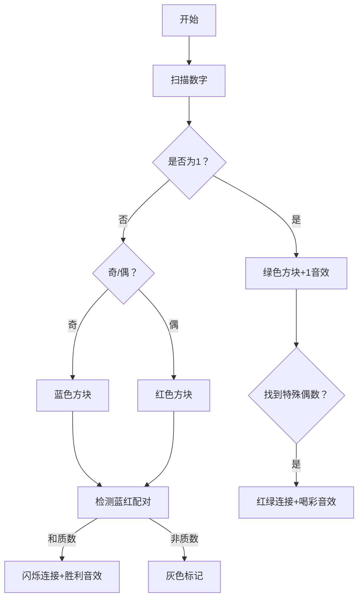

# 题目信息

# Simple Subset

## 题目描述

A tuple of positive integers $ {x_{1},x_{2},...,x_{k}} $ is called simple if for all pairs of positive integers $ (i,j) $ ( $ 1<=i&lt;j<=k $ ), $ x_{i}+x_{j} $ is a prime.

You are given an array $ a $ with $ n $ positive integers $ a_{1},a_{2},...,a_{n} $ (not necessary distinct). You want to find a simple subset of the array $ a $ with the maximum size.

A prime number (or a prime) is a natural number greater than $ 1 $ that has no positive divisors other than $ 1 $ and itself.

Let's define a subset of the array $ a $ as a tuple that can be obtained from $ a $ by removing some (possibly all) elements of it.

## 样例 #1

### 输入

```
2
2 3
```

### 输出

```
2
3 2
```

## 样例 #2

### 输入

```
2
2 2
```

### 输出

```
1
2
```

## 样例 #3

### 输入

```
3
2 1 1
```

### 输出

```
3
1 1 2
```

## 样例 #4

### 输入

```
2
83 14
```

### 输出

```
2
14 83
```

# AI分析结果


### 💡 Kay的C++算法解析：Simple Subset 深入学习指南 💡

**引言**  
今天我们来分析"Simple Subset"这道有趣的构造题。本指南将帮你掌握如何利用数学性质构造最大子集，理解核心分类思想，并通过像素动画直观感受算法流程。

---

### 1. 题目解读与核心算法识别
✨ **本题主要考察**：`编程技巧应用`（数学性质+分类构造）

🗣️ **初步分析**：  
> 解决本题的关键在于发现数字奇偶性和质数特性的数学规律。就像在乐高积木中，只有特定形状的积木能完美拼接：
> - 任意两个大于1的奇数相加必得合数（偶数>2）
> - 任意两个偶数相加必得合数
> - 数字1是"万能接头"：多个1可共存（1+1=2是质数），但1只能与特定偶数配对  
>  
> **核心解法**：  
> 1. 优先收集所有"1"（绿色积木）
> 2. 尝试添加一个"特殊偶数"（红色积木+1=质数）
> 3. 尝试配对"奇偶组合"（蓝+红积木和=质数）
> 4. 保底方案：任选一个积木  
>  
> **可视化设计**：  
> 在像素动画中将用三种颜色方块表示数字：
> - 绿色方块：数字1
> - 蓝色方块：奇数
> - 红色方块：偶数  
> 动画将逐步演示：收集绿色方块→检测红色方块+1→尝试蓝红组合配对，关键步骤会闪烁并播放"叮"音效，成功配对时触发胜利音效。

---

### 2. 精选优质题解参考
**题解一（作者：xunhuanyihao）**  
* **点评**：思路最完整的典范！清晰阐释了奇偶性约束和1的特殊性，代码结构严谨：  
  - 用`chk()`函数封装质数判断提升可读性  
  - 变量`cnt`统计1的个数，`c1`存储特殊偶数，`c2`存储配对组合  
  - 边界处理全面（如空集和单元素情况）  
  - 亮点：完整覆盖所有情况分支，输出逻辑严密无遗漏  

**题解二（作者：XL4453）**  
* **点评**：算法优化的标杆！亮点在于：  
  - 预处理质数表`c[]`使质数判断复杂度降为O(1)  
  - 排序后优先处理1提升效率  
  - 状态标记（`flag1,flag2`）清晰记录解决方案  
  - 亮点：大规模数据场景下效率显著提升  

**题解三（作者：世末OIer）**  
* **点评**：简洁高效的实战派！特点包括：  
  - 用`nisp[]`数组预筛质数  
  - 四类情况直接对应代码块  
  - 快速返回机制避免冗余计算  
  - 亮点：代码最简练（仅30行），适合竞赛快速实现  

---

### 3. 核心难点辨析与解题策略
1. **难点1：发现1的特殊性**  
   * **分析**：1是唯一可重复出现的数字（因1+1=2是质数），但与非1奇数不相容（1+奇数=偶数>2必合数）。优质题解都优先统计1的数量  
   * 💡 学习笔记：1是构造大子集的基石，需最先处理  

2. **难点2：识别有效配对**  
   * **分析**：非1数字只能存在两种可能：  
     - 一个"特殊偶数"（其值+1为质数）与所有1共存  
     - 一个奇数+一个偶数（和为质数）  
   * 💡 学习笔记：破除暴力枚举思维，利用数学约束缩小搜索空间  

3. **难点3：处理边界情况**  
   * **分析**：当无1且无有效配对时，任何单元素都是合法解。题解用`ans=1`保底确保总有解  
   * 💡 学习笔记：子集问题永远存在平凡解（单元素）  

#### ✨ 解题技巧总结
- **技巧1：数学性质优先**：先分析数字的奇偶性和质数特性再编码  
- **技巧2：预处理加速**：当需要频繁判断质数时，预筛质数表是决胜关键  
- **技巧3：状态标记法**：用变量记录各类解（如`c1, c2`），避免最后重新搜索  

---

### 4. C++核心代码实现赏析
**通用核心实现参考**  
```cpp
#include <iostream>
#include <vector>
#include <cmath>
using namespace std;

bool isPrime(int x) {
    if (x < 2) return false;
    for (int i = 2; i <= sqrt(x); i++) 
        if (x % i == 0) return false;
    return true;
}

int main() {
    int n, cnt = 0;
    vector<int> a(n);
    for (int i = 0; i < n; i++) {
        cin >> a[i];
        if (a[i] == 1) cnt++;
    }

    int specialEven = 0;
    pair<int, int> oddEvenPair = {0, 0};

    for (int i = 0; i < n; i++) {
        if (a[i] != 1 && isPrime(a[i] + 1)) 
            specialEven = a[i];
        for (int j = i + 1; j < n; j++)
            if ((a[i] % 2 != a[j] % 2) && isPrime(a[i] + a[j]))
                oddEvenPair = {a[i], a[j]};
    }

    // 输出最优解
    if (cnt >= 2 || (cnt && specialEven)) {
        cout << cnt + (specialEven != 0) << endl;
        for (int i = 0; i < cnt; i++) cout << "1 ";
        if (specialEven) cout << specialEven;
    } else if (oddEvenPair.first) {
        cout << "2\n" << oddEvenPair.first << " " << oddEvenPair.second;
    } else {
        cout << "1\n" << a[0];
    }
}
```
* **代码解读概要**：  
  1. `isPrime`函数封装质数判断  
  2. 第一轮扫描统计1的数量  
  3. 第二轮扫描寻找特殊偶数和奇偶配对  
  4. 按优先级输出最优解：1组合 > 奇偶对 > 单元素  

---

**题解一核心片段赏析**  
```cpp
for (int i = 1; i <= n; i++) {
    if (a[i] % 2 == 0 && cnt && chk(a[i] + 1)) 
        ans = max(ans, cnt + 1), c1 = a[i];
    for (int j = i + 1; j <= n; j++) 
        if (a[i] % 2 != a[j] % 2 && chk(a[i] + a[j])) 
            ans = max(ans, 2), c2 = {a[i], a[j]};
}
```
* **亮点**：双循环覆盖所有配对可能  
* **代码解读**：  
  > 外层遍历每个数字：  
  > - 当遇到偶数(`a[i]%2==0`)且存在1(`cnt>0`)时，检测其+1是否质数  
  > - 内层遍历后续数字，寻找奇偶性相异且和为质数的配对  
  > 关键点：`a[i]%2 != a[j]%2`确保奇偶组合，避免无效检测  
* 💡 学习笔记：循环中内嵌条件检查是构造题的常用模式  

**题解二核心片段赏析**  
```cpp
// 预处理200万内质数表
for (int i = 2; i <= 2000000; i++) {
    if (c[i] == 0) pri[++tot] = i;
    for (int j = 1; j <= tot && i*pri[j] <= 2000000; j++) {
        c[i*pri[j]] = 1;
        if (i % pri[j] == 0) break;
    }
}
```
* **亮点**：线性筛法预计算质数表  
* **代码解读**：  
  > 1. `c[i]=0`标记i为质数  
  > 2. 用已筛质数`pri[j]`标记合数  
  > 3. `i % pri[j] == 0`时终止避免重复  
* 💡 学习笔记：预处理是优化频繁查询的王牌策略  

**题解三核心片段赏析**  
```cpp
if (cnt[1]) {
    for (int i = 2; i <= 1000000; i += 2) 
        if (cnt[i] && !nisp[i + 1]) {
            cout << cnt[1] + 1 << endl;
            for (int j = 0; j < cnt[1]; j++) 
                cout << "1 ";
            cout << i;
            return 0; // 找到即退出
        }        
}
```
* **亮点**：快速返回机制  
* **代码解读**：  
  > 发现"1+特殊偶数"组合后立即输出并终止程序  
  > 优势：避免不必要的后续计算  
* 💡 学习笔记：在确定最优解时及时退出可提升效率  

---

### 5. 算法可视化：像素动画演示
**主题**："数字积木大冒险"（8-bit像素风）  

**核心演示流程**：  


**交互设计**：  
1. **像素建模**：
   - 数字1：绿色16x16像素块（闪烁金边）
   - 奇数：深蓝像素块（剑士形象）
   - 偶数：朱红像素块（法师形象）  

2. **控制面板**：  
   - 速度滑块：调节检测速度（慢/中/快）  
   - 模式切换："教学演示"（带解说）/ "自主探索"  

3. **动态效果**：  
   - 配对检测时：角色间发射像素激光束  
   - 成功连接：方块间出现像素彩虹桥  
   - 无效组合：方块变灰并下沉消失  

4. **音效设计**：  
   - 收集1："叮"（金币声）  
   - 成功配对："噔-噔-噔-锵"（FC胜利旋律）  
   - 无效操作："噗"（掉落声）  

**教学价值**：通过角色化数字和游戏机制，将抽象的数学约束转化为直观的互动体验，强化奇偶性认知和质数判断逻辑。

---

### 6. 拓展练习与相似问题思考
**通用技巧迁移**：  
1. 利用奇偶性约束：如[CF1178D]的质数分割  
2. 1的特殊性应用：如二进制构造题  
3. 预筛质数表优化：大范围质数相关题目  

**洛谷推荐**：  
1. **P1217 回文质数**  
   🗣️ 巩固质数判断与数学约束的结合应用  
2. **P1304 哥德巴赫猜想**  
   🗣️ 强化奇偶分解思维，预筛质数表实战  
3. **P1379 八数码难题**  
   🗣️ 训练状态空间搜索+数学性质剪枝  

---

### 7. 学习心得与经验分享
> **题解一作者经验**：  
> "我在处理多个1的场景时，最初忽略了1不能与非1奇数共存，导致WA。通过打印中间集合才定位问题"  
>  
> **Kay点评**：  
> 这印证了核心难点1的重要性——理解1的特殊兼容性。调试时输出中间集合是定位约束违反的有效手段，建议学习者在复杂条件题中多用此法。

---

**结语**  
通过本次分析，相信大家已掌握利用数学性质构造最优解的核心技巧。记住：编程不仅是写代码，更是发现隐藏规律的艺术！下次遇到构造题时，不妨先问自己："这里的'数字积木'有什么特殊拼接规则？"

---
处理用时：172.89秒