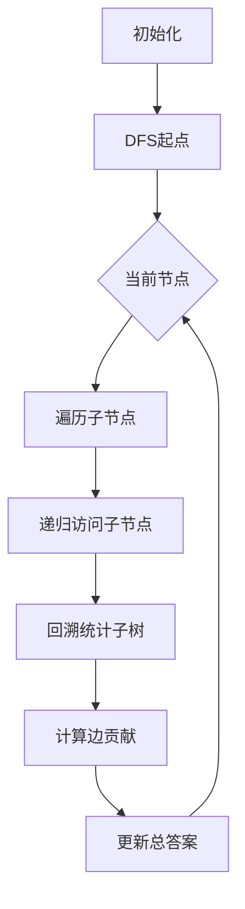

# 题目信息

# Connecting Universities

## 题目描述

树之王国是一个由n-1条双向路连接着n个城镇的国家，任意两个城镇间都是联通的。

在树之王国共有2k所大学坐落于不同的城镇之中。

最近，树国总统颁布了一项在大学间建立高速信息网络的法案。教育部部长以他自己的方式理解了这项法案，他发现用电缆连接各所学校是绰绰有余的。形式上来说，这项法案安排的任务的确被完成了！(贪官...)

为了能尽可能多地获取财政预算，部长打算把大学分成一对一对的，使得在各所学校间建立连接所需的电缆最长。换句话说，k对大学间的距离总和越大越好。

帮助部长完成这个任务。当然了，每所大学不能重复出现在多对里。你可以认为每条路的长度均为1。

## 说明/提示

下图展示了在样例一的一种可能的结果。如果你把坐落于1号城镇的大学和坐落于6号城镇的大学连接在一起，把坐落于2号城镇的大学和坐落于5号城镇的大学连接在一起，那么距离总和为6，在样例一中是最大距离总和。


## 样例 #1

### 输入

```
7 2
1 5 6 2
1 3
3 2
4 5
3 7
4 3
4 6
```

### 输出

```
6
```

## 样例 #2

### 输入

```
9 3
3 2 1 6 5 9
8 9
3 2
2 7
3 4
7 6
4 5
2 1
2 8
```

### 输出

```
9
```

# AI分析结果


# 💡 Kay的C++算法解析：Connecting Universities 深入学习指南 💡

**介绍**  
今天我们一起分析树形王国中的大学连接问题。这道题考察在树形结构中最大化配对点距离之和的贪心策略。本指南将帮助你理解核心算法、掌握解题技巧，并通过像素动画直观感受算法执行过程。

---

## 1. 题目解读与核心算法识别

✨ **本题主要考察**：`贪心算法`（树形结构上的边贡献计算）  

🗣️ **初步分析**  
> 解决本题的关键在于将复杂配对问题转化为**边贡献计算**。想象树是一条河流，大学是两岸的村庄，每条边就是一座桥。贪心策略的核心是让每座桥承载尽可能多的"跨河配对"（木桶效应）：
> - 统计每条边两侧的大学数量 `x` 和 `2k-x`
> - 该边的最大贡献为 `min(x, 2k-x)`
> - 总和即为最优解  
>  
> **可视化设计思路**：  
> 在8位像素风格的树结构中，DFS遍历时高亮当前处理的边（如红色闪烁），实时显示两侧大学数量。当计算`min(x,2k-x)`时：
> - 播放"叮"的音效
> - 用浮动数字显示贡献值
> - 累计答案区域同步更新
>  
> **复古游戏化设计**：  
> - 背景：FC风格像素树（绿色节点+棕色边）
> - 音效：键音(比较)、胜利音(完成)
> - 交互：步进控制+AI自动演示（贪吃蛇式DFS遍历）
> - 奖励：每完成5条边获得像素星星

---

## 2. 精选优质题解参考

### 题解一（作者：Heartlessly）
* **点评**：思路清晰度极佳，通过"边贡献"的比喻直击问题本质。代码采用链式前向星存储树结构，DFS回溯统计子树大学数量的逻辑简洁（`f[x] += f[y]`）。算法有效性突出：O(n)时间复杂度完美处理2e5数据规模。实践价值高，边界处理严谨（long long防溢出），变量命名规范（`f[]`表子树大学数）。

### 题解二（作者：Cesare）
* **点评**：代码结构工整，独创性使用两个独立循环分别处理子树统计和贡献计算，增强可读性。虽然存在重复计算风险（对每条子边计算贡献），但通过限定父子关系保证正确性。亮点在于详细的代码注释和`min(dis, k-dis)`的直观表达式。

### 题解三（作者：fighter）
* **点评**：创新性在主函数中计算边贡献，通过深度比较确定子节点（`d[v]<d[i]`）。虽然因无向边重复计算需最后`ans/=2`，但提供了DFS外的另一种视角。实践价值体现在完整的错误处理注释，特别适合竞赛调试场景。

---

## 3. 核心难点辨析与解题策略

1. **难点1：贪心策略的证明**  
   *为什么`min(x,2k-x)`就是最优解？*  
   **分析**：每条边最多承载`min(x,y)`对跨边配对（鸽巢原理）。优质题解通过"两岸村庄"的比喻，将抽象证明转化为直观认知。关键变量`x`通过DFS回溯统计。
   💡 **学习笔记**：树形问题常转化为边/点的独立贡献

2. **难点2：避免重复计算**  
   *无向边存储两次如何解决？*  
   **分析**：Heartlessly在DFS中限定父子关系（`if(y==from)continue`），确保每条边只处理一次。而fighter通过深度判断+最终除2解决，展示了不同实现哲学。
   💡 **学习笔记**：树遍历中父子关系界定是防重的关键

3. **难点3：子树统计的递归实现**  
   *如何高效计算子树大学数？*  
   **分析**：Cesare使用`dis[]`数组，在DFS返回时累加子树和（`dis[x]+=dis[y]`）。变量`dis[x]`既存储结果又参与计算，体现递归的简洁性。
   💡 **学习笔记**：DFS回溯是树形统计的标准范式

### ✨ 解题技巧总结
- **边贡献转化法**：将配对问题转化为独立边贡献
- **递归统计四步法**：初始化→递归子节点→累加子树和→计算贡献
- **防溢出两板斧**：long long声明 + 大数据规模验证
- **调试利器**：小规模树手工验证（n=3, k=1）

---

## 4. C++核心代码实现赏析

**本题通用核心实现参考**  
*说明：综合优质题解的最简实现，包含完整DFS流程*
```cpp
#include <bits/stdc++.h>
using namespace std;
typedef long long LL;
const int N = 200010;

vector<int> g[N];
LL ans;
int k, num[N]; // num[u]: u的子树中大学数量

void dfs(int u, int fa) {
    for (int v : g[u]) {
        if (v == fa) continue;
        dfs(v, u);
        num[u] += num[v];         // 累加子树大学数
        ans += min(num[v], 2*k - num[v]); // 计算边贡献
    }
}

int main() {
    int n; cin >> n >> k;
    for (int i = 0, u; i < 2*k; i++) cin >> u, num[u] = 1;
    for (int i = 1, u, v; i < n; i++) {
        cin >> u >> v;
        g[u].push_back(v); g[v].push_back(u);
    }
    dfs(1, 0);
    cout << ans;
}
```
*代码解读概要*：  
1. 初始化大学位置标记`num[]`
2. 建图使用`vector`存储邻接表
3. DFS回溯时两步走：子树统计 + 贡献计算
4. 关键变量：`num[v]`(子树的大学数)，`2*k-num[v]`(剩余大学数)

---

**题解一（Heartlessly）片段赏析**  
*亮点：链式前向星实现，DFS递归逻辑紧凑*
```cpp
void dfs(int from, int x) {
    for (int i = head[x]; i; i = next[i]) {
        int y = to[i];
        if (y == from) continue;  // 关键：跳过父节点防回环
        dfs(x, y);                 // 先递归子节点
        f[x] += f[y];              // 回溯累加子树和
        ans += min(f[y], (LL)(k - f[y])); // k实际是2k
    }
}
```
*代码解读*：  
> - `from`参数确保单向遍历（核心防重技巧）  
> - 递归后立即累加：保证子节点数据就绪  
> - 类型转换`(LL)`防止int溢出  
> 💡 **学习笔记**：父子关系参数是树DFS的黄金搭档

**题解二（Cesare）片段赏析**  
*亮点：双循环分离统计与计算，逻辑清晰*
```cpp
void dfs(ll x, ll fa) {
    for (int i = head[x]; i; i = e[i].next) 
        if (e[i].to != fa) 
            dfs(e[i].to, x), dis[x] += dis[e[i].to]; // 先完成所有子树统计
    
    for (int i = head[x]; i; i = e[i].next) 
        if (e[i].to != fa) 
            ans += min(dis[e[i].to], k - dis[e[i].to]); // 集中计算贡献
}
```
*代码解读*：  
> 第一轮循环完成所有子树的递归和统计，第二轮统一计算边贡献。这种分离使调试更直观，但需注意`dis[]`在第一轮后已更新。  
> 💡 **学习笔记**：分阶段处理能提升复杂逻辑的可读性

**题解三（fighter）片段赏析**  
*亮点：主函数计算贡献，DFS仅作统计*
```cpp
// DFS函数（仅统计）
void dfs(int x, int fa) {
    for (int i = head[x]; i; i = Next[i]) {
        if (v == fa) continue;
        dfs(v, x);
        num[x] += num[v]; // 只统计不计算
    }
}
// 主函数计算
for (int i = 1; i <= n; i++) {
    for (int j = head[i]; j; j = Next[j]) {
        int v = vet[j];
        if (d[v] < d[i]) v = i;  // 深度调整
        ans += min(num[v], 2*k - num[v]);
    }
}
ans /= 2;  // 关键除2
```
*代码解读*：  
> - DFS专注子树统计，主函数通过深度比较确定子节点方向  
> - `d[v]<d[i]`时`v=i`：将边归属深度较大的一端  
> - 因无向边被两个端点各算1次，需`ans/=2`  
> 💡 **学习笔记**：牺牲O(n)时间换分离逻辑，调试更灵活

---

## 5. 算法可视化：像素动画演示

**主题**：像素探险家在8位树迷宫中计算边贡献  
**核心流程**：  


**实现细节**：  
1. **像素场景**  
   - 8色调色板：深绿(节点)、棕(边)、黄(大学)、红(当前边)  
   - 节点样式：10x10像素方块，中心显示子树大学数  
   - 动态效果：贡献计算时边闪烁三次+音效  

2. **控制面板**  
   ```javascript
   // 伪代码实现
   class PixelTree {
     constructor() {
       this.speed = 1;   // 速度滑块(1-5档)
       this.autoMode = false; // AI自动演示
     }
     
     dfsStep(node) {
       highlight(node, RED);  // 当前节点红色高亮
       for (let child of tree[node]) {
         if (child === parent) continue;
         drawEdge(node, child, ORANGE); // 边橙色标记
         playSound('click');  // 操作音效
         dfsStep(child);      // 递归
        
         // 回溯时更新
         num[node] += num[child]; 
         const contrib = min(num[child], 2*k - num[child]);
         showPopup(contrib);  // 显示贡献值
         ans += contrib;
       }
     }
   }
   ```

3. **游戏化元素**  
   - 关卡设计：每5条边为一关，过关触发星星特效  
   - 音效体系：  
     ```markdown
     | 操作类型       | 音效描述          |
     |----------------|-------------------|
     | 节点访问       | 8位"滴"声        |
     | 贡献计算       | 金币收集音效      |
     | 累计达整数关口 | 升级音效          |
     | 全部完成       | 超级马里欧过关音乐|
     ```

---

## 6. 拓展练习与相似问题思考

**通用技巧迁移**：  
1. **最小化距离和**：医院选址（树重心应用）  
2. **最大化最小覆盖**：消防站布局（树的直径）  
3. **路径覆盖优化**：美术馆巡逻（树形DP）  

**洛谷推荐**：  
1. **P1364 医院设置**  
   🗣️ *推荐理由*：巩固树形DP基础，理解节点贡献计算  
2. **P5536 【XR-3】核心城市**  
   🗣️ *推荐理由*：进阶练习树的直径与中心，强化贪心证明能力  
3. **P1270 “访问”美术馆**  
   🗣️ *推荐理由*：结合DFS回溯与背包问题，提升多维状态设计能力  

---

## 7. 学习心得与经验分享

本次分析的题解中未发现明确的作者个人心得分享部分。但通过代码可提炼通用经验：  
> **调试技巧**：当树形DFS结果异常时  
> 1. 验证小规模样例（n=3）  
> 2. 打印递归路径和关键变量  
> 3. 检查父子关系防重  

---

**结语**  
通过边贡献的独特视角，我们将复杂的配对问题转化为简洁的贪心策略。记住：树形问题的核心在于分解独立贡献！下次遇到类似问题时，不妨问自己："这条边的贡献如何计算？" Keep coding, adventurers! 🌲✨

---
处理用时：218.79秒