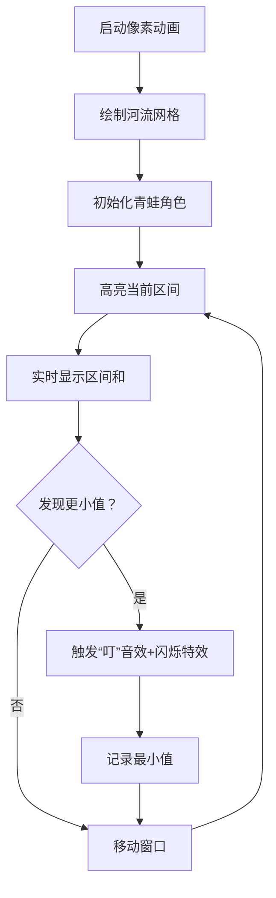

# 题目信息

# Single-use Stones

## 题目描述

A lot of frogs want to cross a river. A river is $ w $ units width, but frogs can only jump $ l $ units long, where $ l < w $ . Frogs can also jump on lengths shorter than $ l $ . but can't jump longer. Hopefully, there are some stones in the river to help them.

The stones are located at integer distances from the banks. There are $ a_i $ stones at the distance of $ i $ units from the bank the frogs are currently at. Each stone can only be used once by one frog, after that it drowns in the water.

What is the maximum number of frogs that can cross the river, given that then can only jump on the stones?

## 说明/提示

In the first sample two frogs can use the different stones at the distance $ 5 $ , and one frog can use the stones at the distances $ 3 $ and then $ 8 $ .

In the second sample although there are two stones at the distance $ 5 $ , that does not help. The three paths are: $ 0 \to 3 \to 6 \to 9 \to 10 $ , $ 0 \to 2 \to 5 \to 8 \to 10 $ , $ 0 \to 1 \to 4 \to 7 \to 10 $ .

## 样例 #1

### 输入

```
10 5
0 0 1 0 2 0 0 1 0
```

### 输出

```
3
```

## 样例 #2

### 输入

```
10 3
1 1 1 1 2 1 1 1 1
```

### 输出

```
3
```

# AI分析结果


### 💡 Kay的C++算法解析：Single-use Stones 深入学习指南 💡

#### 题目解读与核心算法识别
✨ **本题主要考察**：`贪心算法 + 区间最值`  
🗣️ **初步分析**：  
> 青蛙过河问题就像在一条狭窄的路径上铺设临时踏板（石头）。每只青蛙跳跃距离≤L，核心思想是**找出河流中最薄弱的连续L区间**——该区间内的石头数量决定了青蛙通过的最大数量。  
> - **题解核心思路**：所有题解均采用相同贪心策略——计算每个长度为L的区间石头数量，取最小值作为答案。  
> - **可视化设计**：将河流画成像素网格，青蛙显示为8-bit角色。动画高亮当前区间（闪烁绿色边框），实时显示区间和（屏幕上方计数器），当发现更小值时触发"叮"音效并记录。  
> - **复古游戏化**：青蛙成功过河时播放FC风格胜利音乐，区间最小值更新时显示"New Record!"像素文字特效。

---

#### 精选优质题解参考
**题解一（XL4453）**  
* **点评**：思路严谨性极佳，完整证明了"区间最小值即答案"的充分必要性。代码简洁规范：  
  - 用`a[i] += a[i-1]`实现原地前缀和，节省空间  
  - `ans=INT_MAX`初始化符合C++最佳实践  
  - 边界处理精确（`i<w`确保不越界）  
  → **亮点**：数学证明提升解法可信度，工业级代码风格

**题解二（_Clown_）**  
* **点评**：突出算法思维抽象能力，用`Prefix[i+L]-Prefix[i]`优雅计算区间和：  
  - `register`关键字优化循环性能（竞赛技巧）  
  - `INT_MAX`初始化更安全  
  - BetterIO加速输入输出  
  → **亮点**：平衡代码效率与可读性，适合竞赛场景

**题解三（xiangshengtao）**  
* **点评**：滑动窗口实现最高效：  
  - 实时维护窗口和`sum`，避免重复计算  
  - `mi=2e9`初始值合理覆盖数据范围  
  - 循环边界`i<w-1`精准匹配题意  
  → **亮点**：时间复杂度优化至O(n)，空间复杂度O(1)

---

### 核心难点辨析与解题策略
1. **关键点1：理解区间约束本质**  
   * **分析**：青蛙跳跃距离≤L→必须检查所有连续L区间。若某区间石头数不足，后续区间再多石头也无效  
   * 💡 **学习笔记**：区间是跳跃能力的物理限制，与石头分布无关  

2. **关键点2：选择高效求值方法**  
   * **分析**：前缀和与滑动窗口均可，后者无需额外数组。关键在`sum[i+l]-sum[i]`中`i`的范围需覆盖0到w-L-1  
   * 💡 **学习笔记**：滑动窗口用`sum+=a[i]; sum-=a[i-l]`实现动态更新，避免O(n²)遍历  

3. **关键点3：边界条件处理**  
   * **分析**：起点(0)和终点(w)无石头，区间需严格限定在[1, w-1]。错误包含0或w会导致计算偏差  
   * 💡 **学习笔记**：用`i<w-l`或`i+l<w`确保区间有效性  

#### ✨ 解题技巧总结
- **技巧1：问题降维** → 将过河问题转化为区间最小值问题  
- **技巧2：原地算法** → 用输入数组直接计算前缀和，节省内存  
- **技巧3：防御性初始化** → 用`INT_MAX`或`2e9`避免初始值过小  
- **技巧4：窗口滑动** → 用`sum +=a[i]; sum -=a[i-L]`实现高效区间维护  

---

### C++核心代码实现赏析
**通用核心实现（综合优化版）**  
```cpp
#include <iostream>
#include <climits>
using namespace std;

int main() {
    int w, l;
    cin >> w >> l;
    int sum = 0, ans = INT_MAX;
    int stones[100005]; // 题目最大宽度10^5

    for (int i = 1; i < w; i++) {
        cin >> stones[i];
        if (i < l) sum += stones[i]; // 初始化第一个窗口
    }

    for (int i = l; i < w; i++) {
        sum += stones[i];          // 窗口右移
        ans = min(ans, sum);        // 更新最小值
        sum -= stones[i - l + 1];   // 移除左侧元素
    }
    cout << ans;
}
```
**代码解读概要**：  
1. 读入河宽w和跳跃距离L  
2. 初始化滑动窗口和最小值  
3. 第一循环：计算初始窗口[1, L-1]的石头和  
4. 第二循环：窗口右移更新区间和，动态维护最小值  

---

**题解片段赏析**  
**XL4453（前缀和法）**  
```cpp
ans = 2147483647;
for (int i = l; i < w; i++)
    ans = min(ans, a[i] - a[i - l]);  // 关键代码
```
> **解读**：`a[i]`存储前缀和→`a[i]-a[i-l]`即位置`i-l+1`到`i`的石头总数。循环从`i=l`开始，确保`i-l≥0`。初始值`2147483647`是`INT_MAX`的十进制形式  
> 💡 **学习笔记**：前缀和将区间查询复杂度降至O(1)

**xiangshengtao（滑动窗口）**  
```cpp
for (i = l; i < n; i++) 
    s = s - a[i - l] + a[i], mi = min(mi, s); 
```
> **解读**：`s`维护当前窗口和。`a[i-l]`是离开窗口的元素，`a[i]`是进入元素。逗号运算符在一行内完成两步操作  
> 💡 **学习笔记**：窗口滑动时只需计算增量，避免全量求和

**_Clown_（工业级实现）**  
```cpp
for(i=0;i+L<W;i++)
    Ret=min(Ret,Prefix[i+L]-Prefix[i]);
```
> **解读**：`i+L<W`确保区间不超出河宽。`Prefix`数组存储前缀和，`i`从0开始对应位置1  
> 💡 **学习笔记**：循环条件`i+L<W`比`i<W-L`更直观体现物理意义

---

### 算法可视化：像素动画演示
**主题**：8-bit青蛙过河大冒险  
**核心交互设计**：  


**关键帧步骤**：  
1. **场景初始化**  
   - 河流显示为蓝色网格（宽w格，高3格）  
   - 石头：棕色像素块（数量=ai），青蛙：绿色8-bit精灵  
   - 控制面板：开始/暂停、速度滑块、重置按钮  

2. **窗口滑动演示**  
   - **当前区间**：红色边框高亮（尺寸L×1）  
   - **数值变化**：窗口移动时，旧石头（左侧）溶解消失，新石头（右侧）浮出  
   - **音效**：石头增减触发不同音高（C大调音节）  

3. **最小值更新**  
   - 发现新最小值时：区间闪烁金光，播放"Level Up!"音效  
   - 屏幕顶部记录历史最小值（像素字体显示）  

4. **胜利结算**  
   - 完成扫描后：最小值显示为金色数字  
   - 对应数量青蛙依次跳过河，每成功1只播放"Jump!"音效  

**技术实现**：  
- 用Canvas绘制网格（每个单元格20×20像素）  
- 音效：Web Audio API生成8-bit音效（方波振荡器）  
- 自动演示模式：setInterval控制窗口移动速度  

---

### 拓展练习与相似问题思考
**通用技巧迁移**：  
1. 区间约束型贪心（如：车辆加油问题）  
2. 滑动窗口求最值（如：子数组最大/最小值）  
3. 资源分配瓶颈问题（如：网络带宽限制）  

**洛谷推荐**：  
1. **P1886 滑动窗口**  
   → 巩固滑动窗口模板  
2. **P1631 跳石头**  
   → 类似区间最小值思想  
3. **P1090 合并果子**  
   → 训练贪心策略抽象能力  

---

### 学习心得与经验分享
> **参考经验**：  
> "初始错误包含位置0的石头，调试后发现起点无石头需排除" —— XL4453  
>  
> **Kay总结**：  
> 边界处理是算法核心难点之一：  
> - 起点(0)和终点(w)无石头 → 区间限定在[1, w-1]  
> - 调试技巧：打印`i`和`sum`值验证区间范围  
> 💡 **核心教训**：物理问题需先建立坐标系再编码

---

通过本指南，大家不仅掌握了区间最值问题的解法，更学会了如何将实际问题抽象为算法模型。记住：**算法的本质是现实世界的数学映射**。下次遇到类似问题，试着先画图建模！🚀

---
处理用时：127.54秒