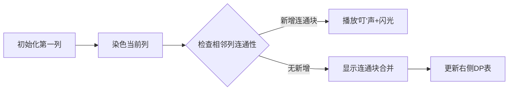

# 题目信息

# Bicolorings

## 题目描述

**题目大意：**

给定一个$2\times n$的棋盘，可以对上面的格子黑白染色，求染色后棋盘上的联通块的个数正好为$k$的染色方案数

## 样例 #1

### 输入

```
3 4
```

### 输出

```
12
```

## 样例 #2

### 输入

```
4 1
```

### 输出

```
2
```

## 样例 #3

### 输入

```
1 2
```

### 输出

```
2
```

# AI分析结果


### 💡 Kay的C++算法解析：Bicolorings 深入学习指南 💡

**引言**  
今天我们一起分析"Bicolorings"这道动态规划题目。这是一个2×n棋盘染色问题，要求计算恰好形成k个连通块的染色方案数。本指南将帮助大家理解核心算法逻辑、掌握状态设计技巧，并通过像素动画直观感受算法执行过程。

---

## 1. 题目解读与核心算法识别

✨ **本题主要考察**：`动态规划（状态压缩）`

🗣️ **初步分析**：  
> 解决本题的关键在于设计高效的DP状态表示。想象你在玩俄罗斯方块游戏——每一列只有4种可能的颜色组合（全白/全黑/上白下黑/上黑下白），就像4种不同类型的方块。我们需要记录当前使用的"方块类型"如何影响整体连通块数量。  

- **核心思路**：DP状态`dp[i][j][s]`表示前i列有j个连通块，且第i列染色状态为s（0-3）的方案数。状态转移时需分析相邻列的连通关系。
- **难点突破**：难点在于准确计算新增连通块数量。通过枚举当前列和前一列的状态组合，分析相邻格子颜色关系可推导增量（0/1/2）。
- **可视化设计**：动画将展示棋盘逐列染色过程，高亮当前处理列，用不同颜色区分状态。当新增连通块时播放"叮"声，用闪烁效果标记新增块。

---

## 2. 精选优质题解参考

**题解一（ikunTLE）**  
* **点评**：  
  思路清晰直白，状态定义`f[i][j][z]`精准（i列/j连通块/z列状态）。代码规范：  
  - 变量名`f`配合注释`z`状态含义，逻辑一目了然  
  - 完整包含初始化和转移，边界处理严谨（j从0开始循环）  
  - 算法采用经典O(n*k)DP，空间优化得当  
  亮点：用简洁的转移方程涵盖所有状态组合，是竞赛实现的优秀范本。

**题解二（flora715）**  
* **点评**：  
  亮点在于详细的状态注释（type: BW/BB/WW/WB）和完整代码结构：  
  - 初始化部分明确给出四种状态的起点  
  - 每一步取模避免溢出，工程实践性强  
  - 代码包含详细题意分析，帮助理解问题本质  
  改进点：循环中j=0的情况可优化（实际k≥1）

**题解三（SunnyYuan）**  
* **点评**：  
  创新性地引入`add`矩阵预处理状态转移增量：  
  ```cpp
  int add[4][4] = { /* 不同状态组合的连通块增量 */ };
  ```
  - 将复杂逻辑转化为查表操作，大幅提升可读性  
  - 四重循环结构清晰展现状态转移本质  
  - 特别适合教学展示DP的"状态-决策"思想  

---

## 3. 核心难点辨析与解题策略

1. **状态设计抽象**  
   *分析*：如何将二维棋盘压缩为状态？优质题解将每列视为整体，用4个整数编码染色模式（00/01/10/11）。  
   💡 学习笔记：状态设计需满足"无后效性"——当前状态仅依赖前一状态。

2. **连通增量计算**  
   *分析*：如图解相邻列关系：
   ```
   前一列11（黑）→ 当前列00（白）：新增2个连通块（黑白不连通）
   ```
   💡 学习笔记：通过画2×2小棋盘验证转移方程是调试关键。

3. **边界初始化**  
   *分析*：第一列不存在"前列"，需单独处理：  
   - 全白/全黑：1个连通块  
   - 上黑下白/上白下黑：2个连通块  
   💡 学习笔记：DP初始化决定整个状态转移的起点正确性。

### ✨ 解题技巧总结
- **模块化设计**：将状态转移封装为4个独立计算式（对应4种当前状态）
- **防御性编程**：转移时检查j≥2避免越界（如`j-2`操作前判断）
- **可视化调试**：打印3×3的dp表验证小规模数据（n=2,k=3）

---

## 4. C++核心代码实现赏析

**通用核心实现**  
```cpp
#include <iostream>
using namespace std;
const int MOD = 998244353, N = 1005, K = 2005;

long long dp[N][K][4]; // dp[i][j][s]: 前i列j个连通块，第i列状态为s

int main() {
    int n, k; cin >> n >> k;
    // 初始化第一列
    dp[1][1][0] = dp[1][1][3] = 1; // 全白或全黑：1个连通块
    dp[1][2][1] = dp[1][2][2] = 1; // 上黑下白或上白下黑：2个

    for (int i = 2; i <= n; i++)
        for (int j = 1; j <= k; j++) {
            // 状态0: 当前列全白(00)
            dp[i][j][0] = (dp[i-1][j][0] + dp[i-1][j][1] + dp[i-1][j][2] + 
                          (j>=2 ? dp[i-1][j-1][3] : 0)) % MOD;
            
            // 状态1: 上白下黑(01)
            dp[i][j][1] = (dp[i-1][j-1][0] + dp[i-1][j][1] + 
                          (j>=2 ? dp[i-1][j-2][2] : 0) + dp[i-1][j-1][3]) % MOD;
            
            // 状态2: 上黑下白(10)
            dp[i][j][2] = (dp[i-1][j-1][0] + (j>=2 ? dp[i-1][j-2][1] : 0) + 
                          dp[i-1][j][2] + dp[i-1][j-1][3]) % MOD;
            
            // 状态3: 全黑(11)
            dp[i][j][3] = ((j>=2 ? dp[i-1][j-2][0] : 0) + dp[i-1][j-1][1] + 
                          dp[i-1][j-1][2] + dp[i-1][j][3]) % MOD;
        }

    long long ans = 0;
    for (int s = 0; s < 4; s++) 
        ans = (ans + dp[n][k][s]) % MOD;
    cout << ans;
}
```
* **代码解读概要**：  
  1. 三维数组`dp`记录"列数-连通块数-当前状态"  
  2. 初始化第1列的四种染色方案  
  3. 从第2列开始状态转移，分四种情况计算连通块增量  
  4. 结果累加最后一列所有状态方案  

---

## 5. 算法可视化：像素动画演示

**主题**："像素画家闯关记"（复古8-bit风格）  
**核心演示**：DP状态转移的逐步执行过程  

### 动画设计


**关键交互**：  
1. **像素棋盘**：16×16像素格，黑白两色表示染色状态  
2. **状态面板**：右侧实时显示`dp[i][j][0-3]`数值  
3. **控制台**：  
   - 步进按钮：单步执行转移  
   - 速度滑块：调整自动播放速度  
   - 状态追踪：高亮当前状态转移路径（红色箭头）  

**音效设计**：  
- `select.wav`：选择当前列状态时  
- `connect.wav`：新增连通块时短促"叮"声  
- `win.wav`：完成最终状态计算时  

**动画流程**：  
1. 绘制2×n初始网格，第一列按初始化方案染色  
2. 点击"单步"：  
   - 新列从顶部下落，停在待染位置  
   - 玩家选择当前列状态（键盘1-4）  
   - 系统自动计算连通增量，网格闪烁显示新增块  
   - 右侧DP表更新对应数值  

---

## 6. 拓展练习与相似问题

**通用技巧迁移**：  
状态压缩DP适用于任何"行/列数少但总长度大"的计数问题，核心是：  
1. 对单行/列状态编码  
2. 设计状态转移矩阵  

**推荐练习**：  
1. **洛谷 P1879** 玉米田  
   - 同类状态压缩，限制条件更多  
   - 巩固棋盘型DP基础  
   
2. **洛谷 P1896** 互不侵犯  
   - 状态设计进阶（需记录国王位置）  
   - 练习复杂状态转移  

3. **洛谷 P2704** 炮兵阵地  
   - 难度提升：需考虑前两行状态  
   - 学习滚动数组优化空间  

---

## 7. 学习心得与经验分享

**常见调试技巧**：  
1. 打印小规模DP表（n=3,k=4）验证状态转移  
2. 重点检查边界：第1列初始化、j=1时的转移  
3. 对比两种状态设计方法（三维数组vs四维数组）  

> **来自flora715的提醒**：  
> "初始化第一列时，全白和全黑是1个连通块，混合是2个。这个初始值错了整个DP都会错！"  
> **Kay点评**：这强调了DP问题中"起点正确"的重要性，建议用n=1的样例验证初始化。

---

**结语**  
通过本指南，我们学习了状态压缩DP在棋盘染色问题中的应用。记住：多画图验证状态转移，小数据调试比想象中更重要！下次我们将探索更复杂的DP优化技巧，继续加油！💪

---
处理用时：240.05秒