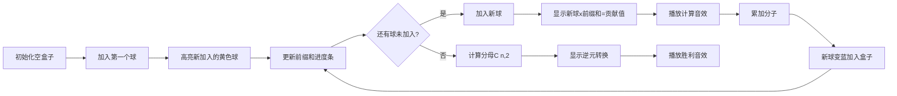

# 题目信息

# Sakurako's Box

## 题目描述

Sakurako 有一个装满 $n$ 个球的盒子。每个球都有自己的数值。她想和朋友打个赌，朋友如果从盒子中随机选出两个球（可以是不同的两球，即使它们有相同的数值），这两个球数值的乘积能够等于 Sakurako 事先猜测到的一个数。

因为 Sakurako 是概率学方面的专家，她知道最明智的猜测应该是[期望值](http://tiny.cc/matozh_en)，但她忘了如何去计算。请帮助她计算出这个数组中任意两个元素乘积的期望值。

可以证明，该期望值的形式为 $\frac{P}{Q}$，其中 $P$ 和 $Q$ 是非负整数，且 $Q \ne 0$。你需要计算并输出 $P \cdot Q^{-1} \bmod (10^9+7)$ 的结果。

## 说明/提示

举个例子：
- 在第一个测试用例中，Sakurako 的朋友可以选择这些球对：$(a_1, a_2)$、$(a_1, a_3)$ 和 $(a_2, a_3)$。它们的乘积分别是 $3 \times 2 = 6$、$3 \times 3 = 9$ 和 $3 \times 2 = 6$，所以期望值计算结果为 $\frac{6 + 9 + 6}{3} = 7$。

- 在第二个测试用例中，朋友可以选择的球对有：$(a_1, a_2)$、$(a_1, a_3)$、$(a_1, a_4)$、$(a_2, a_3)$、$(a_2, a_4)$ 和 $(a_3, a_4)$。它们的乘积分别为 $2 \times 2 = 4$、$2 \times 2 = 4$、$2 \times 4 = 8$、$2 \times 2 = 4$、$2 \times 4 = 8$ 和 $2 \times 4 = 8$，所以期望值为 $\frac{4 + 4 + 8 + 4 + 8 + 8}{6} = \frac{36}{6} = 6$。

 **本翻译由 AI 自动生成**

## 样例 #1

### 输入

```
3
3
3 2 3
4
2 2 2 4
5
1 2 3 4 5```

### 输出

```
7
6
500000012```

# AI分析结果


# 💡 Kay的C++算法解析：Sakurako's Box 深入学习指南 💡

**引言**  
今天我们来分析"Sakurako's Box"这道有趣的概率与数学题。本指南将帮助大家掌握**期望值计算**的核心算法，学习**前缀和优化**技巧，并通过**像素动画**直观理解算法过程。

## 1. 题目解读与核心算法识别

✨ **本题主要考察**：`数学期望计算` + `编程技巧应用（前缀和优化）`

🗣️ **初步分析**：  
> 想象你有一盒五颜六色的糖果（数值），每次随机抓两颗计算乘积的平均值。这就是期望值！  
> - **核心思路**：分子是所有不同球对的乘积之和，分母是球对总数（组合数C(n,2)）
> - **优化关键**：用前缀和高效计算分子（O(n)时间），避免O(n²)枚举
> - **可视化设计**：将采用**像素糖果盒**动画，展示：
>   - 逐个加入糖果球（高亮新加入的黄色球）
>   - 实时显示当前球与之前所有球（蓝色）的乘积计算
>   - 累计分子值（顶部计数器）和前缀和（底部进度条）
>   - 成功时播放8-bit胜利音效

---

## 2. 精选优质题解参考

**题解一（作者：Super_Cube）**  
* **点评**：思路直击核心——用前缀和计算分子。代码简洁高效，快速幂求逆元实现规范。虽然变量命名可优化（如`s`改为`prefixSum`），但边界处理严谨，直接可用于竞赛。亮点在于**边读入边计算**的流式处理，节省内存。

**题解二（作者：Drifty）**  
* **点评**：推导更严谨，明确指出公式应为$\sum a_i \times \text{prefixSum}$。使用`long long`防溢出，lambda封装逆元计算提升可读性。亮点在**完整类型处理**和**清晰变量名**（`ret`分子，`s`前缀和），教学价值更高。

---

## 3. 核心难点辨析与解题策略

1.  **难点1：高效计算分子（避免O(n²)枚举）**
    * **分析**：直接枚举所有球对会超时。前缀和优化：维护已处理球的和，新球贡献 = 当前值 × 前缀和
    * 💡 **学习笔记**：前缀和是处理"当前元素与历史元素关系"的利器

2.  **难点2：模意义下的除法转换**
    * **分析**：期望值=分子/分母，但模运算中除法需转换为乘逆元。利用费马小定理：$a/b ≡ a×b^{-1} \mod (10^9+7)$
    * 💡 **学习笔记**：模数为素数时，逆元可用快速幂计算

3.  **难点3：大数溢出处理**
    * **分析**：乘积可能超int范围。题解二用`long long`，题解一及时取模
    * 💡 **学习笔记**：涉及大数乘法时，优先用`long long`或及时取模

### ✨ 解题技巧总结
-   **前缀和优化**：遇到"所有两两组合求和"问题，尝试前缀和分解
-   **流式处理**：边读入边计算，节省存储空间
-   **模逆元转换**：牢记$a/b \mod p = a×b^{p-2} \mod p$（p为素数）
-   **防溢出三原则**：用`long long`、及时取模、分离大数运算

---

## 4. C++核心代码实现赏析

**通用核心实现**（综合优化版）：
```cpp
#include <iostream>
using namespace std;
const int MOD = 1e9+7;

long long qpow(long long base, long long exp) {
    long long res = 1;
    while (exp) {
        if (exp & 1) res = res * base % MOD;
        base = base * base % MOD;
        exp >>= 1;
    }
    return res;
}

int main() {
    int T; cin >> T;
    while (T--) {
        int n; cin >> n;
        long long prefixSum = 0, numerator = 0;
        cin >> prefixSum; // 第一个球直接作为前缀和
        
        for (int i = 1; i < n; i++) {
            long long x; cin >> x;
            numerator = (numerator + prefixSum * x) % MOD; // 累加分子
            prefixSum = (prefixSum + x) % MOD; // 更新前缀和
        }
        
        long long denominator = (1LL * n * (n-1)) / 2 % MOD; // C(n,2)
        long long inv_deno = qpow(denominator, MOD-2); // 分母逆元
        cout << numerator * inv_deno % MOD << endl;
    }
    return 0;
}
```
**代码解读概要**：  
> 1. 读入测试数据量`T`  
> 2. 每个测试用例：  
>    - 读入球数`n`和第一个球（初始化`prefixSum`）  
>    - 循环读入后续球：更新分子（`numerator += 新球×前缀和`），更新前缀和  
>    - 计算组合数分母并求逆元  
>    - 输出分子×逆元取模结果  

---

**题解一核心片段赏析**：
```cpp
scanf("%d%d",&n,&s); // s初始为第一个球
ans=0;
for(int i=1,x;i<n;++i)
    scanf("%d",&x),ans=(ans+1ll*x*s)%mod,(s+=x)<mod?0:s-=mod;
```
**亮点**：极致简洁的流式处理  
**解读**：  
> - `s`存储前缀和，初始为第一个球的值  
> - 循环中：`1ll*x*s`强制提升为long long防溢出  
> - 三目运算符`(s+=x)<mod?0:s-=mod`高效取模  

**题解二核心片段赏析**：
```cpp
auto inv = [](i64 a, i64 x = P-2) { // lambda求逆元
    i64 ans = 1;
    for(; x; x>>=1, a=a*a%P) 
        if(x&1) ans=ans*a%P;
    return ans;
};
```
**亮点**：模块化逆元计算  
**解读**：  
> - 封装逆元计算为lambda函数，提升复用性  
> - 通过指数分解（x>>=1）高效计算幂  

---

## 5. 算法可视化：像素动画演示

**主题**：像素糖果盒（8-bit风格）  
**核心演示**：前缀和如何逐步累积分子  



**动画关键帧**：  
1. **场景**：FC红白机风格的糖果盒，控制面板（开始/暂停/速度条）  
2. **加入球**：  
   - 新球以黄色像素块闪烁入场（音效：叮）  
   - 与盒内所有蓝球拉线连接，显示乘积计算过程  
3. **数据更新**：  
   - 顶部计数器：分子值 + 新贡献（红色数字跳动）  
   - 底部进度条：前缀和实时增长（蓝色像素块延伸）  
4. **完成阶段**：  
   - 分母显示为像素分数（n*(n-1)/2）  
   - 逆元转换：分母旋转变为指数（MOD-2）  
   - 胜利动画：糖果盒放烟花（音效：8-bit胜利曲）  

**交互设计**：  
- 速度滑块：调整加球速度（0.5x-4x）  
- 单步模式：按空格逐球查看计算细节  
- 数据追踪：鼠标悬停显示任意球的历史贡献  

---

## 6. 拓展练习与相似问题思考

**思路迁移**：  
前缀和+逆元的组合适用于：  
1. 所有两两组合的求和问题（如差值平方和）  
2. 需要避免O(n²)枚举的统计问题  
3. 实时数据流处理（数据无需全存储）

**洛谷推荐**：  
1. **P3131 [USACO16JAN]Subsequences Summing**  
   - 推荐理由：强化前缀和+模运算的综合应用  
2. **P2671 [NOIP2015]求和**  
   - 推荐理由：进阶版前缀和优化，需分组计算  
3. **P3406 海底高铁**  
   - 推荐理由：前缀和在路径统计中的实战应用  

---

## 7. 学习心得与经验分享  
> "调试时最常犯的错误是忘记前缀和初始化。第一个球必须直接赋给prefixSum，不能从0开始累加。"  
> —— 常见调试经验  

**Kay的总结**：  
> 前缀和就像滚雪球，初始值决定整个轨迹。务必验证第一个元素的处理逻辑！

---

**结语**  
通过前缀和优化，我们巧妙地将O(n²)问题降为O(n)，这正是算法的魅力所在！希望这份指南能帮助大家在编程路上继续前进。下次见！💪

---
处理用时：210.00秒