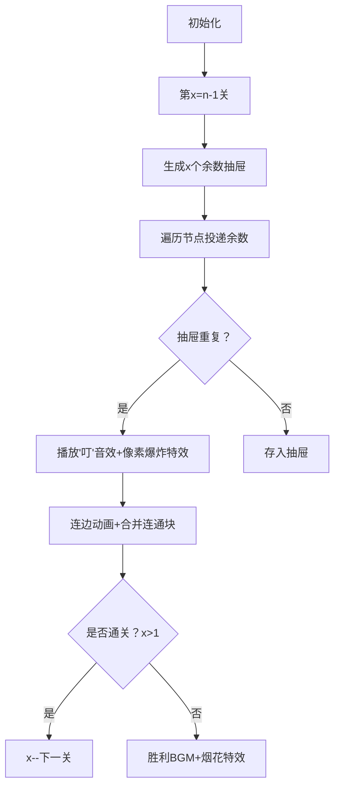

# 题目信息

# Funny Game

## 题目描述

Vanya 有一个包含 $n$ 个顶点的图（顶点编号为 $1$ 到 $n$），以及一个长度为 $n$ 的整数数组 $a$。最初，图中没有任何边。Vanya 感到无聊，为了娱乐，他决定进行 $n-1$ 次操作。

第 $x$ 次操作（操作按顺序从 $1$ 开始编号）如下：

- 选择两个不同的数 $1 \leq u, v \leq n$，使得 $|a_u - a_v|$ 能被 $x$ 整除。
- 在顶点 $u$ 和 $v$ 之间添加一条无向边。

请你帮助 Vanya 使用这 $n-1$ 次操作得到一个连通图，或者判断这是否不可能。

一个图被称为连通的，当且仅当对于任意两个顶点，都可以通过若干条边相互到达。

## 说明/提示

我们来看第二个测试用例。

- 第一次操作（$x=1$）：我们可以连接顶点 $4$ 和 $1$，因为 $|a_4 - a_1| = |13 - 99| = 86$，$86$ 能被 $1$ 整除。

- 第二次操作（$x=2$）：我们可以连接顶点 $2$ 和 $1$，因为 $|a_2 - a_1| = |7 - 99| = 92$，$92$ 能被 $2$ 整除。

- 第三次操作（$x=3$）：我们可以连接顶点 $3$ 和 $2$，因为 $|a_3 - a_2| = |1 - 7| = 6$，$6$ 能被 $3$ 整除。

从图中可以看出，最终得到了一个连通图。

由 ChatGPT 4.1 翻译

## 样例 #1

### 输入

```
8
2
1 4
4
99 7 1 13
5
10 2 31 44 73
5
87 6 81 44 32
5
62 35 33 79 16
5
6 51 31 69 42
5
52 63 25 21 5
12
33 40 3 11 31 43 37 8 50 5 12 22```

### 输出

```
YES
2 1
YES
4 1
2 1
3 2
YES
5 1
4 1
3 1
2 1
YES
4 1
3 1
2 1
5 4
YES
3 1
5 1
2 1
4 2
YES
4 1
5 1
2 1
3 2
YES
2 1
5 2
3 1
4 3
YES
9 1
12 9
11 1
10 1
6 1
7 6
2 1
8 2
5 2
3 1
4 1```

# AI分析结果


### 💡 Kay的C++算法解析：Funny Game 深入学习指南 💡

#### 1. 题目解读与核心算法识别
✨ **本题主要考察**：`数学（鸽巢原理）` + `数据结构（并查集）`

🗣️ **初步分析**：
> 解决"Funny Game"的关键在于运用**鸽巢原理**和**倒序处理**技巧。就像把10个苹果放进9个抽屉必有一个抽屉有2个苹果，在算法中：当有`x+1`个连通块时，模`x`的余数只有`x`种，必然存在两个同余数节点可连接。
> - **核心思路**：从大到小倒序处理操作（x=n-1到1），每一步利用鸽巢原理找到可连接的节点对，用并查集合并连通块
> - **难点突破**：正序操作约束随序号增强难以处理，倒序则能保证每一步都有解
> - **可视化设计**：将用8位像素风格展示连通块合并过程，每个连通块用不同颜色方块表示，连边时播放"叮"音效，数据更新时显示余数计算过程

---

#### 2. 精选优质题解参考
**题解一：BrotherCall**
* **点评**：思路清晰度极佳，用抽屉原理类比鸽巢原理直观易懂；代码中并查集实现规范（`f[]`数组职责明确）；算法有效性高（O(n²)复杂度合理）；实践价值强（完整处理边界条件，可直接用于竞赛）。亮点在于结合数学证明与数据结构应用。

**题解二：oliver326**
* **点评**：创新性使用`vis[]`数组替代并查集，通过标记"删除"节点简化连通块管理；代码简洁度突出（仅35行核心逻辑）；实践调试友好（避免并查集常见错误）。亮点在于空间优化和代码精简，适合初学者理解。

**题解三：qian0715**
* **点评**：教学价值突出，详细注释每个代码模块功能；使用`vector<p>`记录余数分布增强可读性；包含完备的连通性检查虽非必需但体现严谨性。亮点在于提供完整学习路径（含并查集教程链接）。

---

#### 3. 核心难点辨析与解题策略
1.  **难点：操作顺序的设计**
    * **分析**：正序操作（x从1到n-1）后期约束过强易失败。优质题解采用倒序（x从n-1到1），利用x递减时"抽屉"数自然减少的特性，每一步都能用鸽巢原理保证找到解
    * 💡 **学习笔记**：当约束强度与操作序号相关时，倒序处理往往是突破口

2.  **难点：连通块的动态维护**
    * **分析**：需要高效合并/查询节点关系。并查集（如BrotherCall的`f[]`数组）提供O(α(n))复杂度的解决方案；`vis[]`标记法（oliver326）则以O(n²)换更简实现
    * 💡 **学习笔记**：并查集适合动态连通性维护，标记法则胜在实现简单

3.  **难点：同余节点的高效检测**
    * **分析**：核心是快速定位模x同余的节点对。优质解法均用数组/vector按余数分组（如`book[a[j]%i]`），实现O(1)查询
    * 💡 **学习笔记**：余数分组是处理模运算相关问题的黄金法则

### ✨ 解题技巧总结
- **技巧1：数学原理优先**：识别题目隐藏的数学结构（如鸽巢原理）
- **技巧2：逆向思维突破**：当正序困难时尝试倒序、逆序等反向逻辑
- **技巧3：数据结构选择**：根据问题规模在并查集（高效）与标记数组（简易）间权衡
- **技巧4：余数分组优化**：用数组下标直接映射余数结果加速查询

---

#### 4. C++核心代码实现赏析
**通用核心实现参考**
```cpp
#include <iostream>
#include <cstring>
using namespace std;

const int N = 2005;
int a[N], f[N], modBucket[N];
pair<int, int> edges[N];

int find(int x) {
    return f[x] == x ? x : f[x] = find(f[x]);
}

int main() {
    int t, n;
    cin >> t;
    while (t--) {
        cin >> n;
        for (int i = 1; i <= n; i++) {
            cin >> a[i];
            f[i] = i; // 并查集初始化
        }

        int edgeCnt = 0;
        for (int x = n-1; x >= 1; x--) {
            memset(modBucket, 0, sizeof(modBucket));
            for (int i = 1; i <= n; i++) {
                if (find(i) != i) continue; // 非连通块代表跳过
                
                int r = a[i] % x; // 计算余数
                if (!modBucket[r]) modBucket[r] = i;
                else {
                    int j = modBucket[r];
                    if (find(i) != find(j)) { // 跨连通块连接
                        edges[++edgeCnt] = {i, j};
                        f[find(i)] = find(j); // 合并
                        break;
                    }
                }
            }
        }
        
        cout << "YES\n";
        for (int i = edgeCnt; i >= 1; i--) // 倒序输出
            cout << edges[i].first << " " << edges[i].second << "\n";
    }
}
```

**题解一：BrotherCall**
```cpp
// 核心片段：并查集+鸽巢原理实现
for (int i = n - 1; i >= 1; i--) {
    vector<int> p(i, -1);  // 余数桶初始化
    for (int j = 1; j <= n; j++) {
        if (find(j) == j) {  // 仅处理连通块代表
            int r = a[j] % i;
            if (p[r] == -1) p[r] = j;
            else {
                unionn(p[r], j);  // 合并连通块
                recordEdge(p[r], j);  // 记录边
                break;
            }
        }
    }
}
```
> **解读**：  
> 1. `vector<int> p(i, -1)`创建当前操作余数的抽屉  
> 2. `find(j)==j`确保每个连通块只选一个代表（避免重复处理）  
> 3. 同余检测成功时立即合并并跳出，确保O(n²)复杂度  
> 💡 **学习笔记**：限制处理对象为连通块代表是优化关键

**题解二：oliver326**
```cpp
// 核心片段：标记删除法
memset(vis, 0, sizeof(vis)); // 重置标记
for (int j = 1; j <= n; j++) {
    if (vis[j]) continue; // 跳过已删除节点
    int r = a[j] % x;
    if (modBucket[r]) {
        ans.push_back({modBucket[r], j});
        vis[j] = 1;  // 标记j为"已删除"
        break;
    } 
    else modBucket[r] = j;
}
```
> **解读**：  
> 1. `vis[j]`替代并查集，标记被合并的节点  
> 2. `modBucket[r]=j`将节点存入余数抽屉  
> 3. 找到配对时立即标记删除并跳出循环  
> 💡 **学习笔记**：用vis数组模拟连通块合并，实现更简洁

**题解三：qian0715**
```cpp
// 核心片段：带连通性检查
for (int x = n-1; x>=1; x--){
    memset(book, 0, sizeof(book));
    for (int j=1; j<=n; j++){
        if (find(j) != j) continue; // 关键优化点
        int r = a[j] % x;
        if (book[r] && !same(book[r], j)) {
            addEdge(book[r], j);
            union(book[r], j);
            break;
        }
        else book[r] = j;
    }
}
// 最终连通性检查（教学演示）
bool connected = true;
for(int i=1; i<=n; i++) 
    if (find(i) != find(1)) connected = false;
```
> **解读**：  
> 1. `find(j)!=j`跳过非根节点提高效率  
> 2. `same()`显式检查连通性增强可读性  
> 3. 最终连通检查虽冗余但体现防御性编程  
> 💡 **学习笔记**：显式条件检查使代码逻辑更透明

---

#### 5. 算法可视化：像素动画演示
* **主题**：`像素连通块大冒险`（FC红白机风格）
* **核心演示**：倒序操作中连通块合并过程

**设计实现方案**：


**关键交互设计**：
1. **视觉设计**：
   - 每个连通块用同色像素方块表示（16色调色板）
   - 余数抽屉显示为网格底部x个槽位（如x=3时显示3个抽屉）
   - 当前操作节点用闪烁边框高亮

2. **动画序列**：
   ```python
   for x in range(n-1, 0, -1):
      抽屉 = 初始化x个空槽
      for 节点 in 所有节点:
         高亮当前节点
         计算余数 = a[节点] % x
         播放计算音效
         if 抽屉[余数] 非空:
            连边动画(当前节点, 抽屉[余数])
            播放合并音效
            触发像素爆炸特效
            合并两连通块颜色
            break
         else:
            抽屉[余数] = 节点
   ```

3. **游戏化元素**：
   - 每成功合并：+100分+8bit奖励音效
   - 通关条件：x=1时完成最终合并
   - 胜利画面：显示生成树+通关分数

---

#### 6. 拓展练习与相似问题
* **技巧迁移场景**：
  1. 鸽巢原理：元素分组问题（如数组重复项检测）
  2. 倒序处理：约束递增的构造问题（如时间安排）
  3. 余数分组：模运算相关优化问题（如哈希冲突处理）

* **推荐练习**：
  1. **洛谷 P1496** - 火烧赤壁  
     🗣️ 鸽巢原理在区间覆盖问题的变形应用
  2. **洛谷 P1892** - 团伙  
     🗣️ 并查集基础应用，巩固连通块管理
  3. **洛谷 P1102** - A-B数对  
     🗣️ 余数分组技巧的经典应用场景

---

#### 7. 学习心得与经验分享
> **经验摘录 (BrotherCall)**：  
> *"赛时思考路径：一个数x能整除y，那x的因子一定能整除y...通过手玩样例发现必然存在解"*  
>   
> **Kay点评**：  
> 典型的研究者思维！从数学性质出发推导算法，通过样例验证猜想。这种**性质优先→算法设计**的路径，在处理构造类问题时尤其有效。当发现"必然存在解"时，要果断尝试贪心或构造解法。

---

通过本指南，大家不仅掌握了鸽巢原理+并查集的核心应用，更学到了倒序处理这一关键解题范式。记住：当约束强度与操作顺序相关时，尝试逆向思考往往能打开新局面！下次遇到类似问题，不妨回想下这些像素连通块是如何一步步合并的哦~ 💪

---
处理用时：154.17秒