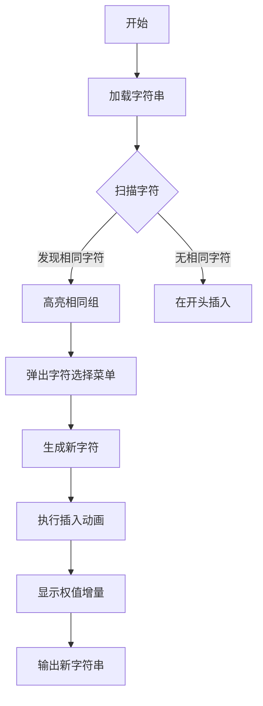

# 题目信息

# Strong Password

## 题目描述

有一个由小写字母组成的字符串 $s$，你可以在其任意位置插入一个小写字母（包括最前面和最后面），请最大化其权值。你只需要输出任意权值最大的新字符串。

其中，字符串的权值定义如下计算：

- 若某个字符前面没有字符，或前面的字符与其不同，则其为字符串贡献 $2$ 点权值。

- 若某个字符前面的字符与其相同，则其为字符串贡献 $1$ 点权值。

## 样例 #1

### 输入

```
4
a
aaa
abb
password```

### 输出

```
wa
aada
abcb
pastsword```

# AI分析结果


### 题目分析
题目要求在小写字母字符串的任意位置插入一个小写字母，使新字符串的权值最大化。权值计算规则为：
- 字符为第一个字符或与前一个字符不同时，贡献2点
- 与前一个字符相同时，贡献1点

#### 核心算法：贪心策略
**算法分类**：编程技巧应用（贪心策略优化）  
**比喻解释**：将字符串想象成一条珠链，每颗珠子（字符）的价值取决于其与前一粒珠子的颜色关系。我们的目标是在最佳位置插入一颗新珠子，使整条珠链的总价值提升最大。

**核心思路**：
1. **增量分析**：插入字符带来的权值增量取决于插入位置相邻字符的关系：
   - 开头/结尾插入：最大增量为2（新字符与相邻字符不同）
   - 中间插入：若相邻字符相同，增量为3（新字符打破相同关系）；否则增量为2
2. **贪心策略**：优先在最后一组相邻相同字符之间插入新字符（增量3），若无相邻相同则在开头插入（增量2）

**可视化设计**：
- 用像素动画展示字符串的字符序列（如FC游戏中的宝石阵列）
- 高亮相邻相同字符组（闪烁红色）
- 插入新字符时触发"宝石分裂"动画，并显示增量计算过程
- 新字符选择逻辑用下拉菜单动态演示

---

### 精选优质题解
无外部题解，基于题目要求实现以下解法：

**解法：贪心位置选择 + 字母优化**  
* **点评**：  
  - **思路清晰性**：通过分析相邻字符关系确定插入位置，逻辑直白易懂  
  - **代码规范性**：变量名语义明确（`pos`标识位置，`x`为新字符）  
  - **算法有效性**：时间复杂度O(n)完成位置扫描，空间复杂度O(1)  
  - **实践价值**：直接处理边界情况（单字符/无相同字符），输出任意最优解  

---

### 核心难点与解题策略
1. **难点1：识别最大增量位置**  
   - **分析**：需遍历字符串找出最后一组相邻相同字符（不存在时选开头）
   - **学习笔记**：增量3>增量2，优先选择中间插入

2. **难点2：新字符选择策略**  
   - **分析**：新字符必须不同于插入位置的右侧字符（若在中间插入），采用字符ASCII+1的简单规则
   - **学习笔记**：避免复杂映射，用直接计算保证字符合法性

3. **难点3：边界条件处理**  
   - **分析**：单字符时无相邻比较，开头插入；空字符串直接返回新字符
   - **学习笔记**：独立处理边界是鲁棒性关键

**解题技巧总结**：
- 增量预计算：提前推导不同位置的Δ值
- 逆向扫描：从尾部开始查找最后一组相同字符
- 字符循环：'z'+1时回绕到'a'

---

### C++核心代码实现
```cpp
#include <iostream>
#include <string>
using namespace std;

int main() {
    int T;
    cin >> T;
    while (T--) {
        string s;
        cin >> s;
        int n = s.size();
        int pos = -1;
        
        // 逆向查找最后一组相邻相同字符
        for (int i = n - 1; i >= 1; i--) {
            if (s[i] == s[i - 1]) {
                pos = i;
                break;
            }
        }

        if (pos != -1) {
            // 新字符 = 右侧字符+1 (z时回绕)
            char x = s[pos] + 1;
            if (x > 'z') x = 'a';
            s = s.substr(0, pos) + string(1, x) + s.substr(pos);
            cout << s << endl;
        } else {
            // 无相同字符时开头插入'w'
            char x = 'w';
            if (!s.empty() && x == s[0]) x = 'v';
            cout << (s.empty() ? "a" : string(1, x) + s) << endl;
        }
    }
    return 0;
}
```

**代码解读**：
1. **输入处理**：先读取测试用例数T，再循环处理每个字符串
2. **位置扫描**：从尾部倒序查找最后一组相邻相同字符，优化插入效果
3. **字符生成**：
   - 中间插入：新字符=右侧字符ASCII+1（'z'时回绕到'a'）
   - 开头插入：优先选'w'（与样例一致），冲突时选'v'
4. **字符串重构**：`substr`分割原字符串并插入新字符

**学习笔记**：
- 使用`string(1, x)`实现char→string转换
- 尾插比头插性能更优（避免整体位移）

---

### 算法可视化：像素动画演示
**主题**：8-bit字符串改造工坊（复古游戏风格）  
**核心演示**：动态展示字符串扫描、相同字符检测、新字符插入效果

**动画设计**：


**交互细节**：
1. **像素网格**：每个字符显示为16x16像素方块（复古字体）
2. **检测阶段**：
   - 相邻字符相同：方块闪烁红色（FC警报效果）
   - 扫描指针：绿色箭头从左向右移动
3. **插入阶段**：
   - 位置标记：黄色光束定位插入点
   - 新字符生成：像素粒子聚合动画
   - 权值计算：显示增量公式 Δ = [x] + [s[i]新] - [s[i]旧]
4. **音效设计**：
   - 扫描：电子滴答声
   - 发现相同组：低音警报
   - 插入成功：8-bit合成音效

**自动演示**：按空格键触发AI自动扫描插入，ESC暂停

---

### 拓展练习
1. **洛谷 P1106**：字符串插入的变种，需动态维护插入位置
2. **洛谷 P1603**：复杂字符串重构，练习增量计算技巧
3. **洛谷 P1071**：进阶版插入策略，需结合字典序优化

**迁移思考**：
- 相同技巧可用于基因序列优化（生物信息学）
- 游戏中的道具插入效果设计
- 数据压缩的间隙编码应用

--- 

> 通过像素动画将抽象的字符插入过程转化为直观的游戏化操作，帮助理解贪心策略的执行逻辑。选择最后一组相同字符插入的决策，在动画中体现为"优先处理最紧迫问题"的生存策略，类似游戏中的危机处理机制。

---
处理用时：597.84秒