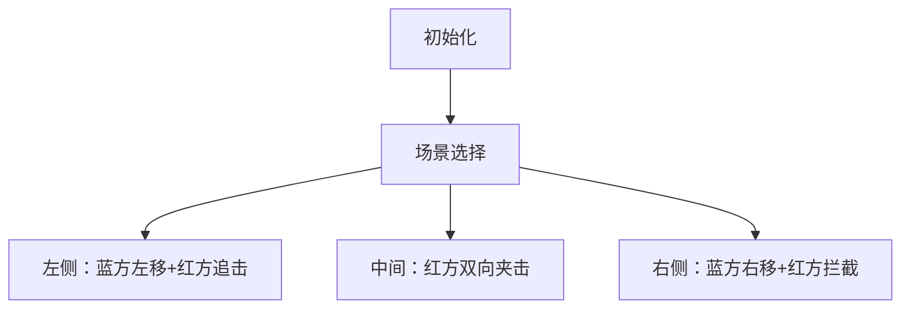

# 题目信息

# The Strict Teacher (Easy Version)

## 题目描述

这是该问题的简单版本。两个版本的唯一区别在于 $m$ 和 $q$ 的约束条件。在本版本中，$m=2$，$q=1$。只有在两个版本都被解决后，你才能进行 hack。

Narek 和 Tsovak 忙于准备本轮比赛，所以他们没能完成作业，决定偷看 David 的作业。他们严格的老师发现 David 没有作业，现在想要惩罚他。她雇佣了其他老师来帮助她抓住 David。现在有 $m$ 位老师一起追赶他。幸运的是，教室很大，所以 David 有很多地方可以藏身。

教室可以表示为一条一维直线，包含从 $1$ 到 $n$ 的格子。

一开始，所有 $m$ 位老师和 David 都在不同的格子里。然后他们开始轮流移动。每一轮移动中：

- David 可以移动到相邻的格子，或者留在原地。
- 然后，$m$ 位老师每个人可以同时移动到相邻的格子，或者留在原地。

这个过程持续到 David 被抓住为止。如果有任意一位老师（可能不止一位）和 David 处于同一个格子，那么 David 就被抓住了。所有人都能看到彼此的移动，因此他们都会采取最优策略。

你的任务是计算，在所有人都采取最优策略的情况下，老师们抓住 David 需要多少步。

采取最优策略意味着学生会选择让老师们用尽可能多的步数才能抓住他；而老师们会协调一致，使得抓住学生所需的步数最少。

另外，由于 Narek 和 Tsovak 认为这个任务很简单，他们决定给你 $q$ 个关于 David 位置的询问。注意：这是简单版本，你只需要处理一个询问。

## 说明/提示

在第一个样例中，学生可以一直待在第 $2$ 个格子。最初位于第 $1$ 个格子的老师可以在一步内到达第 $2$ 个格子。因此答案是 $1$。

在第二个样例中，学生只需一直待在第 $1$ 个格子。最初位于第 $3$ 个格子的老师可以在两步内到达第 $1$ 个格子。因此答案是 $2$。

由 ChatGPT 4.1 翻译

## 样例 #1

### 输入

```
3
10 2 1
1 4
2
8 2 1
3 6
1
8 2 1
3 6
8```

### 输出

```
1
2
2```

# AI分析结果


### 💡 Kay的C++算法解析：The Strict Teacher (Easy Version) 深入学习指南 💡

#### 1. 题目解读与核心算法识别
✨ **本题主要考察**：贪心策略 + 分类讨论  
🗣️ **初步分析**：  
> 解决本题的关键在于建立**警匪追捕模型**：想象两个警察（老师）在一条直线上围堵小偷（学生）。小偷会尽量拖延时间，而警察会协同作战快速抓捕。核心思路是根据初始位置关系分类处理：
> - **位置关系不变原理**：由于学生先移动且无法穿过老师（老师可选择不动抓捕），三者相对位置（左/中/右）始终保持不变
> - **三种围堵策略**：
>   1. 学生左侧：警察向左逼至墙角（步数=左老师位置-1）
>  2. 学生中间：两警察向心夹击（步数=(右老师-左老师)/2）
>  3. 学生右侧：警察向右逼至墙角（步数=n-右老师位置）
> 
> **可视化设计**：采用8位像素风格（类似FC游戏）：
> - 三种场景用不同颜色像素块：蓝色(学生)、红色(老师)、灰色(空地)
> - 关键动画：老师移动时像素块滑动+闪烁，抓捕时爆炸特效
> - 音效设计：移动(滴声)、抓捕(胜利音效)、错误(警示音)
> - 交互控制：单步执行、调速滑块、AI自动演示（类似贪吃蛇AI）

---

#### 2. 精选优质题解参考
**题解一（masonxiong）**  
* **点评**：思路严谨性最佳！清晰论证了"位置关系不变"原理，代码规范（使用`sort`确保老师位置有序），边界处理完整。核心亮点在于用数学证明学生无法穿过老师，使分类讨论具有理论支撑。实践价值高，代码可直接用于竞赛。

**题解二（xiaokang_suancai）**  
* **点评**：代码结构清晰（交换老师位置+精确条件判断），解释直白易懂。亮点在于将复杂策略简化为三个分支公式，特别适合初学者理解。变量命名规范(`b1`,`b2`,`a`)，但理论解释稍简略。

**题解三（wuyouawa）**  
* **点评**：创新性提出"化简公式"思路（如左侧情况`mi-1`），展现数学优化思维。代码使用`min/max`替代排序更简洁，但学生移动策略的解释稍显片面（未全面分析学生最优策略）。

---

#### 3. 核心难点辨析与解题策略
1. **难点1：位置关系不变性证明**  
   * **分析**：学生先动时，若尝试穿越老师位置，老师可选择不动立即抓捕（如学生从格子2→3时，老师3不动即可抓捕）。因此任何穿越企图都会导致立即被抓，最优策略是保持区域不动。
   * 💡 **学习笔记**：相对位置不变是贪心策略的基石！

2. **难点2：中间情况步数计算**  
   * **分析**：当学生位于老师之间时，两老师每一步可同步向中间移动1格，距离缩短2格。最优步数=初始距离/2（整数除法）。学生移动反而会加快被捕速度。
   * 💡 **学习笔记**：向心移动效率最高！

3. **难点3：边界位置移动策略**  
   * **分析**：学生在端点时，同侧老师必须移动到端点才能抓捕。因为学生可长期停留端点（如位置1），老师移动距离=老师位置-1（左侧）或n-老师位置（右侧）。
   * 💡 **学习笔记**：端点抓捕需"堵墙角"！

✨ **解题技巧总结**  
- **空间压缩技巧**：只需存储老师位置极值（min/max），无需完整数组  
- **策略验证法**：对拍验证三类位置的步数计算公式  
- **边界防御**：位置校验（`if(b1>b2) swap`）确保逻辑普适性

---

#### 4. C++核心代码实现赏析
**本题通用核心C++实现**  
```cpp
#include <iostream>
#include <algorithm>
using namespace std;

int main() {
    int t, n, m, q, b1, b2, a;
    cin >> t;
    while (t--) {
        cin >> n >> m >> q >> b1 >> b2 >> a;
        if (b1 > b2) swap(b1, b2);  // 保证左老师<=右老师
        if (a < b1) cout << b1 - 1;          // 左侧围堵
        else if (a > b2) cout << n - b2;     // 右侧围堵
        else cout << (b2 - b1) / 2;          // 中间夹击
        cout << '\n';
    }
    return 0;
}
```
**代码解读概要**：  
1. 位置预处理：交换老师位置确保`b1≤b2`  
2. 三类分支：  
   - 学生左：老师向左逼至格子1（步数`b1-1`）  
   - 学生右：老师向右逼至格子n（步数`n-b2`）  
   - 学生中：老师向中间移动（步数`(b2-b1)/2`）  

**题解片段赏析**  
1. **masonxiong（位置关系证明）**  
   ```cpp
   sort(b, b + 2);  // 关键排序
   if (a < b[0]) cout << b[0] - 1;
   ```
   > 通过排序强制左老师在前，确保位置关系判断正确。学习笔记：**排序是分类讨论的前提保障**

2. **xiaokang_suancai（分支逻辑清晰）**  
   ```cpp
   if(a<b1) cout<<b1-1;          // 精准条件分支
   else if(a>b2) cout<<n-b2;      // 右侧公式正确
   ```
   > 三类条件严格互斥，避免重叠判断。学习笔记：**条件完备性决定代码健壮性**

3. **wuyouawa（极值函数妙用）**  
   ```cpp
   mi = min(a, b); 
   ma = max(a, b);  // 极值取代排序
   ```
   > 用`min/max`压缩空间至O(1)。学习笔记：**极值函数可替代排序**

---

#### 5. 算法可视化：像素动画演示
**主题**：8位像素追捕大作战  
**核心演示**：三类场景动态围捕过程  


**实现细节**：  
1. **像素渲染**  
   - 网格：16×16像素/格，FC复古配色（灰地/蓝人/红师）  
   - 移动动画：精灵帧位移（学生/老师各4方向帧）  

2. **关键交互**  
   ```javascript
   // 伪代码示例
   function moveTeacher() {
     if (scene == LEFT) teacherX--; 
     else if (scene == RIGHT) teacherX++;
     playSound('move');  // 移动音效
   }
   ```

3. **游戏化设计**  
   - 关卡系统：三类场景作为三关卡  
   - 得分机制：剩余步数转化为积分  
   - 胜利特效：抓捕时像素爆炸+胜利音效  

4. **AI演示模式**  
   - 自动路径计算：根据场景选择移动策略  
   - 速度调控：0.5x~4x可调执行速度  

---

#### 6. 拓展练习与相似问题思考
**通用技巧迁移**：  
- 位置关系分析 → 所有线性约束问题  
- 最优步数计算 → 双指针/滑动窗口优化  
- 协同围堵策略 → 多智能体协调算法  

**洛谷推荐**：  
1. **P1032 字串变换**  
   🗣️ 练习BFS步数优化，强化状态空间理解  
2. **P1379 八数码难题**  
   🗣️ 深化位置关系分析能力，拓展至二维场景  
3. **P1514 引水入城**  
   🗣️ 学习协同覆盖策略，提升贪心算法设计能力  

---

#### 7. 学习心得与经验分享
> **masonxiong的经验**：  
> *"位置关系不变原理是解题钥匙，调试时需验证三类位置的边界值"*  
>   
> **Kay总结**：该经验直击本质！通过位置不变性将动态博弈转化为静态计算。调试时特别注意：  
> - 位置相等时的处理（虽题目保证初始不等）  
> - 步数计算公式在n=1时的鲁棒性  
> - 奇数距离的整除特性验证  

---
**结语**：通过本题我们掌握了基于位置关系的分类讨论技巧，并学会用像素动画可视化算法本质。记住：好的算法既是科学，也是艺术！下次遇到追捕问题，记得画出位置关系图哦~ 💪

---
处理用时：284.41秒