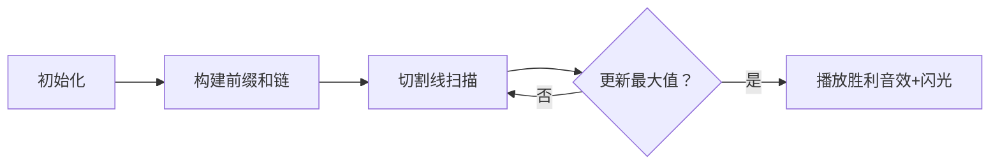

# 题目信息

# Encryption (easy)

## 题目描述

Rebel spy Heidi has just obtained the plans for the Death Star from the Empire and, now on her way to safety, she is trying to break the encryption of the plans (of course they are encrypted – the Empire may be evil, but it is not stupid!). The encryption has several levels of security, and here is how the first one looks.

Heidi is presented with a screen that shows her a sequence of integers $ A $ and a positive integer $ p $ . She knows that the encryption code is a single number $ S $ , which is defined as follows:

Define the score of $ X $ to be the sum of the elements of $ X $ modulo $ p $ .

Heidi is given a sequence $ A $ that consists of $ N $ integers, and also given an integer $ p $ . She needs to split $ A $ into $ 2 $ parts such that:

- Each part contains at least $ 1 $ element of $ A $ , and each part consists of contiguous elements of $ A $ .
- The two parts do not overlap.
- The total sum $ S $ of the scores of those two parts is maximized. This is the encryption code.

Output the sum $ S $ , which is the encryption code.

## 说明/提示

In the first example, the score is maximized if the input sequence is split into two parts as $ (3,4) $ , $ (7,2) $ . It gives the total score of .

In the second example, the score is maximized if the first part consists of the first three elements, and the second part consists of the rest. Then, the score is .

## 样例 #1

### 输入

```
4 10
3 4 7 2
```

### 输出

```
16
```

## 样例 #2

### 输入

```
10 12
16 3 24 13 9 8 7 5 12 12
```

### 输出

```
13
```

# AI分析结果


### 💡 Kay的C++算法解析：Encryption (easy) 深入学习指南 💡

**引言**  
今天我们来分析"Encryption (easy)"这道C++编程题。本指南将帮助你掌握前缀和技巧的应用，理解模运算特性，并通过像素动画直观感受算法执行过程。

---

## 1. 题目解读与核心算法识别

✨ **本题主要考察**：`前缀和应用` + `枚举技巧`  

🗣️ **初步分析**：  
> 本题如同在像素游戏中切割宝石链：给定一串数字"宝石"和模数p，需找最佳切割点将链子分成两段，使两段宝石值模p之和最大。核心思路是：
> - **前缀和**：预计算累计和数组，实现O(1)获取任意区间的和
> - **枚举切割点**：遍历所有合法分割位置（排除使某段为空的情况）
> - **模运算特性**：注意`(a+b)%p ≠ a%p + b%p`，需分别计算模值
>  
> **可视化设计**：  
> 采用复古像素风格展示数字序列，动态移动切割线：  
> - 高亮当前切割点及左右区间  
> - 实时显示左右区间和及其模值  
> - 当发现更优解时播放"胜利音效"，切割线移动时伴随"滴答"音效  

---

## 2. 精选优质题解参考

**题解一（作者：chlchl）**  
* **点评**：  
  思路清晰指出暴力解法O(n²)缺陷，强调前缀和优化到O(n)的本质。代码规范：  
  - 变量`s[i]`明确表示前缀和  
  - 循环边界`i<n`严格避免空区间  
  - 注释提醒关键陷阱（模运算与边界）  
  亮点在于用`(s[n]-s[i])%p`直接计算右区间模值，避免额外空间开销。

**题解二（作者：Noby_Glds）**  
* **点评**：  
  代码极简但逻辑完备，体现算法核心本质：  
  - 输入时即时取模优化数据范围  
  - 循环边界`i<n`处理严谨  
  - 单行核心逻辑`ans=max(ans, s[i]%p+(s[n]-s[i])%p)`直击要害  
  虽无详细注释，但简洁高效的实现具有很高竞赛参考价值。

---

## 3. 核心难点辨析与解题策略

1. **难点1：如何避免O(n²)暴力计算？**  
   * **分析**：  
     优质题解均采用前缀和预处理。定义`pre[i]=a[0]+...+a[i]`后，任意区间和转化为`pre[j]-pre[i]`的差值计算，将单次求和复杂度从O(n)降至O(1)。
   * 💡 **学习笔记**：前缀和是区间统计问题的"万能钥匙"。

2. **难点2：如何处理模运算特性？**  
   * **分析**：  
     需明确本题要求的是`(∑左%p)+(∑右%p)`而非`(∑左+∑右)%p`。优质题解通过在枚举时分别计算两个模值解决，避免错误合并计算。
   * 💡 **学习笔记**：模运算不具有加法分配律，分段计算是关键。

3. **难点3：如何确保分割合法性？**  
   * **分析**：  
     切割点需满足`1≤i≤n-1`。chlchl通过`i<n`的循环条件，Noby_Glds通过`i<=n-1`显式控制，均确保左右区间非空。
   * 💡 **学习笔记**：边界处理是算法健壮性的基石。

### ✨ 解题技巧总结
- **预计算优化**：对频繁使用的区间和操作，预处理前缀/后缀数组
- **边界防御式编程**：显式验证循环边界是否满足题意约束
- **即时取模优化**：对大数场景，输入时即时取模避免溢出（如Noby_Glds解法）
- **变量名自注释**：如`pre[i]`比`s[i]`更明确表达前缀和含义

---

## 4. C++核心代码实现赏析

**通用核心实现参考**  
* **说明**：综合优质题解思路，规范命名并添加关键注释
* **完整核心代码**：
```cpp
#include <iostream>
#include <vector>
using namespace std;

int main() {
    int n, p;
    cin >> n >> p;
    vector<long long> pre(n + 1, 0); // 前缀和数组
    
    // 读取数据并计算前缀和
    for (int i = 1; i <= n; ++i) {
        cin >> pre[i];
        pre[i] += pre[i - 1];
    }

    long long max_sum = 0;
    // 枚举切割点（注意右区间不能为空）
    for (int i = 1; i < n; ++i) { 
        long left_mod = pre[i] % p;      // 左区间模值
        long right_mod = (pre[n] - pre[i]) % p; // 右区间模值
        max_sum = max(max_sum, left_mod + right_mod);
    }
    cout << max_sum << endl;
    return 0;
}
```
* **代码解读概要**：  
  > 1. 前缀和数组`pre`存储累计和  
  > 2. 关键循环`for(int i=1; i<n; ++i)`确保分割有效性  
  > 3. 左区间和=`pre[i]`，右区间和=`pre[n]-pre[i]`  
  > 4. 实时更新两段模值之和的最大值  

---

**题解一（chlchl）核心代码**  
```cpp
for(int i=1; i<n; i++) {
    ans = max(ans, s[i] % p + (s[n] - s[i]) % p);
}
```
* **亮点**：用算术差代替后缀和数组，空间优化  
* **代码解读**：  
  > `s[i]%p`计算左段模值，`(s[n]-s[i])%p`巧妙通过总和差得右段和再取模。循环条件`i<n`确保右段非空，边界处理严谨。  
* 💡 **学习笔记**：空间复杂度O(1)的区间计算技巧

**题解二（Noby_Glds）核心代码**  
```cpp
for(int i=1; i<n; i++) 
    ans=max(ans, s[i]%p+(s[n]-s[i])%p);
```
* **亮点**：极致简洁的嵌入式取模计算  
* **代码解读**：  
  > 在输入阶段`a[i]%=p`预先取模，避免大数运算。核心逻辑单行完成：左段模值`s[i]%p`（注意`s[i]`已是前缀和模值），右段模值`(s[n]-s[i])%p`。  
* 💡 **学习笔记**：预先取模是防溢出的有效手段

---

## 5. 算法可视化：像素动画演示

**主题**：`宝石切割机`（复古像素风）  
**核心演示**：动态切割数字序列，实时显示模值之和  



**动画实现细节**：  
1. **像素场景**：  
   - 8-bit风格数字宝石（如：■3 ■4 ■7 ■2）  
   - 红色切割线在宝石间移动，伴随"滴答"移动音效  

2. **动态数据展示**：  
   - 切割线左侧泛蓝光，右侧泛黄光  
   - 顶部状态栏显示：  
     `左和=Σ蓝宝石 | 左模=左和%p | 右模=右和%p | 当前总分=左模+右模`  

3. **关键操作反馈**：  
   - 当发现新最大值时：切割线闪烁金光，播放《超级马里奥》硬币音效  
   - 单步执行：按空格键逐步移动切割线  
   - 自动演示：点击播放键，切割线匀速扫描（速度可调）  

4. **教学提示**：  
   - 切割线移至末尾时弹出提示：❗右区间不能为空！  
   - 每次前缀和更新时，显示累加公式：`pre[i] = pre[i-1] + a[i]`  

---

## 6. 拓展练习与相似问题思考

**技巧迁移场景**：  
前缀和技巧还可用于：  
1. 区间平均值计算  
2. 频率统计（如：子数组和为k的个数）  
3. 环形数组分割问题  

**洛谷题目推荐**：  
1. **P1115 最大子段和**  
   🗣️ 前缀和经典应用，理解如何通过前缀和求最大区间差  

2. **P3406 海底高铁**  
   🗣️ 进阶前缀和，结合差分数组优化多次区间查询  

3. **P2671 [NOIP2015] 求和**  
   🗣️ 复杂前缀和衍生应用，训练抽象建模能力  

---

## 7. 学习心得与经验分享

**chlchl的调试经验**：  
> *"分割点不能是n，否则右区间为空！模运算没有分配律，需分别计算模值"*  

**Kay的总结**：  
> 这两位作者的经验揭示了算法两大黄金法则：  
> 1. **边界即陷阱**：循环终止条件必须显式验证  
> 2. **数理特性决定实现**：模运算的不可分配性决定了必须分段计算  
> 调试时可打印`i`和`n-i`的值，直观验证区间非空性  

---

**结语**  
通过本次分析，我们掌握了前缀和的核心应用与严谨的边界处理思维。记住：优秀的算法既需要创新优化，更需要严谨防御。下次挑战再见！💪

---
处理用时：168.78秒