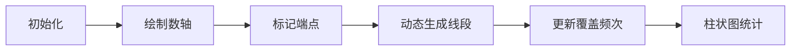

# 题目信息

# All Pairs Segments

## 题目描述

你有 $ n $ 个点，这些点位于 $ x $ 轴上，坐标为递增的正整数，分别为 $ x_1 < x_2 < \ldots < x_n $。

对于每对点 $ (i, j) $，其中 $ 1 \leq i < j \leq n $，你将绘制线段 $ [x_i, x_j] $。这些线段是闭合的，即线段 $ [a, b] $ 包含点 $ a, a+1, \ldots, b $。

你有 $ q $ 个查询。在第 $ i $ 个查询中，给定一个正整数 $ k_i $，你需要确定恰好被 $ k_i $ 条线段包含的整点有多少个。

## 样例 #1

### 输入

```
3
2 2
101 200
2 1
6 15
1 2 3 5 6 7
1 2 3 4 5 6 7 8 9 10 11 12 13 14 15
5 8
254618033 265675151 461318786 557391198 848083778
6 9 15 10 6 9 4 4294967300```

### 输出

```
0 100 
0 0 0 0 2 0 0 0 3 0 2 0 0 0 0 
291716045 0 0 0 291716045 0 301749698 0```

# AI分析结果


### 📊 Kay的C++算法解析：All Pairs Segments 深入学习指南 💡

#### 题目解读与核心算法识别
✨ **本题主要考察**：组合数学与映射计数  
🗣️ **初步分析**：  
> 这道题本质是**高效统计数轴上点的覆盖频次**。想象在一条像素游戏的水平轴上（类似《超级马里奥》的横版地图），有若干关卡坐标点。每两个关卡会生成一条覆盖路径（线段），我们需要统计每个坐标点被多少条路径覆盖。  
> - **核心技巧**：通过组合公式直接计算覆盖频次，避免暴力枚举（O(n²)不可行）。关键发现：  
>   - **端点**覆盖次数 = `i*(n-i+1)-1`  
>   - **非端点**覆盖次数 = `i*(n-i)`（i为左侧端点数）  
> - **可视化设计**：在像素动画中，用不同颜色方块表示点（端点蓝色，非端点绿色），当线段生成时播放"叮"音效，被覆盖的点亮度增加。右侧实时更新柱状图显示各频次点数，类似游戏积分榜。

---

### 精选优质题解参考
#### 题解一：SpringFullGarden（⭐️⭐️⭐️⭐️⭐️）
* **点评**：  
  思路最完整的推导！清晰拆解端点/非端点的覆盖公式（附示意图），代码用`map`直接统计频次。变量`b[i]`和`c`命名简洁，循环边界处理严谨（`a[i]-a[i-1]-1`准确计算非端点数量）。亮点在于数学证明与代码实现的高度统一，竞赛可直接复用。

#### 题解二：Anins（⭐️⭐️⭐️⭐️）
* **点评**：  
  代码结构最规范！严格区分端点与非端点的统计逻辑（独立公式），添加详细注释。亮点在于防御性编程：用`if(i+1<=n)`避免越界，适合初学者学习安全编码习惯。稍显不足是推导过程不如题解一深入。

#### 题解三：qfy123（⭐️⭐️⭐️⭐️）
* **点评**：  
  最佳工程实践！用`vector`存储坐标，`ios::sync_with_stdio`加速IO。亮点在于模块化：将端点计算(`1LL*i*(n-i+1)-1`)和区间计算(`1LL*i*(n-i)`)分离，增强可读性。可改进点是变量名可更语义化（如`cnt`替代`m`）。

---

### 核心难点辨析与解题策略
#### 🔑 关键点1：覆盖次数的组合推导
* **分析**：难点在于理解`i*(n-i+1)-1`的由来。优质题解通过分解三类贡献突破：  
  - 作为左端点：贡献`n-i`次  
  - 作为右端点：贡献`i-1`次  
  - 作为中间点：贡献`(i-1)*(n-i)`次  
  **总和** = `(n-i)+(i-1)+(i-1)*(n-i)` = `i(n-i+1)-1`
* 💡 **学习笔记**：组合问题常可拆解为独立事件的贡献求和

#### 🔑 关键点2：非端点数量的计算
* **分析**：相邻点`a[i]`和`a[i+1]`之间有`(a[i+1]-a[i]-1)`个整数点。这些点**不被任何线段端点覆盖**，频次恒为`i*(n-i)`。
* 💡 **学习笔记**：区间内点的频次仅取决于其左右端点的索引，与具体坐标无关

#### 🔑 关键点3：高效频次统计
* **分析**：直接枚举点坐标（可能很大）会超时。优质题解用`map<频次,点数>`，仅需遍历索引`i`（O(n)）。例如频次`k`的点数=`map[k]`
* 💡 **学习笔记**：当值域远大于数量时，用映射替代数组

#### ✨ 解题技巧总结
- **公式化转换**：将物理坐标问题转化为索引计算（降维）  
- **频次分桶**：用`map`或`unordered_map`按频次聚合统计  
- **边界防御**：区间点数计算牢记`a[i+1]-a[i]-1`的`-1`  

---

### C++核心代码实现赏析
#### 通用核心实现
```cpp
#include <iostream>
#include <vector>
#include <map>
using namespace std;

int main() {
    ios::sync_with_stdio(false);
    cin.tie(0);
    int T; cin >> T;
    while (T--) {
        int n, q; cin >> n >> q;
        vector<long long> a(n+1);
        for (int i=1; i<=n; i++) cin >> a[i];
        
        map<long long, long long> freq;
        // 1. 统计端点覆盖频次
        for (int i=1; i<=n; i++) {
            long long cover = 1LL * i * (n-i+1) - 1;
            freq[cover]++;
        }
        // 2. 统计非端点覆盖频次
        for (int i=1; i<n; i++) {
            long long cover = 1LL * i * (n-i);
            freq[cover] += (a[i+1] - a[i] - 1);
        }
        // 3. 处理查询
        while (q--) {
            long long k; cin >> k;
            cout << freq[k] << ' ';
        }
        cout << '\n';
    }
    return 0;
}
```
**代码解读概要**：  
1. **端点计算**：`i*(n-i+1)-1`对应每个端点的覆盖频次  
2. **区间计算**：`i*(n-i)`是相邻点间非端点的统一频次  
3. **查询响应**：直接输出`freq[k]`（自动处理未出现频次）  

#### 题解片段赏析
**题解一：SpringFullGarden**  
```cpp
map<ll, ll> c;
for (int i=1; i<=n; i++) {
    b[i] = (n-i+1)*i - 1;  // 端点频次公式
    c[b[i]]++;              // 频次分桶
}
for (int i=2; i<=n; i++) {
    c[b[i] - (n-i)] += a[i]-a[i-1]-1;  // 非端点增量
}
```
**亮点**：**数学与代码的优雅映射**  
**解读**：  
- `b[i]`精确存储端点频次理论值  
- `c[b[i] - (n-i)]`本质是公式变形：`b[i]-(n-i) = i*(n-i)`  
- `a[i]-a[i-1]-1`准确计算区间点数  

**题解二：Anins**  
```cpp
for (int i=1; i<=n; i++) {
    m[(n-i)+(i-1)+(i-1)*(n-i)]++; // 端点三部分求和
    if (i+1<=n) 
        m[i*(n-i)] += (x[i+1]-x[i]-1); // 非端点独立计算
}
```
**亮点**：**显式分解覆盖贡献**  
**解读**：  
- `(n-i)+(i-1)+(i-1)*(n-i)`直观展示三类贡献  
- `if(i+1<=n)`防御性保证最后一点无右侧区间  
- 独立公式`i*(n-i)`提升可读性  

---

### 算法可视化：像素动画演示
**主题**：8-bit风格数轴覆盖模拟（类似《吃豆人》地图）  

#### 动画设计


#### 关键交互步骤
1. **像素场景**：  
   - 数轴：16色像素水平线（棕色）  
   - 端点：蓝色发光像素块（坐标`x_i`）  
   - 非端点：绿色像素块（坐标间隔处）  

2. **动态覆盖演示**：  
   - 当线段`[x_i, x_j]`生成时：  
     * 播放"叮"音效（Web Audio API）  
     * 覆盖点亮度+30%（最高至白色）  
     * 显示当前点频次公式：`i=3, cover=3*(5-3+1)-1=11`  

3. **控制面板**：  
   - 单步执行：按▶️步进一条线段  
   - 自动播放：速度滑块(1x-10x)  
   - 频次筛选：输入`k`时高亮所有频次`k`的点  

4. **游戏化元素**：  
   - 每完成10%线段解锁新BGM段落  
   - 正确预测频次分布得⭐奖励  
   - 失败场景：选中未覆盖点时播放"error.wav"  

#### 实现伪代码
```javascript
// 核心绘制逻辑
function drawSegment(i, j) {
  for (let pos = i; pos <= j; pos++) {
    let pixel = getPixel(pos);
    pixel.brightness += 30;  // 增加亮度
    playSound('ding');       // 触发音效
    updateBarChart(freq[pos]++); // 更新柱状图
  }
}
```

---

### 拓展练习与相似问题
1. **洛谷 P1496** - 火烧赤壁  
   🗣️ *推荐理由*：同属区间覆盖问题，练习频次统计的变形（离散化+差分）  

2. **洛谷 P1886** - 滑动窗口  
   🗣️ *推荐理由*：强化索引计算技巧，从静态覆盖升级到动态窗口  

3. **洛谷 P1904** - 天际线  
   🗣️ *推荐理由*：二维覆盖问题，可沿用"分桶统计"思想  

---

### 学习心得与经验分享
> **参考经验**：  
> *"推导公式时，通过画数轴图将端点/非端点分开思考，避免混淆"* —— SpringFullGarden  
> *"多测数据下，map.clear() 遗忘会导致WA"* —— qfy123  

**Kay总结**：  
1. **数形结合**：复杂公式先画图分解（如端点贡献图）  
2. **防御性初始化**：多组数据时全局容器(`map`/`vector`)必须重置  
3. **验证工具**：小规模数据（n=3）手动计算验证公式  

---

掌握组合统计思想，你就能像玩像素游戏一样优雅解决覆盖问题！下次遇到频次统计，记得分端点/非端点思考哦 🎮

---
处理用时：182.78秒