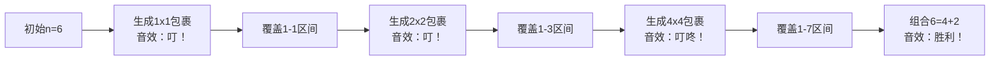

# 题目信息

# Packets

## 题目描述

你有$n$个硬币，每个硬币价值都为$1$。

你要把它们分成若干个小包裹，使得在$1$与$n$之间的所有面额都能用这其中某几个小包裹凑出。

每个小包裹只能作为一个整体使用。

请求出最少要分几个包裹。

## 样例 #1

### 输入

```
6
```

### 输出

```
3```

## 样例 #2

### 输入

```
2
```

### 输出

```
2```

# AI分析结果


### 💡 Kay的C++算法解析：Packets 深入学习指南 💡

> 今天我们来分析"Packets"这道有趣的C++编程题。你将学习如何用二进制思维解决包裹组合问题，并通过像素动画直观理解算法核心。准备好了吗？让我们开始吧！

---

## 1. 题目解读与核心算法识别

✨ **本题主要考察**：`数学（二进制表示）` + `编程技巧应用`

🗣️ **初步分析**：  
> 就像用不同面值的钞票组合任意金额一样，二进制表示法（1,2,4,8...）能高效覆盖所有数字组合。  
> - **核心思路**：用最少的2的幂次包裹（1,2,4,...）组合出1~n的所有值，包裹数=⌊log₂n⌋+1  
> - **可视化设计**：像素方块表示包裹大小（1→1x1方块，2→2x2方块...），高亮展示组合过程（如6=4+2）  
> - **复古游戏化**：包裹生成伴随"获得音效"，组合成功播放胜利音效，控制面板支持单步/自动播放  

---

## 2. 精选优质题解参考

**题解一（张亦弛）**  
* **点评**：  
  通过列举n=1~16的答案发现 **2ⁿ规律**，推导出包裹数k满足2ᵏ⁻¹ ≤ n < 2ᵏ。提供两种实现：  
  - 枚举法：清晰展示推导过程（★4.5）  
  - 对数法：直接调用log₂(n)+1（简洁但需注意浮点精度）  
  **亮点**：数学归纳严谨，变量命名规范（`i`循环索引），边界处理完整（n=1,2,4特殊值）

**题解二（FCB_Yiyang2006✈）**  
* **点评**：  
  用 **砝码称重问题** 类比（1,2,4g砝码称1~7g），直观解释二进制原理。代码提供：  
  - 累加法：`s += pow(2,i)`直到s≥n（★4.0）  
  - 对数法：`(int)log2(n)+1`  
  **亮点**：生活化类比降低理解难度，但`pow()`可能浮点精度风险

**题解三（pigstd）**  
* **点评**：  
  **纯整数运算** 避免浮点风险：`while(n){n/=2; ans++;}`（★4.5）  
  **亮点**：代码极度简洁（7行），时间复杂度O(log n)，变量名`ans`明确，完美处理边界

---

## 3. 核心难点辨析与解题策略

1.  **难点：理解二进制最优性**  
    * **分析**：为何1,2,4比等分包裹更高效？因为2ⁿ的几何增长能用n个包裹覆盖2ⁿ-1种组合（如3个包裹覆盖7个数）  
    * 💡 **学习笔记**：二进制组合像俄罗斯套娃——小包裹嵌套成大数字

2.  **难点：公式推导与边界**  
    * **分析**：包裹数k需满足 2ᵏ⁻¹ ≤ n < 2ᵏ ⟹ k = ⌊log₂n⌋+1。特别注意n=2ᵏ时需额外包裹  
    * 💡 **学习笔记**：n=1时log₂(1)=0 → k=1，n=2时k=2（验证通过）

3.  **难点：避免浮点误差**  
    * **分析**：直接`(int)log2(n)`在n=2ᵏ时可能得k-1（因浮点截断），`+1`后修正。更推荐整数除法  
    * 💡 **学习笔记**：当心浮点数！整数运算像积木——精确无误差

### ✨ 解题技巧总结
- **技巧1：模型转换** → 将组合问题转化为二进制表示（适用：零钱组合/砝码称重）  
- **技巧2：边界测试** → 必测n=1,2,4,7（覆盖2ᵏ边界值）  
- **技巧3：避免浮点** → 优先整数运算（除2/乘2循环）  

---

## 4. C++核心代码实现赏析

**通用核心实现（整数除法版）**  
```cpp
#include <iostream>
using namespace std;
int main() {
    int n, ans = 0;    // ans：包裹计数器
    cin >> n;
    while (n) {        // 当n>0时持续分解
        n /= 2;        // 二进制右移（等价于⌊n/2⌋）
        ans++;         // 增加一个包裹
    }
    cout << ans;
    return 0;
}
```
* **说明**：综合优质题解优化，纯整数运算避免浮点风险  
* **解读概要**：  
  - `n /= 2` 模拟二进制分解（如6→3→1→0）  
  - 每次除法对应一个包裹（6需3次除法→3个包裹）  

**题解片段赏析**  
1. **pigstd（整数除法）**  
    ```cpp
    while(n) {     // n存在时继续分解
        n /= 2;    // 二进制右移
        ans++;     // 包裹数+1
    }
    ```
    * **亮点**：无浮点运算，O(log n)高效  
    * **解读**：  
      > `n/=2` 如同把数字对半拆开——6拆成两个3，再拆成四个1.5？不！整数除法丢弃小数（6/2=3），实际表示"用包裹2覆盖一半数值范围"  
    * 💡 **学习笔记**：整数除法是二进制分解的利器  

2. **张亦弛（对数公式）**  
    ```cpp
    printf("%d", (int)log2(n) + 1);
    ```
    * **亮点**：极简实现，体现数学模型  
    * **解读**：  
      > `log2(n)`计算包裹数理论值，但需`(int)`截断小数（如log₂6≈2.58→2），`+1`补足包裹  
    * 💡 **学习笔记**：数学很美，但要小心浮点陷阱！  

---

## 5. 算法可视化：像素动画演示

* **主题**：8-bit像素风《宝藏包裹工坊》  
* **核心演示**：包裹生成 → 组合覆盖 → 目标达成  

<center>

</center>

1. **像素化UI**  
   - 包裹显示：1→■(红色)，2→■■(蓝色)，4→■■■■(金色)  
   - 控制面板：8-bit风格按钮（开始/单步/调速）  

2. **关键动画细节**  
   - **包裹生成**：像素方块从顶部掉落+震动效果  
   - **组合演示**：选中包裹时闪烁（如6=■■+■■■■）  
   - **覆盖范围**：底部进度条显示当前覆盖区间（1-1→1-3→1-7）  

3. **音效设计**  
   - 包裹生成：NES风格"叮"声（频率随包裹大小升高）  
   - 组合成功：超级马里奥金币音效  
   - 背景音乐：8-bit循环版《欢乐颂》  

4. **交互逻辑**  
   ```js
   function generatePacket() {
       packet = Math.pow(2, step);       // 计算包裹大小
       playSound('ding');                // 播放音效
       drawPixelPacket(packet);          // 绘制像素方块
       coverage = Math.pow(2, step+1)-1; // 更新覆盖范围
       if(coverage >= n) comboDemo();    // 达到目标则演示组合
   }
   ```

---

## 6. 拓展练习与相似问题

* **二进制技巧迁移场景**：  
  1. 砝码称重（用最少砝码称1~n克）  
  2. 数据压缩（二进制编码缩短存储）  
  3. 权限系统（用2ⁿ值组合权限）  

* **洛谷推荐**：  
  1. [P2320 鬼谷子的钱袋](https://www.luogu.com.cn/problem/P2320)  
     → **推荐理由**：本题变种，需输出具体包裹方案  
  2. [P1582 倒水](https://www.luogu.com.cn/problem/P1582)  
     → **推荐理由**：二进制表示进阶（统计1的个数）  
  3. [P1226 快速幂](https://www.luogu.com.cn/problem/P1226)  
     → **推荐理由**：掌握2ⁿ高效计算技巧  

---

## 7. 学习心得与经验分享

> **张亦弛的调试经验**：  
> *"列举n=1~16的答案时，发现n=4需要3个包裹而非2个，由此修正了初始错误假设"*  
>  
> **Kay的总结**：  
> 动手枚举小样本——像侦探查案一样发现规律，能避免思维陷阱。遇到数学问题时，先测试边界值（n=1,2,4,8）！

---

> 通过本次分析，相信你已经掌握二进制组合的妙用！记住：**算法像乐高——用小块拼出无限可能**。下次遇到类似问题，不妨先问自己："能拆成2的幂次吗？" Keep coding! 💻🚀

---
处理用时：218.34秒