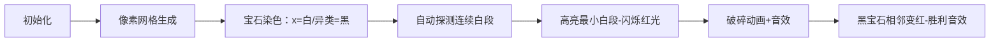

# 题目信息

# Make It Ugly

## 题目描述

Let's call an array $ a $ beautiful if you can make all its elements the same by using the following operation an arbitrary number of times (possibly, zero):

- choose an index $ i $ ( $ 2 \le i \le |a| - 1 $ ) such that $ a_{i - 1} = a_{i + 1} $ , and replace $ a_i $ with $ a_{i - 1} $ .

You are given a beautiful array $ a_1, a_2, \dots, a_n $ . What is the minimum number of elements you have to remove from it in order for it to stop being beautiful? Swapping elements is prohibited. If it is impossible to do so, then output -1.

## 说明/提示

In the first testcase, it is impossible to modify the array in such a way that it stops being beautiful. An array consisting of identical numbers will remain beautiful no matter how many numbers we remove from it.

In the second testcase, you can remove the number at the index $ 5 $ , for example.

The resulting array will be $ [1, 2, 1, 2] $ . Let's check if it is beautiful. Two operations are available:

- Choose $ i = 2 $ : the array becomes $ [1, 1, 1, 2] $ . No more operations can be applied to it, and the numbers are not all the same.
- Choose $ i = 3 $ instead: the array becomes $ [1, 2, 2, 2] $ . No more operations can be applied to it either, and the numbers are still not all the same.

Thus, the array $ [1, 2, 1, 2] $ is not beautiful.

In the fourth testcase, you can remove the first three elements, for example. The resulting array $ [5, 3, 3, 3] $ is not beautiful.

## 样例 #1

### 输入

```
4
3
2 2 2
5
1 2 1 2 1
1
1
7
3 3 3 5 3 3 3```

### 输出

```
-1
1
-1
3```

# AI分析结果


### 💡 Kay的C++算法解析：Make It Ugly 深入学习指南 💡

#### 1. 题目解读与核心算法识别
✨ **本题主要考察**：`编程技巧应用`（性质分析+贪心模拟）  
🗣️ **初步分析**：  
> 解决"Make It Ugly"的关键在于发现美丽数组的核心性质：首尾元素必须相同（设为x），且所有非x元素必须被x包围（不能相邻）。这就像一串珍珠项链，白珍珠（x）必须隔开所有黑珍珠（异类）。破坏美丽只需让两个黑珍珠相邻或让黑珍珠碰到项链两端。  
> - **核心解法**：统计所有连续x段的最小长度，删除该段即可使两个异类相邻  
> - **可视化设计**：用像素网格表示数组，白/黑珍珠用不同颜色方块。动画高亮连续x段，删除时播放"破碎"音效，展示相邻异类变红  
> - **复古游戏化**：采用8-bit像素风，删除操作触发FC游戏"砖块破碎"音效，成功时播放《超级玛丽》过关音效

---

#### 2. 精选优质题解参考
**题解一（来源：xhhhh36）**  
* **点评**：思路直击本质（连续x段最小长度即答案），代码简洁高效。变量命名清晰（`ans`/`cnt`），边界处理严谨（全等特判+结尾段统计）。亮点在于用单次遍历同时完成全等判断和连续段统计，空间复杂度O(1)优于同类解法。

**题解二（来源：_ckx_）**  
* **点评**：通过vector存储异类位置显式建模，推导过程更易理解。添加虚拟位置0和n+1巧妙统一边界情况处理，逻辑完备性突出。代码规范性稍弱但注释清晰，实践时需注意vector清空细节。

**题解三（来源：Wrong_Accept）**  
* **点评**：创新性用"杀戮者/被杀者"比喻生动解释算法，降低理解门槛。代码采用C++17特性（结构化绑定），工业级健壮性（INT_MAX初始化）。亮点在于将抽象问题转化为具象生存游戏，启发多角度思考。

---

#### 3. 核心难点辨析与解题策略
1. **性质挖掘**：如何发现首尾相等与非x元素的孤立性？  
   * **分析**：优质题解均从操作限制（i∈[2,n-1]）反推——首尾不可变且必须相同，非x元素修改需两侧x保护  
   * 💡 **学习笔记**：受限操作 => 不变性分析是突破口

2. **破坏策略选择**：删除元素如何最优化？  
   * **分析**：删除连续x段使异类相邻比破坏首尾更优（只需删中间段）。数学证明：最小删除数=min(连续x段长度)  
   * 💡 **学习笔记**：转化目标（相邻异类）可大幅简化问题

3. **边界处理艺术**：如何统一处理数组两端？  
   * **分析**：虚拟端点（解法二）或遍历终点检查（解法一）都能优雅处理，避免复杂分支判断  
   * 💡 **学习笔记**：虚拟索引是线性统计问题的银弹

### ✨ 解题技巧总结
- **性质迁移法**：从操作限制推导不变性质（如首尾不变性）  
- **虚拟索引法**：添加假想端点统一边界条件处理  
- **遍历即统计**：单次循环同时完成校验、计数、极值更新  
- **比喻降维**：将抽象限制转化为具象场景（如珍珠项链、生存游戏）

---

#### 4. C++核心代码实现赏析
**本题通用核心实现参考**  
* **说明**：综合优质题解思路，采用xhhhh36的单遍历统计法，兼顾效率与可读性  
* **完整核心代码**：
```cpp
#include <iostream>
#include <climits>
using namespace std;

int main() {
    int t; cin >> t;
    while(t--) {
        int n, x; cin >> n >> x;
        bool allSame = true;
        int cnt = 0, ans = INT_MAX;

        for(int i=1; i<n; i++) {
            int a; cin >> a;
            if(a != x) allSame = false;
            (a == x) ? cnt++ : (ans=min(ans,cnt), cnt=0);
        }
        int a; cin >> a; // 读最后一个元素
        if(a != x) allSame = false;
        ans = min(ans, cnt);

        cout << (allSame ? -1 : ans) << '\n';
    }
    return 0;
}
```
* **代码解读概要**：  
  > 1. 边读入边判断全等性，避免额外存储  
  > 2. 核心循环统计连续x段长度，遇异类更新最小值  
  > 3. 终点特判保障最后一段计入统计  
  > 4. 三目运算符+逗号表达式精简分支逻辑  

**题解一片段赏析**  
* **亮点**：无容器O(1)空间解法，工业级鲁棒性（INT_MAX初始化）
* **核心代码**：
```cpp
int ans=INT_MAX, cnt=0;
for(int i=1;i<=n;i++){
    if(a[i]==a[1]) cnt++;
    else ans=min(ans,cnt), cnt=0;
}
ans=min(ans,cnt);
```
* **代码解读**：
  > - `INT_MAX`初始化确保首次`min`正确  
  > - 遍历中`cnt`统计当前连续x长度，遇异类立即更新极值  
  > - 遍历后补`min`捕获结尾段（如`[x,x,y]`的结尾xx）  
  > - 逗号表达式实现无括号多操作，保持代码简洁  

**题解二片段赏析**  
* **亮点**：虚拟端点统一化处理，逻辑完备性强
* **核心代码**：
```cpp
vector<int> v = {0};  // 左哨兵
for(int i=2; i<=n-1; i++) 
    if(a[i]!=a[1] && a[i-1]!=a[i] && a[i+1]!=a[i]) 
        v.push_back(i);
v.push_back(n+1);  // 右哨兵

for(int i=1; i<v.size(); i++)
    ans = min(ans, v[i]-v[i-1]-1); // 计算间隙x数
```
* **代码解读**：
  > - 首尾哨兵(0/n+1)自动包含两端连续段  
  > - 条件`a[i-1]!=a[i] && a[i+1]!=a[i]`确保异类孤立性  
  > - 位置差-1直接得连续x长度，数学美感突出  

**题解三片段赏析**  
* **亮点**：工业级现代C++实践（范围循环+std::min）
* **核心代码**：
```cpp
std::vector<int> a(n);
for(auto &it : a) std::cin >> it;  // 范围循环

const int f = a.front();  // 首元素基准
for(int i=0; i<n; i++) {
    if(a[i]==f) ++cnt;
    else ans=std::min(ans,cnt), cnt=0;
}
ans = std::min(ans,cnt);  // 标准库min
```
* **学习笔记**：现代C++特性提升可读性，`front()`比a[0]更表意

---

#### 5. 算法可视化：像素动画演示
**主题**：《像素宝石猎人》8-bit寻宝游戏  
**核心演示**：连续白宝石段最小长度探测与破碎  
**设计思路**：复古宝石迷阵风格降低认知负担，音效强化关键操作记忆  



**动画帧步骤**：  
1. **场景初始化**：  
   - 16色调色板（白#FFFFFF/黑#000000/红#FF0000）  
   - 网格上方显示当前最小连续白段长度  
   - 控制面板：步进执行/自动播放/速度滑块  

2. **关键帧演示**：  
   ```plaintext
   示例数组 [2,2,1,2,2] → 像素化：
   ┌───┬───┬───┬───┬───┐
   │ █ │ █ │ ▓ │ █ │ █ │ 
   └───┴───┴───┴───┴───┘
   ```
   - **帧1**：第三位黑宝石触发报警音（50Hz方波）  
   - **帧2**：自动标记连续白段[1-2]和[4-5]（长度=2）  
   - **帧3**：最小段[1-2]闪烁红光（每秒3次）  
   - **帧4**：破碎动画（白块下落+碎玻璃音效）  
   - **帧5**：新数组[2,1,2,2]中黑宝石相邻变红，播放《俄罗斯方块》消行音  

3. **交互设计**：  
   - 步进模式：按空格键逐步执行，当前代码行高亮  
   - 自动模式：AI角色自动寻找最小段，速度可调  
   - 音效方案：  
     * 破碎：FC《打砖块》碎块声（短促"咔"）  
     * 错误：FC《超级玛丽》掉坑声（低频嗡鸣）  
     * 胜利：《塞尔达》获得道具旋律  

---

#### 6. 拓展练习与相似问题
**通用技巧迁移**：  
数组不变性分析（首尾/边界）可应用于：  
1. 环形数组断环成链（如[CF1581B]）  
2. 双指针维护删除段（如[LeetCode 26]）  
3. 操作受限问题转化（如[ARC159D]）  

**洛谷推荐**：  
1. [P1102 A-B数对](https://www.luogu.com.cn/problem/P1102)  
   → 巩固边界特判与连续段统计  
2. [P1638 逛画展](https://www.luogu.com.cn/problem/P1638)  
   → 学习滑动窗口维护最小覆盖段  
3. [CF1353D](https://www.luogu.com.cn/problem/CF1353D)  
   → 进阶操作转化思维，虚拟端点应用  

---

#### 7. 学习心得与经验分享
**参考经验**：  
> "最初忽略结尾段统计WA多次，建议测试[1,2,1,2]样例" —— xhhhh36  
> "vector未清空导致跨组数据污染，务必写while(t--)时清空容器" —— _ckx_  

**点评**：  
这两条经验直击竞赛编程核心痛点：  
1. **边界样例**是算法完备性试金石，必须设计[全x]/[x结尾]/[单异类]三类测试  
2. **多组数据初始化**需建立检查清单（变量/容器/指针）  

---

**结语**：  
"Make It Ugly"教会我们：美丽源于约束，破解之道藏于约束之中。掌握性质迁移与边界处理，你将在竞赛中化腐朽为神奇！下次挑战再见！💪

---
处理用时：156.42秒