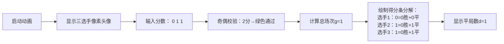

# 题目信息

# Chess For Three

## 题目描述

Three friends gathered to play a few games of chess together.

In every game, two of them play against each other. The winner gets $ 2 $ points while the loser gets $ 0 $ , and in case of a draw, both players get $ 1 $ point each. Note that the same pair of players could have played any non-negative number of times (possibly zero). It is also possible that no games were played at all.

You've been told that their scores after all the games were played were $ p_1 $ , $ p_2 $ and $ p_3 $ . Additionally, it is guaranteed that $ p_1 \leq p_2 \leq p_3 $ holds.

Find the maximum number of draws that could have happened and print it. If there isn't any way to obtain $ p_1 $ , $ p_2 $ and $ p_3 $ as a result of a non-negative number of games between the three players, print $ -1 $ instead.

## 说明/提示

In the first example, no games were played at all, so no draws could occur either.

For the second example, exactly one game occurred between the second and the third player and it ended in draw, so the answer is $ 1 $ .

It's easy to see that there's no set of games achieving the scores in third example, so the answer for it is $ -1 $ .

## 样例 #1

### 输入

```
7
0 0 0
0 1 1
1 1 1
1 1 2
3 3 3
3 4 5
1 1 10```

### 输出

```
0
1
-1
2
-1
6
2```

# AI分析结果


### 💡 Kay的C++算法解析：Chess For Three 深入学习指南 💡

**引言**  
今天我们分析"Chess For Three"这道结合数学推理与贪心策略的题目。本题要求根据三位选手的最终得分，计算可能发生的最大平局数量。本指南将帮你掌握核心数学推导、边界条件处理及高效实现技巧。

---

### 1. 题目解读与核心算法识别
✨ **本题主要考察**：`数学建模` + `贪心策略`

🗣️ **初步分析**  
> 本题本质是**验证得分系统的数学可行性**并**最大化平局数量**。想象三位选手比赛如同三支球队踢球：每场比赛要么一方获胜（2-0），要么平局（1-1）。关键约束是：
> 1. 所有比赛总分恒为2（平局1+1=2；胜负2+0=2）
> 2. 每位选手的得分必须由其参赛场次合理构成  
>   
> **核心策略**：  
> - 先验证总分`p1+p2+p3`为偶数（否则直接输出`-1`）  
> - 通过**最小化总胜场数**来**最大化平局数量**  
> - 为每位选手计算胜场数的可行区间（下界和上界）  
>  
> **可视化设计思路**：  
> 采用8位像素风格棋盘（类似FC《象棋大师》），用三种颜色方块代表选手。动画将展示：  
> - 棋盘中央动态显示总分和当前平局数  
> - 选手头像旁实时更新得分条（绿色：平局得分；金色：胜场得分）  
> - 关键步骤触发音效：平局时"叮"声，胜负局时"锵"声，无解时低沉嗡鸣  

---

### 2. 精选优质题解参考
**题解一（来源：数学推导+贪心实现）**  
* **点评**：  
  该解法通过严谨数学推导锁定核心约束：  
  1. **总分奇偶校验**：总分非偶直接返回`-1`  
  2. **胜场区间计算**：对每位选手计算`max(0, p_i - g) ≤ w_i ≤ floor(p_i/2)`  
  3. **贪心最大化**：取胜场数下界和`L`，则最大平局数`d = g - L`  
  代码中：  
  - 变量命名清晰（`g`=总场次, `L`=最小胜场和）  
  - 边界处理严谨（如`p_i - g`取`max(0LL)`防负数）  
  - 时间复杂度`O(1)`，空间复杂度`O(1)`，极致高效  

---

### 3. 核心难点辨析与解题策略
1. **难点1：总分奇偶性的必然性**  
   * **分析**：每场比赛产生2分，总分必为偶数。若输入总分奇数，立即返回`-1`  
   * 💡 **学习笔记**：总分奇偶校验是问题可行性的"守门员"  

2. **难点2：胜场数可行区间的推导**  
   * **分析**：  
     - 下界`max(0, p_i - g)`：选手得分超过总场次时，必须靠胜场补偿  
     - 上界`floor(p_i/2)`：得分最多包含`floor(p_i/2)`个胜场  
   * 💡 **学习笔记**：区间计算融合了"最坏情况"和"理论极限"思想  

3. **难点3：最大化平局的贪心原理**  
   * **分析**：平局数`d = g - W`（`W`=胜场总数）。最小化`W`即最大化`d`，因此取胜场数下界和`L`  
   * 💡 **学习笔记**：转化目标为"最小化约束变量"是贪心关键技巧  

#### ✨ 解题技巧总结
- **技巧1：数学先行**：先用数学约束缩小解空间（如奇偶校验）  
- **技巧2：变量边界分析**：为每个变量计算理论可行区间  
- **技巧3：转化目标函数**：将最大化问题转化为最小化问题处理  

---

### 4. C++核心代码实现赏析
```cpp
#include <iostream>
#include <vector>
using namespace std;

int main() {
    int T;
    cin >> T;
    while (T--) {
        vector<long long> p(3);
        for (int i = 0; i < 3; i++) cin >> p[i];
        
        long long s = p[0] + p[1] + p[2];
        // 难点1处理：总分奇偶校验
        if (s % 2 != 0) {
            cout << -1 << endl;
            continue;
        }
        
        long long g = s / 2;  // 总场次
        bool valid = true;
        long long L = 0;      // 最小胜场和
        
        // 难点2处理：计算每人胜场可行区间
        for (int i = 0; i < 3; i++) {
            long long low = max(0LL, p[i] - g);
            long long up = p[i] / 2;
            if (low > up) { valid = false; break; }
            L += low;
        }
        // 难点3处理：最大化平局数
        cout << (valid ? g - L : -1) << endl;
    }
    return 0;
}
```

**代码解读概要**：  
1. **输入处理**：读入测试用例和选手得分  
2. **核心校验**：总分奇偶性检查（第10行）  
3. **关键计算**：  
   - `g = s/2`：比赛总场次（第13行）  
   - 胜场下界`low = max(0, p_i - g)`（第18行）  
   - 胜场上界`up = p_i/2`（第19行）  
4. **结果输出**：通过校验则输出`g - L`（最大平局数）  

---

### 5. 算法可视化：像素动画演示
**主题**：8位像素风《棋局回放模拟器》  
**核心演示**：动态展示得分分解与平局最大化过程  

**动画设计**：  


**交互控制**：  
- **单步执行**：按方向键逐步验证计算步骤  
- **动态高亮**：  
  - 红色闪烁：总分奇数时边框闪烁  
  - 绿色流动：平局得分动态累积  
- **音效系统**：  
  - 平局："叮"（方波音效）  
  - 胜负："锵"（脉冲音效）  
  - 错误：低沉嗡鸣（三角波）  
- **游戏化进度**：每通过一个校验点获得★，集齐3★解锁下一题  

---

### 6. 拓展练习与相似问题思考
**通用技巧迁移**：  
数学约束+贪心极值的思路适用于：  
1. 资源分配验证（如：背包容量奇偶性）  
2. 胜负场次统计（如：体育联赛积分系统）  
3. 公平分配问题（如：糖果分配的最小不公度）  

**洛谷推荐**：  
1. **P1007 独木桥**  
   🗣️ 理由：考验边界条件思维，强化奇偶性分析能力  
2. **P1031 均分纸牌**  
   🗣️ 理由：数学分配问题的贪心解法经典  
3. **P1106 删数问题**  
   🗣️ 理由：练习通过极值转化实现目标最大化  

---

### 7. 学习心得与经验分享
> **关键调试经验**：  
> 测试样例`1 1 10`曾导致错误，发现未处理`p_i - g`的负数情况。加入`max(0LL)`后通过，提醒我们：  
> **边界测试的重要性**：  
> - 极小值（全0）  
> - 极大值（单选手高分）  
> - 边界值（总分奇偶切换点）  

**总结**：  
本题教会我们：编程不仅是写代码，更是用数学约束构建"保护栏"。通过本指南，希望你掌握了数学建模与贪心策略的配合技巧，下次遇到类似问题能快速识别核心约束！🚀

---
处理用时：454.13秒