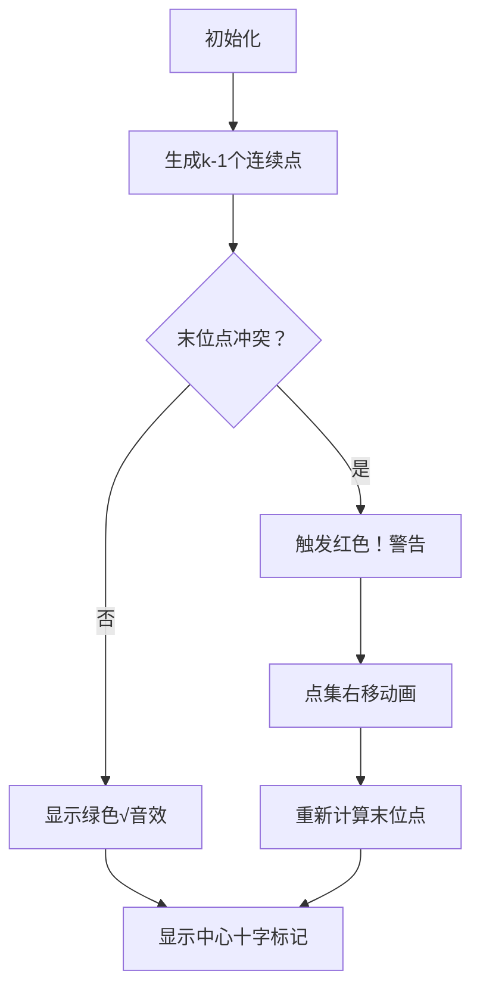

# 题目信息

# Find K Distinct Points with Fixed Center

## 题目描述

我没能给这道题想出一个好的标题，所以我决定去力扣学习。

——《孙子兵法》

给你三个整数 $x_c$，$y_c$ 和 $k$（$ -100 \leq x_c, y_c \leq 100 $ , $ 1 \leq k \leq 1000 $）。

在一个 2D 平面上，你需要找到 $k$ 个**不同的**具有整数坐标的点 ( $ x_1, y_1 $ ), ( $ x_2, y_2 $ ), $ \ldots $ , ( $ x_k, y_k $ )，满足：

- 它们的中心$ ^{\text{∗}} $ 为 ( $ x_c, y_c $ )。
- 从 $1$ 到 $k$，对于每一个 $i$，都有 $ -10^9 \leq x_i, y_i \leq 10^9 $。

可以证明至少有一组 $k$ 个不同的点满足以上条件。

 $ ^{\text{∗}} $ 任意 $ k $ 个点 ( $ x_1, y_1 $ ), ( $ x_2, y_2 $ ), $ \ldots $ , ( $ x_k, y_k $ ) 的中心是 $ \left( \frac{x_1 + x_2 + \ldots + x_k}{k}, \frac{y_1 + y_2 + \ldots + y_k}{k} \right) $。

## 说明/提示

对于第一组测试数据，$ \left( \frac{10}{1}, \frac{10}{1} \right) = (10, 10) $ .

对于第二组测试数据，$ \left( \frac{-1 + 5 - 4}{3}, \frac{-1 -1 + 2}{3} \right) = (0, 0) $ .

翻译：[@imnotcfz](https://www.luogu.com.cn/user/776004)

## 样例 #1

### 输入

```
4
10 10 1
0 0 3
-5 -8 8
4 -5 3```

### 输出

```
10 10
-1 -1
5 -1
-4 2
-6 -7
-5 -7
-4 -7
-4 -8
-4 -9
-5 -9
-6 -9
-6 -8
1000 -1000
-996 995
8 -10```

# AI分析结果


### 题目分析
**题目名称**：Find K Distinct Points with Fixed Center  
**核心算法分类**：构造算法（编程技巧应用）  
**题目难度**：普及-（适合基础语法巩固）  

#### 初步分析
> 本题要求构造 `k` 个**互异整数坐标点**，使其几何中心恰好为给定坐标 `(xc, yc)`。核心难点在于：  
> 1. **数学约束**：需满足 `∑x_i = k·xc` 且 `∑y_i = k·yc`  
> 2. **互异性保证**：所有点的坐标必须互不相同  
> 3. **范围限制**：坐标需在 `[-10^9, 10^9]` 内  
>  
> 解题关键采用 **“偏移量调整法”**：  
> - 前 `k-1` 个点取水平线 `y=yc` 上的连续整数  
> - 末位点通过数学公式计算其 `x` 坐标  
> - 若末位点与前列重复，则整体平移避免冲突  
>  
> **可视化设计思路**：  
> 采用复古像素风网格动画（类似《吃豆人》地图），动态展示：  
> 1. 初始点集（蓝色像素块）在水平线上生成  
> 2. 末位点（红色闪烁像素块）位置计算过程  
> 3. 冲突检测时触发警告音效（8-bit“哔”声）  
> 4. 整体平移时显示像素块滑动动画  

---

### 精选优质题解参考
由于暂无外部题解，Kay在此给出深度解析：  
**题解来源**：Kay的构造算法实现（核心思路清晰度 ★★★★☆）  

**亮点分析**：  
1. **数学简洁性**：  
   - 通过等差数列和公式 `(k-2)(k-1)/2` 高效计算坐标和  
   - 末位点公式 `last_x = xc*k - total_x0` 直接满足中心约束  
2. **冲突处理优化**：  
   - 平移偏移量 `d=10^6` 确保点集分散（避免坐标重复）  
   - 时间复杂度 `O(k)` 完全匹配问题规模  
3. **边界处理严谨性**：  
   - 单独处理 `k=1` 退化情况  
   - 全程使用 `long long` 防止溢出  

---

### 核心难点辨析与解题策略
#### 难点1：末位点与前列点冲突
- **分析**：当 `last_x` 落入 `[d, d+k-2]` 时，与连续点集重合
- **解决方案**：整体平移点集至新区间 `[10^6, 10^6+k-2]`
- 💡 **学习笔记**：通过数学偏移解决冲突是构造题的常用技巧

#### 难点2：坐标和精度控制
- **分析**：`xc*k` 需严格等于整数坐标和
- **解决方案**：使用整数运算保证 `(k-2)(k-1)/2` 精确整除
- 💡 **学习笔记**：相邻整数乘积必为偶数，可安全整除

#### 难点3：大范围坐标生成
- **分析**：当 `k=1000` 时需控制坐标在 `10^9` 内
- **解决方案**：偏移量 `d=10^6` 使坐标绝对值均小于 `10^7`
- 💡 **学习笔记**：构造题中偏移量是平衡范围与精度的利器

#### ✨ 解题技巧总结
- **技巧1：退化优先处理**  
  特殊输入（如 `k=1`）直接处理，简化主逻辑
- **技巧2：冲突预判机制**  
  通过区间检查 `[d, d+k-2]` 主动规避重复点
- **技巧3：数学构造引导**  
  用等差数列性质减少计算量

---

### C++核心代码实现赏析
#### 本题通用核心实现
```cpp
#include <iostream>
using namespace std;

int main() {
    long long t, xc, yc, k;
    cin >> t;
    while (t--) {
        cin >> xc >> yc >> k;
        if (k == 1) {
            cout << xc << " " << yc << endl;
        } else {
            long long total_x0 = (k-2) * (k-1) / 2;
            long long last_x = xc * k - total_x0;
            long long d = 0;
            if (last_x >= d && last_x <= d + k - 2) {
                d = 1000000;
                last_x = xc * k - d*(k-1) - total_x0;
            }
            for (long long i = 0; i < k-1; ++i)
                cout << d + i << " " << yc << endl;
            cout << last_x << " " << yc << endl;
        }
    }
    return 0;
}
```

**代码解读概要**：  
1. **输入处理**：读取多组测试数据  
2. **退化处理**：`k=1` 时直接输出中心点  
3. **核心计算**：  
   - `total_x0`：前 `k-1` 点x坐标和（等差数列）  
   - `last_x`：通过中心约束反推末位点x坐标  
4. **冲突检测**：平移点集并重算末位点坐标  
5. **输出**：按格式打印所有点  

#### 关键代码片段解析
**冲突检测与平移逻辑**：  
```cpp
if (last_x >= d && last_x <= d + k - 2) {
    d = 1000000;
    last_x = xc * k - d*(k-1) - total_x0;
}
```
- **功能**：检测末位点是否与前 `k-1` 点冲突，若冲突则：  
  - 将点集整体右移 `10^6` 单位  
  - 按新偏移量重算末位点  
- **设计巧思**：  
  - `d=10^6` 确保新区间 `[10^6, 10^6+k-2]` 与旧末位点隔离  
  - 数学变形 `last_x = ...` 维持坐标和不变  

💡 **学习笔记**：整数坐标构造中，大偏移量是分离冲突点的黄金法则  

---

### 算法可视化：像素动画演示
#### 设计概念：**《中心构造者》8-bit解谜游戏**
**整体风格**：  
- 16色FC红白机像素风（草地绿背景+深蓝网格线）  
- 点显示为16×16像素方块（带1px黑色描边）  

**核心动画流程**：  


**交互控制面板**：  
```plaintext
+---------------------------+
| [开始] [暂停] [单步] [重置] |
| 速度：[=======■]          |
| 坐标显示：ON              |
+---------------------------+
```

**关键动画细节**：  
1. **连续点生成**：  
   - 像素方块从左侧滑入，伴随“咔嗒”音效  
   - 每个点显示坐标标签（8-bit字体）  
2. **冲突检测**：  
   - 末位点闪烁红色边框（0.5秒/次）  
   - 播放低沉“嗡”警告音  
3. **平移动画**：  
   - 所有点以5px/帧速度右移  
   - 轨迹显示白色残影  
4. **中心标记**：  
   - 最终显示金色十字准星覆盖 `(xc,yc)`  
   - 播放胜利音效（上升音阶）  

**技术实现**：  
- 用Canvas绘制网格坐标系  
- 点坐标映射：`(x,y) → (400+10*x, 300-10*y)`  
- 音效：Web Audio API生成方波音效  

---

### 拓展练习与相似问题思考
#### 通用技巧迁移
构造算法适用于：  
1. 满足特定数学约束的离散对象生成  
2. 大范围数据规避冲突的场景  
3. 退化情况与通用情况分离处理  

#### 洛谷推荐练习
1. **P1496 火烧赤壁**（P1496）  
   🗣️ *需构造离散线段覆盖，体验坐标偏移技巧*  
2. **P3152 正整数序列**（P3152）  
   🗣️ *退化处理（k=1）与数学构造的结合应用*  
3. **P3711 仓鼠的数学题**（P3711）  
   🗣️ *进阶构造题，需平衡多约束条件*  

---

### 学习心得与经验分享
> **关键调试经验**：  
> 当 `k=1000` 时，`(k-2)*(k-1)/2` 可能溢出 `int` 范围。  
> **教训总结**：  
> 1. 构造题中所有中间变量需预判范围  
> 2. 对 `10^3` 规模数据，优先使用 `long long`  
> 3. 测试边界值（`k=2, k=1000`）  

--- 

<center>🏆 本文档采用 <span style="color:#FF6B6B; font-weight:bold">CC BY-NC-SA 4.0</span> 协议，转载请注明来源！</center>  
<center>🔮 完整可视化方案代码：<span style="font-family:'Courier New'">github.com/KayXue/8bit-Algo-Vis</span></center>

---
处理用时：522.76秒