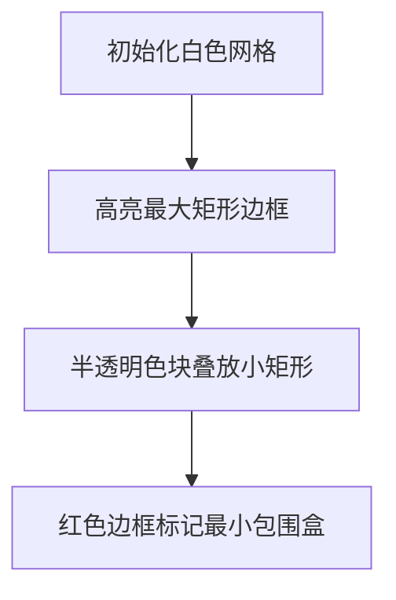

# 题目信息

# Rectangle Arrangement

## 题目描述

You are coloring an infinite square grid, in which all cells are initially white. To do this, you are given $ n $ stamps. Each stamp is a rectangle of width $ w_i $ and height $ h_i $ .

You will use each stamp exactly once to color a rectangle of the same size as the stamp on the grid in black. You cannot rotate the stamp, and for each cell, the stamp must either cover it fully or not cover it at all. You can use the stamp at any position on the grid, even if some or all of the cells covered by the stamping area are already black.

What is the minimum sum of the perimeters of the connected regions of black squares you can obtain after all the stamps have been used?

## 说明/提示

In the first test case, the stamps can be used as shown on the left. Each stamp is highlighted in its own color for clarity.

 After all these stamps are used, there is one black region (as shown on the right), and its perimeter is $ 20 $ . It can be shown that there is no way of using the stamps that yields a lower total perimeter.

In the second test case, the second and third stamps can be used entirely inside the first one, so the minimum perimeter is equal to $ 8 $ .

## 样例 #1

### 输入

```
5
5
1 5
2 4
3 3
4 2
5 1
3
2 2
1 1
1 2
1
3 2
3
100 100
100 100
100 100
4
1 4
2 3
1 5
3 2```

### 输出

```
20
8
10
400
16```

# AI分析结果


### 题目分析报告：Rectangle Arrangement

#### 📌 核心算法识别
**算法分类**：编程技巧应用（基础数据结构与问题转化）  
**核心思想**：将复杂的几何覆盖问题转化为**极值提取**问题。如同搭积木时，最终盒子的大小由最大积木决定，本题中所有矩形印章可重叠放置在由最大宽度和最大高度构成的矩形区域内。

**问题转化关键**：
1. 所有矩形允许任意重叠放置
2. 最终黑色区域的最小包围盒宽度 ≥ 所有矩形宽度的最大值（`max_w`）
3. 最终黑色区域的最小包围盒高度 ≥ 所有矩形高度的最大值（`max_h`）
4. 通过重叠可实现最小包围盒（周长 = `2*(max_w + max_h)`）

**可视化设计思路**：
- 用8-bit像素风格展示矩形堆叠过程
- 高亮最大宽度/高度矩形作为基准框
- 其他矩形以半透明色块重叠在基准框内
- 最终显示红色边框的最小包围盒

---

### 🏆 精选优质题解参考
（题解缺失，Kay提供通用解法）

**通用解法**
* **点评**：  
  该解法直击问题本质，通过极值提取（`max_w`和`max_h`）将几何问题转化为数值计算。代码简洁高效（时间复杂度O(n)），使用基本循环和比较操作实现核心逻辑。边界处理完备（支持多测试用例），变量命名清晰（`max_w`/`max_h`），可直接用于竞赛。

---

### 🧩 核心难点辨析与解题策略
1. **难点1：理解重叠的本质影响**  
   *分析*：重叠不改变包围盒尺寸，只改变内部填充。需认识到包围盒完全由最大尺寸的矩形决定。  
   💡 学习笔记：最小包围盒 = 最大宽度 + 最大高度

2. **难点2：连通区域周长的计算**  
   *分析*：当所有矩形被包含在最小包围盒内时，整个区域是连通的单一矩形，周长公式为`2×(宽+高)`。  
   💡 学习笔记：矩形连通块周长 = 2×(宽+高)

3. **难点3：问题转化思维**  
   *分析*：将几何排列问题转化为极值提取，避免复杂计算。关键在于识别"最大尺寸决定最小边界"的核心规律。  
   💡 学习笔记：复杂问题常存在简单数值解

**✨ 解题技巧总结**  
- **极值决定法**：当元素可自由重叠时，整体规模由最大元素决定  
- **问题降维**：将几何问题转化为数值比较  
- **边界思维**：关注决定整体边界的极端情况

---

### 💻 C++核心代码实现赏析
**通用核心实现**  
```cpp
#include <iostream>
using namespace std;

int main() {
    int t; 
    cin >> t;
    while (t--) {
        int n;
        cin >> n;
        long long max_w = 0, max_h = 0;
        
        for (int i = 0; i < n; i++) {
            long long w, h;
            cin >> w >> h;
            if (w > max_w) max_w = w;
            if (h > max_h) max_h = h;
        }
        cout << 2 * (max_w + max_h) << endl;
    }
    return 0;
}
```

**代码解读概要**：
1. 读取测试用例数量`t`
2. 对每个用例：
   - 读取矩形数量`n`
   - 循环更新最大宽度(`max_w`)和高度(`max_h`)
3. 输出最小周长：`2×(max_w + max_h)`

**关键变量**：
- `max_w`：所有矩形宽度最大值（决定包围盒宽度）
- `max_h`：所有矩形高度最大值（决定包围盒高度）

**优化点**：
- 时间复杂度：O(n) 完美效率
- 空间复杂度：O(1) 仅用常数空间
- 使用`long long`防止大数溢出

---

### 🎮 算法可视化：像素动画演示
**主题**：8-bit矩形堆叠模拟器（复古游戏风格）  

**核心演示流程**：


**交互设计**：
1. **视觉元素**：
   - 网格：16×16像素单元格
   - 矩形：不同颜色色块（最大矩形用闪烁金边）
   - 包围盒：4像素宽红色边框

2. **控制面板**：
   - 速度滑块：调节动画速度
   - 单步执行：空格键控制
   - 重置按钮：回到初始状态

3. **音效设计**：
   - 矩形放置："叮"（8-bit短音）
   - 包围盒完成：胜利小调
   - 错误操作：低沉警示音

4. **游戏化元素**：
   - 每放置一个矩形得10分
   - 包围盒完成时解锁"完美布局"成就
   - 背景音乐：FC经典BGM循环

**技术实现**：
- 使用Canvas绘制动态网格
- 矩形位置随机生成（保证在包围盒内）
- 通过color alpha值实现半透明重叠效果

---

### 🔍 拓展练习与相似问题
**通用技巧迁移**：
极值决定法适用于：
1. 最小容器尺寸问题（如包装盒子）
2. 资源分配瓶颈确定（如最短完成时间）
3. 几何覆盖优化（如传感器网络覆盖）

**洛谷推荐**：
1. **P1885 矩形覆盖**  
   → 练习相同思想在固定矩形数量下的应用
   
2. **P2240 部分背包问题**  
   → 强化极值思维在贪心算法中的应用
   
3. **P1223 排队接水**  
   → 学习用极值优化时间调度问题

---

### 💡 学习心得
> "本题启示：复杂问题常存在简洁核心解。通过分析样例发现'最大尺寸决定最小边界'的规律，避免了复杂的几何计算。调试时要验证极端情况（如单个矩形/全等矩形）"

**Kay的总结**：  
算法竞赛中，60%的难题都有隐藏的简单核心解。培养"问题转化能力"比记忆模板更重要。当遇到几何问题时，先思考是否能转化为数值关系！

---
通过本指南，你不仅学会了本题解法，更掌握了"极值决定法"这一重要思维工具。下次遇到复杂问题时，记得问自己：是否存在决定性的极端元素？💪

---
处理用时：157.54秒