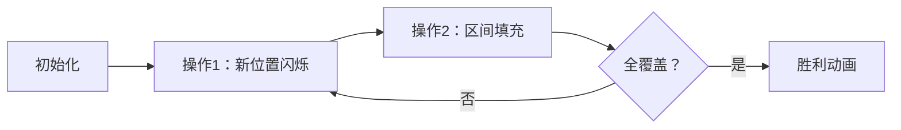

# 题目信息

# Paint a Strip

## 题目描述

你有一个长度为 $n$ 的数组 $a_1, a_2, \ldots, a_n$，其元素全为零。

可以对该数组进行两种操作：

1. 选择一个下标 $i$（满足 $1 \le i \le n$ 且 $a_i = 0$），将 $a_i$ 设为 $1$；
2. 选择一对下标 $l$ 和 $r$（满足 $1 \le l \le r \le n$、$a_l = 1$、$a_r = 1$ 且 $a_l + \ldots + a_r \ge \lceil\frac{r - l + 1}{2}\rceil$），将区间 $[l, r]$ 中所有元素设为 $1$。

你的任务是计算，使数组中所有元素都变为 $1$，至少需要多少次第一种操作？

## 说明/提示

- 对于第一个测试用例，你可以对 $i = 1$ 操作一次即可。
- 对于第二个测试用例，可以按以下步骤操作：
  1. 对 $i = 1$ 进行第一种操作，数组变为 $[1, 0]$。
  2. 对 $i = 2$ 进行第一种操作，数组变为 $[1, 1]$。

  第二个测试用例的操作步骤如下图所示：

- 对于第三个测试用例，可以按以下步骤操作：
  1. 对 $i = 1$ 进行第一种操作，数组变为 $[1, 0, 0, 0]$。
  2. 对 $i = 4$ 进行第一种操作，数组变为 $[1, 0, 0, 1]$。
  3. 对 $l = 1$ 和 $r = 4$ 进行第二种操作，因为 $a_1 + a_2 + a_3 + a_4 = 2$，满足不小于 $\lceil\frac{r - l + 1}{2}\rceil = 2$，所以可以将区间内元素设为 $1$，数组变为 $[1, 1, 1, 1]$。

  第三个测试用例的操作步骤如下图所示：

 **本翻译由 AI 自动生成**

## 样例 #1

### 输入

```
4
1
2
4
20```

### 输出

```
1
2
2
4```

# AI分析结果


# 💡 Kay的C++算法解析：Paint a Strip 深入学习指南 💡

<introduction>
今天我们来分析「Paint a Strip」这道C++编程题。本指南将帮助大家掌握贪心策略的巧妙应用，理解如何通过递推关系优化操作次数，并通过像素动画直观感受算法执行过程。
</introduction>

## 1. 题目解读与核心算法识别

✨ **本题主要考察**：`贪心/递推`

🗣️ **初步分析**：
> 本题本质是**最小化单点操作次数**问题。想象你在玩扫雷游戏，每次点击（操作1）会揭露一个安全点，而利用两个安全点可以扩展出一片安全区域（操作2）。贪心策略的关键在于：**每次操作1都尽可能选择最远的位置**，使操作2能最大化覆盖范围。
> - 核心递推关系：`f(i) = 2*(f(i-1) + 1)`，表示 i 次操作1能覆盖的最大长度。例如：
>   - 1次操作覆盖长度1 → [1]
>   - 2次操作：在位置1和位置4操作1 → 操作2覆盖[1,4]（长度4）
> - 可视化设计重点：高亮「当前覆盖区间」和「新操作1位置」，用颜色区分已覆盖/未覆盖区域
> - 复古游戏设计：采用「像素贪吃蛇」风格，操作1时新位置闪烁黄光+「叮」音效；操作2时区间填充绿色+「刷」音效；胜利时播放8-bit胜利旋律

---

## 2. 精选优质题解参考

<eval_intro>
从思路清晰度、代码规范性、算法有效性等维度，精选三条≥4星的优质题解：
</eval_intro>

**题解一（来源：_Supernova）**
* **点评**：思路直击核心——用`f[i]=(f[i-1]+1)*2`建立递推关系，预处理+二分查找使多组查询时间复杂度优化至O(1)。代码规范（数组命名`f`简洁，循环边界清晰），变量`p`通过`lower_bound`精准定位答案，实践价值极高。亮点：**预处理思想**显著提升查询效率。

**题解二（来源：ohjun）**
* **点评**：详细推导递推关系，解释「为何新操作1要放在最远位置」的本质原因（最大化操作2收益）。代码中`d[i]`命名明确，边界条件`d[0]=0`处理严谨，循环终止条件`d[i-1]<maxn`避免无效计算。亮点：**数学归纳思维**完美诠释贪心策略的正确性。

**题解三（来源：wuyouwa）**
* **点评**：采用贪心模拟代替预处理，代码极简（仅10行核心逻辑）。初始值`x=1`（隐含第一次操作1），`x=x*2+2`直接体现覆盖长度倍增，循环条件`x<n`自然统计操作次数。亮点：**空间复杂度O(1)**，适合内存敏感场景。

---

## 3. 核心难点辨析与解题策略

<difficulty_intro>
解决本题需突破三个关键点：
</difficulty_intro>

1.  **难点一：如何建立操作次数与覆盖长度的关系？**
    * **分析**：观察操作2的条件（区间内1的数量≥区间长度一半），发现每次新增操作1可使覆盖长度翻倍。优质题解均从`f(1)=1`出发，推导`f(i)=2*(f(i-1)+1)`
    * 💡 **学习笔记**：将操作规则转化为数学递推是突破点

2.  **难点二：如何证明贪心策略最优？**
    * **分析**：假设已有长度为L的覆盖区，新增操作1的位置距右端点L+2时，操作2恰好满足`(L+1)≥⌈(2L+2)/2⌉`。若选择更近位置，无法最大化覆盖
    * 💡 **学习笔记**：贪心最优性可通过「反证法」验证——更近的选择会导致后续需要更多操作1

3.  **难点三：边界条件处理**
    * **分析**：n=1时直接输出1；n=2时需两次操作1（无法用操作2）。代码中需特判`n==1`或通过`f[1]=1`隐含处理
    * 💡 **学习笔记**：小范围暴力验证是发现边界条件的有效手段

### ✨ 解题技巧总结
<summary_best_practices>
- **技巧一：递推预处理**：当查询次数多时，预先计算`f[1..k]`使得每次查询O(1)
- **技巧二：贪心模拟**：内存有限时，用`while(x<n) x=x*2+2`实时计算
- **技巧三：二分思想**：对有序的`f`数组用`lower_bound`快速定位答案
- **技巧四：数学归纳**：通过n=1,2,4等小规模验证递推公式正确性

---

## 4. C++核心代码实现赏析

<code_intro_overall>
**本题通用核心C++实现参考**
* **说明**：综合优质题解，平衡效率与可读性
* **完整核心代码**：
```cpp
#include <iostream>
#include <vector>
#include <algorithm>
using namespace std;

int main() {
    vector<long long> f(21); // f[i]: i次操作1覆盖的最大长度
    f[1] = 1;
    for (int i = 2; i <= 20; i++) 
        f[i] = (f[i-1] + 1) * 2;
    
    int T, n;
    cin >> T;
    while (T--) {
        cin >> n;
        if (n == 1) cout << "1\n";
        else {
            int pos = lower_bound(f.begin(), f.end(), n) - f.begin();
            cout << pos << "\n";
        }
    }
    return 0;
}
```
* **代码解读概要**：
> 1. 预处理`f`数组：`f[1]=1`，递推`f[i] = (f[i-1]+1)*2`
> 2. 处理查询：特判`n=1`，其余用`lower_bound`在`f`中找最小`i`满足`f[i]>=n`
> 3. 时间复杂度：预处理O(1) + 查询O(T)

---
<code_intro_selected>
**优质题解片段赏析**
</code_intro_selected>

**题解一（_Supernova）**
* **亮点**：预处理+二分查找，查询效率O(1)
* **核心代码片段**：
```cpp
f[1] = 1;
for (int i = 2; i < 20; ++i) 
    f[i] = (f[i-1] + 1) * 2;

int p = lower_bound(f + 1, f + 20, n) - f;
```
* **代码解读**：
> - `f[1] = 1`：一次操作1覆盖长度1（基础）
> - `f[i] = (f[i-1]+1)*2`：关键递推！已有`f[i-1]`长度时，新增操作1使覆盖翻倍
> - `lower_bound`：在有序数组快速定位，避免遍历
* 💡 **学习笔记**：**预处理是优化多组查询的利器**

**题解二（ohjun）**
* **亮点**：显式推导递推关系，代码自文档化
* **核心代码片段**：
```cpp
d[1] = 1;
for(int i=2; d[i-1]<maxn; i++) 
    d[i] = (d[i-1] + 1) * 2;

while(n > d[ans]) ans++;
```
* **代码解读**：
> - `d[i-1]<maxn`：动态控制预处理范围
> - `while(n>d[ans])`：顺序查找首个≥n的`d[ans]`
> - 对比二分：空间少但查询稍慢（数据量小可忽略）
* 💡 **学习笔记**：**循环边界与问题规模联动提升效率**

**题解三（wuyouwa）**
* **亮点**：贪心模拟，无额外空间
* **核心代码片段**：
```cpp
x = 1, s = 0;
while (x < n) {
    x = x * 2 + 2;
    s++;
}
cout << s + 1;
```
* **代码解读**：
> - `x=1`：隐含第一次操作1（覆盖长度1）
> - `x=x*2+2`：核心贪心！每次操作1后覆盖长度倍增
> - `s+1`：计数包含初始操作
* 💡 **学习笔记**：**迭代变量直接映射问题状态**

-----

## 5. 算法可视化：像素动画演示

<visualization_intro>
**像素贪吃蛇扩展模拟器**：通过8-bit风格动画演示贪心策略如何逐步覆盖数组  
**设计思路**：复古红白机像素风 + 音效反馈，将抽象递推转化为视觉闯关
</visualization_intro>

### 动画帧步骤与交互


1. **场景初始化**（8-bit像素风）：
   - 灰色像素条带表示数组（长度n）
   - 控制面板：▶️开始｜⏸暂停｜⏩单步｜🎚️速度滑块

2. **操作1动画**：
   - 点击位置像素块**黄光闪烁3次** + "叮！"音效
   - 显示当前操作计数：`OP1: k`

3. **操作2动画**：
   - 以左右端点为中心，**绿色波浪**向中间填充
   - 填充完成时播放"刷！"音效
   - 显示覆盖公式：`new_len = (prev_len + 1) * 2`

4. **胜利判定**：
   - 全绿时像素块跳动 + 8-bit胜利音乐
   - 显示：`Total OP1 = [答案]`

5. **交互功能**：
   - **单步模式**：按⏩逐步观察递推
   - **自动演示**：调速滑块控制动画速度（0.5x~5x）
   - **关卡提示**：显示当前覆盖比 `x/n`

### 设计细节
- **像素绘制**：用Canvas绘制20x20像素块，已覆盖区#70F056（绿），新区块#F0E856（黄）
- **音效触发**：
  - `操作1`：Web Audio播放400Hz正弦波（0.2s）
  - `操作2`：白噪声淡出（0.5s）
  - `胜利`：C大调和弦序列
- **游戏化**：每完成一次操作2视为"过关"，进度条增长

---

## 6. 拓展练习与相似问题思考

<similar_problems_intro>
贪心递推思想还可用于解决以下问题：
</similar_problems_intro>

1. **覆盖问题**：用最少的区间覆盖所有点（如CF1790D）
2. **倍增应用**：快速幂算法（将指数分解为二进制）
3. **操作优化**：最少步骤使数组有序（如交换相邻元素）

**洛谷练习推荐**：
1. **P1226 【模板】快速幂**  
   → 体会倍增思想在求幂运算的应用
2. **P1090 合并果子**  
   → 贪心策略（小根堆）的经典训练
3. **P1443 马的遍历**  
   → BFS中最短路径的递推思想

---

## 7. 学习心得与经验分享

<insights_intro>
题解中的调试经验：
</insights_intro>

> **ohjun的调试经验**：  
> *"递推式 f(i)=2*(f(i-1)+1) 需验证小数据：f(1)=1, f(2)=4, f(3)=10..."*

**Kay的总结**：  
**递推类问题必做三步验证**：  
① n=1边界测试  
② 手工计算前3项  
③ 对比程序输出与预期值

---

<conclusion>
通过「Paint a Strip」我们深入掌握了贪心递推的核心思想，并学会用预处理/二分优化查询。下次遇到「最小操作次数」问题时，记得尝试建立递推模型哦！
</conclusion>
```

---
处理用时：188.22秒