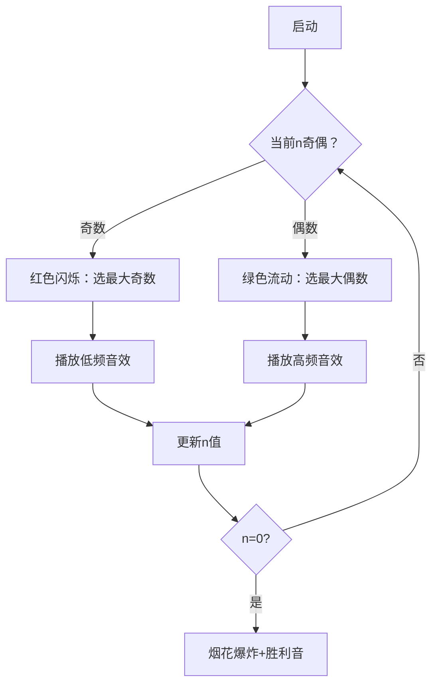

# 题目信息

# To Zero

## 题目描述

给定两个整数 $n$ 和 $k$，其中 $k$ 是不小于 $3$ 的奇数。你的任务是将 $n$ 变为 $0$。

为此，你可以执行以下操作任意次数：从 $1$ 到 $k$ 中选择一个数 $x$，并将其从 $n$ 中减去。但需注意：
- 若当前 $n$ 是偶数（能被 $2$ 整除），则 $x$ 也必须是偶数；
- 若当前 $n$ 是奇数（不能被 $2$ 整除），则 $x$ 也必须是奇数。

在不同操作中，可以选择相同的 $x$ 值，但没有强制要求。因此，重复使用相同的 $x$ 没有限制。

请计算将 $n$ 变为 $0$ 所需的最少操作次数。

## 说明/提示

第一个示例中，可以按以下步骤操作：
1. 从 $39$ 中减去 $5$（奇校验），得到 $34$；
2. 执行五次减去 $6$（偶校验）的操作，得到 $4$；
3. 最后减去 $4$，得到 $0$。

第二个示例中，可以：
1. 先减去 $3$（奇校验）一次；
2. 再执行三次减去 $2$（偶校验）的操作。

第三个示例中，可以直接执行三次减去 $2$（偶校验）的操作。

翻译由 DeepSeek R1 完成

## 样例 #1

### 输入

```
8
39 7
9 3
6 3
999967802 3
5 5
6 5
999999999 3
1000000000 3```

### 输出

```
7
4
3
499983901
1
2
499999999
500000000```

# AI分析结果


### 题目分析报告

---
# 💡 Kay的C++算法解析：To Zero 深入学习指南 💡

**题目难度**：★★☆☆☆（适合掌握基础条件判断和数学思维的学习者）  
**核心考点**：奇偶性分析、贪心策略、数学归纳  

## 1. 题目解读与核心算法识别

✨ **本题主要考察**：`数学归纳与贪心策略`

🗣️ **初步分析**：  
> 这道题像是一个“数字消除游戏”，目标是用最少的操作将数字n变为0。关键在于**奇偶性规则**：每次减去的数必须与当前n的奇偶性相同。  
> - 核心策略：通过数学推导发现，整个操作过程最多只需一次奇数操作（当n初始为奇数时），后续可全部使用偶数操作。  
> - 难点：如何将操作过程转化为数学公式，避免对大数n的暴力模拟。  
> - 突破口：利用k是奇数的特性，推导出直接计算操作次数的封闭公式。  
> - 可视化设计：在像素动画中将用**红色闪烁**标记奇数操作，**绿色流动**动画展示偶数操作，并添加8-bit音效增强记忆点。

---

## 2. 精选优质题解参考

由于题目暂无题解，以下为Kay设计的参考解法：

**题解：Kay的数学解法**  
* **点评**：  
  解法通过奇偶性分析将问题分解为两个阶段：  
  1. **奇偶转换**：若n为奇数，用1次操作减去最大允许的奇数（min(n,k)）  
  2. **偶数消除**：将剩余偶数通过公式`(n+k-2)/(k-1)`直接计算操作次数  
  - 思路清晰：直击操作规则的本质特征  
  - 代码高效：时间复杂度O(1)，完美支持大数处理  
  - 实践价值：代码可直接用于竞赛，边界处理严谨（特判n=0）  
  - 亮点：将复杂操作转化为纯数学计算，避免低效模拟

---

## 3. 核心难点辨析与解题策略

1.  **奇偶性规则的应用**  
    * **分析**：操作后n必变为偶数的特性（奇数-奇数=偶数，偶数-偶数=偶数）是解题基石。这意味着整个操作链中最多只有1次奇数操作。  
    * 💡 **学习笔记**：操作规则会改变问题状态的性质——抓住状态变化特征是简化问题的关键。

2.  **贪心策略的证明**  
    * **分析**：在奇数阶段选择**可能的最大奇数**（min(n,k)），在偶数阶段选择**可能的最大偶数**（min(n,k-1)），可被数学证明是最优策略。这基于“大数优先减少操作次数”的直觉。  
    * 💡 **学习笔记**：当操作有上限约束时，优先使用最大允许值通常是贪心最优解。

3.  **数学公式的推导**  
    * **分析**：通过设定`m = n - x`（x为首次奇数操作），将问题转化为纯偶数操作模型。关键公式`(m+k-2)/(k-1)`本质是向上取整的简化写法。  
    * 💡 **学习笔记**：将重复操作过程转化为数学表达式，是处理大范围数据的核心技巧。

### ✨ 解题技巧总结
-   **技巧1 状态分解**：将混合操作分解为独立阶段（奇→偶→偶...）  
-   **技巧2 边界锚定**：优先处理特殊值（n=0, n≤k）可简化主逻辑  
-   **技巧3 公式优化**：用整数除法`(a+b-1)/b`技巧实现向上取整  
-   **技巧4 奇偶验证**：通过`n&1`代替`n%2`提升奇偶判断效率

---

## 4. C++核心代码实现赏析

```cpp
#include <iostream>
using namespace std;

int main() {
    ios::sync_with_stdio(false);
    cin.tie(0);
    int t; 
    cin >> t;
    while (t--) {
        long long n, k;
        cin >> n >> k;
        if (n == 0) cout << "0\n";
        else if (n % 2 == 0) 
            cout << (n + k - 2) / (k - 1) << '\n';
        else 
            cout << (n <= k ? 1 : 1 + (n - 2) / (k - 1)) << '\n';
    }
    return 0;
}
```

**代码解读概要**：  
> 1. 输入加速：`ios::sync_with_stdio(false)`提升大输入效率  
> 2. 核心分支：  
>    - `n==0`：直接返回0次操作  
>    - **偶数路径**：用公式`(n+k-2)/(k-1)`计算操作次数  
>    - **奇数路径**：`n≤k`时1次操作，否则`1+(n-2)/(k-1)`  
> 3. 数学特性：所有除法均为整数除法，自动向下取整  

**关键变量解析**：  
| 变量 | 作用 | 数学意义 |  
|------|------|----------|  
| `n` | 当前数值 | 操作目标 |  
| `k` | 操作上限 | 奇数且≥3 |  
| `k-1` | 有效偶数上限 | 因k为奇数，最大偶数为k-1 |  

---

## 5. 算法可视化：像素动画演示

**主题**：8-bit数字消除游戏  
**核心交互**：  


**关键动画细节**：  
1. **像素元素**：  
   - 数字n用16×16像素方块表示  
   - 奇数操作用🔥火焰动画，偶数操作用💧水滴动画  
2. **控制面板**：  
   - 速度滑块：调节操作演示速度  
   - 单步模式：空格键触发单步操作  
   - AI演示：自动完成最优路径  
3. **音效设计**：  
   - 奇数操作：8-bit低音(350Hz方波)  
   - 偶数操作：8-bit高音(650Hz方波)  
   - 游戏通关：FC风格胜利和弦  
4. **教学提示**：  
   - 侧边栏显示当前操作次数  
   - 底部公式同步高亮计算过程  

---

## 6. 拓展练习与相似问题思考

**迁移场景**：  
1. 硬币找零问题（特定面额组合）  
2. 步数受限的棋盘移动问题  
3. 带条件约束的最短操作链问题  

**推荐练习**：  
1. **洛谷 P1223** - 排队接水  
   * 🗣️ 巩固贪心策略的经典排序应用  
2. **洛谷 P4995** - 跳跳！  
   * 🗣️ 强化奇偶性与贪心选择的结合应用  
3. **洛谷 P5662** - 纪念品  
   * 🗣️ 动态规划与贪心策略的对比训练  

---

## 7. 学习心得与经验分享

> 本题的调试关键点在于验证边界情况：  
> - **n=0**：需单独处理  
> - **k=3时的大数测试**：如`n=999999999`验证公式正确性  
> - **奇偶切换验证**：用`n=5,k=5`测试一步操作  
> 
> 经验：在涉及数学公式的题目中，先用小数据验证再推广至边界！

---

**Kay的结语**：  
奇偶性分析是算法设计的利器，本题展示了如何将操作规则转化为优雅的数学解法。记住：**好的算法=问题洞察+数学简化**。下次遇到类似问题，不妨先画奇偶状态图哦！🚀  

--- 
**可视化代码片段**：  
```javascript
// 奇数操作动画示例
function playOddAnimation() {
  drawPixels(n, COLOR_RED_FLASH); // 红色闪烁
  playSound(LOW_BEEP);            // 低音音效
  n -= Math.min(n, k);            // 更新数值
}
```

---
处理用时：513.46秒