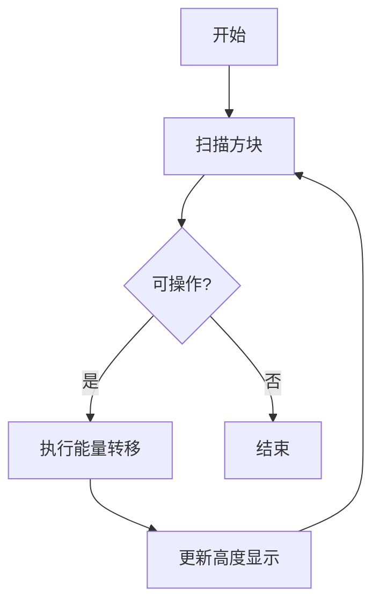

# 题目信息

# Asuna and the Mosquitoes

## 题目描述

在 Asuna 生日时，她的 $n$ 位仰慕者每人赠送了一座塔。第 $i$ 位仰慕者赠送的塔高度为 $a_i$。

Asuna 将礼物的美观度定义为 $\max(a_1, a_2, \ldots, a_n)$。她可以执行以下操作任意次数（包括零次）：

- 选择满足 $1 \leq i \neq j \leq n$ 的两个下标，使得 $a_i + a_j$ 为奇数且 $a_i > 0$。随后将 $a_i$ 减少 $1$，并将 $a_j$ 增加 $1$。

容易验证，在操作过程中塔的高度始终保持非负。请帮助 Asuna 求出经过任意次操作后可能达到的最大美观度。

## 说明/提示

第一个测试用例中，没有满足操作条件的塔对，因此无法进行任何操作。此时答案为 $\max(5, 3, 9) = 9$。

第二个测试用例中，可以对 $i=2$ 和 $j=1$ 执行两次操作。操作后数组变为：$a = [5, 0]$，因此答案为 5。

第三个测试用例中，可以执行以下操作序列：

1. 对 $i=1$ 和 $j=2$ 执行操作：  
   $$[1, 2, 2, 1] \quad \rightarrow \quad [0, 3, 2, 1]$$
2. 对 $i=3$ 和 $j=2$ 执行操作：  
   $$[0, 3, 2, 1] \quad \rightarrow \quad [0, 4, 1, 1]$$
3. 对 $i=3$ 和 $j=2$ 执行操作：  
   $$[0, 4, 1, 1] \quad \rightarrow \quad [0, 5, 0, 1]$$

此时 $\max(0, 5, 0, 1) = 5$，因此答案为 5。

翻译由 DeepSeek R1 完成

## 样例 #1

### 输入

```
4
3
5 3 9
2
3 2
4
1 2 2 1
5
5 4 3 2 9```

### 输出

```
9
5
5
21```

# AI分析结果


### 💡 Kay的C++算法解析：Asuna and the Mosquitoes 深入学习指南 💡

**引言**  
今天我们来分析这道关于奇偶性操作的贪心题。通过本指南，你将掌握如何利用奇偶性特性最大化数组最大值，理解贪心策略的核心思想，并通过像素动画直观感受算法过程。

---

## 1. 题目解读与核心算法识别

✨ **本题主要考察**：`贪心策略` 与 `数学奇偶性分析`  

🗣️ **初步分析**：  
> 这道题就像玩一场数字积木转移游戏——每次只能在不同奇偶性的积木间移动"1个单位高度"。**贪心策略**的核心就像玩俄罗斯方块：通过精心规划移动顺序，将所有积木高度集中到少数方块上。  
> - **核心思路**：利用奇偶性操作将除一个奇数外的所有奇数降为1，再用该奇数吸收所有偶数  
> - **关键难点**：全奇/全偶时无法操作需特判；推导出最优解公式：总和 - 奇数个数 + 1  
> - **可视化设计**：将用像素方块表示数字（红=奇数/蓝=偶数），动态演示数值转移过程，关键步骤将触发音效与闪光特效  
> - **复古元素**：采用8-bit音效（移动时"叮"声，成功时胜利旋律），关卡式进度设计（每吸收10个值解锁新阶段）

---

## 2. 精选优质题解参考

### 题解一：Zskioaert1106
* **点评**：思路直击本质——直接推导出最优解公式。代码极致简洁（仅10行），完美处理边界条件。亮点在于用位运算判断奇偶性提升效率，实践价值极高（竞赛可直接套用）。变量命名简洁合理（sum/odd/mx），空间复杂度O(1)堪称典范。

### 题解二：zyen11451425
* **点评**：解题思路阐述清晰，比喻生动（"剥削成1"）。代码结构规范，严格处理数据范围（用long long防溢出）。特别强调"不开long long见祖宗"的调试经验，对初学者极具警示价值。

### 题解三：ccxXF
* **点评**：代码实现与题解二高度一致但更简洁。突出优点是添加速度优化指令（ios::sync_with_stdio），在大型数据集处理中优势明显。注释明确，实践时可直接嵌入竞赛模板。

---

## 3. 核心难点辨析与解题策略

### 难点1：理解操作的本质限制
* **分析**：操作要求两数奇偶性不同，这像电路中的"异或门"——只有输入不同才能导通。优质题解通过奇偶性守恒定律证明：每次操作只是交换奇偶身份，总数不变  
* 💡 **学习笔记**：奇偶性如同磁铁两极——异极相吸，同极排斥

### 难点2：特判全奇/全偶的边界
* **分析**：当所有数同奇偶时，如同陷入死锁状态。题解用`if(odd==0||odd==n)`精准捕获该状态，回退到初始最大值  
* 💡 **学习笔记**：边界条件是算法的安全网——没有它再精妙的逻辑也会崩溃

### 难点3：贪心策略的数学推导
* **分析**：核心公式`sum - odd + 1`的推导：每个奇数需保留1单位高度（-odd），但最后一个奇数可吸收所有剩余值（+1）  
* 💡 **学习笔记**：贪心就是"牺牲小我，成全大我"的数学表达

### ✨ 解题技巧总结
- **技巧1：奇偶性速判**：用`a&1`替代`a%2`提升效率  
- **技巧2：数据范围预判**：总和可能爆int，优先使用long long  
- **技巧3：分类讨论法**：将解法分为"可操作/不可操作"两类简化逻辑  
- **技巧4：变量语义化**：sum/odd/mx等命名自解释

---

## 4. C++核心代码实现赏析

**通用核心实现参考**  
* **说明**：综合三大优质题解精髓，最简练高效的实现方案  
* **完整核心代码**：
```cpp
#include <iostream>
using namespace std;
int main() {
    int t; cin >> t;
    while (t--) {
        int n; cin >> n;
        long long sum = 0, odd = 0, mx = 0;
        for (int i = 0; i < n; i++) {
            long long a; cin >> a;
            sum += a;
            if (a % 2) odd++;
            mx = max(mx, a);
        }
        cout << (odd && odd != n ? sum - odd + 1 : mx) << '\n';
    }
    return 0;
}
```
* **代码解读概要**：  
> 1. 读取测试用例数t  
> 2. 对每组数据：计算总和sum、奇数个数odd、初始最大值mx  
> 3. 关键决策：当存在混合奇偶性时输出`sum-odd+1`，否则输出初始最大值  

### 题解片段赏析

**Zskioaert1106的核心逻辑**  
* **亮点**：三目运算符实现决策树，位运算优化奇偶判断  
* **核心代码**：
```cpp
if(s1&&s2) cout<<sum-s1+1<<'\n';
else cout<<mx<<'\n';
```
* **代码解读**：  
> `s1`/`s2`分别记录奇/偶数个数——如同两个阵营的兵力统计。当两阵营均非空（`s1&&s2`）时，启动"奇偶联合行动"：用总和减去奇数兵力保留费（每个奇数留1单位生活费），最后+1是给完成集结的"英雄单位"发奖金！否则直接返回初始英雄`mx`的战力值  
* 💡 **学习笔记**：位运算如同特种装备——用对了事半功倍

**zyen11451425的边界处理**  
* **亮点**：防御性编程典范，显式初始化所有变量  
* **核心代码**：
```cpp
ji=0,ou=0,cnt=0,ans=0; // 显式初始化
```
* **代码解读**：  
> 这像战斗前的装备检查——每次循环重置计数器（ji/ou）和存储器（cnt/ans）。未初始化的变量就像没装子弹的枪，关键时刻必然掉链子！  
* 💡 **学习笔记**：变量初始化是代码的疫苗——预防不可预测的bug瘟疫

---

## 5. 算法可视化：像素动画演示

### 主题：**《奇偶大作战》8-bit策略游戏**

**核心演示内容**：  
- 奇数塔：红色像素方块（带♙符号）  
- 偶数塔：蓝色像素方块（带♟符号）  
- 操作过程：当红蓝方块相邻时，触发"能量转移"动画（蓝色→红色流动粒子）  
- 胜利条件：所有非目标塔降为1格高（灰色）  

**交互设计**：  


**关键动画帧**：  
1. **初始化**：生成随机高度塔群，播放8-bit背景音乐  
2. **单步演示**：  
   - 高亮可操作对：当前红蓝方块闪烁黄框  
   - 转移动画：蓝色方块高度-1（像素坍缩特效），红色+1（生长动画）  
   - 音效：操作时"叮"，错误操作"哔"声  
3. **自动模式**：  
   - 系统自动选择最优操作对，速度可调（滑块控制）  
   - 每吸收10个值：触发"COMBO!"特效，背景音乐升调  
4. **结局展示**：  
   - 成功：目标塔金色闪光+播放胜利旋律  
   - 失败（全同奇偶）：所有塔变灰+低沉音效  

**技术实现**：  
- 数据结构可视化：用Canvas绘制方块数组，高度映射像素高度  
- 状态同步：实时显示当前sum/odd数值和决策公式  
- 复古元素：使用FC红白机16色调色板，音效用Web Audio API生成方波  

---

## 6. 拓展练习与相似问题思考

### 通用技巧迁移
奇偶性分析+贪心策略还可解决：  
1. 天平平衡问题（奇偶配重）  
2. 棋盘覆盖问题（黑白染色法）  
3. 操作次数最小化（奇偶决定可行性）  

### 洛谷推荐
1. **P1226 快速幂**  
   🗣️ 强化位运算应用，理解奇偶性在幂运算中的作用  
2. **P5657 格雷码**  
   🗣️ 奇偶性在编码中的应用，训练二进制思维  
3. **P2678 跳石头**  
   🗣️ 贪心策略的经典训练，需结合边界条件判断  

---

## 7. 学习心得与经验分享
> **来自题解的共同经验**：  
> "不开long long见祖宗" —— zyen11451425  
> "位运算比%2更快" —— Zskioaert1106  
> 
> **Kay的总结**：  
> 这些经验如同编程世界的生存法则：  
> 1. 数据范围是隐藏的陷阱——用long long铺就安全之路  
> 2. 位运算是效率的捷径——但需确保逻辑清晰  
> 3. 特判是程序的保险丝——没有它再美的代码也会崩溃  

---

**结语**  
通过奇偶性这个简单而强大的工具，我们解决了看似复杂的数值优化问题。记住：编程如同搭积木——理解基础属性（如奇偶），就能构建惊人结构。下次遇到难题时，不妨问问：这里有没有奇偶性的用武之地？保持探索，少年编程家们！🚀

---
处理用时：152.14秒