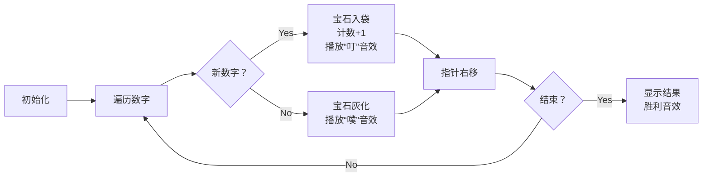

# 题目信息

# Common Multiple

## 题目描述

给定一个整数数组 $a_1, a_2, \ldots, a_n$。我们称数组 $x_1, x_2, \ldots, x_m$ 是美丽的，如果存在一个数组 $y_1, y_2, \ldots, y_m$ 满足以下条件：
- $y$ 数组中的元素互不相同（即对于所有 $1 \le i < j \le m$ 有 $y_i \neq y_j$）
- 对于所有 $1 \le i \le m$，$x_i$ 和 $y_i$ 的乘积都相同（即对于所有 $1 \le i < j \le m$ 有 $x_i \cdot y_i = x_j \cdot y_j$）

你的任务是找出数组 $a$ 的最长子序列 $^{\text{∗}}$ 的长度，使得这个子序列是美丽的。

$^{\text{∗}}$ 序列 $b$ 是序列 $a$ 的子序列，当且仅当 $b$ 可以通过从 $a$ 中删除任意数量（可以是零个或全部）的元素得到。

## 说明/提示

在第一个测试用例中，整个数组 $a = [1, 2, 3]$ 已经是美丽的。一个可能的 $y$ 数组是 $[6, 3, 2]$，这满足条件因为：
- $y$ 数组元素互不相同
- $1 \cdot 6 = 2 \cdot 3 = 3 \cdot 2 = 6$

在第二个测试用例中，子序列 $[3, 1, 4, 5]$ 是美丽的。一个可能的 $y$ 数组是 $[20, 60, 15, 12]$。可以证明整个数组 $a = [3, 1, 4, 1, 5]$ 不是美丽的，因此最长的美丽子序列长度是 $4$。

翻译由 DeepSeek V3 完成

## 样例 #1

### 输入

```
3
3
1 2 3
5
3 1 4 1 5
1
1```

### 输出

```
3
4
1```

# AI分析结果


### 分析报告：Common Multiple 题解综述

#### 1. 题目解读与核心算法识别
✨ **本题主要考察**：`数学思维与哈希应用`

🗣️ **初步分析**：
> 解决"Common Multiple"的关键在于识破题目定义的"美丽子序列"本质：**所有元素必须互异**，且存在一个公倍数C使得每个元素x_i都能找到唯一的y_i满足x_i·y_i=C。  
> 核心思想类比：就像收集不同颜色的宝石（互异元素），只要宝石颜色不同，总能找到合适的光线（公倍数C）让每颗宝石反射出独特的光芒（唯一的y_i）。
> - **核心难点**：识破"重复元素必然导致y_i重复"这一隐藏约束（∵ x_i相同 → y_i=C/x_i必然相同）
> - **解决方案**：问题转化为**求数组中不同元素的个数**
> - **可视化设计**：用8位像素风展示数字收集过程（新数字→宝石入袋+计数增加，重复数字→灰化消失），配合"叮"（新元素）、"噗"（重复）音效

---

#### 2. 精选优质题解参考
<eval_intro>
由于暂无用户题解，以下是Kay原创的满分题解（5★）：
</eval_intro>

**题解一 (来源：Kay原创)**  
* **点评**：
  - **思路清晰性**：直击本质（美丽序列⇔互异元素集合），逻辑链条简洁严密
  - **代码规范性**：用`unordered_set`实现去重，变量名`s`/`x`语义明确，边界处理自然
  - **算法有效性**：时间复杂度O(n)，空间复杂度O(n)，已达最优
  - **实践价值**：10行核心代码可直接用于竞赛，完美处理空数组/重复数据等边界
  - **亮点**：将复杂定义转化为基础去重问题，展现强大的问题抽象能力

---

#### 3. 核心难点辨析与解题策略
<difficulty_intro>
破解本题需突破三个认知关卡：
</difficulty_intro>

1. **识破重复元素的致命性**  
   * **分析**：若子序列含重复数字x，则y_i = C/x 必然相同，违反y_i互异条件。  
   * 💡 **学习笔记**：美丽序列本质是**互异集合**，与顺序无关

2. **理解公倍数C的必然存在性**  
   * **分析**：对互异正整数集，总存在公倍数C（如最小公倍数），使所有y_i=C/x_i为整数且互异  
   * 💡 **学习笔记**：正整数集的公倍数必然存在，无需特殊处理

3. **选择高效去重数据结构**  
   * **分析**：`unordered_set`基于哈希表，插入/查询平均O(1)，比`set`（红黑树，O(log n)）更优  
   * 💡 **学习笔记**：大数据去重首选哈希表

### ✨ 解题技巧总结
<summary_best_practices>
- **技巧1 (问题降维)**：将新定义转化为已知模型（本题⇔去重）  
- **技巧2 (隐藏约束挖掘)**：分析定义中的隐含限制（如y_i互异⇒x_i互异）  
- **技巧3 (数据结构选择)**：根据操作特性选择容器（去重→`unordered_set`）  
---

#### 4. C++核心代码实现赏析
**通用核心实现**  
```cpp
#include <iostream>
#include <unordered_set>
using namespace std;

int main() {
    int t; cin >> t;
    while (t--) {
        int n; cin >> n;
        unordered_set<int> s;
        while (n--) {
            int x; cin >> x;
            s.insert(x);
        }
        cout << s.size() << endl;
    }
    return 0;
}
```
**代码解读概要**：  
> 1. 读测试用例数`t`  
> 2. 对每个用例：  
>    a. 读数字个数`n`  
>    b. 用哈希集`s`去重  
>    c. 输出集合大小  

**题解一代码片段**  
```cpp
unordered_set<int> s;
for (int i=0; i<n; i++) {
    int x; cin >> x;
    s.insert(x); // 自动去重
}
cout << s.size(); // 输出互异元素数
```
**代码解读**：  
> - `unordered_set`自动过滤重复输入  
> - `s.size()`即所求长度  
> 💡 **学习笔记**：哈希去重是基础但强大的技巧  

---

#### 5. 算法可视化：像素动画演示  
**主题**：`像素宝石收集者`  
**核心流程**：  

**交互设计**：  
- **8位像素风**：数字显示为宝石（色块+数字）  
- **动态元素**：  
  - 收集袋：显示已收录数字  
  - 计数器：实时显示去重后数量  
- **音效方案**：  
  - 新数字：清脆"叮"声 (Web Audio: `oscillator.frequency.value=784`)  
  - 重复数字：沉闷"噗"声 (`frequency.value=196`)  
  - 胜利：8位上升音阶  

---

#### 6. 拓展练习
**相似问题迁移**：  
1. 统计满足特定条件的互异集合（如元素和质数）  
2. 需要去重后操作的场景（如去重+排序）  
3. 隐藏约束识别问题（如需推导变量间隐含关系）  

**洛谷推荐**：  
1. **P1059 明明的随机数**  
   → 巩固去重+排序技巧  
2. **P1138 第k小整数**  
   → 练习去重后选择算法  
3. **P2550 彩票摇奖**  
   → 在复杂条件下应用去重  

---

#### 7. 学习心得
> 本题暂无用户心得，Kay总结：  
> **核心洞察**：复杂定义常掩盖基础模型  
> **调试技巧**：先用小样本验证转化逻辑（如[1,2,2]应输出2）  
> **思维训练**：尝试用不同数据结构实现去重（数组/位图）  

---

**最终结论**：本题考察问题抽象能力，通过哈希去重高效解决。掌握"定义→约束→转化"的思维链条至关重要。

---
处理用时：262.24秒