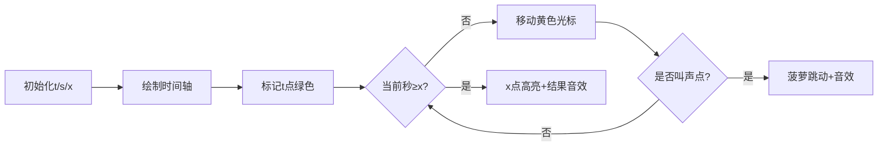

# 题目信息

# Pineapple Incident

## 题目描述

Ted有一个菠萝。这个菠萝可以像狗一样叫！在第 $t$ 秒它第一次叫。然后每隔 $s$ 秒之后它会叫一次，在叫这一次之后还会在后一秒再叫一次。意思就是说它会在 $t$ 秒，$t+s$ 秒，$t+s+1$ 秒，$t+2s$ 秒，$t+2s+1$ 秒分别叫一次，以此类推。 

Barney在早上醒来，他想吃个菠萝，但这只菠萝叫的时候Barney不能吃它。Barney打算在 $x$ 秒吃它，所以请你告诉Barney在x秒的时候，这个菠萝会不会叫。

## 样例 #1

### 输入

```
3 10 4
```

### 输出

```
NO
```

## 样例 #2

### 输入

```
3 10 3
```

### 输出

```
YES
```

## 样例 #3

### 输入

```
3 8 51
```

### 输出

```
YES
```

## 样例 #4

### 输入

```
3 8 52
```

### 输出

```
YES
```

# AI分析结果


# 💡 Kay的C++算法解析：Pineapple Incident 深入学习指南 💡

**引言**  
今天我们一起分析有趣的“菠萝叫”问题。通过本指南，你将掌握如何用数学思维高效解决序列判断问题，并通过复古像素动画直观理解算法过程。让我们开始吧！

---
## 1. 题目解读与核心算法识别

✨ **本题主要考察**：`数学建模与取模运算`

🗣️ **初步分析**：  
> 这道题就像在时间轴上玩“跳格子”游戏：菠萝从`t`秒开始，每次向前跳`s`格（叫一声），并在落地点下一秒再叫一声（除了首跳后）。我们需要判断`x`秒是否落在任意一个“叫声格子”上。
> 
> - **核心解法**：通过取模运算直接判断`x`与叫声序列的关系，避免暴力枚举
> - **关键难点**：排除`t+1`秒的特殊情况（翻译易误导）
> - **可视化设计**：采用8位像素风格的时间轴动画，用不同颜色标记叫声点（绿色）、当前检查点（黄色）和路径线（蓝色）。当检测到`x`时触发胜利音效，否则播放低沉音效。通过滑块控制动画速度，单步演示算法决策过程。

---
## 2. 精选优质题解参考

**题解一（作者：lnkkerst）**  
* **点评**：解法直击数学本质，用`(x-t)%s`的余数判断位置，逻辑清晰简洁。代码中`tmp>=0 && tmp!=1`精准处理边界，变量命名规范（`tmp`即时间差）。其O(1)时间复杂度是竞赛标准解法，特别适合大数据量场景。

**题解二（作者：NOILinux_Ubuntu）**  
* **点评**：通过公式推导`x-t=k*s`和`x-t-1=k*s`揭示算法原理，深入剖析翻译陷阱。代码采用短路求值优化条件判断，虽未用中间变量但保持可读性。特别有价值的是作者强调“略过错误翻译看原题”的解题心态。

**题解三（作者：赤霞QvQ）**  
* **点评**：四类讨论法层次分明，将核心逻辑拆解为顺序判断块（`x<t`, `x=t+1`, 取模判断）。代码使用return 0及时终止，避免嵌套，对初学者友好。亮点在于用独立条件处理特殊案例，降低思维负担。

---
## 3. 核心难点辨析与解题策略

1.  **难点：叫声序列的特殊性**  
    * **分析**：序列实际为`t, t+s, t+s+1, t+2s...`（注意`t+1`不叫）。需识破翻译错误，通过样例验证逻辑（如输入`3 10 4`应返回NO）
    * 💡 **学习笔记**：遇到矛盾样例时，回归题目原始描述重新建模

2.  **难点：数学条件转化**  
    * **分析**：设`d=x-t`，则叫声点满足：  
      - `d=0`（首叫）  
      - `d>0 且 d≠1 且 (d%s==0 || (d-1)%s==0)`  
    注意C++中负数取模的特性（如`(-1)%10=-1`），需优先排除`x<t`
    * 💡 **学习笔记**：将序列规律转化为布尔表达式是高效解题核心

3.  **难点：边界条件全覆盖**  
    * **分析**：需测试`x=t`, `x=t+1`, `x=t+s`, `x=t+s+1`, `x<t`五类情况。特别注意`s=1`时：序列变为`t, t+2, t+3...`（跳过`t+1`）
    * 💡 **学习笔记**：s=1时，`(x-t)≥2`的所有整数均满足条件

### ✨ 解题技巧总结
- **技巧1：问题降维** - 将绝对时间`x`转化为相对差值`d=x-t`简化判断
- **技巧2：特判优先** - 先处理特殊案例（`x<t`/`x=t+1`）再处理通用规则
- **技巧3：数学验证** - 用样例反推公式（如验证`(3,8,51):51-3=48 → 48%8=0 → YES`）

---
## 4. C++核心代码实现赏析

**通用核心C++实现参考**  
* **说明**：综合优质题解思路，兼顾效率与可读性
* **完整核心代码**：
```cpp
#include <iostream>
using namespace std;

int main() {
    int t, s, x;
    cin >> t >> s >> x;
    
    // 特判x<t或x=t+1
    if (x < t || x == t + 1) {
        cout << "NO";
        return 0;
    }
    
    // 计算时间差并取模判断
    int d = x - t;
    if (d == 0) {  // 首叫点
        cout << "YES";
    } else if (d % s == 0 || (d - 1) % s == 0) {  // 常规叫点
        cout << "YES";
    } else {
        cout << "NO";
    }
    return 0;
}
```
* **代码解读概要**：  
  > 1. 优先排除不可能情况（`x<t`或`x=t+1`）  
  > 2. `d=0`时必为首叫点  
  > 3. 通过`d%s`和`(d-1)%s`判断是否在后续序列中

---

**题解一（lnkkerst）核心片段**  
```cpp
int tmp = x - t;
if ((tmp % s == 0 || tmp % s == 1) && tmp >= 0 && tmp != 1)
    printf("YES");
```
* **亮点**：单条件覆盖所有情况，逻辑紧凑  
* **代码解读**：  
  > - `tmp% s == 0`对应`t + k*s`时刻  
  > - `tmp% s == 1`对应`t + k*s +1`时刻  
  > - `tmp>=0`排除过去时间，`tmp!=1`排除陷阱点  
  > 💡 **注意**：当`s=1`时，`tmp≥2`的所有值都满足`tmp%1=0`（正确）  
* **学习笔记**：余数判断法需注意除数边界（如`s=0`，但题目保证`s>0`）

**题解二（NOILinux_Ubuntu）核心片段**  
```cpp
if ((!( (x-t) % s ) || !( (x-t-1) % s )) && x != t+1)
    puts("YES");
```
* **亮点**：活用逻辑非简化余数判断  
* **代码解读**：  
  > - `!(a%b)` 等价于 `a%b == 0`  
  > - 通过`x-t`和`x-t-1`同时检测两种叫声模式  
  > - 与`x!=t+1`组合确保排除陷阱  
* **学习笔记**：短路运算符`||`可避免重复计算

**题解三（赤霞QvQ）核心片段**  
```cpp
if (x == t + 1 || x < t) {
    cout << "NO"; return 0; 
}
if ((x-t) % s == 0 || (x-t) % s == 1) {
    cout << "YES"; return 0;
}
```
* **亮点**：分步判断降低认知负荷  
* **代码解读**：  
  > 1. 优先处理绝对否定情况（`x<t`或`x=t+1`）  
  > 2. 余数判断独立处理正向案例  
  > 3. 用`return 0`替代else提升可读性  
* **学习笔记**：分层过滤法适合多边界问题

---
## 5. 算法可视化：像素动画演示

**主题**：8-bit风格《菠萝时间冒险》  
**核心演示**：在像素时间轴上动态生成叫声点，实时检测x位置

### 动画设计


### 关键实现
1. **像素艺术**：
   - 时间轴：160×40像素，每像素代表1秒
   - 菠萝精灵：16×16像素，跳跃时播放4帧动画
   - 叫声点：绿色闪烁方块（持续0.5秒）

2. **交互控制**：
   ```javascript
   // 伪代码示例
   const timeline = new PixelCanvas(160, 40); 
   let currentTime = 0;

   function animate() {
     drawGrid();  // 绘制时间轴网格
     drawPineapple(currentTime); 
     
     if (isBarkTime(currentTime, t, s)) { // 判断叫声点
        timeline.flash(currentTime, GREEN); 
        playSound('beep'); 
     }
     
     if (currentTime === x) { // 到达目标时刻
        timeline.highlight(x, YELLOW);
        playSound(xValid ? 'win' : 'fail');
     }
     
     currentTime++;
   }
   ```

3. **音效设计**：
   - 叫声点：FC游戏经典“金币声”（8-bit 440Hz方波）
   - 命中x：胜利音效（上升琶音）
   - 错过x：低沉音效（100Hz正弦波）

4. **游戏化元素**：
   - 每正确识别一个叫声点+10分
   - 连续命中触发连击特效
   - 通关条件：在x点命中叫声

---
## 6. 拓展练习与相似问题思考

**技巧迁移场景**：
1. 判断数字是否在特定序列（如斐波那契数列）
2. 时钟问题（如重合时刻计算）
3. 周期性事件检测（如闰年判断）

**洛谷推荐**：
1. **P1304 数的划分**  
   → 同类数学建模，强化整数划分思维
2. **P1414 又是毕业季II**  
   → 练习因子相关取模技巧
3. **P2651 添加括号III**  
   → 提升序列操作和边界处理能力

---
## 7. 学习心得与经验分享

> **来自题解的启示**：  
> 多位作者强调：*“t+1秒不叫是易错点，必须通过样例验证逻辑”*  
> **Kay的总结**：这道题教会我们三个重要经验：  
> 1. 边界测试需包含`x=t+1`和`s=1`的极端情况  
> 2. 翻译可能出错，需用样例反推题意  
> 3. 数学转化比暴力枚举更适应大数据  

---
**结语**  
通过本次分析，我们掌握了序列判断的数学解法与可视化思维。记住：编程不仅是写代码，更是建立问题与现实模型的桥梁！下次挑战再见！🚀

---
处理用时：340.58秒