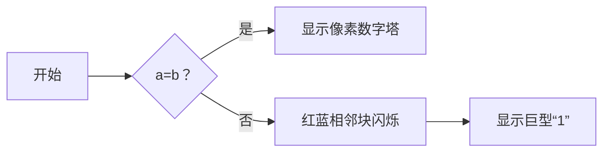

# 题目信息

# Complicated GCD

## 题目描述

【问题描述】 给你若干个整数，它们是a,a+1,a+2,…,b，请求出它们的最大公约数，即 gcd(a, a+1, a+2, …, b)。

## 样例 #1

### 输入

```
1 2
```

### 输出

```
1
```

## 样例 #2

### 输入

```
61803398874989484820458683436563811772030917980576 61803398874989484820458683436563811772030917980576
```

### 输出

```
61803398874989484820458683436563811772030917980576
```

# AI分析结果


### 💡 Kay的C++算法解析：Complicated GCD 深入学习指南 💡

#### 引言
今天我们来分析求区间 `[a, b]` 所有整数最大公约数（GCD）的题目。题目数据范围极大（10¹⁰⁰），需要巧妙解法而非暴力计算。

---

## 1. 题目解读与核心算法识别
✨ **本题主要考察**：`数学证明与性质应用`

🗣️ **初步分析**：
> 解决本题的关键在于发现数学性质而非复杂算法。**相邻自然数互质**是核心突破口：
> - **数学比喻**：想象一排连续数字像多米诺骨牌，相邻两张牌之间没有共同支撑点（公约数），因此整排只能由最小单位"1"支撑
> - **核心流程**：只需比较 `a` 和 `b` 是否相等 → 相等输出 `a`，不等输出 `1`
> - **可视化设计**：像素动画中将用相邻色块闪烁（红→蓝）表示互质关系，配合"叮"音效强化概念

---

## 2. 精选优质题解参考
**题解一（fsy_juruo）**
* **点评**：通过辗转相除法严谨证明相邻数互质，代码简洁高效。亮点在于：
  - 用 `gcd(a+1,a)=gcd(a,1)=1` 三行完成数学证明
  - 字符串比较完美规避大数问题
  - 边界处理明确（`a==b` 分支）

**题解二（hensier）**
* **点评**：双角度证明互质性（反证法+代数推导），提供多语言实现。亮点：
  - 反证法证明：假设存在公约数 `p>1` 会推导出 `p=1` 矛盾
  - 展示三种代码范式（C数组/C++字符串/运算符重载）

**题解三（andyli）**
* **点评**：最精简的工业级实现，亮点：
  - 直接调用 `strcmp` 进行大数比较
  - 逻辑表达式内联 `a==b ? a : 1`
  - 适合竞赛场景的高效编码风格

---

## 3. 核心难点辨析与解题策略
1. **难点：突破暴力计算思维**
   * **分析**：数据范围 10¹⁰⁰ 排除遍历可能，需发现数学性质
   * 💡 学习笔记：遇到极大数时优先寻找数学规律

2. **难点：理解互质链式效应**
   * **分析**：若区间含相邻数，因 `gcd(n,n+1)=1`，整个区间 GCD 必为 1
   * 💡 学习笔记：相邻数互质是数论基石性质

3. **难点：大数比较实现**
   * **分析**：用字符串代替数值，比较长度和逐位字符
   * 💡 学习笔记：`string` 类型天然支持字典序比较

✨ **解题技巧总结**
- **性质迁移**：将数论性质转化为代码分支（`a==b` 是唯一特殊情况）
- **规避计算**：用逻辑判断代替实际求 GCD 操作
- **防御性编码**：字符串比较避免数值溢出

---

## 4. C++核心代码实现赏析
**通用核心实现**
```cpp
#include <iostream>
#include <string>
using namespace std;

int main() {
    string a, b;
    cin >> a >> b;         // 读入大数字符串
    cout << (a == b ? a : "1"); // 核心逻辑
    return 0;
}
```
* **说明**：综合优质题解的最简实现
* **解读概要**：通过字符串直接比较替代数值运算，三元运算符实现分支逻辑

---

**题解一片段赏析**
```cpp
if(a==b) cout<<a<<endl;  
else puts("1");
```
* **亮点**：极简分支结构
* **解读**：当 `a` 和 `b` 字符串完全相同时输出原值，否则输出"1"。如同判断两个单词是否完全相同
* 💡 学习笔记：字符串比较自动处理前导零和长度差异

---

## 5. 算法可视化：像素动画演示
**设计主题**：`数字多米诺：互质链式反应`

**核心演示**：


**动画流程**：
1. **初始化**：8-bit 像素风数字序列（如 FC 游戏《数字迷宫》）
2. **关键操作**：
   - 相邻数碰撞时触发像素波动 + "叮！"音效
   - 当 `a≠b` 时：相邻红蓝块持续闪烁 → 最终坍缩为金色"1"
   - 当 `a=b` 时：数字塔逐层点亮 + 胜利音效
3. **交互控制**：
   - 速度滑块调节动画节奏
   - 点击数字查看其质因数分解像素图
4. **游戏化设计**：
   - 成功推导性质时获得"数论大师"像素勋章
   - 错误尝试会触发复古"Game Over"画面

---

## 6. 拓展练习与相似问题思考
**通用技巧迁移**：
1. 利用互质性构造加密算法（如 RSA）
2. 证明素数分布性质
3. 解决模运算下的逆元问题

**洛谷推荐**：
1. **P1075** 质因数分解
   - 理由：巩固数字分解与互质概念
2. **P2447** 外星千足虫
   - 理由：进阶练习异或方程组求解
3. **P4549** 裴蜀定理
   - 理由：掌握GCD的扩展定理应用

---

## 7. 学习心得与经验分享
> **fsy_juruo 的调试经验**：  
> *"最初想用 long long，发现炸精度后改用 string"*

**Kay 点评**：  
> 这是处理大数的经典教训！记住：
> - 10⁶ 以上即需警惕数值溢出
> - 字符串处理是解决大数问题的银弹
> - 测试时务必构造边界用例（如本题的 a=b）

---

### 结语
通过数学性质巧妙规避复杂计算是本题的精华。记住 Kay 的忠告：**遇到大数想性质，相邻互质是利器**！下次挑战再见！🚀

---
处理用时：81.82秒