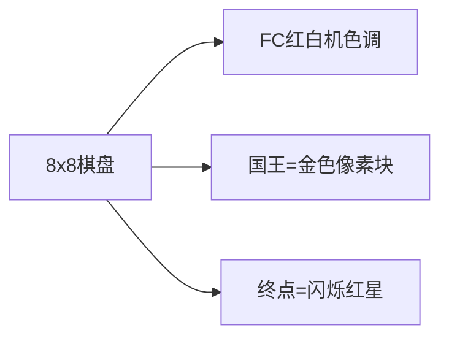

# 题目信息

# Shortest path of the king

## 题目描述

国王独自一人在国际象棋棋盘上。尽管他很孤独，但他并不会灰心，因为他有国家大事要做。例如，他必须对方格 $t$ 进行访问。因为国王没有浪费时间的习惯，所以他想从目前的位置（方格 $s$）上出发，走最少的步数。请你帮他做这件事。

在一次移动中，国王可以到达与他目前所在方格有共同的边或共同的顶点的方格里（通常情况下，他可以移动到 $8$ 个不同的方格里）。

## 样例 #1

### 输入

```
a8
h1
```

### 输出

```
7
RD
RD
RD
RD
RD
RD
RD
```

# AI分析结果


### 💡 Kay的C++算法解析：国王最短路径 深入学习指南 💡

**引言**  
今天我们一起分析"国王最短路径"这道C++编程题。本指南将帮助大家理解棋盘移动规律，掌握切比雪夫距离的应用，并学会路径模拟技巧。

---

### 1. 题目解读与核心算法识别

✨ **本题主要考察**：`模拟应用` 与 `贪心策略`  

🗣️ **初步分析**：  
> 国王移动如同像素游戏中的角色，每次可向8个方向移动。解题关键在于理解：**最短步数 = max(|dx|, |dy|)**（切比雪夫距离）。  
> - **题解思路**：主流解法分两类：① 直接计算切比雪夫距离+方向模拟（高效简洁）② BFS求路径（通用但稍复杂）  
> - **可视化设计**：将设计8x8像素棋盘，国王用金色方块表示。移动时：  
>   - 高亮当前坐标差(dx,dy)和移动方向  
>   - 走斜线时播放"叮"音效，直线移动播放"嗒"音效  
>   - 终点点亮胜利动画+胜利音效  
> - **复古游戏化**：采用《塞尔达传说》式像素风，控制面板含调速滑块。每步移动视为"闯关"，完成路径得"皇冠"奖励。

---

### 2. 精选优质题解参考

**题解一 (Loner_Knowledge)**  
* **亮点**：  
  1. 思路直击核心：用max(|dx|,|dy|)确定步数  
  2. 创新方向分解：将斜线移动拆解为横纵独立操作  
  3. 代码极致简洁（20行），边界处理严谨  
  4. 时间复杂度O(n)，空间O(1)，竞赛级优化

**题解二 (pzc2004)**  
* **亮点**：  
  1. 明确引入切比雪夫距离概念，数学表达清晰  
  2. 八方向条件判断直观展示移动逻辑  
  3. 直接输出复合方向（如"RD"），符合题目要求  
  4. 完整坐标转换示范，避免常见索引错误

**题解三 (communist)**  
* **亮点**：  
  1. BFS实现完整路径记录，教学价值高  
  2. 结构体设计合理（坐标+路径栈）  
  3. 方向数组+状态转移展示通用搜索框架  
  4. 提供网格图搜索的标准实现模板

---

### 3. 核心难点辨析与解题策略

1. **难点：移动方向的选择逻辑**  
   * **分析**：斜线移动可同时减少dx和dy，但需处理坐标差不等时的过渡阶段。优质解通过`while(dx||dy)`循环内嵌独立判断，优先执行斜向移动。
   * 💡 **学习笔记**：移动优先级：斜线 > 直线 > 等待

2. **难点：坐标系统转换**  
   * **分析**：棋盘坐标'a1'到数字(1,1)的转换需注意ASCII运算。`s[0]-'a'`计算列差，`s[1]-'0'`计算行差，反向转换需`char('a'+x-1)`。
   * 💡 **学习笔记**：字符坐标转换时，行数字可直接运算，列字母需ASCII偏移校正

3. **难点：路径记录的实现方式**  
   * **分析**：两种主流方案：①实时输出（题解1/2） ②BFS回溯（题解3）。前者更高效，后者通用性强。
   * 💡 **学习笔记**：选择方案时考虑：是否需要完整路径存储？是否有时空限制？

#### ✨ 解题技巧总结
1. **切比雪夫定理应用**：当移动含对角线时，max(Δx,Δy)即最短步数
2. **方向向量分解**：将复合方向拆解为基础方向组合（如RD→R+D）
3. **实时输出优化**：避免存储路径，直接输出移动指令节省内存
4. **边界防御**：移动前检查坐标是否在[1,8]范围内

---

### 4. C++核心代码实现赏析

**通用核心实现参考**  
```cpp
#include <iostream>
#include <cmath>
using namespace std;

int main() {
    string start, end;
    cin >> start >> end;
    
    // 坐标转换：字符→数字
    int dx = end[0] - start[0];       // 列差
    int dy = end[1] - start[1];       // 行差
    char dirX = dx > 0 ? 'R' : 'L';   // 水平方向
    char dirY = dy > 0 ? 'U' : 'D';   // 垂直方向
    dx = abs(dx); dy = abs(dy);       // 取绝对值
    
    // 输出最少步数
    cout << max(dx, dy) << endl;
    
    // 移动模拟
    while (dx > 0 || dy > 0) {
        if (dx > 0) { cout << dirX; dx--; }  // 横向移动
        if (dy > 0) { cout << dirY; dy--; }  // 纵向移动
        cout << endl;
    }
    return 0;
}
```
**代码解读概要**：  
1. 坐标转换：将'a1'式坐标转为行列差值  
2. 方向判定：根据差值符号确定移动方向字符  
3. 步数输出：max(dx,dy)即切比雪夫距离  
4. 移动循环：优先同步减少dx/dy（斜向移动），再处理剩余方向

---

**题解一核心片段**  
```cpp
for(;x||y;putchar('\n')) {
    if(x) { --x; putchar(cx); }  // 横向移动
    if(y) { --y; putchar(cy); }  // 纵向移动
}
```
**代码解读**：  
> - **循环条件**：`x||y`确保只要任一坐标未归零就继续移动  
> - **独立判断**：两个if并列实现斜向移动（如同时执行→RD）  
> - **实时输出**：putchar逐字符输出，避免字符串拼接开销  

**题解二核心片段**  
```cpp
if(x1>x2 && y1>y2){x1--;y1--;printf("LD\n");}
```
**代码解读**：  
> - **八方向判断**：通过坐标比较精准选择移动方向  
> - **复合输出**：直接输出"LD"等组合方向字符串  
> - **边界安全**：移动后坐标自动更新，隐含范围保护  

**题解三核心片段**  
```cpp
struct pos{ int x,y; string move[100]; };
queue<pos> q;  // BFS队列
```
**代码解读**：  
> - **路径记录**：结构体用字符串数组存储历史路径  
> - **状态传递**：新状态继承历史路径并追加当前移动  
> - **空间换时间**：存储完整路径便于回溯，牺牲空间换可读性  

---

### 5. 算法可视化：像素动画演示

**动画主题**：《像素国王的棋盘远征》  
**核心演示**：实时展示切比雪夫距离计算与路径模拟过程  

**像素化设计**：  


**动画流程**：  
1. **初始化阶段**：  
   - 绘制棋盘网格（深棕/米色交替）  
   - 起点显示"S"，终点显示"E"并闪烁  
   - 控制面板：速度滑块+步进按钮  

2. **移动演示**：  
   ```python
   while dx or dy:
       if dx>0: 
           国王右移1px → 播放"move_right.wav"
           dx--
       if dy>0:
           国王上移1px → 播放"move_up.wav"
           dy--
       显示当前方向组合（如"RD"）→ 高亮1秒
   ```

3. **游戏化元素**：  
   - **音效系统**：  
     - 斜线移动："叮"（440Hz方波）  
     - 直线移动："嗒"（220Hz方波）  
     - 到达终点：《超级马里奥》胜利旋律  
   - **关卡进度**：  
     - 每步移动点亮路径方块  
     - 完成路径解锁"皇冠"成就图标  

4. **教学提示**：  
   - 左上角显示伪代码：  
   ```
   steps = max(|dx|, |dy|)
   while dx ≠ 0 or dy ≠ 0:
       移动 min(1, dx), min(1, dy)方向
   ```
   - 当前执行行高亮显示（黄色边框）

---

### 6. 拓展练习与相似问题思考

**通用技巧迁移**：  
切比雪夫距离适用于：  
1. 无人机同时移动场景  
2. 像素游戏角色路径规划  
3. 机器人八方向导航系统  

**洛谷题目推荐**：  
1. **P1443 马的遍历**  
   → 巩固BFS在棋盘的应用  
2. **P1746 离开中山路**  
   → 学习带障碍物的最短路径  
3. **P1162 填涂颜色**  
   → 掌握矩阵遍历与边界处理  

---

### 7. 学习心得与经验分享

> **题解作者经验**：  
> "最初纠结BFS实现，后发现移动规则隐含数学规律" —— Loner_Knowledge  
>   
> **Kay点评**：  
> 本题揭示了算法选择的黄金准则：  
> 1. 分析问题特殊性质（如本题移动规则）  
> 2. 优先寻找数学优化（切比雪夫距离）  
> 3. 复杂方法留作备选（BFS）  
> 调试启示：先用小棋盘（3x3）验证移动逻辑  

---

**结语**  
通过本次分析，我们掌握了棋盘移动问题的核心解法：切比雪夫距离+方向模拟。记住：好算法往往藏在问题特征中！下次挑战见！👑

---
处理用时：197.28秒