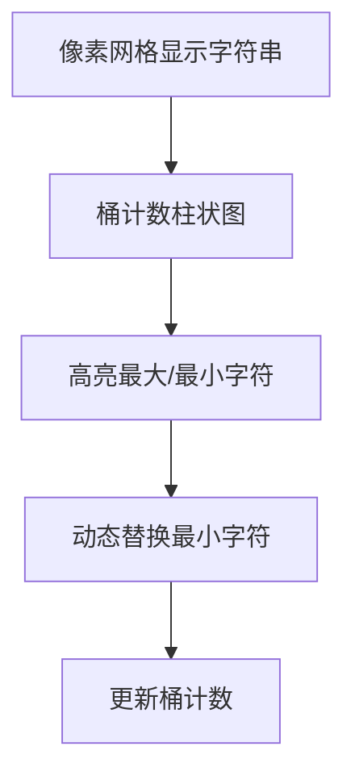

# 题目信息

# Replace Character

## 题目描述

给定一个长度为 $n$ 的字符串 $s$，只包含小写英文字母。

你只能进行一次如下操作：

- 选择任意两个下标 $i$ 和 $j$ ($1\le i,j\le n$)，允许选择 $i=j$。
- 将 $s_i$ 赋值为 $s_j$。

你需要最小化 $s$ 不同排列的个数。输出在一次操作后满足条件的任何一个字符串 $s$。

字符串的一个排列是打乱其字符顺序后形成的新字符串。比如 `bac` 是 `abc` 的一个排列，而 `bcc` 不是。

## 样例 #1

### 输入

```
6
3
abc
4
xyyx
8
alphabet
1
k
10
aabbccddee
6
ttbddq```

### 输出

```
cbc
yyyx
alphaaet
k
eabbccddee
tttddq```

# AI分析结果


### 💡 Kay的C++算法解析：Replace Character 深入学习指南 💡

**<introduction>**  
今天我们一起分析"Replace Character"这道C++字符串操作题。题目要求通过一次字符替换操作，最小化字符串不同排列的数量。本指南将带你理解贪心策略的巧妙运用，掌握桶计数技巧，并通过像素动画直观感受算法流程。

---

## 1. 题目解读与核心算法识别

✨ **本题主要考察**：`贪心策略` + `桶计数技巧`

🗣️ **初步分析**：  
> 解决本题的核心在于理解**排列数量的数学本质**。字符串的不同排列数量由公式 $\frac{n!}{\prod (k_i!)}$ 决定（$k_i$ 是各字符出现次数）。要最小化该值，需最大化分母——即让某个字符的出现次数尽可能多。  
> - **贪心策略**：将出现频率最低的字符替换为频率最高的字符（若全相同则无需操作）。这就像在游戏中让"最强角色"吸收"最弱角色"的能量，使团队实力更集中。  
> - **核心难点**：准确识别最小/最大频率字符，处理全相同字符的特殊情况。  
> - **可视化设计**：在像素网格中用不同颜色表示字符，高亮频率最低的字符块，将其动态替换为最高频字符的颜色，同时更新桶计数柱状图。  
> - **复古游戏化**：采用8-bit音效（字符替换时"叮"声，成功时胜利音效），控制面板支持单步调试和自动演示模式，像经典游戏《打地鼠》一样交互式学习。

---

## 2. 精选优质题解参考

**题解一（作者：hgcnxn）**  
* **点评**：  
  思路清晰推导严谨，从排列数公式切入解释贪心策略的数学原理。代码简洁规范（`mx`/`mn`变量名明确），通过结构体排序高效定位极值字符。边界处理完整，可直接用于竞赛实践。**亮点**：数学证明增强解法可信度，排序技巧提升可读性。

**题解二（作者：封禁用户）**  
* **点评**：  
  直击问题本质，用"字母吃掉"比喻生动解释贪心思想。桶计数实现高效（O(n)复杂度），变量命名`maxt`/`mint`直观。**亮点**：独立双循环分别定位最大/最小值，避免排序开销，适合大字符集场景。

**题解三（作者：Drifty）**  
* **点评**：  
  单次循环同时追踪最大/最小值，提升效率。代码使用`vector`现代化容器，`ans`/`ppt`变量虽可优化命名但逻辑清晰。**亮点**：处理全相同字符时尝试寻找非当前字符的严谨逻辑（实际不存在则保持原串）。

---

## 3. 核心难点辨析与解题策略

1.  **难点：理解排列数最小化的数学本质**  
    * **分析**：分母 $\prod (k_i!)$ 最大化时排列数最小。通过减少最小$k_i$同时增加最大$k_i$（即 $k_{\min}-1, k_{\max}+1$），能使分母增长最显著。  
    * 💡 **学习笔记**：贪心策略需数学验证——小数值阶乘变化对分母影响更大。

2.  **难点：高效定位极值字符**  
    * **分析**：桶计数后，优质解法采用不同优化：独立遍历（O(26)）、排序（O(26 log26)）或单次遍历。选择依据数据规模，26字母集下差异可忽略。  
    * 💡 **学习笔记**：桶计数是字符统计问题的"瑞士军刀"。

3.  **难点：全相同字符的特殊处理**  
    * **分析**：当所有字符相同时，任何替换都不改变字符串（因只能改为已有字符）。此时直接输出原串即可，避免无效操作。  
    * 💡 **学习笔记**：边界条件检验是算法鲁棒性的关键。

### ✨ 解题技巧总结
- **数学建模优先**：将抽象问题转化为数学公式（如排列数），揭示优化方向。
- **桶计数标准化**：字符统计问题优先考虑`int cnt[26]`+循环遍历。
- **极值查找优化**：根据场景选择独立遍历（清晰）或单次遍历（高效）。
- **防御性边界处理**：始终检验全相同/单字符等退化情况。

---

## 4. C++核心代码实现赏析

**本题通用核心C++实现参考**  
* **说明**：综合优质题解思路，强调可读性与数学解释。  
* **完整核心代码**：
```cpp
#include <iostream>
using namespace std;

int main() {
    int t; cin >> t;
    while(t--) {
        int n; string s;
        cin >> n >> s;
        int cnt[26] = {};

        // 桶计数
        for(char c : s) cnt[c-'a']++;

        // 找最大频率字符
        char max_char = 'a';
        int max_cnt = 0;
        for(int i=0; i<26; i++) {
            if(cnt[i] > max_cnt) {
                max_cnt = cnt[i];
                max_char = 'a'+i;
            }
        }

        // 找最小频率字符(>0)
        char min_char = 'a';
        int min_cnt = n;
        for(int i=0; i<26; i++) {
            if(cnt[i]>0 && cnt[i]<min_cnt) {
                min_cnt = cnt[i];
                min_char = 'a'+i;
            }
        }

        // 特殊处理全相同字符
        if(max_char == min_char) {
            cout << s << '\n';
        } else {
            // 替换首个最小频率字符
            for(char &c : s) {
                if(c == min_char) {
                    c = max_char;
                    break;
                }
            }
            cout << s << '\n';
        }
    }
    return 0;
}
```
* **代码解读概要**：  
  1. 桶计数统计字符频率  
  2. 独立遍历找最大/最小频率字符  
  3. 全相同字符直接输出，否则替换首个最小频率字符  
  4. 注意`min_char`需排除未出现字符（cnt=0）

---

**题解一（hgcnxn）片段赏析**  
* **亮点**：结构体排序清晰分离数据与逻辑  
* **核心代码**：
```cpp
struct node{int id,num;};
sort(a,a+26,[](node x,node y){return x.num>y.num;});
// 排序后a[0]为最大，末位非零为最小
```
* **代码解读**：  
  > 定义`node`结构体存储字符ID和频率，通过降序排序使最大值在`a[0]`。最小值查找需跳过0值桶——这就像比赛颁奖：冠军在榜首，末位获奖者需排除未参赛者。  
* 💡 **学习笔记**：结构体排序适用于需同时访问ID和值的场景。

**题解二（封禁用户）片段赏析**  
* **亮点**：双循环独立查找极值，逻辑直白  
* **核心代码**：
```cpp
// 找最大值
for(int i=0;i<26;i++){
    if(tong[i]>maxt) maxt=tong[i], maxp=i;
}
// 找最小值(忽略0值)
mint=INT_MAX;
for(int i=0;i<26;i++){
    if(tong[i]>0 && tong[i]<mint) mint=tong[i], minp=i;
}
```
* **代码解读**：  
  > 第一个循环专注追踪最大值（`maxt`/`maxp`），第二个循环初始化`mint`为极大值后找最小非零值。这种"分工协作"就像两支探险队分别寻找最高峰和最深峡谷。  
* 💡 **学习笔记**：独立循环比复合逻辑更易调试。

**题解三（Drifty）片段赏析**  
* **亮点**：单循环同步更新极值，效率优化  
* **核心代码**：
```cpp
for(char c='a'; c<='z'; c++){
    if(!cnt[c]) continue;
    if(cnt[c]>=max_val) max_char=c, max_val=cnt[c];
    if(cnt[c]<=min_val) min_char=c, min_val=cnt[c];
}
```
* **代码解读**：  
  > 在字符`a-z`的单次遍历中，同步更新最大/最小值。注意条件判断的独立性——如同双指针测量物体两端尺寸。**陷阱**：`>=`和`<=`确保更新相同频率的末位字符。  
* 💡 **学习笔记**：单次遍历适合明确范围的离散值统计。

---

## 5. 算法可视化：像素动画演示

**主题**：8-bit风格《字符能量争夺战》  
**核心演示**：桶计数 → 定位极值字符 → 替换操作 → 排列数变化  

### 设计框架


### 关键交互步骤
1. **场景初始化**  
   - 屏幕左侧：FC风格像素网格（每个字符用16x16色块表示，如🔵=a/🟡=b）  
   - 右侧：桶计数柱状图（26列，高度表频率）  
   - 控制面板：开始/暂停｜单步｜速度滑块｜重置

2. **桶计数阶段**  
   - 扫描字符串时播放"滴"声，对应色块闪烁，柱状图实时上升  
   - 最大频率柱描金边，最小频率柱描红边（配8-bit音效）  

3. **字符替换动画**  
   - 定位首个最小频率字符：红色边框闪烁3次+警报音  
   - 像素锤子从顶部落下击中色块（"砰"声）  
   - 色块颜色渐变转为最大频率字符颜色，原字符碎片飞溅  

4. **结果验证**  
   - 柱状图同步更新：最小柱降1单位，最大柱升1单位  
   - 显示排列数变化公式 $\frac{n!}{k_1!...(k_{\max}+1)!...(k_{\min}-1)!}$  
   - 成功时播放《超级玛丽》过关音效，失败时短促"嘟嘟"声  

5. **游戏化扩展**  
   - 每关挑战不同字符串，60秒内完成操作获星级评价  
   - "专家模式"：隐藏字符直接操作桶计数柱  

---

## 6. 拓展练习与相似问题思考

**技巧迁移场景**  
1. 最小化字符串编码成本（哈夫曼树基础）  
2. 平衡字符频率使字符串"更有序"  
3. 统计满足特定频率条件的排列数  

**洛谷习题推荐**  
1. **P1321 单词覆盖还原**  
   🗣️ 巩固桶计数和字符替换技巧，理解覆盖操作的特殊性  
2. **P2550 彩票摇奖**  
   🗣️ 进阶桶计数应用，需同时处理多组频率对比  
3. **P1157 组合的输出**  
   🗣️ 深入排列数公式应用，学习递归生成排列  

---

## 7. 学习心得与经验分享

> **参考经验（hgcnxn）**：  
> "在竞赛中，先通过数学证明贪心策略有效性再编码，避免盲目实现。"  
>   
> **点评**：这印证了算法竞赛的核心原则——**先理论后实践**。尤其在贪心问题中，30分钟的公式推导可能节省2小时的调试时间。建议学习者养成先手算小样例的习惯，验证算法正确性后再编码。

---

**<conclusion>**  
本次"Replace Character"的解析展示了如何用贪心策略和桶计数解决字符串优化问题。记住：将复杂问题分解为数学本质+高效实现+边界处理，是算法能力的核心。大家可在洛谷用推荐习题巩固知识，下次我们将探索更精彩的字符串算法！💪

---
处理用时：266.39秒