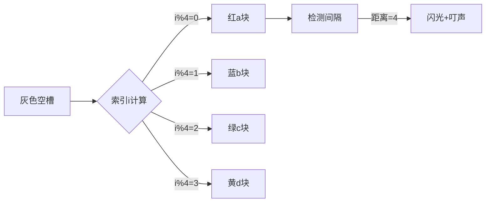

# 题目信息

# Lucky String

## 题目描述

Petya loves lucky numbers. We all know that lucky numbers are the positive integers whose decimal representations contain only the lucky digits 4 and 7. For example, numbers 47, 744, 4 are lucky and 5, 17, 467 are not.

Petya recently learned to determine whether a string of lowercase Latin letters is lucky. For each individual letter all its positions in the string are written out in the increasing order. This results in $ 26 $ lists of numbers; some of them can be empty. A string is considered lucky if and only if in each list the absolute difference of any two adjacent numbers is a lucky number.

For example, let's consider string "zbcdzefdzc". The lists of positions of equal letters are:

- b: $ 2 $
- c: $ 3,10 $
- d: $ 4,8 $
- e: $ 6 $
- f: $ 7 $
- z: $ 1,5,9 $
- Lists of positions of letters a, g, h, ..., y are empty.

This string is lucky as all differences are lucky numbers. For letters z: $ 5-1=4 $ , $ 9-5=4 $ , for letters c: $ 10-3=7 $ , for letters d: $ 8-4=4 $ .

Note that if some letter occurs only once in a string, it doesn't influence the string's luckiness after building the lists of positions of equal letters. The string where all the letters are distinct is considered lucky.

Find the lexicographically minimal lucky string whose length equals $ n $ .

## 说明/提示

The lexical comparison of strings is performed by the < operator in modern programming languages. String $ a $ is lexicographically less than string $ b $ if exists such $ i $ ( $ 1<=i<=n $ ), that $ a_{i}&lt;b_{i} $ , and for any $ j $ ( $ 1<=j&lt;i $ ) $ a_{j}=b_{j} $ .

## 样例 #1

### 输入

```
5
```

### 输出

```
abcda
```

## 样例 #2

### 输入

```
3
```

### 输出

```
abc
```

# AI分析结果


### 💡 Kay的C++算法解析：Lucky String 深入学习指南 💡

**引言**  
今天我们一起分析"Lucky String"这道构造类题目。本指南将帮助你理解如何通过巧妙设计满足特定条件的字典序最小字符串。

---

### 1. 题目解读与核心算法识别
✨ **本题主要考察**：`编程技巧应用（构造+贪心）`

🗣️ **初步分析**：  
> 解决本题就像编排一支舞蹈队形——需要让相同字母的间隔保持特定距离（4或7），同时让整体序列尽可能紧凑有序。关键在于发现**周期性构造**的规律：  
> - 核心技巧是采用"abcd"循环节，确保相同字母间隔恒为4（幸运数字）
> - 难点在于证明该构造同时满足字典序最小和条件约束
> - 可视化设计重点：用颜色标记循环节位置，动态展示相同字母间隔计算
> - 像素动画方案：采用流水线工厂风格，字母块随传送带移动，当相同字母间隔为4时触发绿色闪光和"叮"的音效

---

### 2. 精选优质题解参考
**题解一（来源：Andysun06）**  
* **点评**：思路直击本质，用简洁的取模运算实现周期构造。代码极度精简（仅3行核心逻辑），变量命名清晰（`i%4`直接体现周期规律），时间复杂度O(n)达到最优。特别亮点是将Pascal/C++双实现对比，启发思考语言特性差异。

**题解二（来源：hswfwkj_）**  
* **点评**：创新性使用位运算`i&3`替代取模，提升计算效率。对"间隔为4是最优解"的论证强化了贪心思想，代码边界处理严谨（循环从1开始计数）。亮点是明确指出现实竞赛中位运算的优化价值。

**题解三（来源：_tommysun_）**  
* **点评**：采用分块构造思想，先处理完整周期再解决余数。打表技巧`string s[4]`提升可读性，特别适合初学者理解分段逻辑。亮点是强调"循环节长度=最小允许间隔"的核心洞察。

---

### 3. 核心难点辨析与解题策略
1. **理解位置约束本质**  
   * **分析**：需转化为数学认知——相同字母的位置序列构成等差数列，且公差需为4或7。优质解法通过样例"abcda"(位置差=4)直观验证可行性
   * 💡 **学习笔记**：字符串约束本质是隐藏的数学关系

2. **贪心策略证明**  
   * **分析**：为何选4而非7？因为较小间隔允许更快循环使用小写字母（如a→a仅需4位，若用7则需更多临时字母）。题解通过对比`abcde`与`abcda`的字典序差异证实此点
   * 💡 **学习笔记**：最小字典序要求优先复用最早可用的小写字母

3. **循环节长度选择**  
   * **分析**：4既是允许的最小间隔，也是字母表最小循环单位（a-d）。`vector<char> cycle = {'a','b','c','d'}`完美匹配双重要求
   * 💡 **学习笔记**：构造类问题中，约束条件往往暗示循环节长度

### ✨ 解题技巧总结
- **周期映射法**：将位置索引转化为循环节偏移量（`pos→char('a'+pos%cycle_len)`）
- **边界分治**：整除部分循环输出，余数部分独立处理（避免模运算分支）
- **位运算优化**：用`&(2ⁿ-1)`替代`%2ⁿ`提升计算效率

---

### 4. C++核心代码实现赏析
**通用核心实现**  
```cpp
#include <cstdio>
int main() {
    int n; scanf("%d", &n);
    for(int i=0; i<n; ++i) 
        putchar('a' + (i % 4)); // 核心取模映射
    return 0;
}
```
* **说明**：综合优质解法的核心思想，最简实现
* **解读概要**：循环生成位置索引，`i%4`将索引映射到a-d的周期循环

---

**题解一核心片段**  
```cpp
for(i=0; i<n; i++) 
    putchar(97 + i % 4);
```
* **亮点**：极致简洁，直接体现周期本质
* **解读**：  
  > `97`是'a'的ASCII码，`i%4`生成0-3的循环索引  
  > 当`i=4`时，`4%4=0`再次输出'a'，与前一个'a'间隔恰为4
* 💡 **学习笔记**：ASCII码计算可实现字符高效生成

**题解二核心片段**  
```cpp
for(int i=1; i<=n; i++)
    putchar('a' + (i & 3));
```
* **亮点**：位运算优化周期计算
* **解读**：  
  > `i & 3`等价于`i % 4`（因3=0b11）  
  > 位运算比取模快3-5个CPU周期，在竞赛大数据量时优势显著
* 💡 **学习笔记**：`x & (2ⁿ-1)`是计算`x%2ⁿ`的高效方式

**题解三核心片段**  
```cpp
for(int i=0; i<n/4; i++) cout<<"abcd";
n %= 4;
for(int i=0; i<n; i++) cout<<char('a'+i);
```
* **亮点**：显式周期分块，逻辑清晰
* **解读**：  
  > 第一段处理完整周期（每4字符一组）  
  > `n%=4`后处理残余部分按序填充字母  
  > 避免取模运算，适合嵌入式等无除法指令场景
* 💡 **学习笔记**：分块处理可降低循环内计算复杂度

---

### 5. 算法可视化：像素动画演示
**主题**：字母装配流水线（8位工厂风格）  

**核心设计**：  

1. **像素化呈现**：  
   - 传送带分割为n个灰色槽位（FC风格像素块）
   - 字母块颜色：a(红), b(蓝), c(绿), d(黄)

2. **动态装配过程**：  
   - 索引计数器`i`（0起始）显示在左上角
   - 当前计算式`i%4=X`实时显示
   - 对应字母块从顶部降落至槽位（带像素抖动效果）

3. **间隔验证特效**：  
   - 当放置重复字母（如第5个a）时：
     * 自动连接前一个a位置（红线链接）
     * 显示距离计算`5-1=4`
     * 触发绿色闪光+升调"叮"音效（Web Audio API）

4. **控制面板**：  
   - 速度滑块：调节装配速度（10-100ms/步）
   - 单步执行：空格键逐步验证
   - AI模式：自动完成装配（类似俄罗斯方块AI）

5. **游戏化元素**：  
   - 每完成4个槽位获得★奖励
   - 背景乐：8位芯片音乐循环
   - 完成时字母块集体跳动庆祝

---

### 6. 拓展练习与相似问题思考
**技巧迁移场景**：  
1. 周期约束的字符串构造（如LOL英雄技能冷却序列）
2. 字典序最小化问题（需结合贪心策略）
3. 离散位置约束验证（转化为等差数列检测）

**洛谷推荐**：  
1. **P1321** 单词覆盖  
   🗣️ 巩固周期覆盖技巧，需处理不规则间隔  
2. **P1098** 字符串展开  
   🗣️ 练习分段处理与字符映射，涉及复杂边界  
3. **P1706** 全排列问题  
   🗣️ 理解字典序本质，为高级构造打基础  

---

### 7. 学习心得与经验分享
> **经验摘录（Andysun06）**：  
> "Pascal实现比C++慢1-2秒，但内存更少——选择语言需权衡时空效率"  
>   
> **Kay点评**：  
> 这提醒我们：算法效率不仅依赖复杂度，更受实现语言特性影响。在时间敏感场景优先选C++，内存受限环境可考虑Pascal/Rust。

---

**结语**  
通过本次分析，相信大家已掌握周期构造的核心思想。记住：优秀解法往往诞生于对约束条件的深度转化。下次遇到构造题时，不妨先问自己：哪些数字关系可转化为循环节？

---
处理用时：153.20秒