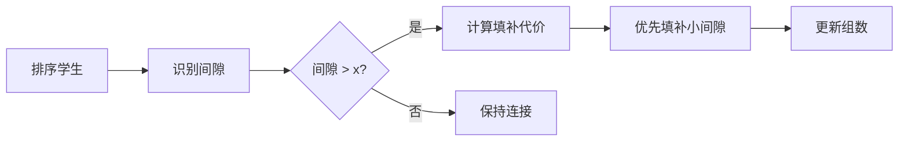

# 题目信息

# Stable Groups

## 题目描述

There are $ n $ students numerated from $ 1 $ to $ n $ . The level of the $ i $ -th student is $ a_i $ . You need to split the students into stable groups. A group of students is called stable, if in the sorted array of their levels no two neighboring elements differ by more than $ x $ .

For example, if $ x = 4 $ , then the group with levels $ [1, 10, 8, 4, 4] $ is stable (because $ 4 - 1 \le x $ , $ 4 - 4 \le x $ , $ 8 - 4 \le x $ , $ 10 - 8 \le x $ ), while the group with levels $ [2, 10, 10, 7] $ is not stable ( $ 7 - 2 = 5 > x $ ).

Apart from the $ n $ given students, teachers can invite at most $ k $ additional students with arbitrary levels (at teachers' choice). Find the minimum number of stable groups teachers can form from all students (including the newly invited).

For example, if there are two students with levels $ 1 $ and $ 5 $ ; $ x = 2 $ ; and $ k \ge 1 $ , then you can invite a new student with level $ 3 $ and put all the students in one stable group.

## 说明/提示

In the first example you can invite two students with levels $ 2 $ and $ 11 $ . Then you can split the students into two stable groups:

1. $ [1, 1, 2, 5, 8, 11, 12, 13] $ ,
2. $ [20, 22] $ .

In the second example you are not allowed to invite new students, so you need $ 3 $ groups:

1. $ [1, 1, 5, 5, 20, 20] $
2. $ [60, 70, 70, 70, 80, 90] $
3. $ [420] $

## 样例 #1

### 输入

```
8 2 3
1 1 5 8 12 13 20 22```

### 输出

```
2```

## 样例 #2

### 输入

```
13 0 37
20 20 80 70 70 70 420 5 1 5 1 60 90```

### 输出

```
3```

# AI分析结果


### 💡 Kay的C++算法解析：Stable Groups 深入学习指南 💡

#### 1. 题目解读与核心算法识别
✨ **本题主要考察**：贪心算法 + 排序应用  
🗣️ **初步分析**：  
> 解决"Stable Groups"这道题，关键在于运用**贪心策略**。想象你要用最少的胶水（k个学生）连接木棍（已排序的学生），使每组木棍长度差≤x。  
> - 核心思路：先排序学生水平，计算相邻差值。大于x的间隙需要填补，优先填补代价小的间隙（需添加学生数少）  
> - 难点：正确计算填补间隙所需最少学生数（公式：`ceil(间隙/x)-1`）  
> - 可视化设计：用像素条表示学生水平，红色高亮间隙，绿色显示填补过程。8位音效在填补时触发"叮"声，组合并时播放胜利音效  

---

#### 2. 精选优质题解参考
**题解一（Shunpower）**  
* **点评**：思路清晰直指核心，用`(d-1)/x`巧妙计算填补代价。代码规范（`b[]`存储间隙），边界处理严谨（`cnt+1`输出）。亮点在于用"隔板原理"比喻学生填补，形象解释公式推导  

**题解二（ZolaWatle）**  
* **点评**：严谨推导数学公式`ceil(d/x)-1`，代码模块化（`lj[]`存储间隙）。亮点在于完整复杂度分析（O(n log n)），变量命名规范（`nd`=needed），实践性强可直接用于竞赛  

**题解三（zMinYu）**  
* **点评**：简洁高效实现贪心，特判整除情况优化填补数。亮点在于用`vector`动态管理间隙，代码可读性极强（`c[]`计算代价），适合初学者理解核心逻辑  

---

#### 3. 核心难点辨析与解题策略
1. **间隙代价计算**  
   * **分析**：间隙d需分成`ceil(d/x)`段，需添加`ceil(d/x)-1`人。如d=15, x=5时需2人（分成3段）  
   * 💡 **学习笔记**：`ceil(d/x) = (d+x-1)/x`（整数除法）  

2. **填补顺序优化**  
   * **分析**：优先填补小间隙（需人少），才能用有限k合并更多组。若先补大间隙可能导致k耗尽  
   * 💡 **学习笔记**：贪心原则——局部最优解序列产生全局最优解  

3. **初始组数确定**  
   * **分析**：每出现间隙d>x时组数+1，初始组数=间隙数+1。填补成功则组数-1  
   * 💡 **学习笔记**：组数变化 = 1 + 未填补间隙数  

### ✨ 解题技巧总结
- **排序预处理**：贪心问题先排序，消除随机性影响  
- **代价公式化**：将抽象问题转化为数学公式（`ceil(d/x)-1`）  
- **边界特判**：注意整除时需减1人（d=10,x=5时只需1人而非2人）  
- **资源分配**：有限资源（k）优先解决性价比高的问题（小代价间隙）  

---

#### 4. C++核心代码实现赏析
**通用核心实现**  
```cpp
#include <bits/stdc++.h>
#define ll long long
using namespace std;

int main() {
    ll n, k, x; 
    cin >> n >> k >> x;
    vector<ll> a(n), gaps;
    for (int i = 0; i < n; i++) cin >> a[i];
    sort(a.begin(), a.end());
    
    // 计算间隙
    for (int i = 1; i < n; i++) 
        if (a[i] - a[i-1] > x) 
            gaps.push_back(a[i] - a[i-1]);
    
    // 初始组数
    int groups = gaps.size() + 1;
    sort(gaps.begin(), gaps.end());
    
    // 填补间隙
    for (ll gap : gaps) {
        ll need = (gap % x == 0) ? (gap/x - 1) : (gap/x);
        if (k < need) break;
        k -= need;
        groups--;
    }
    cout << groups;
}
```
**代码解读概要**：  
1. 排序后计算所有> x的间隙  
2. 初始组数 = 间隙数 + 1  
3. 按间隙升序填补，更新剩余k和组数  

---

#### 5. 算法可视化：像素动画演示
**主题**：*"像素学生填补大作战"*（FC红白机风格）  
**核心演示**：  


**动画设计**：  
1. **初始化**：  
   - 8-bit像素学生水平排列，绿色条块表示水平值  
   - 控制面板：开始/暂停/单步按钮 + 速度滑块  

2. **关键流程**：  
   - **间隙高亮**：>x的间隙显示为红色闪烁条块，宽度=d/x倍基准  
   - **填补动画**：点击填补时，绿色像素小人跳入间隙，分裂为`ceil(d/x)`段  
   - **音效反馈**：填补时"叮"声，组合并时播放《超级玛丽》过关音效  

3. **游戏化元素**：  
   - 每成功填补一个间隙得100分，连续填补触发连击特效  
   - "AI演示模式"自动以最优顺序填补，展示贪心策略优势  

**技术实现**：  
- Canvas绘制动态条块，`requestAnimationFrame`控制帧率  
- 音效使用Web Audio API，8-bit音源生成器  

---

#### 6. 拓展练习与相似问题思考
**技巧迁移场景**：  
1. 区间合并问题（用最少点覆盖所有区间）  
2. 资源分配优化（有限资源解决最大问题）  
3. 路径分割问题（最小化路径最大间隔）  

**洛谷推荐**：  
1. **P1090 合并果子**  
   🗣️ 巩固贪心策略，优先处理小代价操作  
2. **P1803 线段覆盖**  
   🗣️ 练习区间排序与资源分配，强化贪心思维  
3. **P2240 种树**  
   🗣️ 复杂场景下的贪心决策，提升问题抽象能力  

---

#### 7. 学习心得与经验分享
> **经验摘录（ZolaWatle）**：  
> *"ceil(d/x)-1的公式推导让我卡壳，动手画图才理解分段数=ceil(d/x)"*  
>  
> **Kay点评**：遇到公式抽象时，用具体数值代入验证（如d=12,x=5需2人分3段）。画示意图是最佳调试手段！

---

> 本次解析就到这里！记住：贪心问题要像玩拼图——先处理小碎片才能快速完成大图景。下次见！🚀

---
处理用时：89.64秒