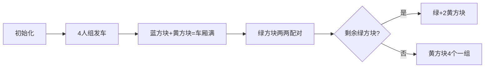

# 题目信息

# Taxi

## 题目描述

After the lessons $ n $ groups of schoolchildren went outside and decided to visit Polycarpus to celebrate his birthday. We know that the $ i $ -th group consists of $ s_{i} $ friends ( $ 1<=s_{i}<=4 $ ), and they want to go to Polycarpus together. They decided to get there by taxi. Each car can carry at most four passengers. What minimum number of cars will the children need if all members of each group should ride in the same taxi (but one taxi can take more than one group)?

## 说明/提示

In the first test we can sort the children into four cars like this:

- the third group (consisting of four children),
- the fourth group (consisting of three children),
- the fifth group (consisting of three children),
- the first and the second group (consisting of one and two children, correspondingly).

There are other ways to sort the groups into four cars.

## 样例 #1

### 输入

```
5
1 2 4 3 3
```

### 输出

```
4
```

## 样例 #2

### 输入

```
8
2 3 4 4 2 1 3 1
```

### 输出

```
5
```

# AI分析结果


### 💡 Kay的C++算法解析：Taxi 深入学习指南 💡

#### 题目解读与核心算法识别
✨ **本题主要考察**：`贪心算法`（分组优化）  
🗣️ **初步分析**：  
> Taxi问题就像**拼车游戏**：不同人数的朋友组（1-4人）必须同乘一辆车（每车≤4人）。核心是**最大化车厢利用率**，就像俄罗斯方块要严丝合缝地填满空间。贪心策略优先进行最优搭配：4人组直接发车 → 3人组"吃"1人组 → 2人组内部配对 → 剩余1人组"抱团取暖"。  
> - **可视化设计**：用像素方块表示不同人数组（红=4人，蓝=3人，绿=2人，黄=1人），动画展示车厢填充过程，高亮当前匹配操作和剩余空间
> - **复古游戏化**：采用8-bit音效（匹配成功"叮"声，发车引擎声），关卡制（每阶段搭配视为小关），AI自动演示模式展示最优匹配顺序

---

### 精选优质题解参考
**题解一（ZolaWatle）**  
* **点评**：  
  思路直白如拼积木，严格遵循贪心优先级（4→3+1→2配对→1处理）。代码用`sum[]`桶计数清晰，边界处理严谨（如`sum[1]`减后负数校正）。亮点在**模块化处理阶段**，每个`if`对应一种策略，调试心得强调"避免重复计算"值得学习。

**题解二（FL_sleake）**  
* **点评**：  
  创新性用**数学归纳法**简化逻辑：所有组最终可视为"总人数除4上取整"。代码极简（仅6行核心），但依赖`(cnt[2]*2+cnt[1]+3)/4`巧妙处理余数。实践价值高但可读性稍弱，需理解"先消去3+1对"的前提假设。

**题解三（Katsura_Hinagiku）**  
* **点评**：  
  平衡了可读性与效率，变量名`a1,a2,a3,a4`直观体现分组思想。亮点在**2人组余数处理**：优先消耗两个1人组，不足则独占一车。边界`max(a1-2,0)`避免负数，比取余更稳健。

---

### 核心难点辨析与解题策略
1. **搭配优先级陷阱**  
   *分析*：错误顺序（如先处理2人组）会导致车厢浪费。优质解统一优先3+1因他们必须占用整车厢（3人组无法拆开），而2人组更灵活  
   💡 **学习笔记**：贪心算法中，**约束最强的元素优先处理**

2. **残余组处理**  
   *分析*：剩余2人组时需判断1人组数量：≥2则同车，=1则"半浪费"车厢（剩1座），无1人组则独占车。数学解用`(total+3)/4`隐藏此逻辑  
   💡 **学习笔记**：残余量处理是贪心的关键收尾

3. **负数边界防御**  
   *分析*：`sum[1]-=2`可能负值（当只剩1个1人组），需`if(sum[1]<0)sum[1]=0`。FL解用总人数规避此问题  
   💡 **学习笔记**：更新计数数组后必须做非负校验

#### ✨ 解题技巧总结
- **桶计数优先**：用`cnt[1]-cnt[4]`替代原始数组，复杂度直降O(n)→O(1)
- **阶段分离**：拆解为4独立子问题（处理4人/3+1/2配对/残余1人）
- **数学归纳**：当组间无约束时，总人数÷4上取整即最优解（需先处理有约束组）
- **防御性编码**：更新计数后立即校验边界，避免状态污染

---

### C++核心代码实现赏析
```cpp
#include <iostream>
using namespace std; // 综合三份优质解的核心逻辑

int main() {
    int n, x, cnt[5] = {0}; // 桶计数：cnt[i]=i人组的数量
    cin >> n;
    while (n--) { cin >> x; cnt[x]++; }
    
    int cars = cnt[4];              // 4人组直接发车
    cars += min(cnt[3], cnt[1]);     // 3人组"吃"1人组
    
    if (cnt[3] > cnt[1]) {           // 多余3人组
        cars += cnt[3] - cnt[1];     // 每组独占车
        cnt[1] = 0;                  // 1人组已耗尽
    } else {
        cnt[1] -= cnt[3];            // 消耗匹配的1人组
    }
    
    cars += cnt[2] / 2;             // 2人组内部配对
    if (cnt[2] % 2) {                // 多余1个2人组
        cars++;
        cnt[1] = max(0, cnt[1] - 2); // 消耗2个1人组(可能不足)
    }
    
    cars += (cnt[1] + 3) / 4;        // 残余1人组上取整
    cout << cars << endl;
}
```
**代码解读概要**：  
> 1. **桶计数初始化**：用数组`cnt`统计各尺寸组数量  
> 2. **四阶段处理**：  
>    - 直接发走所有4人组  
>    - 3人组与1人组1:1匹配  
>    - 2人组两两配对，余数搭配两个1人组  
>    - 残余1人组4个一车  
> 3. **防御性更新**：`cnt[1] = max(0, ...)`确保不出现负数

---

### 算法可视化：像素动画演示
**主题**：8-bit出租车拼车大冒险  
**核心演示**：像素方块（红/蓝/绿/黄=4/3/2/1人组）自动匹配进入出租车（4格车厢）  



**动画流程**：  
1. **像素化UI**：FC风格网格，控制面板含调速滑块/单步执行  
2. **阶段高亮**：  
   - 处理3+1时：蓝黄方块闪烁→合并时播放"匹配成功"音效  
   - 残余组：红色边框闪烁警示  
3. **数据结构可视化**：  
   - 底部计数桶实时显示剩余组数  
   - 车厢用4个格子动态填充  
4. **游戏化激励**：  
   - 每满一车得10分，音效递增  
   - 最优解时播放《超级玛丽》过关音乐  

---

### 拓展练习与相似问题
1. **洛谷P1094 [纪念品分组]**  
   🗣️ 同类贪心匹配，物品价值代替人数，强化"双指针配对"技巧  
2. **洛谷P5019 [铺设道路]**  
   🗣️ 贪心区间覆盖，动画可延用像素地块填充效果  
3. **洛谷P1223 [排队接水]**  
   🗣️ 贪心排序基础题，理解"处理时间短者优先"的数学证明  

---

### 学习心得与经验分享
> **ZolaWatle的调试经验**：  
> *"最初忘记处理2人组余数，通过打印cnt数组中间状态发现逻辑漏洞"*  
>   
> **Kay点评**：  
> 多组变量交互时，**分阶段打印关键变量**（如每步后的`cnt[1]-cnt[4]`）是调试黄金法则！类似游戏开发中的"状态机可视化"。

---
**最终总结**：Taxi问题本质是**约束优化下的资源分配**，掌握贪心策略的优先级设计+残余处理，即可举一反三解决同类问题。记住Kay的拼车口诀：  
> 四人独行，三人找一  
> 双人配对，落单凑四！ 🚖✨

---
处理用时：173.07秒