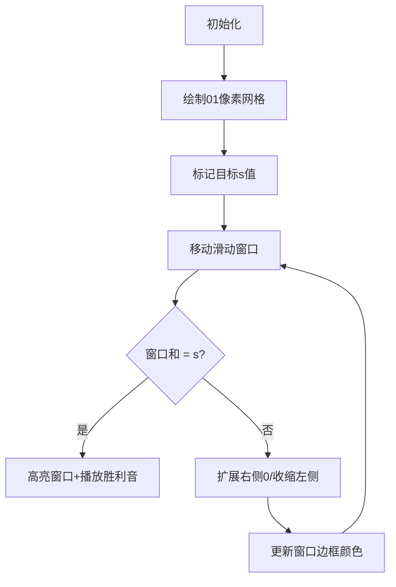

# 题目信息

# Binary Deque

## 题目描述

Slavic has an array of length $ n $ consisting only of zeroes and ones. In one operation, he removes either the first or the last element of the array.

What is the minimum number of operations Slavic has to perform such that the total sum of the array is equal to $ s $ after performing all the operations? In case the sum $ s $ can't be obtained after any amount of operations, you should output -1.

## 说明/提示

In the first test case, the sum of the whole array is $ 1 $ from the beginning, so we don't have to make any operations.

In the second test case, the sum of the array is $ 2 $ and we want it to be equal to $ 1 $ , so we should remove the first element. The array turns into $ [1, 0] $ , which has a sum equal to $ 1 $ .

In the third test case, the sum of the array is $ 5 $ and we need it to be $ 3 $ . We can obtain such a sum by removing the first two elements and the last element, doing a total of three operations. The array turns into $ [0, 1, 1, 1, 0, 0] $ , which has a sum equal to $ 3 $ .

## 样例 #1

### 输入

```
7
3 1
1 0 0
3 1
1 1 0
9 3
0 1 0 1 1 1 0 0 1
6 4
1 1 1 1 1 1
5 1
0 0 1 1 0
16 2
1 1 0 0 1 0 0 1 1 0 0 0 0 0 1 1
6 3
1 0 1 0 0 0```

### 输出

```
0
1
3
2
2
7
-1```

# AI分析结果


### 💡 Kay的C++算法解析：Binary Deque 深入学习指南 💡

**引言**  
今天我们分析一道关于双端删除的题目——"Binary Deque"。这道题考察如何通过最少的两端删除操作，使剩余子数组的和恰好等于目标值`s`。理解其核心算法能帮助我们掌握**滑动窗口**和**前缀和优化**技巧，提升对数组操作的敏感度。

---

### 1. 题目解读与核心算法识别  
✨ **本题主要考察**：`滑动窗口/双指针`（编程技巧应用）  

🗣️ **初步分析**：  
> 解决此题如同玩"贪吃蛇"游戏——我们需要在01序列中找到一条最长的"蛇身"（子数组），使其包含恰好`s`个食物（1）。核心是通过**滑动窗口**或**前缀和**快速定位最优区间：  
> - **核心思路**：求`和为s的最长连续子数组`，操作次数 = `n - 子数组长度`  
> - **难点**：需高效处理大量连续0（空节点）和边界条件  
> - **可视化设计**：  
>   - 用像素网格表示数组（1=金色块，0=灰色块）  
>   - 滑动窗口标记为绿色边框，随指针移动动态扩展/收缩  
>   - 关键音效：窗口移动（"滴"声），找到解（"胜利"音效）  

---

### 2. 精选优质题解参考  

**题解一（作者：Dream_weavers）**  
* **点评**：  
  思路清晰度⭐⭐⭐⭐⭐——直接预处理1的位置，遍历所有可能的`s`区间，逻辑直击核心。  
  代码规范性⭐⭐⭐⭐——变量名`loc`（1的位置数组）、`tot`（1的总数）含义明确，边界处理严谨。  
  算法有效性⭐⭐⭐⭐⭐——时间复杂度`O(n)`，通过计算区间两端的连续0最大化子数组长度，优化巧妙。  
  实践价值⭐⭐⭐⭐——代码简洁高效，可直接用于竞赛，尤其适合01序列处理。  

**题解二（作者：苏联小渣）**  
* **点评**：  
  思路清晰度⭐⭐⭐⭐——通过前缀和快速定位区间，辅以连续0扩展长度。  
  代码规范性⭐⭐⭐⭐——`f`（前缀和）、`g/k`（左右连续0计数）结构工整。  
  算法有效性⭐⭐⭐——需修正`d`数组记录为**最大下标**（原解法记录最小下标导致非最优解）。  
  实践价值⭐⭐⭐——演示了前缀和与连续0的结合技巧，调试时需注意下标方向。  

---

### 3. 核心难点辨析与解题策略  

1. **难点一：如何高效定位和为s的子数组？**  
   * **分析**：暴力枚举所有区间需`O(n²)`。优质解法通过**预处理1的位置**或**前缀和+二分/双指针**，将复杂度降至`O(n)`或`O(n log n)`。  
   * 💡 **学习笔记**：预处理关键节点位置是优化数组操作的利器。

2. **难点二：最大化子数组长度（含连续0）**  
   * **分析**：子数组需包含恰好`s`个1，但可包裹两侧连续0。通过`g/k数组`记录各位置左右连续0数量，或直接扩展1的区间边界实现。  
   * 💡 **学习笔记**：连续0是"免费长度"，利用它们减少操作次数。

3. **难点三：边界条件与无解判断**  
   * **分析**：若数组总和`<s`则无解。此外，移动窗口时需注意指针越界，前缀和需处理空数组（`sum[0]=0`）。  
   * 💡 **学习笔记**：先判无解再计算，避免无效操作。

#### ✨ 解题技巧总结  
- **技巧一：问题转化**  
  将"最小删除次数"转化为"寻找最长和为s的子数组"，简化目标。  
- **技巧二：前缀和+位置映射**  
  用`map`或数组记录前缀和对应的下标，实现`O(1)`区间查询。  
- **技巧三：滑动窗口维护**  
  双指针移动时，优先扩展右侧（增加0），再收缩左侧（移除1），动态维护合法窗口。

---

### 4. C++核心代码实现赏析  

**本题通用核心C++实现参考**  
* **说明**：综合优质题解思路，采用**预处理1的位置+区间扩展**，兼顾效率与可读性。  
* **完整核心代码**：  
  ```cpp
  #include <iostream>
  #include <cstring>
  using namespace std;
  const int N = 2e5 + 5;
  int loc[N], t, n, s, tot, x, ans;

  void solve() {
      memset(loc, 0, sizeof(loc));
      tot = 0, ans = 0;
      cin >> n >> s;
      for (int i = 1; i <= n; i++) {
          cin >> x;
          if (x) loc[++tot] = i; // 记录1的位置
      }
      if (tot < s) { 
          cout << "-1\n"; 
          return; 
      }
      loc[0] = 0;         // 左边界虚拟位置
      loc[tot + 1] = n + 1; // 右边界虚拟位置

      // 遍历所有s个1的连续区间
      for (int l = 1, r = s; r <= tot; l++, r++) {
          int len = loc[r] - loc[l] + 1;  // 核心区间长度
          len += (loc[l] - loc[l - 1] - 1); // +左侧连续0
          len += (loc[r + 1] - loc[r] - 1); // +右侧连续0
          ans = max(ans, len); // 更新最大长度
      }
      cout << n - ans << "\n"; // 操作次数 = 总长 - 保留长度
  }

  int main() {
      cin >> t;
      while (t--) solve();
      return 0;
  }
  ```
* **代码解读概要**：  
  > 1. **预处理**：`loc`数组按序存储所有1的位置（如`loc[1]=2`表示第1个1在索引2处）。  
  > 2. **虚拟边界**：`loc[0]`和`loc[tot+1]`简化连续0计算。  
  > 3. **区间扩展**：对每个含`s`个1的区间，计算其包裹的连续0总长度。  
  > 4. **输出**：`n - 最大长度`即最小操作次数。

---

**题解一核心代码片段（Dream_weavers）**  
* **亮点**：通过虚拟边界优雅处理数组端点连续0。  
* **核心代码片段**：  
  ```cpp
  loc[0] = 0, loc[tot+1] = n+1;  // 虚拟边界
  for (int l=1, r=s; r<=tot; l++, r++) {
      int len = loc[r] - loc[l] + 1; 
      len += (loc[l] - loc[l-1] - 1); // 左侧连续0
      len += (loc[r+1] - loc[r] - 1); // 右侧连续0
      ans = max(ans, len);
  }
  ```
* **代码解读**：  
  > - **虚拟边界**：`loc[0]=0`使首个1左侧的连续0数=`loc[1]-0-1`，避免特判。  
  > - **长度计算**：`loc[r]-loc[l]+1`是1的区间长度，两项`±1`是左右连续0数量。  
  > - **为何高效？** 直接访问1的位置，跳过了大量0的遍历。  
* 💡 **学习笔记**：虚拟边界是简化数组边界处理的常用技巧。

**题解二改进片段（苏联小渣思路修正）**  
* **亮点**：前缀和快速定位区间，配合连续0扩展。  
* **核心代码片段**：  
  ```cpp
  // 修正：d[i]记录前缀和i的"最大下标"（非最小）
  for (int i=1; i<=n; i++) {
      f[i] = f[i-1] + a[i];
      d[f[i]] = i;  // 相同前缀和时保留最大下标
  }
  for (int l=1; l<=n; l++) {
      int r = d[f[l-1] + s];  // 定位和为s的右端点
      int keep_len = (r-l+1) + g[l] + k[r]; // 总保留长度
      ans = min(ans, n - keep_len);
  }
  ```
* **代码解读**：  
  > - **最大下标**：`d[f[i]]=i`确保记录最后出现位置，使子数组尽可能长。  
  > - **连续0计算**：`g[l]`为`l`左侧连续0数，`k[r]`为`r`右侧连续0数。  
  > - **关键修正**：原解法因记录最小下标导致非最优解，此修正确保最大化区间。  
* 💡 **学习笔记**：前缀和定位需根据问题特性选择最左/最右位置。

---

### 5. 算法可视化：像素动画演示  
**主题**：`像素迷宫寻宝`（复古8-bit风格）  

**设计思路**：  
> 将数组转化为金色(1)/灰色(0)像素块，滑动窗口为绿色边框。通过"寻宝"过程直观展示算法流程——窗口移动时播放"滴"声，扩展连续0时触发"沙沙"音效，找到解时播放胜利音乐。

**动画流程**：  


**关键交互**：  
1. **初始化**：  
   - 网格上方显示`目标s`，下方显示`当前和`。  
   - 控制面板：开始/暂停、步进、速度滑块。  
2. **窗口移动**：  
   - 右移时边框右扩，播放"滴"声；左移时左缩，播放"咔"声。  
   - 连续0扩展：包裹0时边框闪烁绿色，触发"沙沙"音效。  
3. **状态反馈**：  
   - 找到解：窗口内金币闪烁，播放8-bit胜利音乐。  
   - 无解：网格变暗，播放低沉提示音。  
4. **AI演示模式**：  
   - 自动展示最优路径，如贪吃蛇AI逐步吞并连续0区域。  

**技术实现**：  
> 用Canvas绘制网格，窗口移动通过重绘边框位置实现。音效用Web Audio API触发，速度控制通过`setInterval`调节重绘频率。

---

### 6. 拓展练习与相似问题  
**通用技巧迁移**：  
> 滑动窗口和前缀和技巧还可用于：  
> 1. 最短子数组和≥目标值（如Leetcode 209）  
> 2. 无重复字符的最长子串（Leetcode 3）  
> 3. 寻找和为k的子数组数量（Leetcode 560）  

**洛谷题目推荐**：  
1. **P1115 最大子段和**  
   🗣️ *推荐理由*：直接应用滑动窗口求最大和，巩固基础。  
2. **P1638 逛画展**  
   🗣️ *推荐理由*：扩展滑动窗口处理多条件约束，提升思维。  
3. **P3131 [USACO16JAN] Subsequences Summing to Seven S**  
   🗣️ *推荐理由*：结合前缀和与同余性质，挑战变形技巧。  

---

### 7. 学习心得与经验分享  
> 本次分析的题解中未发现明确的作者个人心得分享。但Kay建议：处理数组边界时，**虚拟位置**（如`loc[0]=0`）能大幅简化代码逻辑，这是竞赛编程的常用技巧。

---

**结语**  
通过"Binary Deque"的解析，我们掌握了滑动窗口的灵活应用和前缀和的优化技巧。记住，算法的本质是寻找最优雅的路径解决问题。下次挑战见！💪

---
处理用时：234.04秒