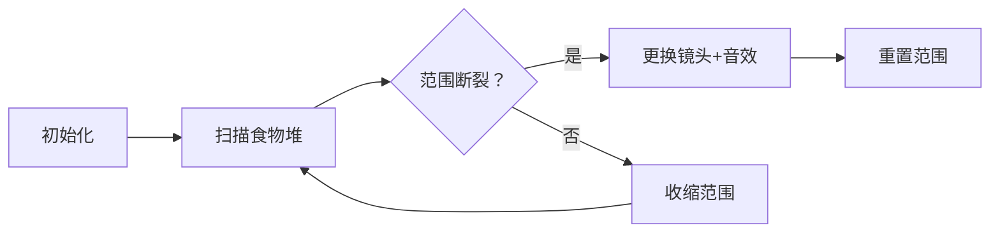

# 题目信息

# Luke is a Foodie

## 题目描述

Luke likes to eat. There are $ n $ piles of food aligned in a straight line in front of him. The $ i $ -th pile contains $ a_i $ units of food.

Luke will walk from the $ 1 $ -st pile towards the $ n $ -th pile, and he wants to eat every pile of food without walking back. When Luke reaches the $ i $ -th pile, he can eat that pile if and only if $ |v - a_i| \leq x $ , where $ x $ is a fixed integer, and $ v $ is Luke's food affinity.

Before Luke starts to walk, he can set $ v $ to any integer. Also, for each $ i $ ( $ 1 \leq i \leq n $ ), Luke can change his food affinity to any integer before he eats the $ i $ -th pile.

Find the minimum number of changes needed to eat every pile of food.

Note that the initial choice for $ v $ is not considered as a change.

## 说明/提示

In the first test case, Luke can set $ v $ to $ 5 $ before he starts to walk. And he can walk straight to eat every piles of food without changing $ v $ .

In the second test case, Luke can set $ v $ to $ 3 $ before he starts to walk. And he could change $ v $ to $ 10 $ before he eats the second pile. After that, he can walk straight to eat remaining food without changing $ v $ .

In the fourth test case, Luke can set $ v $ to $ 3 $ before he starts to walk. And he could change $ v $ to $ 8 $ before he eats the sixth pile. After that, he can walk straight to eat remaining food without changing $ v $ .

In the fifth test case, Luke can set $ v $ to $ 4 $ before he starts to walk. And he could change $ v $ to $ 6 $ before he eats the fourth pile. Then he could change $ v $ to $ 12 $ before he eats the seventh pile. After that, he can walk straight to eat remaining food without changing $ v $ .

## 样例 #1

### 输入

```
7
5 3
3 8 5 6 7
5 3
3 10 9 8 7
12 8
25 3 3 17 8 6 1 16 15 25 17 23
10 2
1 2 3 4 5 6 7 8 9 10
8 2
2 4 6 8 6 4 12 14
8 2
2 7 8 9 6 13 21 28
15 5
11 4 13 23 7 10 5 21 20 11 17 5 29 16 11```

### 输出

```
0
1
2
1
2
4
6```

# AI分析结果


### 💡 Kay的C++算法解析：Luke is a Foodie 深入学习指南 💡

#### 引言
今天我们一起分析"Luke is a Foodie"这道C++编程题。Luke需要按顺序吃掉所有食物堆，通过最小化改变食物亲和力`v`的次数来满足条件`|v - a_i| ≤ x`。本指南将帮你掌握贪心算法的应用技巧，并通过像素动画直观理解核心逻辑。

---

### 1. 题目解读与核心算法识别
✨ **本题主要考察**：`贪心算法`  
🗣️ **初步分析**：
> 解决本题的关键在于**贪心策略**——想象你手持一个可变焦的"美食探测镜"🔍（区间`[L, R]`）。初始时，镜头能覆盖第一个食物堆。当扫描新食物堆时：
> - 若新堆在镜头范围内 → 缩小镜头范围（取交集）  
> - 若超出范围 → 更换新镜头（计数+1）并重置范围  
> 
> **两种主流解法**：  
> 1. **区间交法**（Andrewzdm）：直接维护`v`的有效区间`[L, R]`  
> 2. **极差法**（多数题解）：通过`max - min ≤ 2x`判断区间连续性  
>  
> **可视化设计**：  
> 将采用**8位像素风格**（类似FC游戏）动态展示：
> - 食物堆显示为彩色像素块（高度=数值）
> - "探测镜"用绿色半透明矩形表示当前`[L, R]`
> - 镜头收缩/切换时触发"滴"声，更换镜头时播放"失败"音效
> - 控制面板支持单步/自动播放（调速滑块）

---

### 2. 精选优质题解参考
**题解一（Andrewzdm）**  
* **点评**：采用**区间交法**，逻辑清晰直白：  
  - 维护当前有效区间`[L, R]`，通过`max/min`更新交集  
  - 代码规范（`L/R/l/r`命名明确），边界处理严谨  
  - 亮点：关联[CF1304C](https://www.luogu.com.cn/problem/CF1304C)拓展思维  

**题解二（luo_shen）**  
* **点评**：**极差法**的代表作：  
  - 用`max - min ≤ 2x`等价判断区间连续性  
  - 代码极致简洁（仅10行核心逻辑），空间复杂度`O(1)`  
  - 亮点：将复杂条件转化为极差判断，降低实现难度  

**题解三（yinhy09）**  
* **点评**：极差法的教学级实现：  
  - 详细中文注释+完整IO处理，适合初学者  
  - 亮点：强调"读题难度"，提醒关注问题本质  

---

### 3. 核心难点辨析与解题策略
1. **难点1：理解v的覆盖条件**  
   *分析*：`|v - a_i| ≤ x` 本质要求`v∈[a_i-x, a_i+x]`。连续覆盖需满足所有区间存在交集（或极差`≤2x`）  
   💡 **学习笔记**：将抽象约束转化为具体区间/极差判断  

2. **难点2：维护动态覆盖范围**  
   *分析*：贪心策略的核心在于——  
   - 区间交法：用`L = max(L, a_i-x)`和`R = min(R, a_i+x)`收缩范围  
   - 极差法：实时更新`max`/`min`，触发重置时计数  
   💡 **学习笔记**：两种方法本质相通，极差法代码更简洁  

3. **难点3：处理边界条件**  
   *分析*：注意初始`v`不算修改！优质解法均正确初始化：  
   - 区间交法：`L=a₁-x, R=a₁+x`  
   - 极差法：`min=max=a₁`  
   💡 **学习笔记**：首个元素始终可被初始`v`覆盖  

#### ✨ 解题技巧总结
- **技巧1：问题转化** → 将约束转为区间覆盖/极差问题  
- **技巧2：实时维护** → 遍历时动态更新范围判断连续性  
- **技巧3：重置策略** → 范围断裂时果断重置并计数  

---

### 4. C++核心代码实现赏析
**通用核心实现（极差法）**  
```cpp
#include <iostream>
using namespace std;

int main() {
    int T; cin >> T;
    while(T--) {
        int n, x, ans = 0;
        cin >> n >> x;
        int mn, mx, a;
        cin >> a; 
        mn = mx = a; // 初始化覆盖首元素

        for(int i=1; i<n; ++i) {
            cin >> a;
            mn = min(mn, a); // 更新最小值
            mx = max(mx, a); // 更新最大值
            if(mx - mn > 2*x) { // 范围断裂判断
                ans++;
                mn = mx = a; // 重置覆盖范围
            }
        }
        cout << ans << '\n';
    }
    return 0;
}
```
**代码解读概要**：  
1. 初始化首元素为当前覆盖范围  
2. 遍历中更新`min`/`max`，当极差`>2x`时触发重置  
3. 时间复杂度`O(n)`，空间复杂度`O(1)`  

---

**题解一（Andrewzdm）区间交法**  
* **亮点**：显式维护区间边界，逻辑直观  
* **核心代码**：
```cpp
ll L = a[1] - x, R = a[1] + x;
for(int i=2; i<=n; ++i) {
    ll l = a[i] - x, r = a[i] + x;
    if(r < L || l > R) { // 区间无交集
        ans++;
        L = l; R = r;   // 重置区间
    } else {             // 区间有交集
        L = max(L, l);  // 收缩左边界
        R = min(R, r);  // 收缩右边界
    }
}
```
* **代码解读**：  
  > 当新区间`[l, r]`与当前`[L, R]`无交集时（`r<L`或`l>R`），必须更换`v`并重置区间；否则取交集作为新有效范围。  
  💡 **学习笔记**：直接模拟`v`的覆盖范围变化  

**题解二（luo_shen）极差法优化**  
* **亮点**：极值判断取代区间运算，代码更简洁  
* **核心代码**：
```cpp
mx = mn = read(); // 初始化
for(int i=1; i<n; i++) {
    now = read();
    mx = max(mx, now); 
    mn = min(mn, now);
    if(mx - mn > 2*x) { // 极差断裂判断
        mx = mn = now;  // 重置极值
        ans++;
    }
}
```
* **代码解读**：  
  > 证明：`max-min≤2x` ⇔ 存在`v`覆盖`[min,max]`内所有值。  
  💡 **学习笔记**：数学转化简化问题  

---

### 5. 算法可视化：像素动画演示
**主题**：8位像素风《美食探险家》  
**核心演示**：贪心覆盖范围动态变化  

#### 🎮 动画设计


#### 🖥️ 实现细节
1. **像素场景**  
   - 食物堆：不同高度彩色方块（y轴=值）  
   - 覆盖范围：绿色半透明矩形`[L, R]`  
   - 当前堆：闪烁边框+悬停显示数值  

2. **动态交互**  
   - **镜头收缩**：绿色矩形平滑缩小（`L↑, R↓`）  
   - **镜头切换**：绿色矩形瞬移+红色闪光，触发"失败"音效  
   - **控制面板**：  
     - 速度滑块：调节自动播放速度  
     - 单步执行：空格键触发下一步  
     - 重置按钮：重启动画  

3. **游戏化元素**  
   - **音效系统**：  
     - 范围更新："滴"声（250Hz方波）  
     - 镜头切换："失败"音效（3个衰减正弦波）  
   - **关卡进度**：  
     - 每成功覆盖10堆 → 像素星星特效  
     - 通关时播放《超级玛丽》胜利BGM  

4. **信息面板**  
   - 实时显示：`当前min/max`，`已修改次数`  
   - 代码同步：高亮执行中的C++代码行  

---

### 6. 拓展练习与相似问题思考
**通用套路迁移**：  
贪心维护连续范围的技术还适用于：  
1. 温度区间控制（如空调系统）  
2. 传感器数据平滑处理  
3. 连续时间段任务调度  

**洛谷推荐**：  
1. [P1803 凌乱的yyy](https://www.luogu.com.cn/problem/P1803)  
   → 巩固贪心选择策略  
2. [P2887 Sunscreen](https://www.luogu.com.cn/problem/P2887)  
   → 练习区间覆盖的变形应用  
3. [P2212 Watering Fields](https://www.luogu.com.cn/problem/P2212)  
   → 结合距离计算的贪心进阶  

---

### 7. 学习心得与经验分享
> **作者Andrewzdm建议**：  
> *"本题与CF1304C（空调系统）思路高度相似，解决后可继续挑战！"*  
>  
> **Kay的总结**：  
> 调试此类问题时，重点关注：  
> 1. 初始范围是否包含首元素  
> 2. 重置条件判断（`>2x`而非`≥`）  
> 3. 多测数据初始化完整性  

---

### 结语
通过本指南，相信大家已掌握贪心维护动态范围的技巧。记住：将复杂约束转化为可维护的数学条件是解题关键！下次我们将探索更多像素化算法演示，继续加油！💪

---
处理用时：208.16秒